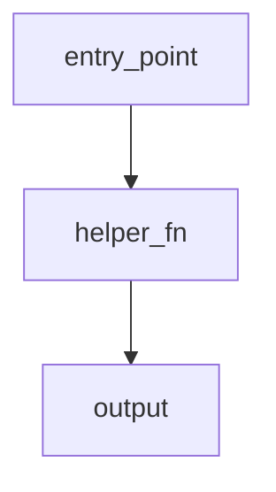
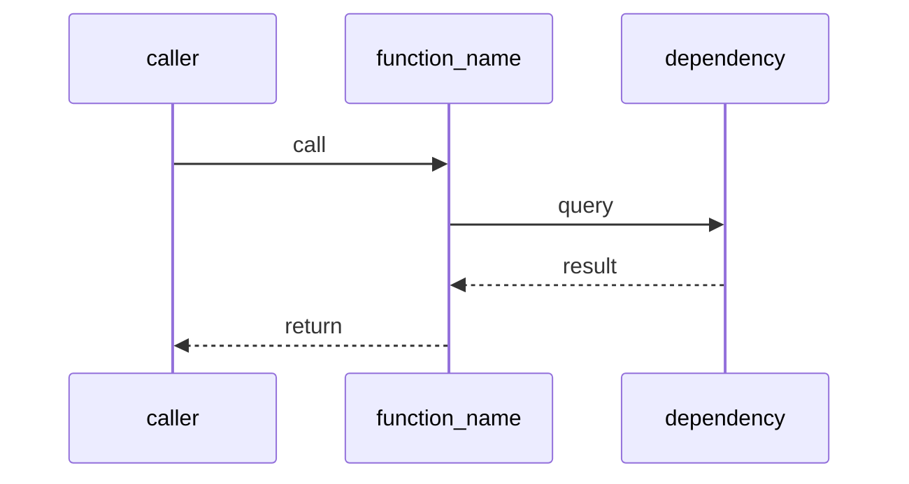

# Docs Skill — Local Documentation

ChronoQuant documentation lives in `_doc_/`. Read this before creating or
updating module documentation.

---

## When to Document

**Only when there is an explicit task or direct user request for it.** Never
create or update docs speculatively. If no task and no request: skip entirely.

---

## Structure

`_doc_/` is a flat numbered file collection — files are NOT nested in subdirectories.
The numbering encodes **both the topic block AND the reading order within each block**.

**Ordering rule: methodology/concept docs always have a lower number than their corresponding
code docs within the same topic block.** Never assign a code doc number lower than its
methodology doc within the same block.

```
_doc_/
  0000_project_overview.md   ← global project overview

  # Database Infrastructure (1xxx)
  1000_database.md           ← X000: database domain overview (DuckDB schema, ER diagram)
  1001_database_module.md    ← X001: database Python module overview
  1100_store.md              ← X100: store almodul (duckdb_store, duckdb_query, stats)
  1110_duckdb_store.md       ← X110: duckdb_store.py kód referencia
  1120_duckdb_query.md       ← X110: duckdb_query.py kód referencia
  1130_duckdb_stats.md       ← X110: duckdb_stats.py kód referencia
  1140_validate.md           ← X110: validate.py kód referencia
  1150_toolkit.md            ← X110: toolkit.py kód referencia
  1200_sync_tables.md        ← X100: sync_tables almodul overview
  1210_sync_ohlcv.md         ← X110: sync_ohlcv.py kód referencia
  1230_sync_predictions.md   ← X110: sync_predictions.py kód referencia
  1300_tests.md              ← X100: tests almodul overview
  1310_store_tests.md        ← X110: store teszt suite
  1320_pipeline_tests.md     ← X110: sync pipeline teszt suite

  # Features (2xxx) — metodológia ELŐBB, kód UTÁNA
  2000_features.md           ← X000: feature layer metodológia (25 csoport, lag, warmup)
  2010_feature_engineering.md ← X010: feature selection elmélet (quality, redundancy, stability)
  2100_sync_features.md      ← X100: sync_features.py kód referencia
  2200_features_polars.md    ← X100: _features_polars.py kód referencia

  # Targets (3xxx) — metodológia ELŐBB, kód UTÁNA
  3000_targets.md            ← X000: target layer metodológia (fw60 logreturn, MFE)
  3100_sync_targets.md       ← X100: sync_targets.py kód referencia

  # Quant Train (4xxx) — metodológia ELŐBB, kód UTÁNA
  4000_quant_train.md        ← X000: quant_train metodológia (INNER JOIN handoff)
  4100_quant_train.md        ← X100: quant_train séma, rebuild, CLI referencia

  # Sampling / Modelling (5xxx)
  5000_modelling.md          ← X000: modeling domain overview (TOC)
  5010_sampling_yearly.md    ← X010: yearly random-hour sampling metodológia (aktív)
  5100_sampling_config.md    ← X100: YearlySamplingConfig dataclass
  5200_sampling_artifacts.md ← X100: write_yearly_artifacts / load_yearly_sample
  5300_create_sample.md      ← X100: create_yearly_sample orchestrator + CLI
  5400_sampling.md           ← ARCHÍV: expanding window CV (nem aktív)
  5410_sampling_splits.md    ← ARCHÍV: expanding window splits
  5420_sampling_audit.md     ← ARCHÍV: feature table audit

  analysis/                  ← analyst_agent: EDA, specs, sample quality notebooks
```

---

## Doc File Naming

Files in `_doc_/` use a **hierarchikus számozási séma**:

| Szint | Minta | Példa | Leírás |
|-------|-------|-------|--------|
| Domain overview | `X000` | `5000_modelling.md` | Teljes domain áttekintője |
| Metodológia | `X010–X099` | `2010_feature_engineering.md` | Módszertani háttér, döntések |
| Almodul overview | `X100` | `5100_sampling_config.md` | Almodul áttekintője |
| Részletes fájl | `X110` | `1110_duckdb_store.md` | Egy Python fájl / komponens |
| Globális | `0000` | `0000_project_overview.md` | Kivétel — project-szintű |

### Topic block assignment

| Tartomány | Domain | Elv |
|-----------|--------|-----|
| `0000` | project overview | reserved |
| `1000–1999` | Database Infrastructure | store + sync OHLCV/predictions + tests |
| `2000–2999` | Features | 2000–2099: metodológia → 2100+: kód |
| `3000–3999` | Targets | 3000–3099: metodológia → 3100+: kód |
| `4000–4999` | Quant Train | 4000–4099: metodológia → 4100+: kód |
| `5000–5999` | Sampling / Modelling | 5000–5099: overview/metod → 5100+: részletek |

**Kötelező sorrend minden blokkon belül:** metodológia szám < kód szám.
Ha egy témához új kód doc kerül, a száma nagyobb kell legyen a kapcsolódó metod docnál.

---

## Diagram Format

Always use **Mermaid** for diagrams inside `.md` files.

Supported types:
- `erDiagram` — database schemas
- `sequenceDiagram` — call flows between functions / modules
- `flowchart LR` / `flowchart TD` — module overview, data flow
- `classDiagram` — class structure and relationships

### Rendering Rules (mandatory — breaks silently if violated)

A Mermaid block renders in VS Code preview **only if all of these are true:**

1. **The opening fence starts at column 0** — never indented, never inside a list or blockquote
2. **Lowercase `mermaid`, no trailing spaces** on the opening line
3. **The closing ` ``` ` is also at column 0**
4. **Not nested inside another code fence** — a ` ```mermaid ` block inside a ` ```markdown ` block renders as raw code, not a diagram

**Correct — renders as diagram:**





> VS Code requires the **"Markdown Preview Mermaid Support"** extension for rendering.
> Without it, all Mermaid blocks show as raw code regardless of syntax.

### Diagram Design Rules

- Prefer **multiple simple diagrams** over one complex one
- Every diagram must be readable without rendering (label all nodes)
- Max ~15 nodes per diagram; split if larger
- Avoid emoji/status glyphs inside Mermaid node labels (`✅`, `❌`, `⚠️`).
  Quarto's bundled Mermaid renderer may parse them as syntax errors. Use
  `OK:`, `NO:`, and `WARN:` inside Mermaid nodes; emoji can remain in normal
  markdown tables.
- For rendered Quarto HTML readability, Mermaid sizing is controlled by
  `analyst/chronoquant_analysis.css`. Keep diagrams within the report body:
  wrapper elements and `svg.mermaid-js` should fill `100%` width with
  `height: auto`; do not use a desktop-only width that exceeds the body unless
  the user explicitly asks for horizontal overflow.

### Quarto TOC / Mermaid Render Notes

- `_chronoquant_docs.ipynb` is generated by
  `analyst/doc_renderer/build_doc_notebook.py`; its Raw-cell frontmatter can
  override `analyst/_quarto.yml`. When changing global doc layout, update both
  if the generated notebook must keep the setting.
- Current working TOC grid for consolidated docs: `sidebar-width: 380px`,
  `body-width: 900px`, `margin-width: 140px`, `gutter-width: 2rem`.
- The left TOC needs both enough sidebar grid width and CSS width. In
  `analyst/chronoquant_analysis.css`, keep `nav#TOC { width: 100%; font-size:
  0.92rem; }` for readable, less-wrapped TOC labels.
- Mermaid diagrams render as `pre.mermaid-js` converted to `svg.mermaid-js` by
  Quarto at page load. If a diagram appears tiny despite `svg { width: 100% }`,
  also set the intermediate `.cell-output-display` / `figure` wrappers to
  `width: 100%`; otherwise the SVG expands only inside a shrink-to-fit wrapper.

---

## Documentation Types

### 1. Database Doc

Required when documenting a DuckDB schema, table, or store module.

**Must include:**
- Top-level **ER diagram** (`erDiagram`) of all tables and their relationships
- One subsection per table with:
  - Purpose: one sentence on why the table exists
  - Columns: listed with `name | type | description` in a markdown table
  - Notable constraints or partitioning logic

**Structure:**

````markdown
# Schema — {Module Name}

One-line summary.

---

## Overview

[erDiagram — all tables and FK relationships]

## Tables

### table_name

Purpose: …

| Column | Type | Description |
|--------|------|-------------|
| id     | BIGINT | … |
| …      | …      | … |
````

---

### 2. Flow / Module Doc

Required when documenting a `.py` file, a package, or a data pipeline.

**Must include:**
- **Module overview** at the top: one paragraph + one `flowchart` or `sequenceDiagram`
- One subsection per function (or logical group of functions) with:
  - What the function does (1–2 sentences)
  - Parameters: name, type, purpose
  - Return value: type and meaning
  - At least one diagram (sequence or flowchart node) showing what the function
    influences or calls

**Structure:**

````markdown
# {Module Name}

One-line summary.

---

## Overview

[flowchart TD — module-level entry points and data flow]

## Functions

### function_name(param1, param2)

What it does.

| Parameter | Type | Description |
|-----------|------|-------------|
| param1    | str  | … |

Returns: `type` — what it means.

[sequenceDiagram — caller → function → dependencies → return]
````

---

## Documentation Ordering Principle

**Minden témában a sorrend kötelező: Overview → Metodológia → Technikai részletek.**

Ez az egész dokumentáció rendező elve — vonatkozik mind a fájl belső struktúrájára,
mind az X000/X100/X110 szintek közötti hierarchiára.

```
X000 fájl  — domain overview: flowchart, magas szintű leírás, almodulok listája
X100 fájl  — alfejezet overview + 6 metodológiai szekció (miért, döntések, kockázatok)
X110+ fájl — teljes kód referencia: függvények, paraméterek, diagramok .py szinten
```

**Belső fájl-struktúra (minden szinten):**
1. `## Overview` — egy bekezdés + flowchart: mi ez és hol kapcsolódik a pipeline-ba
2. `## Üzleti és módszertani háttér` — miért, alternatívák, kulcsfogalmak, paraméterek
3. Táblák / függvények / komponensek — konkrét technikai leírás

**Redundancia-szabály:** Az overview a high-level logikát és struktúrát írja le.
A részletes alfejezetek kibontják, de nem megismétlik az overviewt.
Dedikált tartalomismétlés tilos — cross-reference linkkel hivatkozz.

**Mermaid kötelező:** Minden X100 fájlban legalább 2–3 Mermaid diagram.
Az `## Overview`-ban mindig legyen pipeline flowchart.
Minden módszertani döntéshez (pl. miért expanding window?) saját diagram.

## Layout Rule: Always Top-Down

Every doc starts with the **simplest possible overview** (one diagram, one paragraph),
then drills down into subsections. Never start with details.

```
1. Module overview + overview diagram
2. Methodology sections (why, decisions, risks)
3. Subsection per table / function / component
4. Each subsection has its own focused diagram
```

---

## Methodology Rule: X000 és X100 fájlok módszertani szekciói

**Az X000 és X100 szintű fájlok üzleti és módszertani szekciói a `methodology_agent`
feladata — a code_doc_agent CSAK X110+ fájlokat ír.**

Ha egy X100 fájlban hiányzik az `## Üzleti és módszertani háttér` szekció:
- Ne töltsd ki
- Nyiss `todo_` ticketet a `methodology_agent`-nek
- Az X110 fájlokat addig ne írd meg

Az X100 fájlokban kötelező hat szekció részletes specifikációja:
→ `.agent/skills/methodology_doc_skill.md`

---

## Relationship to _jira

Task files in `_jira_/` may reference `_doc_/` pages for context:
```markdown
## Scope
See `_doc_/store/schema.md` for current DuckDB schema.
```

This keeps task files concise while pointing to stable reference docs.
