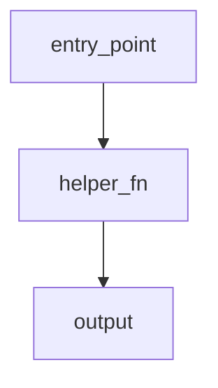
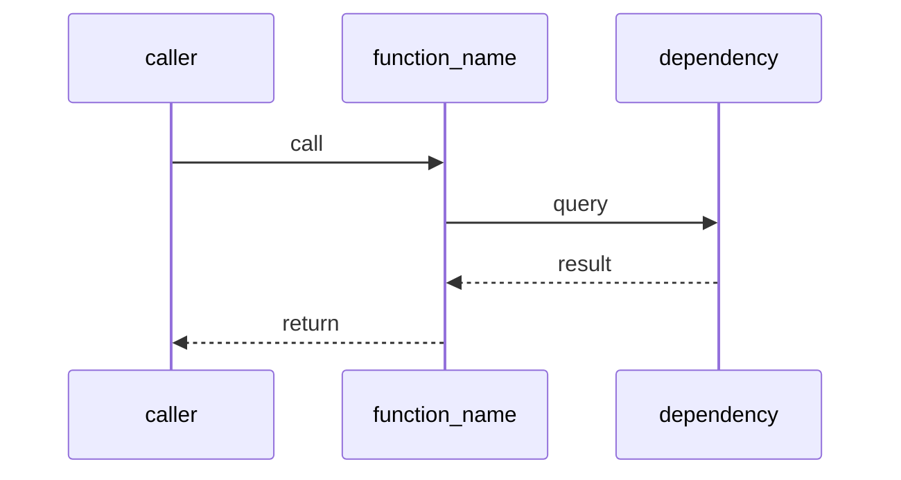

# Docs Skill — Local Documentation

ChronoQuant documentation lives in `_docs/`. Read this before creating or
updating module documentation.

---

## When to Document

**Only when there is an explicit task or direct user request for it.** Never
create or update docs speculatively. If no task and no request: skip entirely.

---

## Structure

`_docs/` mirrors `src/`. Every `src/` module directory has a corresponding
`_docs/` subdirectory:

```
_docs/
  store/             ← mirrors src/store/
  data_pipeline/     ← mirrors src/data_pipeline/
  modeling/          ← mirrors src/modeling/
  evaluation/        ← mirrors src/evaluation/
  streamlit_app/     ← mirrors src/streamlit_app/
  trading/           ← mirrors src/trading/
  app/               ← mirrors src/app/
  elliott_waves/     ← mirrors src/elliott_waves/
  plotting/          ← mirrors src/plotting/
```

---

## Doc File Naming

- One file per logical topic within the module directory
- Names: lowercase, underscores, descriptive — `sync_flow.md`, `schema.md`, `partitioning.md`
- No date prefixes; content should be evergreen

---

## Diagram Format

Always use **Mermaid** for diagrams inside `.md` files.

Supported types:
- `erDiagram` — database schemas
- `sequenceDiagram` — call flows between functions / modules
- `flowchart LR` / `flowchart TD` — module overview, data flow
- `classDiagram` — class structure and relationships

### Rendering Rules (mandatory — breaks silently if violated)

A Mermaid block renders in VS Code preview **only if all of these are true:**

1. **The opening fence starts at column 0** — never indented, never inside a list or blockquote
2. **Lowercase `mermaid`, no trailing spaces** on the opening line
3. **The closing ` ``` ` is also at column 0**
4. **Not nested inside another code fence** — a ` ```mermaid ` block inside a ` ```markdown ` block renders as raw code, not a diagram

**Correct — renders as diagram:**





> VS Code requires the **"Markdown Preview Mermaid Support"** extension for rendering.
> Without it, all Mermaid blocks show as raw code regardless of syntax.

### Diagram Design Rules

- Prefer **multiple simple diagrams** over one complex one
- Every diagram must be readable without rendering (label all nodes)
- Max ~15 nodes per diagram; split if larger

---

## Documentation Types

### 1. Database Doc

Required when documenting a DuckDB schema, table, or store module.

**Must include:**
- Top-level **ER diagram** (`erDiagram`) of all tables and their relationships
- One subsection per table with:
  - Purpose: one sentence on why the table exists
  - Columns: listed with `name | type | description` in a markdown table
  - Notable constraints or partitioning logic

**Structure:**

````markdown
# Schema — {Module Name}

One-line summary.

---

## Overview

[erDiagram — all tables and FK relationships]

## Tables

### table_name

Purpose: …

| Column | Type | Description |
|--------|------|-------------|
| id     | BIGINT | … |
| …      | …      | … |
````

---

### 2. Flow / Module Doc

Required when documenting a `.py` file, a package, or a data pipeline.

**Must include:**
- **Module overview** at the top: one paragraph + one `flowchart` or `sequenceDiagram`
- One subsection per function (or logical group of functions) with:
  - What the function does (1–2 sentences)
  - Parameters: name, type, purpose
  - Return value: type and meaning
  - At least one diagram (sequence or flowchart node) showing what the function
    influences or calls

**Structure:**

````markdown
# {Module Name}

One-line summary.

---

## Overview

[flowchart TD — module-level entry points and data flow]

## Functions

### function_name(param1, param2)

What it does.

| Parameter | Type | Description |
|-----------|------|-------------|
| param1    | str  | … |

Returns: `type` — what it means.

[sequenceDiagram — caller → function → dependencies → return]
````

---

## Layout Rule: Always Top-Down

Every doc starts with the **simplest possible overview** (one diagram, one paragraph),
then drills down into subsections. Never start with details.

```
1. Module overview + overview diagram
2. Subsection per table / function / component
3. Each subsection has its own focused diagram
```

---

## Relationship to _jira

Task files in `_jira/` may reference `_docs/` pages for context:
```markdown
## Scope
See `_docs/store/schema.md` for current DuckDB schema.
```

This keeps task files concise while pointing to stable reference docs.
