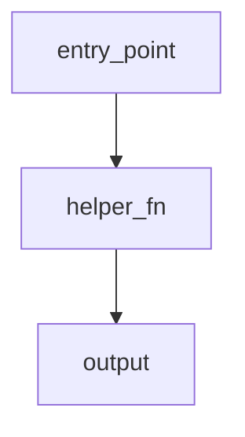
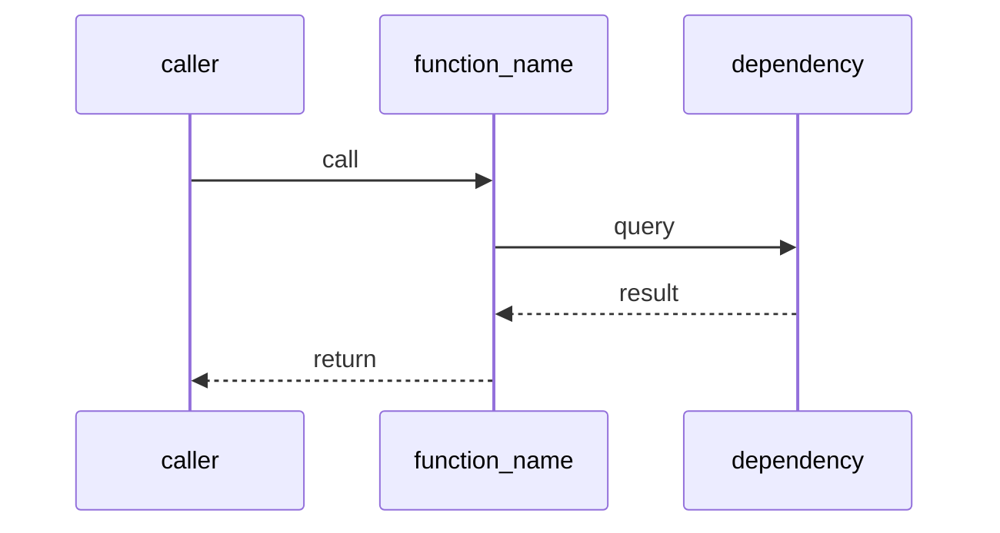

# Docs Skill — Local Documentation

ChronoQuant documentation lives in `_doc_/`, split into **three global zones** by
document type and owner agent. Read this before creating or updating any documentation.

---

## When to Document

**Only when there is an explicit task or direct user request for it.** Never
create or update docs speculatively. If no task and no request: skip entirely.

---

## Three-Zone Structure

`_doc_/` is organised into **three zone subdirectories**, each owned by exactly
one agent (single writer). The topic numbering (1xxx db, 2xxx features, 5xxx
modelling …) is preserved **inside each zone**, so cross-references stay predictable.

```
_doc_/
  0000_project_overview.md       ← global, root (orchestrator session-startup read)
  0001_agentic_system.md         ← global, root (agentic system description)
                                    ← ONLY these two files stay at the root

  database_and_code_doc/         ← ZONE 1 — implementation/code reference
    0002_data_architecture.md    ← cross-domain arch ref (numbered 0002 but lives in zone 1)
    0003_runtime_flow.md         ← cross-domain runtime flow ref (lives in zone 1)
    0004_model_lifecycle.md      ← cross-domain model lifecycle ref (lives in zone 1)
    1xxx–8xxx *.md               ← per-module code reference, DB schema
  methodology_doc/               ← ZONE 2 — rationale, decisions, methodology
    1xxx–8xxx *.md               ← per-module methodology docs
  models_doc/                    ← ZONE 3 — per-model reports (.ipynb → Quarto)

  _plans_/                       ← draft system plans (not a canonical zone)
```

**Root rule:** Only `0000_project_overview.md` and `0001_agentic_system.md` live at the
`_doc_/` root. Every other doc — including cross-domain architectural references (0002+)
— lives inside one of the three zone subdirectories. When a new global reference doc is
needed beyond 0001, place it in `database_and_code_doc/` if it describes system architecture
or data flow, or in `methodology_doc/` if it is rationale-only.

### Zone → owner → content → format

| Zone | Single writer | Content | Levels | Format |
|------|---------------|---------|--------|--------|
| `database_and_code_doc/` | **code_doc_agent** (exclusive) | DB schema, code reference; mermaid/UML; every function broken down | DB schema + X110 code-reference (incl. code-type X100, e.g. `2100_sync_features`, `4100_quant_train`) | `.md` |
| `methodology_doc/` | **methodology_agent** (exclusive) | Rationale, decisions, methodology; many diagrams; **nothing about code** | X000 domain overviews + X010–X099 methodology + methodology-type X100 | `.md` |
| `models_doc/` | **analyst_agent** (exclusive) | One report per model, references methodology; Quarto + CSS + plot palette | per-model | `.ipynb` (+ rendered `.html`) |

**Single-writer rule:** no agent writes into another agent's zone. If a doc needs
content from another zone, **link** to it — do not duplicate or cross-write.

### Zone assignment rule (by content, not by level number alone)

A file lands in the zone matching its **dominant content type**:

- **Code reference** — describes `.py` files, functions, CLI, DB schema/ER → `database_and_code_doc/`
  (this includes code-type X100 overviews such as `2100_sync_features`, `2200_features_polars`,
  `3100_sync_targets`, `4100_quant_train`, and the entire 1xxx infrastructure block).
- **Methodology / rationale** — describes *why*, decisions, alternatives, parameters, with
  **no code** → `methodology_doc/` (X000 domain overviews, X010 methodology, methodology X100).
- **Per-model analysis report** → `models_doc/` as a notebook.

---

## Cross-Reference Rule (one-directional)

Cross-references between zones are **one-directional**, an evolution of the old Entry-Gate principle:

- **`database_and_code_doc` → `methodology_doc` is MANDATORY**: code docs link *up* to the
  "why" (the methodology doc explains the rationale the code implements).
- **`methodology_doc` is code-free and MUST NOT link down to code**: it never references
  `database_and_code_doc` files, so it stays stable across refactors.
- **`models_doc` → `methodology_doc`**: model reports reference the methodology they apply.

```
methodology_doc/  ◀── database_and_code_doc/   (code links up to rationale)
       ▲
       └────────── models_doc/                  (reports link to methodology)
   (methodology never links down)
```

### Entry Gate (preserved)

Methodology comes **before** code documentation. If an X000/X100 methodology doc does
not yet exist for a topic, **do not** write the corresponding X110 code reference —
open a `todo_` ticket for the `methodology_agent` first. The X100 methodology sections
spec lives in `.agent/skills/methodology_doc_skill.md`.

---

## models_doc — registry + rendered report

Zone 3 is **not** hand-maintained markdown. Each model gets **one `.ipynb`** that:

- pulls per-instance data from the **registry + model artifact** (the modeling_agent is
  the *source*; the analyst_agent is the *owner/renderer*),
- references the relevant `methodology_doc` pages for the "why",
- renders to `.html` via Quarto (CSS + plot palette in `analyst/`).

**Per-instance data never grows the `_doc_` tree as static markdown** — 50 models must
not mean 50 hand-written pages. The data comes from registry queries; the report renders it.

---

## Doc File Naming

Files keep the **hierarchical numbering scheme** inside their zone:

| Level | Pattern | Example | Zone |
|-------|---------|---------|------|
| Domain overview | `X000` | `5000_modelling.md` | methodology_doc |
| Methodology | `X010–X099` | `2010_feature_engineering.md` | methodology_doc |
| Submodule overview (methodology) | `X100` | `7100_live_trading.md` | methodology_doc |
| Submodule / file (code) | `X100`/`X110` | `1110_duckdb_store.md`, `2100_sync_features.md` | database_and_code_doc |
| Global root | `0000`/`0001` | `0000_project_overview.md` | **`_doc_/` root only** |
| Cross-domain arch ref | `0002+` | `0002_data_architecture.md` | database_and_code_doc |

### Topic blocks (numbering kept across zones)

| Range | Domain |
|-------|--------|
| `0000–0001` | global (root) |
| `1000–1999` | Database Infrastructure |
| `2000–2999` | Features |
| `3000–3999` | Targets |
| `4000–4999` | Quant Train |
| `5000–5999` | Sampling / Modelling |
| `6000–6999` | Strategy |
| `7000–7999` | Trading Runtime |
| `8000–8999` | UI Dashboard |

**Ordering invariant (per block):** the methodology number is lower than its code number.
A new code doc must get a number higher than its related methodology doc.

---

## Navigation

There is **no separate TOC-index file**. Navigation relies on the speaking, numbered
filenames + `Glob`/`Grep`. The consolidated Quarto render (`analyst/doc_renderer/`)
provides the reading-order TOC for the HTML output.

---

## Diagram Format

Always use **Mermaid** for diagrams inside `.md` files.

Supported types:
- `erDiagram` — database schemas
- `sequenceDiagram` — call flows between functions / modules
- `flowchart LR` / `flowchart TD` — module overview, data flow
- `classDiagram` — class structure and relationships

### Rendering Rules (mandatory — breaks silently if violated)

A Mermaid block renders in VS Code preview **only if all of these are true:**

1. **The opening fence starts at column 0** — never indented, never inside a list or blockquote
2. **Lowercase `mermaid`, no trailing spaces** on the opening line
3. **The closing ` ``` ` is also at column 0**
4. **Not nested inside another code fence** — a ` ```mermaid ` block inside a ` ```markdown ` block renders as raw code, not a diagram

**Correct — renders as diagram:**





> VS Code requires the **"Markdown Preview Mermaid Support"** extension for rendering.
> Without it, all Mermaid blocks show as raw code regardless of syntax.

### Diagram Design Rules

- Prefer **multiple simple diagrams** over one complex one
- Every diagram must be readable without rendering (label all nodes)
- Max ~15 nodes per diagram; split if larger
- Avoid emoji/status glyphs inside Mermaid node labels (`✅`, `❌`, `⚠️`).
  Quarto's bundled Mermaid renderer may parse them as syntax errors. Use
  `OK:`, `NO:`, and `WARN:` inside Mermaid nodes; emoji can remain in normal
  markdown tables.
- For rendered Quarto HTML readability, Mermaid sizing is controlled by
  `analyst/chronoquant_analysis.css`. Keep diagrams within the report body:
  wrapper elements and `svg.mermaid-js` should fill `100%` width with
  `height: auto`; do not use a desktop-only width that exceeds the body unless
  the user explicitly asks for horizontal overflow.

### Quarto TOC / Mermaid Render Notes

- `_chronoquant_docs.ipynb` is generated by
  `analyst/doc_renderer/build_doc_notebook.py`; it walks the three zones in
  topic-number order. Its Raw-cell frontmatter can override `analyst/_quarto.yml`.
  When changing global doc layout, update both if the generated notebook must keep the setting.
- Current working TOC grid for consolidated docs: `sidebar-width: 380px`,
  `body-width: 900px`, `margin-width: 140px`, `gutter-width: 2rem`.
- The left TOC needs both enough sidebar grid width and CSS width. In
  `analyst/chronoquant_analysis.css`, keep `nav#TOC { width: 100%; font-size:
  0.92rem; }` for readable, less-wrapped TOC labels.
- Mermaid diagrams render as `pre.mermaid-js` converted to `svg.mermaid-js` by
  Quarto at page load. If a diagram appears tiny despite `svg { width: 100% }`,
  also set the intermediate `.cell-output-display` / `figure` wrappers to
  `width: 100%`; otherwise the SVG expands only inside a shrink-to-fit wrapper.

---

## Documentation Types

### 1. Database Doc (`database_and_code_doc/`)

Required when documenting a DuckDB schema, table, or store module.

**Must include:**
- Top-level **ER diagram** (`erDiagram`) of all tables and their relationships
- One subsection per table with:
  - Purpose: one sentence on why the table exists
  - Columns: listed with `name | type | description` in a markdown table
  - Notable constraints or partitioning logic

**Structure:**

````markdown
# Schema — {Module Name}

One-line summary.

---

## Overview

[erDiagram — all tables and FK relationships]

## Tables

### table_name

Purpose: …

| Column | Type | Description |
|--------|------|-------------|
| id     | BIGINT | … |
| …      | …      | … |
````

---

### 2. Flow / Module Doc (`database_and_code_doc/`)

Required when documenting a `.py` file, a package, or a data pipeline.

**Must include:**
- **Module overview** at the top: one paragraph + one `flowchart` or `sequenceDiagram`
- One subsection per function (or logical group of functions) with:
  - What the function does (1–2 sentences)
  - Parameters: name, type, purpose
  - Return value: type and meaning
  - At least one diagram (sequence or flowchart node) showing what the function
    influences or calls

**Structure:**

````markdown
# {Module Name}

One-line summary.

---

## Overview

[flowchart TD — module-level entry points and data flow]

## Functions

### function_name(param1, param2)

What it does.

| Parameter | Type | Description |
|-----------|------|-------------|
| param1    | str  | … |

Returns: `type` — what it means.

[sequenceDiagram — caller → function → dependencies → return]
````

---

## Documentation Ordering Principle

**Within every topic the order is mandatory: Overview → Methodology → Technical details.**

This is the organising principle of the whole documentation — it applies both to the
internal structure of a file and to the X000 → X100 → X110 level hierarchy. With the
three-zone split, the methodology (zone 2) precedes the code reference (zone 1) by topic
number, and the code reference links up to it.

```
X000 file  — domain overview: flowchart, high-level description, submodule list   (methodology_doc)
X010–X099  — methodology: why, decisions, risks, parameters                       (methodology_doc)
X100       — submodule overview: methodology X100 → methodology_doc;
             code X100 (sync_*, schema/CLI) → database_and_code_doc
X110+      — full code reference: functions, parameters, .py-level diagrams        (database_and_code_doc)
```

**Internal file structure (every level):**
1. `## Overview` — one paragraph + flowchart: what it is and where it connects in the pipeline
2. `## Üzleti és módszertani háttér` — methodology files only (why, alternatives, key concepts, parameters)
3. Tables / functions / components — concrete technical description (code files)

**Redundancy rule:** the overview describes the high-level logic and structure. Detailed
subsections expand it but do not repeat it. Dedicated content duplication is forbidden —
cross-reference with a link instead.

**Mermaid mandatory:** at least 2–3 Mermaid diagrams per X100 file. The `## Overview`
always has a pipeline flowchart. Each methodological decision gets its own diagram.

## Layout Rule: Always Top-Down

Every doc starts with the **simplest possible overview** (one diagram, one paragraph),
then drills down into subsections. Never start with details.

```
1. Module overview + overview diagram
2. Methodology sections (why, decisions, risks)   ← methodology_doc
3. Subsection per table / function / component     ← database_and_code_doc
4. Each subsection has its own focused diagram
```

---

## Methodology Rule: X000 and X100 methodology files

**Business and methodological content is the `methodology_agent`'s job and lives in
`methodology_doc/` — the `code_doc_agent` writes ONLY code reference in `database_and_code_doc/`.**

If a code-reference doc needs methodology context that does not yet exist:
- Do not write it yourself
- Open a `todo_` ticket for the `methodology_agent`
- Hold the code reference until the methodology doc exists (Entry Gate)

The mandatory six-section spec for methodology X100 files:
→ `.agent/skills/methodology_doc_skill.md`

---

## Relationship to _jira

Task files in `_jira_/` may reference `_doc_/` pages for context:
```markdown
## Scope
See `_doc_/database_and_code_doc/1110_duckdb_store.md` for the store code reference.
See `_doc_/methodology_doc/3000_targets.md` for the target methodology.
```

This keeps task files concise while pointing to stable reference docs.
