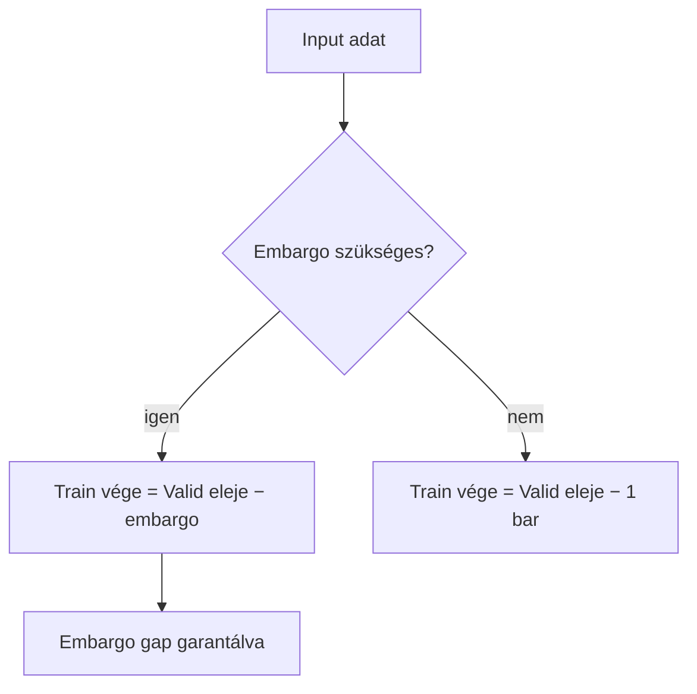
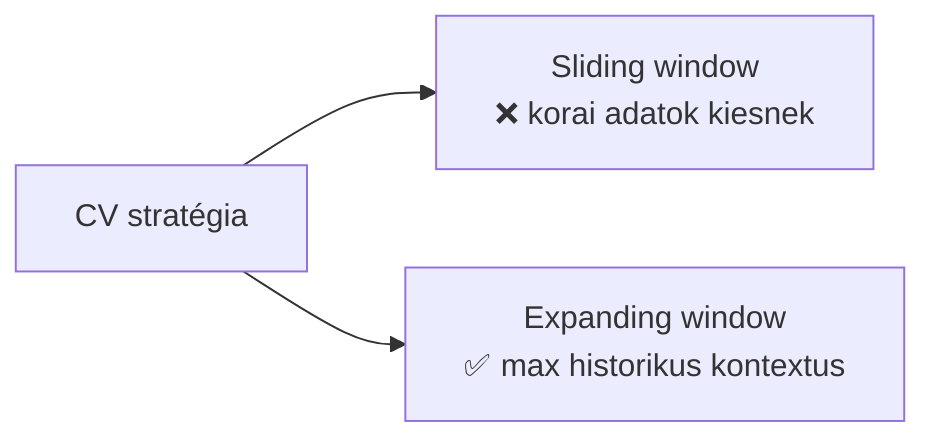
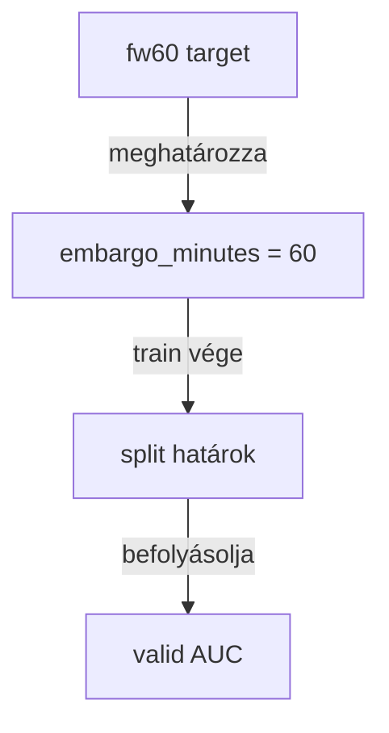
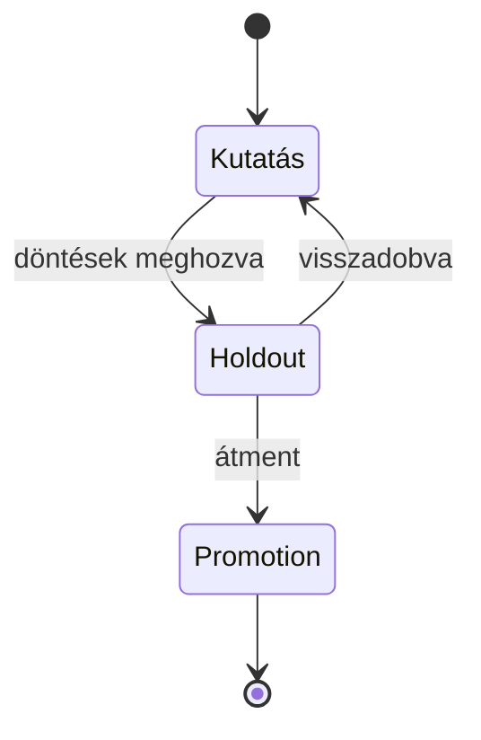

# Methodology Doc Skill — Methodological Context Documentation

Single source of truth for writing X000 and X100 files. Read before creating
or updating any fejezet or alfejezet-level `_doc_/` file.

---

## When to Activate

Only when explicitly assigned a documentation task OR when investigation mode
identifies a gap. Never produce methodology docs speculatively.

---

## File Naming and Numbering

Use the numbering scheme defined in `docs_skill.md`:

| Szint | Minta | Leírás |
|-------|-------|--------|
| X000 | `3000_modelling.md` | Fejezet — teljes domain áttekintője |
| X100 | `3100_sampling.md` | Alfejezet — almodul áttekintője |
| X110+ | — | Részletes fájlok — **code_doc_agent territory, nem ide** |

Chapter assignment:
| Tartomány | Domain |
|-----------|--------|
| 1000 | database |
| 3000 | modeling |

If no number exists for a new submodule: assign the next available X100 slot
within the domain's range.

---

## Source Extraction Protocol

Before writing any section:

1. **Scan `_jira_/`** for stories and epic tasks related to this module:
   - Check file names and frontmatter first
   - Open full content only for stories clearly related to this module
   - Copy rationale verbatim, then rewrite in doc style
2. **Read `src/<module>/`** — implementation is ground truth for what was actually decided
3. **Read `config/`** entries for parameter values
4. **Check `docs/` legacy** for any narrative rationale worth migrating; if content contradicts current code, trust the code
5. **Check `_doc_/analysis/`** for empirical findings relevant to this module

---

## Entry Gate Rule

The code_doc_agent may NOT write X110 files for a module unless the parent X100
already contains all six mandatory sections. If the X100 is missing or
incomplete: the methodology_agent writes it first. This is enforced per module.

---

## X100 Standard Structure (Six Sections — All Mandatory)

Every X100 file must contain all six sections under `## Üzleti és módszertani háttér`.
Empty sections are forbidden. If genuinely unknown, write the current best-guess
and mark it `(feltételezés — validálásra vár)`.

```markdown
## Üzleti és módszertani háttér

### Miért kritikus ez a lépés?
### Miért ezt a megközelítést?
### [Kulcsfogalom N]: miért kell és hogyan működik?
### Paraméter alapértékek és indoklásuk
### Ismert kockázatok és korlátok
### Validációs checklist
```

The third section (`[Kulcsfogalom N]`) repeats for every non-trivial design
decision in the module. One subsection per decision concept (e.g., "Miért embargo?",
"Miért expanding window?", "Miért log return target?").

---

## Section Templates

### 1. Miért kritikus ez a lépés?

```markdown
### Miért kritikus ez a lépés?

[Modul neve] az [upstream input]-ot [downstream output]-tá alakítja. Ezen a
ponton dől el [mi a tét]. Ha [ez a lépés] rosszul van konfigurálva,
[mi a következmény az egész pipeline-ban].
```

### 2. Miért ezt a megközelítést? (Alternatives table)

```markdown
### Miért ezt a megközelítést?

| Megközelítés | Előny | Hátrány | Státusz |
|--------------|-------|---------|---------|
| Jelenlegi — X | ... | ... | ✅ Választott |
| Alternatíva A | ... | ... | ❌ Elvetett — ok: ... |
| Alternatíva B | ... | ... | ⚠️ Fontolóra vehető — feltétel: ... |
```

Every alternatives table must include at least one rejected alternative.
If no alternative was formally considered, write what would be the obvious
alternative and explain why it was not chosen.

### 3. [Kulcsfogalom]: miért kell és hogyan működik?

```markdown
### [Kulcsfogalom]: miért kell és hogyan működik?

[2–3 mondat: mi ez a fogalom és miért szükséges ebben a modulban.]

[Opcionálisan: egy rövid számítási példa vagy összefüggés ha matematikailag
nem triviális.]

**Szabály:** [Az ebből következő operatív szabály, amit az agent betart.]
```

### 4. Paraméter alapértékek és indoklásuk

```markdown
### Paraméter alapértékek és indoklásuk

| Paraméter | Alapérték | Indoklás |
|-----------|-----------|---------|
| `param_name` | `value` | Miért ez az érték; mi a kockázat ha megváltoztatják |
```

Every configurable parameter must appear. "Default from config" is not an
acceptable rationale — explain WHY that value was chosen.

### 5. Ismert kockázatok és korlátok

```markdown
### Ismert kockázatok és korlátok

| Kockázat | Tünet | Mitigáció |
|----------|-------|-----------|
| [Leírás] | [Mi jelzi ha bekövetkezik] | [Mi csökkenti vagy kezeli] |
```

### 6. Validációs checklist

```markdown
### Validációs checklist

- [ ] [Ellenőrzési pont 1]
- [ ] [Ellenőrzési pont N]
```

Minimum five items. Items must be actionable checks, not vague goals.

---

## Incorporating Analyst Findings

If `_doc_/analysis/` contains a notebook with findings for this module:

1. Read the Summary section of the notebook
2. Translate relevant findings into methodology notes:
   - Confirmed assumptions → add to "Miért ezt a megközelítést?" as empirical support
   - Risk observations → add a row to "Ismert kockázatok és korlátok"
   - Calibration or distribution issues → named risk row with known mitigation status
3. Cite the source:
   ```markdown
   Forrás: `_doc_/analysis/<slug>.ipynb` — <dátum>, <finding title>
   ```

---

## X000 Structure

Fejezet-szintű (X000) fájlok az alfejezeteket összefoglalják. Required sections:

1. One-paragraph domain overview
2. Flowchart of submodule connections (Mermaid `flowchart TD`)
3. Domain-level business rationale (1–2 paragraph)
4. Table of submodules with links to X100 files
5. Cross-cutting domain methodological principles (rules that apply to all submodules)

X000 does NOT repeat the six sections — those belong in each X100.

---

## Investigation Mode — Gap Detection

When running a domain sweep:

1. List all implemented modules in `src/<domain>/`
2. For each module check: does a corresponding X100 exist in `_doc_/`?
3. If yes: does the X100 contain all six sections?
4. For each gap: create a `todo_` ticket

Gap ticket template:
```markdown
---
epic: epic_{id}
id: t{n}
title: [Module] X100 metodológiai szekciók megírása
assignee: methodology_agent
status: todo
---

## Goal
Az `_doc_/X100_<module>.md` fájl hiányzik vagy a módszertani szekciók hiányosak.

## Scope
- Forrás: `src/<path>/` implementáció
- Forrás: `_jira_/` kapcsolódó story-k
- Cél: `_doc_/X100_<module>.md`

## Acceptance Criteria
- [ ] Mind a hat szekció jelen van és nem üres
- [ ] Alternatíva-táblázat legalább egy elvetett alternatívát tartalmaz
- [ ] Paraméter táblázat minden paraméternél tartalmaz indoklást
- [ ] Validációs checklist legalább 5 pontból áll
```

---

## Mermaid — Diagram-First Rule

**Rajzolj Mermaid diagramot minden olyan koncepthez, ami vizuálisan is megmutatható.**
Ez a leg fontosabb stílusbeli elvárás a methodology_agent munkájában.

Rendering rules from `docs_skill.md` apply (opening fence at column 0,
lowercase `mermaid`, not nested inside lists or other fences).

### Preferált típusok és mikor

**`flowchart TD` — pipeline, döntési folyamat:**


**`flowchart LR` — alternatívák összehasonlítása:**


**`graph TD` — fogalmak közötti összefüggés:**


**`stateDiagram-v2` — életciklus, állapotok:**


### Kötelező diagramok X100 fájlban

| Helyszín | Diagram |
|----------|---------|
| `## Overview` | Modul-szintű flowchart — hogyan kapcsolódik az upstream/downstream elemekhez |
| `### Miért ezt a megközelítést?` | Alternatívák összehasonlítása (flowchart LR vagy táblázat + diagram) |
| Minden kulcsfogalom szekció | Legalább egy diagram illusztrálva a fogalom mechanizmusát |

Minimum: **2–3 Mermaid diagram X100 fájlonként.** X000 fejezet-fájlban minimum 1.
