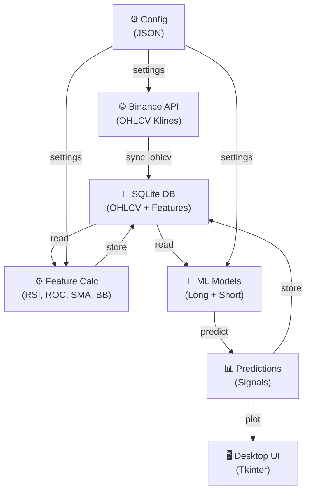
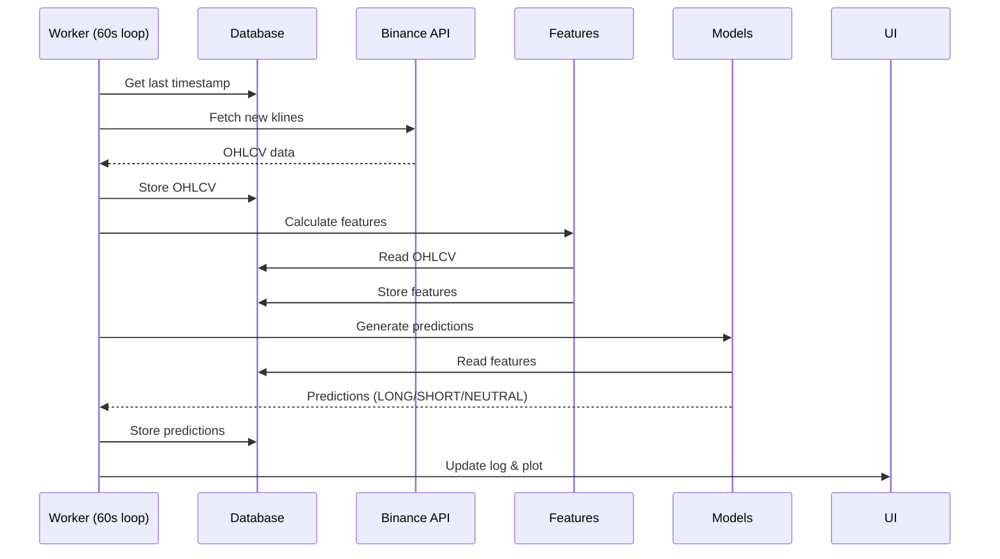
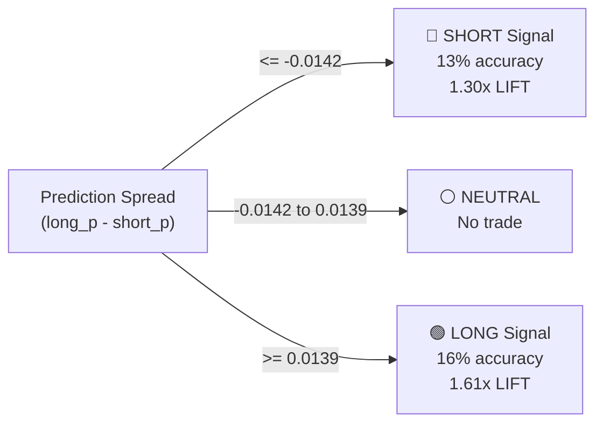

# ChronoQuant Architecture

## Overview
ChronoQuant is a **real-time trading signal prediction system** using machine learning to identify price movement opportunities on Binance. It combines live OHLCV data, technical features, and trained ML models to generate LONG/SHORT trading signals.

---

## System Architecture



---

## Core Modules

| Module | Purpose |
|--------|---------|
| **main_app.py** | Entry point - initializes Tkinter GUI |
| **app/ui.py** | Desktop UI - logs, plots, layout |
| **app/worker.py** | Main loop - orchestrates sync/predict cycle |
| **app/settings.py** | Runtime configuration (poll interval, UI dims) |
| **database_codes/sync_ohlcv.py** | Fetches Binance klines, stores in DB |
| **database_codes/features.py** | Calculates technical indicators |
| **database_codes/predictions.py** | Runs ML models, generates signals |
| **database_codes/pred_view.py** | Formats predictions for plotting |
| **utils.py** | Path resolution, config loading |

---

## Data Flow



---

## Signal Logic



---

## Configuration Structure

```
config/
├── db.json          # Database path, tables, symbol
├── env.json         # API keys path, logging
├── features.json    # Feature definitions & params
└── models.json      # Model paths, predict methods
```

**Key Config Example:**
```json
{
  "database": {
    "db_path": "data/chronoquant.db",
    "symbol": "BTCUSDT",
    "tables": {"ohlcv": "OHLCV", "features": "FEATURES", "predictions": "PREDICTIONS"}
  },
  "models": {
    "lg_l_rw240_p90_base_sm": {
      "target_name": "trg_l_rw_240_prc_09",
      "paths": {"model_dir": "model_dev/lg_l_rw240_p90_base_sm"}
    },
    "lg_s_rw240_p90_base_sm": {
      "target_name": "trg_s_rw_240_prc_01",
      "paths": {"model_dir": "model_dev/lg_s_rw240_p90_base_sm"}
    }
  }
}
```

---

## Key Processes

### 1. **Data Sync** (`sync_ohlcv`)
- Queries Binance API for new klines (1-min candles)
- Stores OHLCV (Open, High, Low, Close, Volume) in DB
- Tracks last timestamp to avoid duplicates

### 2. **Feature Engineering** (`sync_features`)
- Calculates 7-8 technical indicators:
  - RSI (14-period)
  - ROC (Rate of Change, 14 & 140 periods)
  - SMA Ratio (14 & 140 periods)
  - Bollinger Bands Width (14 & 140 periods)
- Stores in FEATURES table for model consumption

### 3. **Model Prediction** (`sync_predictions`)
- Loads 2 trained logistic regression models:
  - **Long Model**: Predicts top 10% price increases
  - **Short Model**: Predicts bottom 10% price decreases
- Calculates prediction spread = (long_prob - short_prob)
- Generates signals: LONG (>=0.0139), SHORT (<=-0.0142), NEUTRAL (between)

### 4. **UI & Visualization** (`pred_view`)
- Streams live logs to Tkinter text widget
- Plots latest predictions with signal zones
- Updates every poll cycle (60 seconds default)

---

## Scope

✅ **What it does:**
- Real-time signal generation (1-min candles)
- Multi-indicator feature engineering
- Probabilistic price direction prediction
- Live UI with charts and logs

❌ **What it doesn't:**
- Execute trades (signals only)
- Multi-timeframe analysis
- Portfolio risk management
- Live market data beyond Binance

---

## Deployment

### Development
```bash
python main_app.py
```

### Production (PyInstaller)
```bash
cd tools/build
.\build.ps1
# Output: build/main_app/main_app.exe
```

---

## Tech Stack

- **Framework:** Tkinter (GUI)
- **Data:** Pandas, SQLite3
- **ML:** Statsmodels (logistic regression)
- **Data Source:** Binance API (python-binance)
- **Indicators:** TA (Technical Analysis)
- **Build:** PyInstaller

---

## Analysis & Backtesting

- **Cut-off Analysis:** [ANALYSIS.md](ANALYSIS.md) - Optimal signal thresholds
- **Model Dev:** `model_dev/` - Jupyter notebooks for model training
- **Demo Signals:** `analysis/demo_trading_signals.py` - Signal generation examples
