# ChronoQuant — Agentic System Documentation

Rendszer- és környezetleírás az AI-alapú fejlesztési infrastruktúrához.  
Sorszám: `0001` — projekt-szintű globális dokumentum.

---

## Overview

A ChronoQuant fejlesztési munkafolyamatát egy **multi-agent orchestráció** vezérli.
A Claude (LLM) két szerepben működik: **orchestrátorként** (task-elosztás, tervezés)
és **specialist agentként** (végrehajtás domain szerint). Az összes agent a Claude Code
CLI-t használja, ugyanazon projekt-könyvtárból dolgozik, és közös szabályrendszert követ.

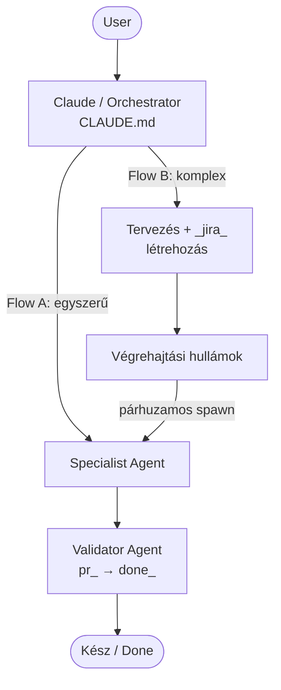
```mermaid
flowchart TD
  USER([User]) --> ORCH[Claude / Orchestrator\nCLAUDE.md]
  ORCH -->|Flow A: egyszerű| AGENT[Specialist Agent]
  ORCH -->|Flow B: komplex| PLAN[Tervezés + _jira_\nlétrehozás]
  PLAN --> WAVE[Végrehajtási hullámok]
  WAVE -->|párhuzamos spawn| AGENT
  AGENT --> VALID[Validator Agent\npr_ → done_]
  VALID --> DONE([Kész / Done])
```

---

## 1. Orchestrátor — CLAUDE.md

A projekt belépési pontja. Nem ír alkalmazáskódot — kizárólag koordinál.

### 1.1 Session Startup (minden session elején kötelező)

```
1. Beolvassa: _doc_/0000_project_overview.md
2. Beolvassa: .agent/general_principles.md
3. Listázza: _jira_/ tartalmát (csak fájlnevek, nem tartalom)
4. Vár a user kérésére
```

> **Soha nem tölti be:** agent manifesteket, `_doc_/<module>/` oldalakat,
> `_jira_/archive/` tartalmát.

### 1.2 Kérés-osztályozás

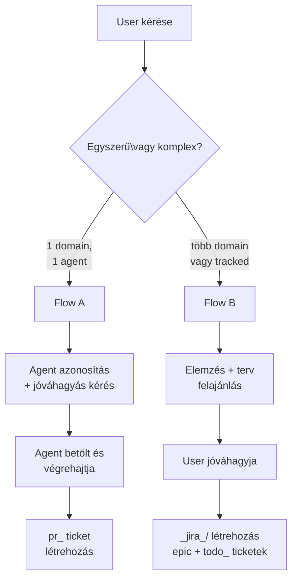
```mermaid
flowchart TD
  REQ[User kérése] --> Q{Egyszerű\vagy komplex?}
  Q -->|1 domain,\n1 agent| FA[Flow A]
  Q -->|több domain\nvagy tracked| FB[Flow B]
  FA --> CONFIRM[Agent azonosítás\n+ jóváhagyás kérés]
  CONFIRM --> EXEC[Agent betölt és\nvégrehajtja]
  EXEC --> PR[pr_ ticket\nlétrehozás]
  FB --> ANALYZE[Elemzés + terv\nfelajánlás]
  ANALYZE --> APPROVE[User jóváhagyja]
  APPROVE --> JIRA[_jira_/ létrehozás\nepic + todo_ ticketek]
```

---

## 2. Flow A — Egyszerű kérés (1 agent)

Egyetlen domainhoz tartozó, jól körülhatárolt feladat.

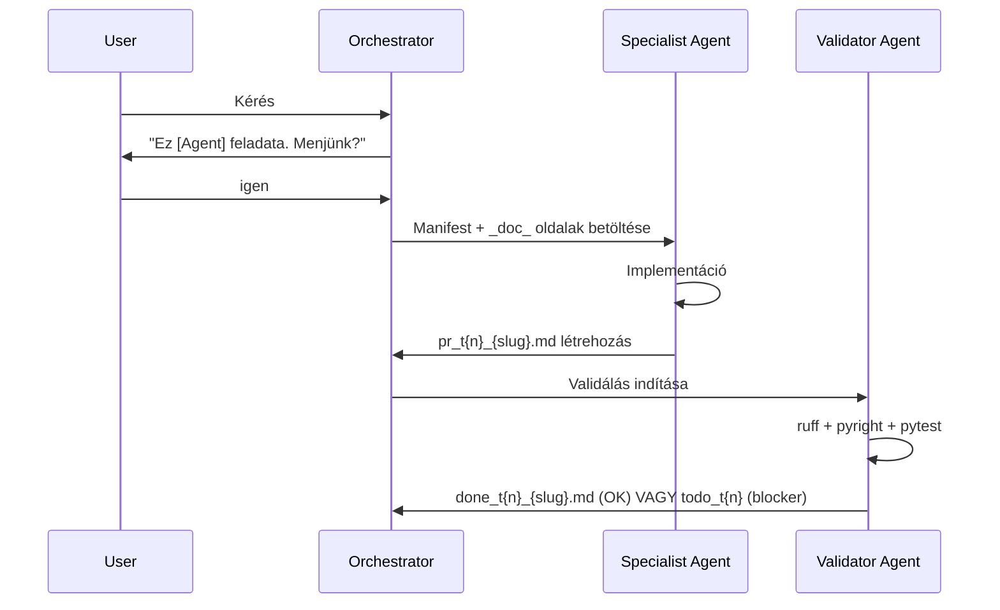
```mermaid
sequenceDiagram
  participant U as User
  participant O as Orchestrator
  participant A as Specialist Agent
  participant V as Validator Agent

  U->>O: Kérés
  O->>U: "Ez [Agent] feladata. Menjünk?"
  U->>O: igen
  O->>A: Manifest + _doc_ oldalak betöltése
  A->>A: Implementáció
  A->>O: pr_t{n}_{slug}.md létrehozás
  O->>V: Validálás indítása
  V->>V: ruff + pyright + pytest
  V->>O: done_t{n}_{slug}.md (OK) VAGY todo_t{n} (blocker)
```

- Nincs előzetes `todo_` ticket — az agent rögtön `pr_`-rel kezd.
- A validator ugyanabban a sessionben fut.

---

## 3. Flow B — Komplex kérés (több agent)

Több domaint érintő, nyomon követett munka.

### 3.1 Előkészítés

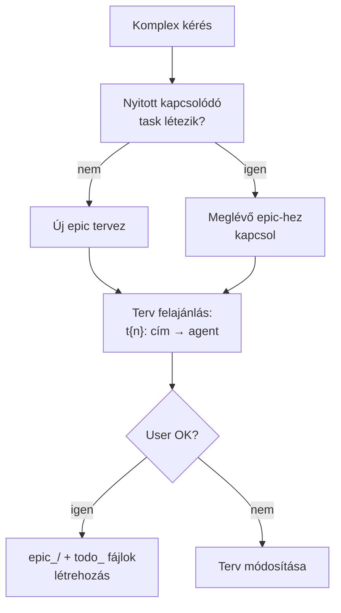
```mermaid
flowchart TD
  REQ[Komplex kérés] --> CHECK[Nyitott kapcsolódó\ntask létezik?]
  CHECK -->|igen| LINK[Meglévő epic-hez\nkapcsol]
  CHECK -->|nem| NEW[Új epic tervez]
  NEW --> PLAN["Terv felajánlás:\nt{n}: cím → agent"]
  LINK --> PLAN
  PLAN --> APPROVE{User OK?}
  APPROVE -->|igen| CREATE[epic_/ + todo_ fájlok\nlétrehozás]
  APPROVE -->|nem| REVISE[Terv módosítása]
```

### 3.2 Mód A — Szegmentált végrehajtás

User sessionenként megnevezi az agent-típust.

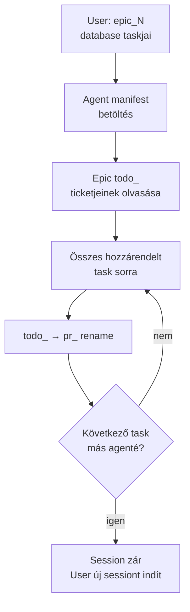
```mermaid
flowchart TD
  USER[User: epic_N\ndatabase taskjai] --> LOAD[Agent manifest\nbetöltés]
  LOAD --> READ[Epic todo_\nticketjeinek olvasása]
  READ --> EXEC[Összes hozzárendelt\ntask sorra]
  EXEC --> RENAME[todo_ → pr_ rename]
  RENAME --> CHECK{Következő task\nmás agenté?}
  CHECK -->|igen| CLOSE[Session zár\nUser új sessiont indít]
  CHECK -->|nem| EXEC
```

### 3.3 Mód B — Orchestrált, párhuzamos végrehajtás

Az orchestrátor aktív marad és subagenteket spawnol.

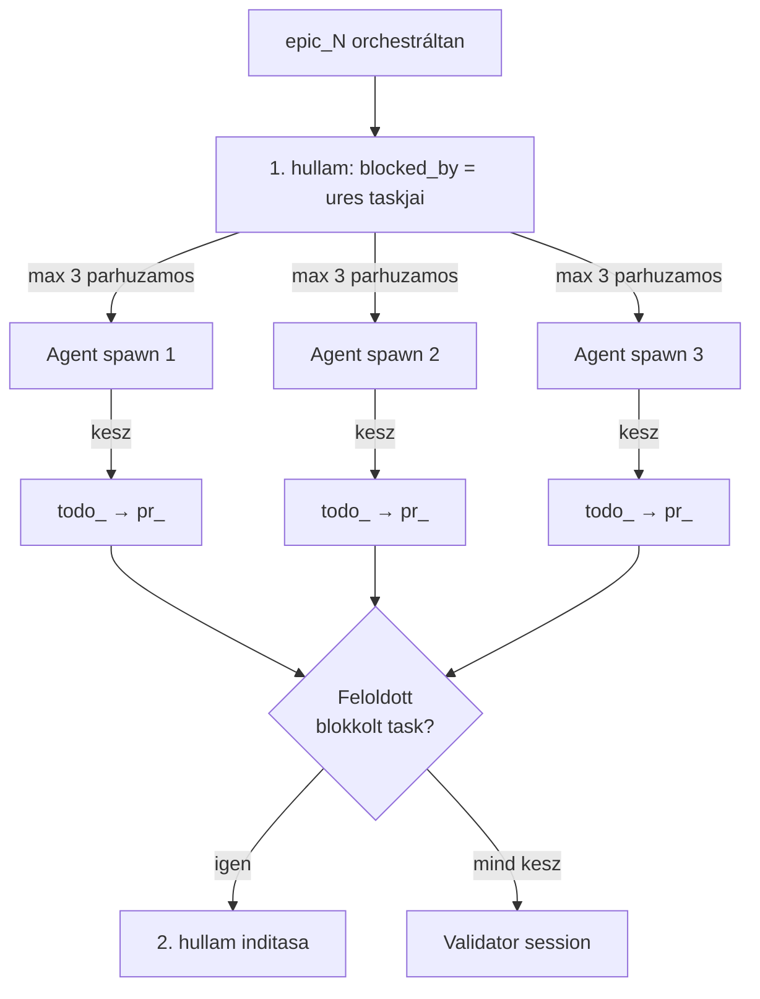
```mermaid
flowchart TD
  START["epic_N orchestráltan"] --> WAVE1["1. hullam: blocked_by = ures taskjai"]
  WAVE1 -->|max 3 parhuzamos| S1[Agent spawn 1]
  WAVE1 -->|max 3 parhuzamos| S2[Agent spawn 2]
  WAVE1 -->|max 3 parhuzamos| S3[Agent spawn 3]
  S1 -->|kesz| R1["todo_ → pr_"]
  S2 -->|kesz| R2["todo_ → pr_"]
  S3 -->|kesz| R3["todo_ → pr_"]
  R1 --> UNLOCK{Feloldott\nblokkolt task?}
  R2 --> UNLOCK
  R3 --> UNLOCK
  UNLOCK -->|igen| WAVE2[2. hullam inditasa]
  UNLOCK -->|mind kesz| VALID[Validator session]
```

**Spawn model-szabályok:**

| Task típus | Agent típus | Model |
|------------|-------------|-------|
| Keresés, olvasás | `Explore` | `haiku` |
| Rövid implementáció (1-2 fájl) | Névvel ellátott | `haiku` |
| Komplex, cross-file implementáció | Névvel ellátott | `sonnet` (default) |

> **Limit:** max 3 egyidejű Agent spawn.

---

## 4. Validator Session (4a. lépés)

Minden dev session után kötelező. Kizárólag `pr_` státuszú taskokon dolgozik.

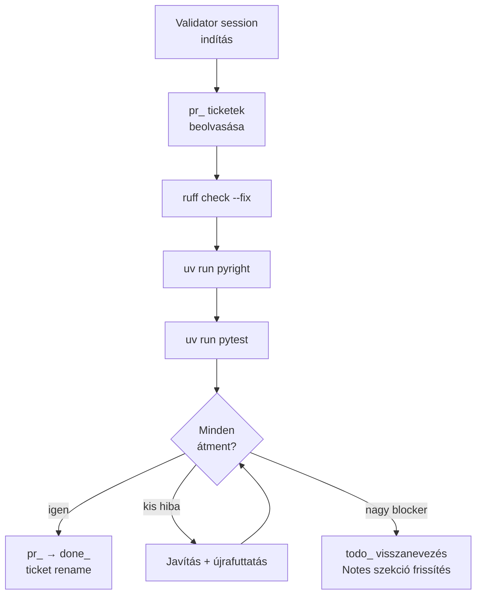
```mermaid
flowchart TD
  START[Validator session\nindítás] --> READ[pr_ ticketek\nbeolvasása]
  READ --> RUFF[ruff check --fix]
  RUFF --> PYRIGHT[uv run pyright]
  PYRIGHT --> PYTEST[uv run pytest]
  PYTEST --> Q{Minden\nátment?}
  Q -->|igen| DONE[pr_ → done_\nticket rename]
  Q -->|kis hiba| FIX[Javítás + újrafuttatás]
  Q -->|nagy blocker| BACK[todo_ visszanevezés\nNotes szekció frissítés]
  FIX --> Q
```

---

## 5. Specialist Agentok

A projekt 7 specialist agentje van. Mindegyik betölt egy manifest fájlt (`.agent/agents/`),
majd a szükséges skill-eket és tool dokumentációkat.

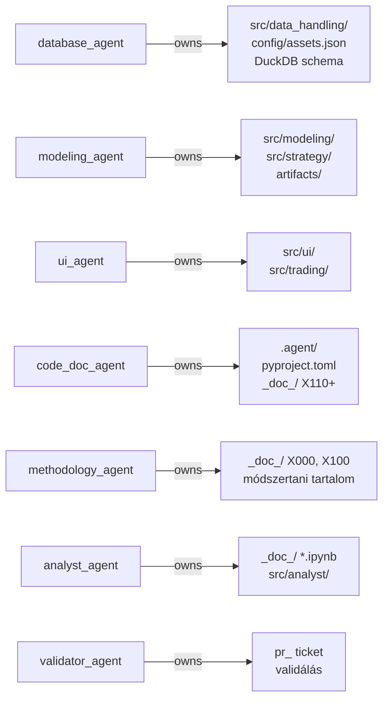
```mermaid
flowchart LR
  DB[database_agent]
  MOD[modeling_agent]
  UI[ui_agent]
  DOC[code_doc_agent]
  METH[methodology_agent]
  ANA[analyst_agent]
  VAL[validator_agent]

  DB --> |owns| SRC1[src/data_handling/\nconfig/assets.json\nDuckDB schema]
  MOD --> |owns| SRC2[src/modeling/\nsrc/strategy/\nartifacts/]
  UI --> |owns| SRC3[src/ui/\nsrc/trading/]
  DOC --> |owns| SRC4[.agent/\npyproject.toml\n_doc_/ X110+]
  METH --> |owns| SRC5[_doc_/ X000, X100\nmódszertani tartalom]
  ANA --> |owns| SRC6[_doc_/ *.ipynb\nsrc/analyst/]
  VAL --> |owns| SRC7[pr_ ticket\nvalidálás]
```

### 5.1 Agent manifest struktúra

Minden manifest tartalmaz:
- **Role** — mit csinál és mit nem
- **Required Skills and Tools** — mit kell betöltenie induláskor
- **Scope** — path ↔ felelősség táblázat
- **Out of Scope** — expliicit tiltólista
- **Key Patterns** — projekt-specifikus szabályok

### 5.2 Agent referencia

| Agent | Manifest | Scope | Skill-ek | Tool-ok |
|-------|----------|-------|----------|---------|
| `database_agent` | `.agent/agents/database_agent.md` | `src/data_handling/`, DuckDB | coding, jira | lsp, ast-grep, uv |
| `modeling_agent` | `.agent/agents/modeling_agent.md` | `src/modeling/`, `src/strategy/`, artifacts | coding, jira | lsp, ast-grep, uv |
| `ui_agent` | `.agent/agents/ui_agent.md` | `src/ui/`, `src/trading/` | coding, jira | lsp |
| `code_doc_agent` | `.agent/agents/code_doc_agent.md` | `.agent/`, config, `_doc_/` X110+ | jira, docs | uv, permissions |
| `methodology_agent` | `.agent/agents/methodology_agent.md` | `_doc_/` X000, X100 | jira, methodology_doc | — |
| `analyst_agent` | `.agent/agents/analyst_agent.md` | `_doc_/*.ipynb`, `src/analyst/` | analyst, quarto | — |
| `validator_agent` | `.agent/agents/validator_agent.md` | `pr_` ticketek, `src/*/tests/` | jira | lsp, uv |

### 5.3 Agent betöltési sorrend

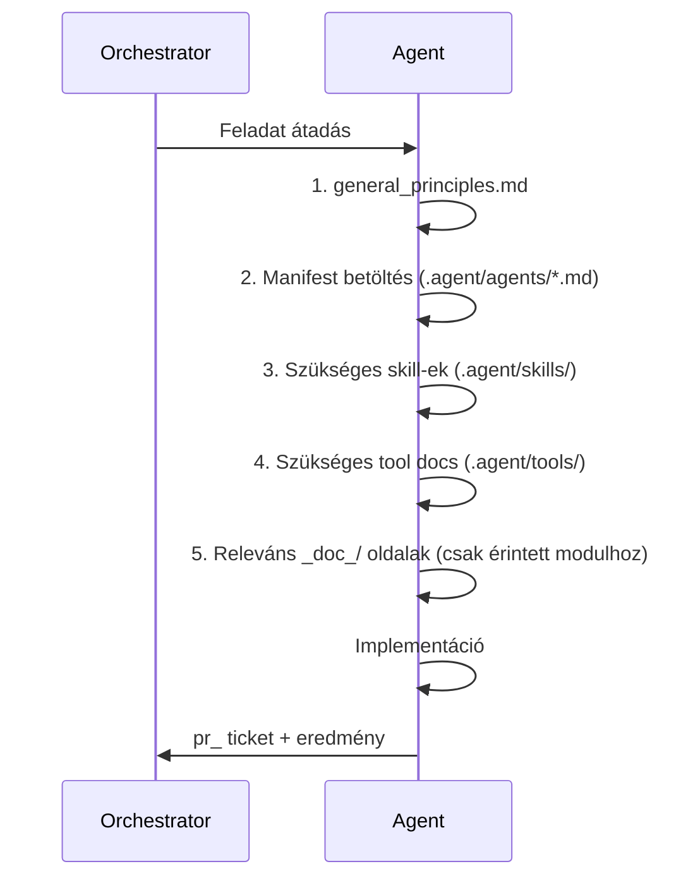
```mermaid
sequenceDiagram
  participant O as Orchestrator
  participant A as Agent

  O->>A: Feladat átadás
  A->>A: 1. general_principles.md
  A->>A: 2. Manifest betöltés (.agent/agents/*.md)
  A->>A: 3. Szükséges skill-ek (.agent/skills/)
  A->>A: 4. Szükséges tool docs (.agent/tools/)
  A->>A: 5. Releváns _doc_/ oldalak (csak érintett modulhoz)
  A->>A: Implementáció
  A->>O: pr_ ticket + eredmény
```

---

## 6. Skills (Készségek)

A skill fájlok `.agent/skills/` alatt élnek. Végrehajtási útmutatók — nem általános instrukciók.

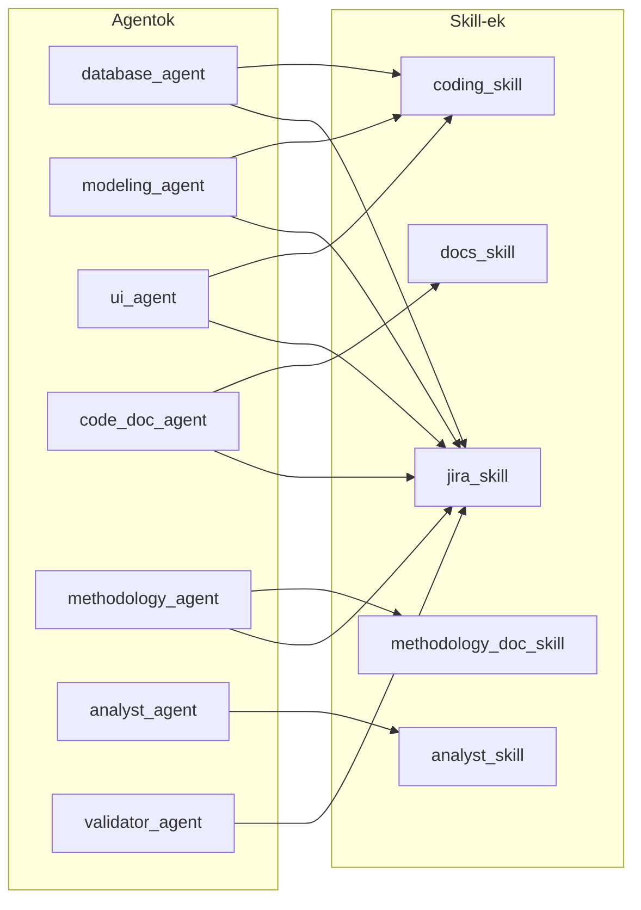
```mermaid
flowchart LR
  subgraph AG[Agentok]
    direction TB
    DB[database_agent]
    MOD[modeling_agent]
    UI[ui_agent]
    DOC[code_doc_agent]
    METH[methodology_agent]
    ANA[analyst_agent]
    VAL[validator_agent]
  end

  subgraph SK[Skill-ek]
    direction TB
    JS[jira_skill]
    CS[coding_skill]
    DS[docs_skill]
    MS[methodology_doc_skill]
    AS[analyst_skill]
  end

  DB --> JS & CS
  MOD --> JS & CS
  UI --> JS & CS
  DOC --> JS & DS
  METH --> JS & MS
  ANA --> AS
  VAL --> JS
```

### 6.1 Skill összefoglaló

| Skill | Mit fed | Ki használja |
|-------|---------|--------------|
| `coding_skill.md` | Type annotations, docstring stílus, naming, alignment, logging, modul-szerkezet | database, modeling, ui, validator |
| `jira_skill.md` | `_jira_/` könyvtár-struktúra, ID-szabályok, task lifecycle, template-ek | minden agent |
| `docs_skill.md` | `_doc_/` számozási séma (X000–X110), Mermaid szabályok, doc típusok | code_doc, methodology |
| `methodology_doc_skill.md` | X100 hat kötelező szekció template-jei, alternatíva-tábla formátum | methodology |
| `analyst_skill.md` | Quarto frontmatter, notebook-struktúra, chart-szabályok, szekció-minta, `display_analysis_table()`, numeric formatting, paletta | analyst |

---

## 7. Tools (Eszközök)

A tool dokumentációk `.agent/tools/` alatt élnek.

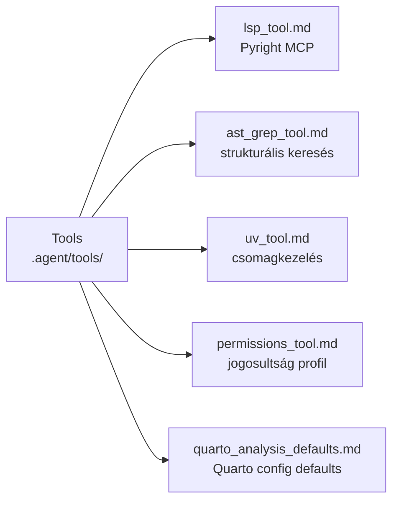
```mermaid
flowchart LR
  T["Tools\n.agent/tools/"]
  T --> LSP[lsp_tool.md\nPyright MCP]
  T --> AST[ast_grep_tool.md\nstrukturális keresés]
  T --> UV[uv_tool.md\ncsomagkezelés]
  T --> PERM[permissions_tool.md\njogosultság profil]
  T --> QUA[quarto_analysis_defaults.md\nQuarto config defaults]
```

### 7.1 LSP Tool — Pyright MCP

Pyright-alapú Language Server Protocol MCP szerveren keresztül.

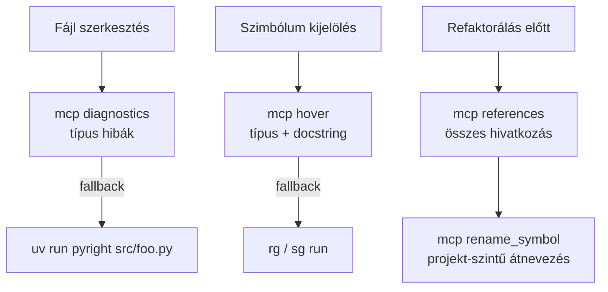
```mermaid
flowchart TD
  EDIT[Fájl szerkesztés] --> DIAG[mcp diagnostics\ntípus hibák]
  HOVER[Szimbólum kijelölés] --> HOV[mcp hover\ntípus + docstring]
  REFACT[Refaktorálás előtt] --> REF[mcp references\nösszes hivatkozás]
  REF --> REN[mcp rename_symbol\nprojekt-szintű átnevezés]
  DIAG -->|fallback| CLI1[uv run pyright src/foo.py]
  HOV -->|fallback| CLI2[rg / sg run]
```

**Konfigurációs fájlok:**

| Fájl | Hely | Tartalom |
|------|------|---------|
| `.mcp.json` | repo root | MCP szerver elérési út (gitignored, gép-specifikus) |
| `pyrightconfig.json` | repo root | Python 3.12, `.venv`, `typeCheckingMode: basic` |
| `.claude/settings.json` | repo root | `"enableAllProjectMcpServers": true` |

**Elérhető MCP tool-ok:**

| Tool | Mikor |
|------|-------|
| `mcp__language-server__diagnostics` | Fájl szerkesztés után — típus hibák |
| `mcp__language-server__hover` | Szimbólum típus és docstring |
| `mcp__language-server__definition` | Szimbólum definíció helye |
| `mcp__language-server__references` | Összes hivatkozás (refaktorálás előtt) |
| `mcp__language-server__rename_symbol` | Projekt-szintű átnevezés |
| `mcp__language-server__edit_file` | LSP szerkesztési alkalmazás |

### 7.2 ast-grep Tool (sg)

Szintaxisfa-alapú Python keresés. Akkor használandó, ha a text-alapú `rg` túl sok zajt ad.

```bash
# Összes duckdb.connect hívás
sg run --pattern 'with duckdb.connect($PATH) as $CONN: $$$' --lang python src/

# Összes függvénydefiníció
sg run --pattern 'def $FUNC($$$):' --lang python src/

# utils.* metódus hívások
sg run --pattern 'utils.$METHOD($$$)' --lang python src/
```

| Változó | Illeszkedés |
|---------|-------------|
| `$VAR` | Egyetlen csomópont (kifejezés, azonosító) |
| `$$$` | Nulla vagy több csomópont (variadic) |

### 7.3 uv Tool — Python Env

A `.venv` kezelése. `pip` nem létezik ebben a projektben.

```powershell
uv add <package>          # Hozzáad (pyproject.toml + uv.lock frissítés)
uv remove <package>       # Eltávolít
uv run python script.py   # Futtatás venv-ben
uv run pyright            # Típusellenőrzés
uv run pytest src/<m>/tests/   # Tesztek
```

### 7.4 Permissions Tool — Jogosultság profil

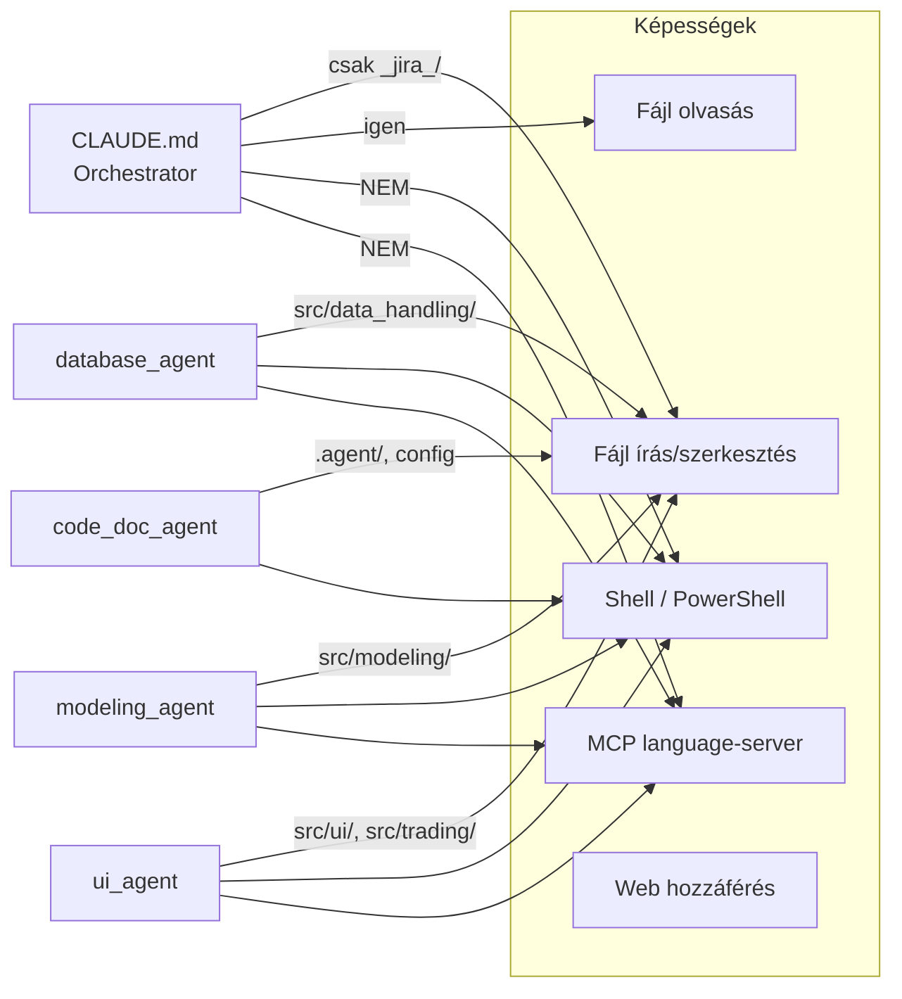
```mermaid
flowchart LR
  subgraph Képességek
    READ[Fájl olvasás]
    EDIT[Fájl írás/szerkesztés]
    SHELL[Shell / PowerShell]
    MCP[MCP language-server]
    WEB[Web hozzáférés]
  end

  ORCH[CLAUDE.md\nOrchestrator] -->|csak _jira_/| EDIT
  ORCH -->|igen| READ
  ORCH -->|NEM| SHELL
  ORCH -->|NEM| MCP

  DB[database_agent] -->|src/data_handling/| EDIT
  MOD[modeling_agent] -->|src/modeling/| EDIT
  UI[ui_agent] -->|src/ui/, src/trading/| EDIT
  DOC[code_doc_agent] -->|.agent/, config| EDIT

  DB --> SHELL
  MOD --> SHELL
  UI --> SHELL
  DOC --> SHELL

  DB --> MCP
  MOD --> MCP
  UI --> MCP
```

---

## 8. _jira_/ — Lokális Task Tracking

```mermaid
flowchart LR
  JIRA[_jira_/\nkönyvtár]
  JIRA --> EPIC[epic_{id}_{slug}/\n3 számjegy, pl. epic_011]
  EPIC --> ECMD[epic.md\nnincstask lifecicle]
  EPIC --> TODO[todo_{tid}_{slug}.md\nakítv munka]
  EPIC --> PR[pr_{tid}_{slug}.md\nimplementáció kész]
  EPIC --> DONE[done_{tid}_{slug}.md\nvalidáció kész]
  JIRA --> JSON[jira.json\nepic_counter]
  JIRA --> ARCH[archive/\ntörölt epics\nOLVASHATATLAN]
```

### 8.1 Task életciklus

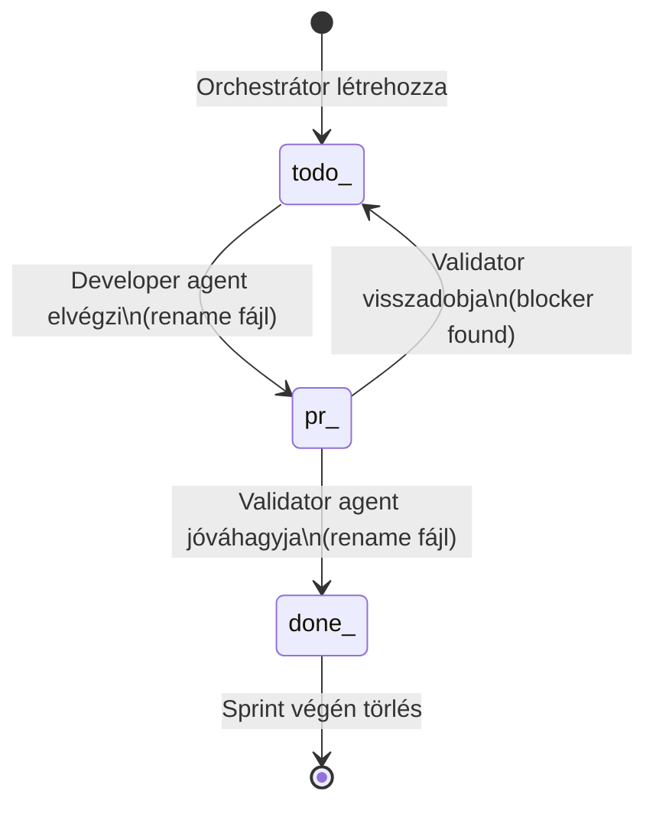
```mermaid
stateDiagram-v2
  [*] --> todo_ : Orchestrátor létrehozza
  todo_ --> pr_ : Developer agent elvégzi\n(rename fájl)
  pr_ --> done_ : Validator agent jóváhagyja\n(rename fájl)
  pr_ --> todo_ : Validator visszadobja\n(blocker found)
  done_ --> [*] : Sprint végén törlés
```

### 8.2 ID szabályok

- **Globálisan egyedi** ID-k az összes `_jira_/`-ban
- `epic_{n}` — 3 számjegyű, zero-padded (pl. `epic_011`)
- `t{n}` — task (pl. `t11`, `t12`)
- `s{n}` — story (pl. `s2`)
- Új ID = scan + legmagasabb + 1
- `_jira_/jira.json` → `epic_counter` az epic-ek forrása igazsága

### 8.3 Task sablon kulcsmezői

```yaml
---
epic: epic_{id}
id: t{n}
title: Rövid imperatív cím
assignee: database_agent | modeling_agent | ...
status: todo | pr | done
blocks: []
blocked_by: []
---
```

### 8.4 Stop Hook — Automatikus archiválás

Minden session végén lefut: `.claude/hooks/archive_epics.ps1`

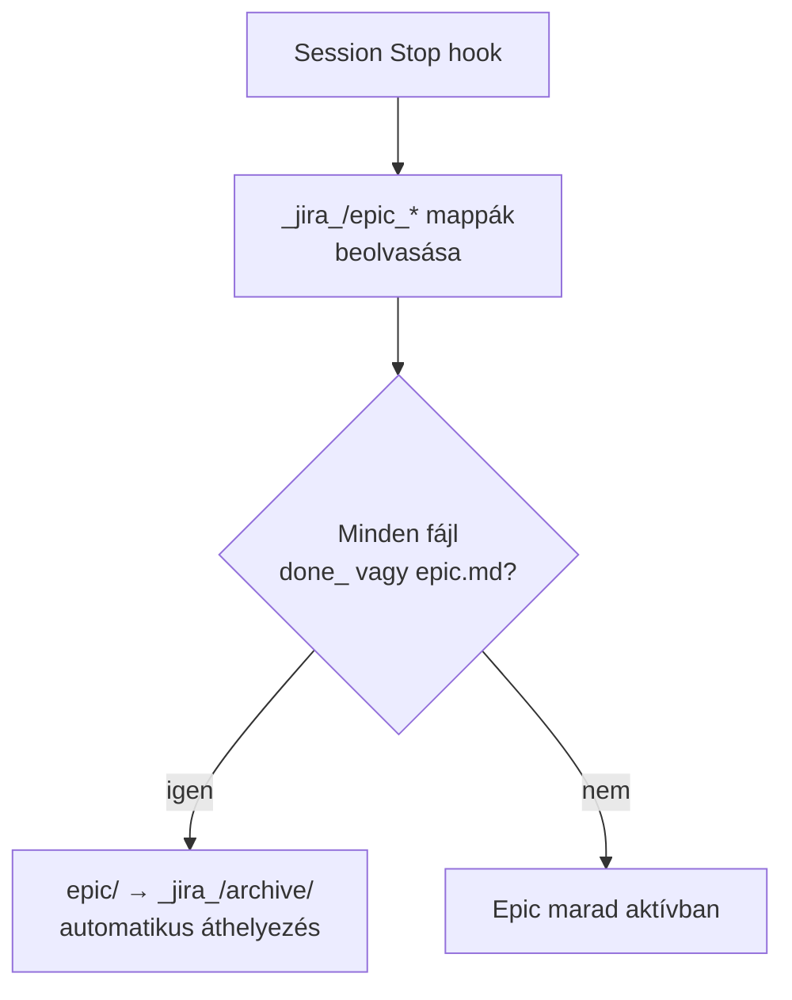
```mermaid
flowchart TD
  STOP[Session Stop hook] --> SCAN[_jira_/epic_* mappák\nbeolvasása]
  SCAN --> Q{Minden fájl\ndone_ vagy epic.md?}
  Q -->|igen| MOVE[epic/ → _jira_/archive/\nautomatikus áthelyezés]
  Q -->|nem| SKIP[Epic marad aktívban]
```

---

## 9. _doc_/ — Dokumentációs Rendszer

### 9.1 Hierarchikus számozási séma

**Domain blokkok (számozási tartományok):**

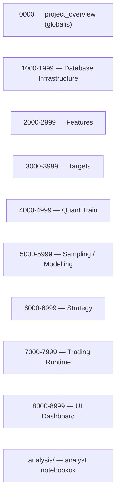
```mermaid
flowchart TD
  G0["0000 — project_overview (globalis)"]
  D1["1000-1999 — Database Infrastructure"]
  D2["2000-2999 — Features"]
  D3["3000-3999 — Targets"]
  D4["4000-4999 — Quant Train"]
  D5["5000-5999 — Sampling / Modelling"]
  D6["6000-6999 — Strategy"]
  D7["7000-7999 — Trading Runtime"]
  D8["8000-8999 — UI Dashboard"]
  ANA["analysis/ — analyst notebookok"]

  G0 --- D1 --- D2 --- D3 --- D4 --- D5 --- D6 --- D7 --- D8 --- ANA
```

**Szintek egy blokkon belül (pl. 1xxx Database):**

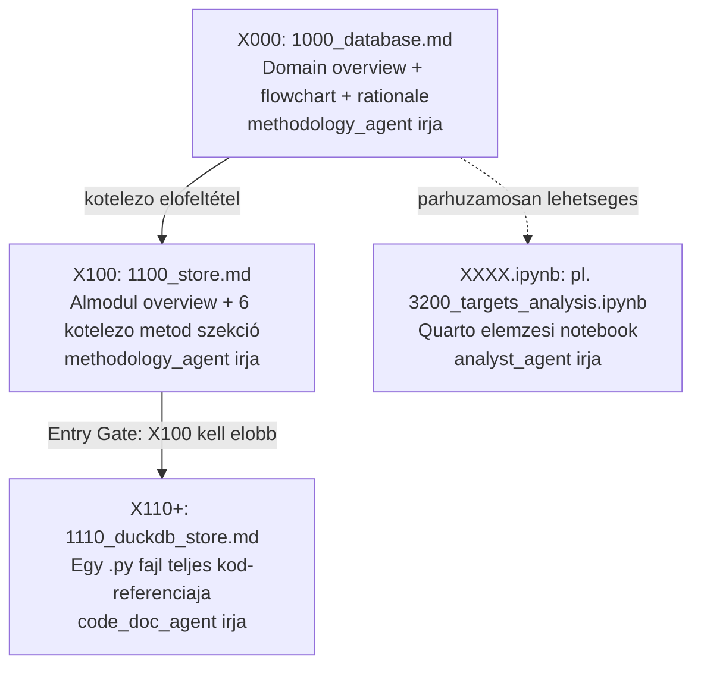
```mermaid
flowchart TD
  A["X000: 1000_database.md\nDomain overview + flowchart + rationale\nmethodology_agent irja"]
  B["X100: 1100_store.md\nAlmodul overview + 6 kotelezo metod szekció\nmethodology_agent irja"]
  C["X110+: 1110_duckdb_store.md\nEgy .py fajl teljes kod-referenciaja\ncode_doc_agent irja"]
  N["XXXX.ipynb: pl. 3200_targets_analysis.ipynb\nQuarto elemzesi notebook\nanalyst_agent irja"]

  A -->|kotelezo elofeltétel| B
  B -->|Entry Gate: X100 kell elobb| C
  A -.->|parhuzamosan lehetseges| N
```

### 9.2 Fájl szintek

| Szint | Minta | Felelős agent | Tartalom |
|-------|-------|---------------|---------|
| X000 | `5000_modelling.md` | `methodology_agent` | Domain overview, flowchart, rationale |
| X010–X099 | `2010_feature_engineering.md` | `methodology_agent` | Módszertani háttér |
| X100 | `5100_sampling_config.md` | `methodology_agent` | Almodul overview + 6 kötelező szekció |
| X110+ | `1110_duckdb_store.md` | `code_doc_agent` | Egy .py fájl teljes kód-referenciája |
| XXXX.ipynb | `3200_targets_analysis.ipynb` | `analyst_agent` | Quarto-renderable elemzési notebook |

### 9.3 X100 kötelező hat szekció (methodology_agent írja)

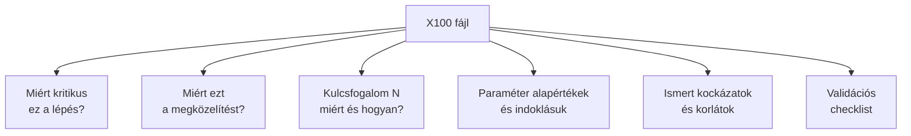
```mermaid
flowchart TD
  X100[X100 fájl] --> S1[Miért kritikus\nez a lépés?]
  X100 --> S2[Miért ezt\na megközelítést?]
  X100 --> S3[Kulcsfogalom N\nmiért és hogyan?]
  X100 --> S4[Paraméter alapértékek\nés indoklásuk]
  X100 --> S5[Ismert kockázatok\nés korlátok]
  X100 --> S6[Validációs\nchecklist]
```

**Entry Gate szabály:** a `code_doc_agent` nem írhat X110 fájlt, amíg a szülő X100 nem létezik
és nem tartalmazza mind a hat szekciót.

### 9.4 Dokumentációs sorrendhatályossági elv

```
Minden témában: X000 (overview) → X100 (metodológia) → X110+ (kód-referencia)
Minden szinten belül: metodológia szám < kód szám
```

---

## 10. Claude Settings és Hookok

### 10.1 `.claude/settings.json`

Projekt-szintű Claude Code konfigurációs fájl.

```json
{
  "enableAllProjectMcpServers": true,
  "permissions": {
    "allow": [
      "Bash(*)",
      "Edit(*)", "Write(*)", "MultiEdit(*)",
      "PowerShell(uv run pyright*)",
      "PowerShell(uv run ruff*)",
      "PowerShell(uv run python*)",
      "PowerShell(uv run pytest*)",
      "PowerShell(git *)",
      "PowerShell(Get-*)", "PowerShell(Select-*)",
      "mcp__language-server__*",
      "NotebookEdit(*)"
    ]
  }
}
```

### 10.2 `.claude/settings.local.json`

Gép-specifikus, gitignored. Kibővíti a `settings.json`-t.
- Skill permissions (pl. `Skill(code-review)`, `Skill(run)`)
- Lokális Bash / PowerShell allow-all bejegyzések dev kényelemhez

### 10.3 Hookok

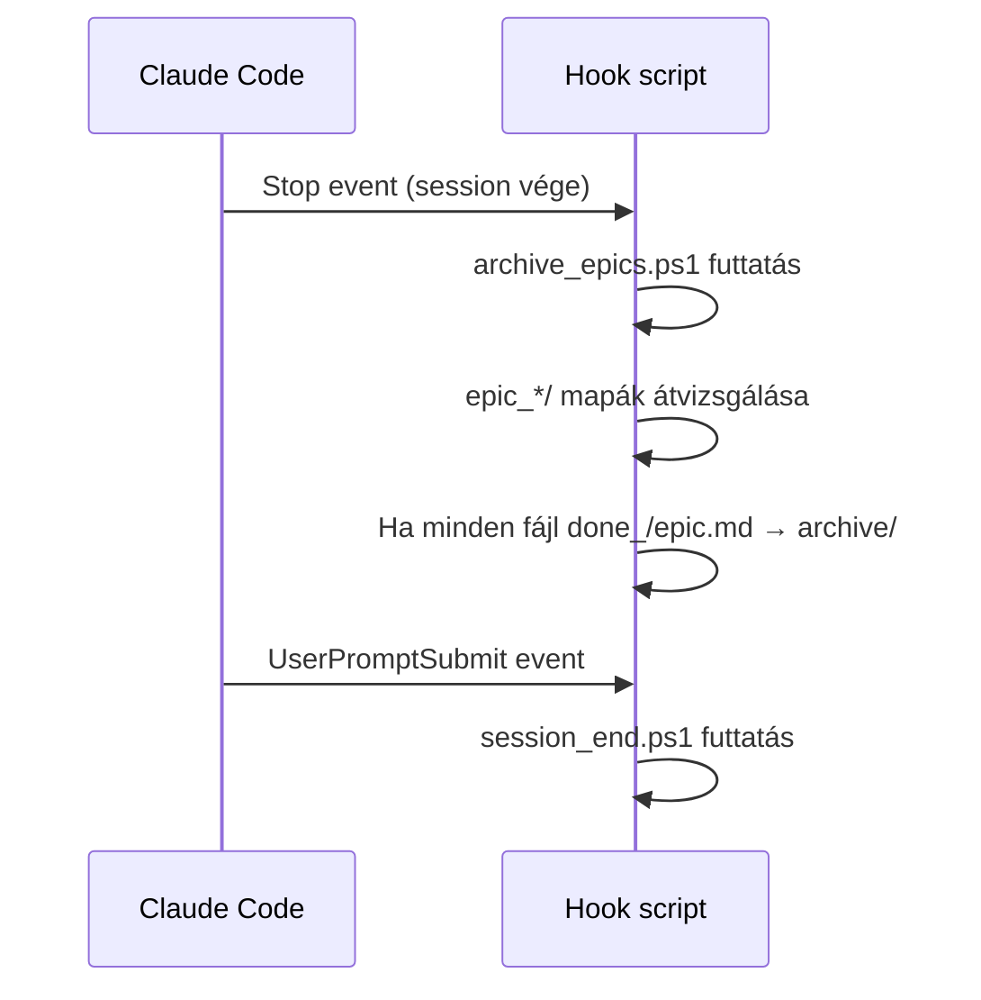
```mermaid
sequenceDiagram
  participant CL as Claude Code
  participant H as Hook script

  CL->>H: Stop event (session vége)
  H->>H: archive_epics.ps1 futtatás
  H->>H: epic_*/ mapák átvizsgálása
  H->>H: Ha minden fájl done_/epic.md → archive/

  CL->>H: UserPromptSubmit event
  H->>H: session_end.ps1 futtatás
```

| Hook esemény | Script | Funkció |
|-------------|--------|---------|
| `Stop` | `archive_epics.ps1` | `done_` epicsek automatikus archiválása |
| `UserPromptSubmit` | `session_end.ps1` | Session lezárási logika |

---

## 11. General Principles — Általános szabályok

Minden agent olvassa a `.agent/general_principles.md` fájlt. Legfontosabb elvek:

### 11.1 Implementáció előtt

```mermaid
flowchart TD
  TASK[Feladat kapott] --> OUTLINE[Rövid végrehajtási terv\nvázolás]
  OUTLINE --> UNKNOWN[Kritikus ismeretlenek\nfelszínre hozása]
  UNKNOWN --> INSPECT[Meglévő kód, docs, config\nátnézése]
  INSPECT --> CONV[Egyezőség ellenőrzés\nprojekt konvenciókkal]
  CONV --> IMPL[Implementáció]
  IMPL --> PR[pr_ ticket]
```

### 11.2 Navigációs eszközök prioritása

| Feladat | Elsődleges | Fallback |
|---------|-----------|---------|
| Szimbólum definíció | `mcp definition` | `rg` / `sg run` |
| Szintaktikai keresés | `sg run` | `rg` szűkített mintával |
| Gyors string keresés | `rg` | Glob + Read |
| Fájl lista | Glob | `rg --files` |

### 11.3 Subagent spawn policy

```mermaid
flowchart TD
  Q[Kérés jött] --> SIMPLE{Egyszerű\nlookup?}
  SIMPLE -->|igen| DIRECT[Grep / Glob / Read\nközvetlen tool]
  SIMPLE -->|nem, open-ended| SPAWN_Q{Biztos spawn\nkell?}
  SPAWN_Q -->|nem| CONFIRM["Kérdés a usernek:\n'Spawnt vagy direct tool?'"]
  SPAWN_Q -->|igen Flow B Mód B| SPAWN[Agent spawn\nbez kérdés]
  CONFIRM --> USER_YES{User igen?}
  USER_YES -->|igen| SPAWN
  USER_YES -->|nem| DIRECT
```

**Model kiválasztás spawn esetén:**
- Read-only, exploration → `Explore` agent, `model: "haiku"`
- Implementáció → névvel ellátott agent, `model: "sonnet"` (default)
- Soha ne használj `general-purpose`-t fájl keresésre

### 11.4 Core szabályok (kivonat)

- Kérdezz, mielőtt cselekszel, ha kritikus követelmény nem egyértelmű
- Ellenőrizd a meglévő kódot dokumentálás vagy implementálás előtt
- Ne duplikálj meglévő logikát
- Változtatások hatóköre: csak a feladat
- Ne módosíts nem kapcsolódó user-változtatásokat
- **`_jira_/archive/` olvasása szigorúan tilos** minden agentnek
- **Aktív asset: SOLUSDT** — más párok nem kapnak fejlesztési munkát

---

## 12. AI modellek és context-takarékossági elvek

### 12.1 Context betöltési stratégia

```mermaid
flowchart TD
  SESSION[Session Start] --> READ1[0000_project_overview.md]
  READ1 --> READ2[general_principles.md]
  READ2 --> READ3[_jira_/ fájlnévlista]
  READ3 --> WAIT[Várakozás kérésre]

  WAIT --> DELEGATE[Delegálás agentnek]
  DELEGATE --> MANIFEST[Csak az agent\nmanifestje töltődik be]
  MANIFEST --> DOC[Csak az érintett\n_doc_/ oldalak]
```

### 12.2 Amit az orchestrátor SOHA nem tölt be

- Agent manifestek (csak végrehajtáskor)
- `_doc_/<module>/` oldalak (az agent tölti be)
- `_jira_/archive/` tartalmak
- Hosszú jira ticketek (csak ha konkrétan kérdeznek rájuk)

### 12.3 Subagent spawn modell-szabályok

| Feladat típus | Subagent | Model |
|---------------|----------|-------|
| Keresés, fájl lookup, read-only | `Explore` | `haiku` |
| Rövid implementáció (1-2 fájl) | Névvel ellátott | `haiku` |
| Komplex implementáció | Névvel ellátott | `sonnet` |
| Nem ír fájlt | `Explore` | `haiku` (kötelező) |

---

## 13. Delegation Table (összefoglaló)

| Domain / Path | Agent | Főbb skill-ek |
|--------------|-------|---------------|
| `src/data_handling/`, DuckDB, Parquet | `database_agent` | coding, jira, lsp, uv |
| `src/modeling/`, `src/strategy/`, artifacts | `modeling_agent` | coding, jira, lsp, uv |
| `src/trading/`, `src/ui/` | `ui_agent` | coding, jira, lsp |
| `.agent/`, config, `_doc_/` X110+ | `code_doc_agent` | docs, jira, uv, permissions |
| `_doc_/` X000, X100 — metodológia | `methodology_agent` | methodology_doc, jira |
| `_doc_/XXXX*.ipynb`, `src/analyst/` | `analyst_agent` | analyst, quarto |
| `pr_` ticketek validálása | `validator_agent` | jira, lsp, uv |

---

## 14. Kapcsolódó dokumentumok

| Fájl | Tartalom |
|------|---------|
| `_doc_/0000_project_overview.md` | Projekt üzleti célja, modulok, adatfolyam, DB séma |
| `.agent/general_principles.md` | Minden agentre vonatkozó alapelvek |
| `.agent/agents/*.md` | Specialist agent manifestek |
| `.agent/skills/*.md` | Végrehajtási útmutatók (coding, jira, docs, analyst...) |
| `.agent/tools/*.md` | Tool konfigurációk (LSP, uv, ast-grep, permissions) |
| `.claude/settings.json` | Projekt-szintű Claude Code permissions + hookok |
| `_jira_/jira.json` | Epic counter (soha ne írd felül kézzel) |
| `CLAUDE.md` | Orchestrátor belépési pont — session startup + flow definíciók |
