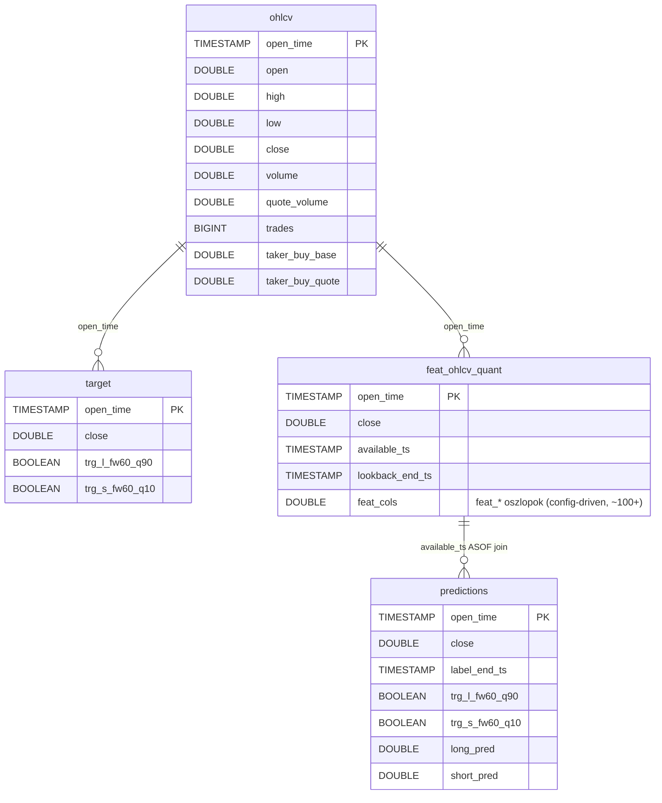

# Database — DuckDB Schema

A ChronoQuant egyetlen DuckDB fájlban tárolja az összes piaci adatot, feature-t és predikciót egy assetenként.

---

## Áttekintés



Minden tábla `open_time` TIMESTAMP primary key-en alapul. Az összes timestamp **UTC**, `YYYY-MM-DD HH:MM:SS` formátumban tárolva.

**DuckDB fájl helye:** `database/<asset_id>/<asset_id>.duckdb`

Aktív asset: `solusdt` → `database/solusdt/solusdt.duckdb`

Az elérési út mindig a `config/assets.json` → `utils.load_asset_config(asset_id)` → `db_path` mezőjéből jön.

---

## Táblák

### ohlcv

**Cél:** Nyers, változatlan Binance 1-perces kline adatok. A pipeline alapja — minden downstream tábla ebből épül fel.

**Beírási mód:** append-only. Csak a tárolt `MAX(open_time)`-nál újabb sorok kerülnek be (`_insert_append_only`). Nincs upsert, nincs törlés.

| Oszlop | Típus | Leírás |
|--------|-------|--------|
| `open_time` | `TIMESTAMP` (PK) | Gyertya nyitásának időpontja, UTC. Minden sor egyedi. |
| `open` | `DOUBLE` | Nyitóár USDT-ben |
| `high` | `DOUBLE` | Legmagasabb ár az 1 perces ablakban |
| `low` | `DOUBLE` | Legalacsonyabb ár az 1 perces ablakban |
| `close` | `DOUBLE` | Záróár USDT-ben |
| `volume` | `DOUBLE` | Forgalom base asset-ben (SOL) |
| `quote_volume` | `DOUBLE` | Forgalom quote asset-ben (USDT) |
| `trades` | `BIGINT` | Kötések száma az 1 perces ablakban |
| `taker_buy_base` | `DOUBLE` | Taker vevő forgalom base asset-ben (SOL) |
| `taker_buy_quote` | `DOUBLE` | Taker vevő forgalom quote asset-ben (USDT) |

**Nem tárolt Binance mezők:** `close_time` (redundáns), `ignore` (deprecated).

```sql
CREATE TABLE IF NOT EXISTS ohlcv (
    open_time       TIMESTAMP PRIMARY KEY,
    open            DOUBLE,
    high            DOUBLE,
    low             DOUBLE,
    close           DOUBLE,
    volume          DOUBLE,
    quote_volume    DOUBLE,
    trades          BIGINT,
    taker_buy_base  DOUBLE,
    taker_buy_quote DOUBLE
)
```

---

### target

**Cél:** Bináris klasszifikációs labelek. Az `ohlcv.close` alapján, DuckDB SQL ablakfüggvényekkel számítva. Teljes rebuild minden `sync_targets` híváskor.

**Beírási mód:** DELETE + INSERT a teljes tartományra (`insert_target`). Az előre definiált időablakban (`ROWS BETWEEN 1 FOLLOWING AND {horizon} FOLLOWING`) a t. bar NEM szerepel a forward window-ban.

**NULL sorok:** Az utolsó `horizon` (=60) sor `trg_*` értéke NULL — nincs elegendő jövőbeli adat a küszöb kiszámításához.

| Oszlop | Típus | Leírás |
|--------|-------|--------|
| `open_time` | `TIMESTAMP` (PK) | Bar nyitási ideje, UTC |
| `close` | `DOUBLE` | Bar záróára (referencia) |
| `trg_l_fw60_q90` | `BOOLEAN` | Long label: a következő 60 bar `max(close)/close - 1` >= q90 küszöb |
| `trg_s_fw60_q10` | `BOOLEAN` | Short label: a következő 60 bar `min(close)/close - 1` <= q10 küszöb |

```sql
CREATE TABLE IF NOT EXISTS target (
    open_time      TIMESTAMP PRIMARY KEY,
    close          DOUBLE,
    trg_l_fw60_q90 BOOLEAN,
    trg_s_fw60_q10 BOOLEAN
)
```

**Küszöbök:** a q90/q10 kvantilisek az összes elérhető nem-null visszatérés alapján számítódnak, és a `database/solusdt/solusdt.json` metadata fájlba is kikerülnek audit célból.

---

### feat_ohlcv_quant

**Cél:** Technikai indikátorok és feature-ök (Polars LazyFrame pipeline). Séma config-driven — az oszlopok száma és neve a `config/features.json` indikátor konfigurációjától függ (~100+ `feat_*` oszlop).

**Beírási mód:** append-only (`_insert_append_only`). A séma automatikusan bővül az első `insert_feat_ohlcv_quant` hívásnál (tábla létrehozása) és ha új feature oszlopok jelennek meg.

**t-1 lag:** Minden OHLCV-alapú feature 1 barral el van tolva (`shift(1)`) a `compute_features_polars` hívásban. A P2 (időindexes) feature-ök kivételek — ezek nem kerülnek eltolásra (`T_MINUS_1_SKIP`).

| Oszlop | Típus | Leírás |
|--------|-------|--------|
| `open_time` | `TIMESTAMP` (PK) | Bar nyitási ideje, UTC |
| `close` | `DOUBLE` | Bar záróára (referencia) |
| `available_ts` | `TIMESTAMP` | Mikor válik elérhetővé a feature (== `open_time`, t-1 lag garantált) |
| `lookback_end_ts` | `TIMESTAMP` | A lookback ablak vége (== `open_time`) |
| `feat_*` | `DOUBLE` / `BOOLEAN` | Config-driven feature oszlopok, `feat_` prefix |

Az ASOF join (`predictions` ↔ `feat_ohlcv_quant`) az `available_ts` oszlopon alapul: `p.open_time >= f.available_ts`.

---

### predictions

**Cél:** Champion modellek (`lgbm_solusdt_l_fw60_q90_local_v4`, `lgbm_solusdt_s_fw60_q10_local_v4`) által generált valószínűségi pontszámok. Egy sor per `open_time`, unified long+short output.

**Beírási mód:** append-only (`_insert_append_only`). A séma rögzített — `ensure_tables` hozza létre.

| Oszlop | Típus | Leírás |
|--------|-------|--------|
| `open_time` | `TIMESTAMP` (PK) | Bar nyitási ideje, UTC |
| `close` | `DOUBLE` | Bar záróára (az `ohlcv.close`-val egyezik) |
| `label_end_ts` | `TIMESTAMP` | A forward window vége: `open_time + fw_minutes` |
| `trg_l_fw60_q90` | `BOOLEAN` | Long label (ha rendelkezésre áll a target táblában) |
| `trg_s_fw60_q10` | `BOOLEAN` | Short label (ha rendelkezésre áll a target táblában) |
| `long_pred` | `DOUBLE` | Long modell predict_proba értéke [0, 1] |
| `short_pred` | `DOUBLE` | Short modell predict_proba értéke [0, 1] |

```sql
CREATE TABLE IF NOT EXISTS predictions (
    open_time       TIMESTAMP PRIMARY KEY,
    close           DOUBLE,
    label_end_ts    TIMESTAMP,
    trg_l_fw60_q90  BOOLEAN,
    trg_s_fw60_q10  BOOLEAN,
    long_pred       DOUBLE,
    short_pred      DOUBLE
)
```

**Legacy oszlopok:** `dataset_split` és `fold_id` — ha jelen vannak, az `ensure_tables` migráció során `ALTER TABLE DROP COLUMN`-nal törlődnek.

---

## Általános konvenciók

| Szabály | Részlet |
|---------|---------|
| **Timestamp formátum** | UTC, `YYYY-MM-DD HH:MM:SS` (naiv string, UTC-ként értelmezve) |
| **Epoch ms** | Csak Binance API-val való kommunikációban, nem tárolva |
| **Config gateway** | Mindig `utils.load_asset_config(asset_id)` → `db_path` |
| **Idempotens upsert** | Minden sync operáció biztonságosan újrafuttatható |
| **Zonemap** | Sorok `open_time` szerint rendezve kerülnek be (DuckDB range query optimalizálás) |
