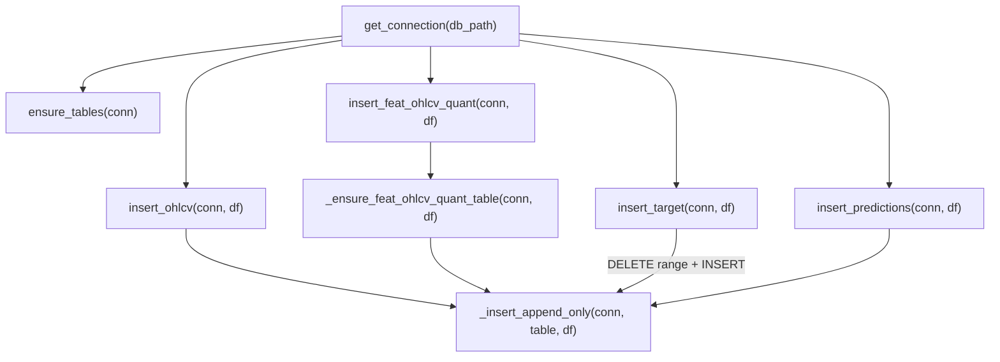

# duckdb_store.py — DuckDB Írás és Séma

`src/database/store/duckdb_store.py`

Kapcsolat kezelés, táblák inicializálása, migráció és adatbeírás. Ez az egyetlen modul, amely írási hozzáféréssel rendelkezik a DuckDB-hez.

---

## Függvény áttekintés

---

## `get_connection(db_path)`

**Célja:** DuckDB kapcsolat megnyitása írás-olvasás módban.

**Paraméterek:**

| Paraméter | Típus | Leírás |
|-----------|-------|--------|
| `db_path` | `str` | DuckDB fájl elérési útja |

**Visszatérési érték:** `duckdb.DuckDBPyConnection`

**Mellékhatások:** Létrehozza a szülőkönyvtárat (`Path(db_path).parent.mkdir(parents=True, exist_ok=True)`).

---

## `ensure_tables(conn)`

**Célja:** Mind a négy tábla létrehozása, ha nem léteznek. Legacy migráció: `dataset_split` és `fold_id` oszlopok eltávolítása a `predictions` táblából ha jelen vannak.

**Paraméterek:**

| Paraméter | Típus | Leírás |
|-----------|-------|--------|
| `conn` | `duckdb.DuckDBPyConnection` | Nyitott írható kapcsolat |

**Létrehozott táblák:** `ohlcv`, `target`, `predictions` (rögzített séma). A `feat_ohlcv_quant` létrehozása dinamikus — lásd `_ensure_feat_ohlcv_quant_table`.

**Migráció:** Ha a `feat_ohlcv_quant` vagy `predictions` tábla tartalmaz `dataset_split` vagy `fold_id` oszlopot, `ALTER TABLE DROP COLUMN` törli őket.

---

## `_ensure_feat_ohlcv_quant_table(conn, df)`

**Célja:** Dinamikus séma kezelés a `feat_ohlcv_quant` táblához.

- **Ha a tábla nem létezik:** `CREATE TABLE` a DataFrame oszlopaiból (DuckDB típus inferencia)
- **Ha a tábla létezik:** hiányzó oszlopokat `ALTER TABLE ADD COLUMN`-nal adja hozzá

**Paraméterek:**

| Paraméter | Típus | Leírás |
|-----------|-------|--------|
| `conn` | `duckdb.DuckDBPyConnection` | Nyitott írható kapcsolat |
| `df` | `pl.DataFrame` | Az újonnan beírandó feature DataFrame |

**Fontos:** A config-driven feature szám változhat modellek között. Ez a függvény teszi lehetővé az online sémabővítést anélkül, hogy a teljes táblát újra kellene építeni.

---

## `_insert_append_only(conn, table, df)`

**Célja:** Core append logika — csak az eddig nem tárolt sorok beírása.

**Működés:**
1. `conn.register("_ins_batch", df)` — DataFrame DuckDB view-ként regisztrálva
2. `MAX(open_time)` lekérdezése az adott táblából (`last_ts`)
3. `INSERT INTO table SELECT * FROM _ins_batch WHERE open_time > last_ts`

**Paraméterek:**

| Paraméter | Típus | Leírás |
|-----------|-------|--------|
| `conn` | `duckdb.DuckDBPyConnection` | Nyitott írható kapcsolat |
| `table` | `str` | Céltábla neve |
| `df` | `pl.DataFrame` | Beírandó adatok |

**Invariáns:** Ha a tábla üres (`last_ts = None`), az összes sor bekerül. Ha minden sor már korábban be volt írva, 0 sor kerül beírásra (idempotens).

---

## `insert_ohlcv(conn, df)`

**Célja:** OHLCV adatok beírása append-only módban.

**Előfeldolgozás:** A DataFrame-ből csak a 10 OHLCV oszlopot tartja meg (szűri a Binance `close_time` és `ignore` mezőket, ha véletlenül jelen vannak).

**Paraméterek:**

| Paraméter | Típus | Leírás |
|-----------|-------|--------|
| `conn` | `duckdb.DuckDBPyConnection` | Nyitott írható kapcsolat |
| `df` | `pl.DataFrame` | OHLCV sorok (`open_time`, `open`, `high`, `low`, `close`, `volume`, `quote_volume`, `trades`, `taker_buy_base`, `taker_buy_quote`) |

---

## `insert_feat_ohlcv_quant(conn, df)`

**Célja:** Feature adatok beírása dinamikus sémával.

**Lépések:** `_ensure_feat_ohlcv_quant_table(conn, df)` → `_insert_append_only(conn, "feat_ohlcv_quant", df)`

**Paraméterek:**

| Paraméter | Típus | Leírás |
|-----------|-------|--------|
| `conn` | `duckdb.DuckDBPyConnection` | Nyitott írható kapcsolat |
| `df` | `pl.DataFrame` | Feature sorok (`open_time`, `close`, `available_ts`, `lookback_end_ts`, `feat_*`) |

---

## `insert_target(conn, df)`

**Célja:** Target labelek beírása. **Teljes rebuild szemantika** — nem append-only.

**Lépések:**
1. `DELETE FROM target WHERE open_time BETWEEN df.min AND df.max`
2. `INSERT INTO target SELECT * FROM _ins_batch`

**Paraméterek:**

| Paraméter | Típus | Leírás |
|-----------|-------|--------|
| `conn` | `duckdb.DuckDBPyConnection` | Nyitott írható kapcsolat |
| `df` | `pl.DataFrame` (Polars) | Target sorok (`open_time`, `close`, `trg_l_fw60_q90`, `trg_s_fw60_q10`) |

**Fontos:** A target kvantilis küszöbök a teljes history alapján újraszámítódnak minden `sync_targets` híváskor — ezért szükséges a teljes tartomány DELETE+INSERT.

---

## `insert_predictions(conn, df)`

**Célja:** Predikciók beírása append-only módban. A séma a DB-ből olvasódik (nem a DataFrame-ből inferálva).

**Paraméterek:**

| Paraméter | Típus | Leírás |
|-----------|-------|--------|
| `conn` | `duckdb.DuckDBPyConnection` | Nyitott írható kapcsolat |
| `df` | `pl.DataFrame` | Predikció sorok (`open_time`, `close`, `label_end_ts`, `trg_*`, `long_pred`, `short_pred`) |
