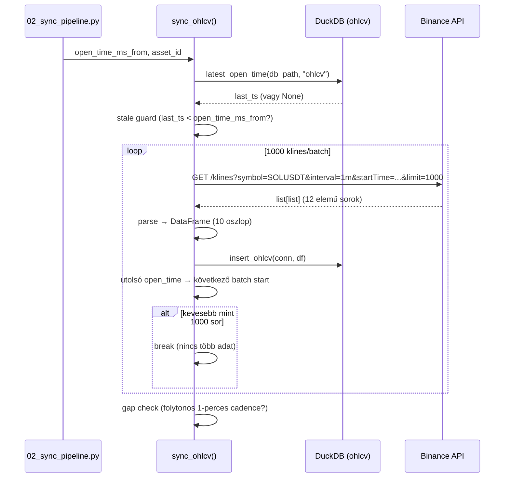

# sync_ohlcv.py — Binance OHLCV Szinkron

`src/database/sync_tables/sync_ohlcv.py`

Inkrementális Binance 1-perces kline szinkronizálás. Minden futás az utolsó tárolt bar utántól kezdi, 1000 klines/batch lapozással.

---

## `sync_ohlcv(open_time_ms_from, asset_id)`

**Célja:** Binance klines lekérése a megadott időponttól és `insert_ohlcv` beírás.

**Paraméterek:**

| Paraméter | Típus | Leírás |
|-----------|-------|--------|
| `open_time_ms_from` | `int` | Szinkron kezdete epoch milliszekundumban |
| `asset_id` | `str \| None` | Asset azonosító (config default ha `None`) |

---

## Belső folyamat



---

## Stale Guard

Ha az utolsó tárolt timestamp az adott `open_time_ms_from` kértnél régebbi lenne, a függvény figyelmeztet és a **DB-ben tárolt legutóbb érték utántól indul** (nem a kért indulóponttól). Ez megakadályozza a hiányos adatsort.

---

## Gap Check

Az összes batch betöltése után az utolsó N bar `open_time` értékeit ellenőrzi — egymást követő 1-perces időközök-e. Ha gap van (hiányzó bar), `logging.warning` hívással jelzi. Nem állítja meg a futást.

---

## Binance kline formátum

Binance 12-elemű raw list → 10 oszlop:

| Index | Binance mező | Tárolt oszlop |
|-------|-------------|---------------|
| 0 | open_time (ms) | `open_time` (TIMESTAMP) |
| 1 | open | `open` |
| 2 | high | `high` |
| 3 | low | `low` |
| 4 | close | `close` |
| 5 | volume | `volume` |
| 6 | close_time (ms) | **elhagyva** (redundáns) |
| 7 | quote_volume | `quote_volume` |
| 8 | trades | `trades` |
| 9 | taker_buy_base | `taker_buy_base` |
| 10 | taker_buy_quote | `taker_buy_quote` |
| 11 | ignore | **elhagyva** (deprecated) |

Az `open_time` ms → TIMESTAMP konverzió: `pd.to_datetime(open_time_ms, unit="ms", utc=True).tz_localize(None)`.

---

## Futtatás

Az `sync_ohlcv` a `02_sync_pipeline.py` unified CLI-n keresztül hívható:

```bash
# OHLCV szinkron egy konkrét kezdőponttól
uv run python src/database/02_sync_pipeline.py --start "2024-01-01 00:00:00" --tables ohlcv --asset-id solusdt

# Az utolsó tárolt sortól indul (alapértelmezett, OHLCV + derived táblák)
uv run python src/database/02_sync_pipeline.py

# Csak OHLCV (derived rebuild nélkül)
uv run python src/database/02_sync_pipeline.py --tables ohlcv
```
