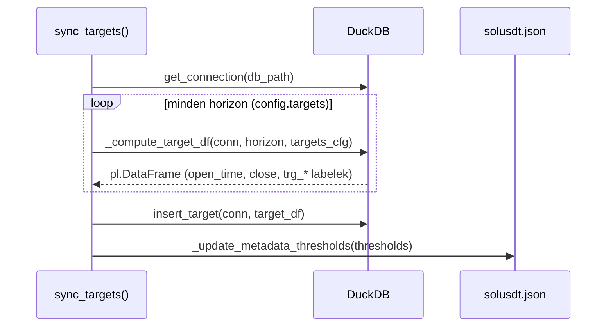

# sync_targets.py — Target Label Számítás

`src/database/sync_tables/sync_targets.py`

Bináris klasszifikációs labelek számítása DuckDB window SQL-lel. Minden `sync_targets` hívás teljes rebuild — DELETE+INSERT az összes tárolt OHLCV bar alapján.

---

## `sync_targets(asset_id)`

**Célja:** A `target` tábla teljes újraépítése az összes `ohlcv` bar alapján.

**Paraméterek:**

| Paraméter | Típus | Leírás |
|-----------|-------|--------|
| `asset_id` | `str \| None` | Asset azonosító (config default ha `None`) |

---

## Belső folyamat



---

## `_compute_target_df(conn, horizon, targets)`

**Célja:** Forward window return számítás és kvantilis alapú labeling SQL-lel.

**Paraméterek:**

| Paraméter | Típus | Leírás |
|-----------|-------|--------|
| `conn` | `duckdb.DuckDBPyConnection` | Nyitott kapcsolat |
| `horizon` | `int` | Forward window hossza barokban (60) |
| `targets` | `list[dict]` | Target konfiguráció listája (direction, name, percentile) |

**Visszatérési érték:** `pl.DataFrame` — `open_time`, `close`, és minden `trg_*` label oszlop.

---

## `_TARGET_SQL` — A core SQL sablon

```sql
WITH returns AS (
    SELECT
        open_time,
        close,
        MAX(close) OVER (
            ORDER BY open_time
            ROWS BETWEEN 1 FOLLOWING AND {horizon} FOLLOWING
        ) AS fw_max,
        MIN(close) OVER (
            ORDER BY open_time
            ROWS BETWEEN 1 FOLLOWING AND {horizon} FOLLOWING
        ) AS fw_min
    FROM ohlcv
),
thresholds AS (
    SELECT
        QUANTILE_CONT(fw_max / close - 1, {long_percentile}) AS long_thresh,
        QUANTILE_CONT(fw_min / close - 1, {short_percentile}) AS short_thresh
    FROM returns
    WHERE fw_max IS NOT NULL
)
SELECT
    r.open_time,
    r.close,
    CASE
        WHEN r.fw_max IS NULL THEN NULL
        WHEN r.fw_max / r.close - 1 >= t.long_thresh THEN TRUE
        ELSE FALSE
    END AS {long_label},
    CASE
        WHEN r.fw_min IS NULL THEN NULL
        WHEN r.fw_min / r.close - 1 <= t.short_thresh THEN TRUE
        ELSE FALSE
    END AS {short_label}
FROM returns r, thresholds t
ORDER BY r.open_time
```

**Kritikus invariáns:** `ROWS BETWEEN 1 FOLLOWING AND {horizon} FOLLOWING`
- Az aktuális bar (`t`) **nem szerepel** a forward window-ban
- Az utolsó `horizon` sor `NULL`-t kap (nincs elegendő jövőbeli adat)

---

## Kvantilis küszöbök

| Label | Kvantilis | Leírás |
|-------|-----------|--------|
| `trg_l_fw60_q90` | q90 (0.9) | A legmagasabb 10% forward return → Long signal |
| `trg_s_fw60_q10` | q10 (0.1) | A legalacsonyabb 10% forward return → Short signal |

A küszöbök az összes elérhető nem-null return értékből számítódnak (`full history quantile`). Ez biztosítja, hogy ~10% label legyen mindkét irányban.

---

## `_update_metadata_thresholds(...)`

**Célja:** Kvantilis küszöbök perzisztálása audit és reprodukálhatóság céljából.

**Kimeneti fájl:** `database/<asset_id>/<asset_id>.json`

**Tartalom:**
```json
{
  "thresholds": {
    "trg_l_fw60_q90": 0.0234,
    "trg_s_fw60_q10": -0.0198
  },
  "updated_at": "2026-06-15T10:23:45",
  "horizon": 60,
  "row_count": 1234567
}
```

---

## NULL sorok

Az utolsó `horizon=60` sor label értéke `NULL` — nincs elegendő jövőbeli adat a küszöbhöz. A tesztek (`test_target_window.py`) ezeket a NULL sorokat ellenőrzik invariáns tesztként.

```
                    ┌──────────────────────────┐
LABELEK:           │ TRUE/FALSE │ NULL (60 sor) │
                   └──────────────────────────┘
                          ↑ fw_max nem NULL      ↑ fw_max IS NULL
```
