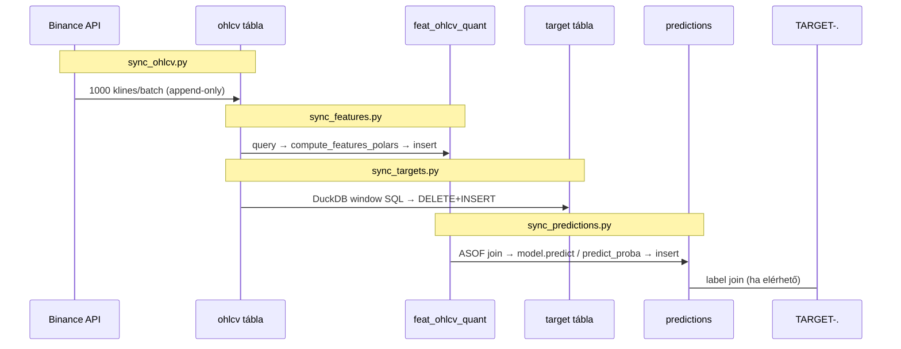
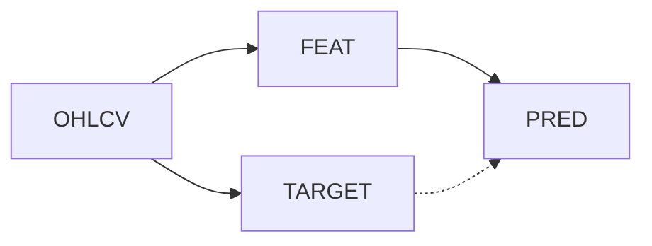
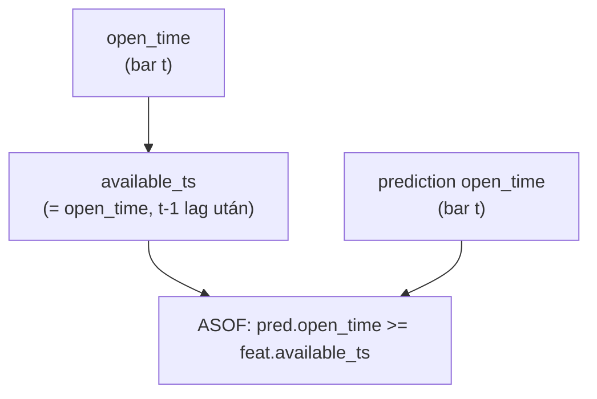

# sync_tables/ — Sync Pipeline

A `src/database/sync_tables/` könyvtár felelős az összes adat mozgatásáért és transzformálásáért: Binance API → OHLCV → features → targets → predictions. Minden funkció idempotens — biztonságosan újrafuttatható.

---

## Pipeline áttekintés

---

## Fájlok

### [sync_ohlcv.py](0221_sync_ohlcv.md)

Binance 1-perces kline szinkron. Paginálás 1000/batch, stale guard, gap check.

**Belépési pont:** `sync_ohlcv(open_time_ms_from, asset_id)`

**Kritikus invariáns:** 10 oszlop tárolva (Binance 12-ből — `close_time` és `ignore` elhagyva).

---

### [sync_features.py](0222_sync_features.md)

Feature számítás Polars LazyFrame pipeline-nal. t-1 lag minden OHLCV-alapú feature-re.

**Belépési pont:** `sync_features(start_time, lookback_bars, end_time, asset_id)`

**Kritikus invariáns:** `available_ts = open_time` (t-1 lag az `_apply_t1_lag_pl` biztosítja).

---

### [sync_predictions.py](0223_sync_predictions.md)

Champion modellek betöltése és inference futtatása. Unified long+short output egy sorban.

**Belépési pont:** `sync_predictions(start_time, end_time, asset_id)`

**Kulcs lépések:** `champion_models_for_asset` → `_load_model_artifacts` → ASOF join features → `_run_inference` → `insert_predictions`

---

### [sync_targets.py](0224_sync_targets.md)

Bináris target labelek számítása DuckDB window SQL-lel. Teljes rebuild szemantika.

**Belépési pont:** `sync_targets(asset_id)`

**Kritikus invariáns:** `ROWS BETWEEN 1 FOLLOWING AND 60 FOLLOWING` — az aktuális bar NEM szerepel a forward window-ban.

---

### [_features_polars.py](0225_features_polars.md)

Feature computation engine — 30+ indikátor csoport Polars LazyFrame API-val.

**Belépési pont:** `compute_features_polars(df_ohlcv, indicators, feat_prefix, available_activity, targets_cfg)`

**Kritikus invariáns:** `T_MINUS_1_SKIP` frozenset — P2 időindexes feature-ök ki vannak zárva a t-1 lag alól.

---

## Függőségi sorrend

A `02_sync_pipeline.py` ezt a sorrendet garantálja:
1. `sync_targets` (csak `ohlcv`-t olvas)
2. `sync_features` (csak `ohlcv`-t olvas)
3. `sync_predictions` (`feat_ohlcv_quant`-ot ASOF join-nal olvas)

A `target` tábla NEM blokkolja a features rebuild-et — a predictions viszont a features meglétét igényli.

---

## Idempotencia

Minden sync függvény a `latest_open_time(db_path, dataset)` alapján meghatározza a szinkron kezdőpontját. Ha a kért tartomány már be van töltve, a függvény 0 beírással lép ki.

| Függvény | Gap kezelés |
|----------|-------------|
| `sync_ohlcv` | Stale guard + gap check, warning logolás |
| `sync_features` | `MAX(open_time)` a feat táblában |
| `sync_predictions` | `MAX(open_time)` a predictions táblában |
| `sync_targets` | Mindig teljes rebuild (DELETE+INSERT) |

---

## Lookahead bias megakadályozás

A feature-öket a `compute_features_polars` hívásban `shift(1)` tolja el. Az `available_ts` mezőt a `sync_features` állítja be `open_time`-ra az eltolás után. Az ASOF join a `predictions` táblát `feat_ohlcv_quant.available_ts <= predictions.open_time` feltétellel köti össze — így minden bar csak már elérhető feature-t lát.
