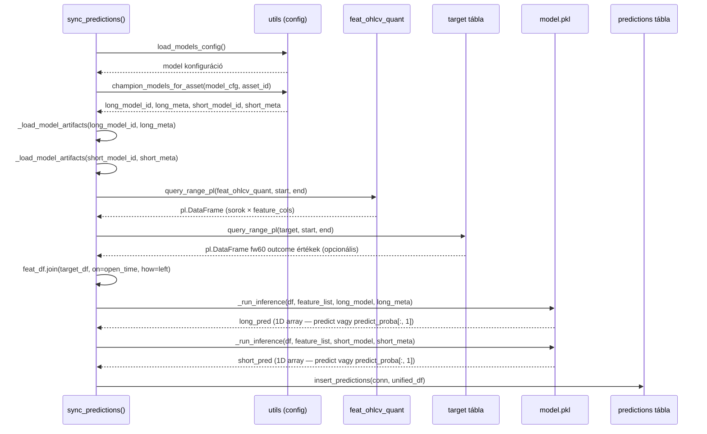

# sync_predictions.py — Inference és Predikció Beírás

`src/database/sync_tables/sync_predictions.py`

Champion modellek betöltése, feature snapshot összeállítása ASOF join-nal, inference futtatása, unified long+short predikciók beírása.

---

## `sync_predictions(start_time, end_time, asset_id)`

**Célja:** Predikciók generálása a megadott időtartományra és beírás a `predictions` táblába.

**Paraméterek:**

| Paraméter | Típus | Alap | Leírás |
|-----------|-------|------|--------|
| `start_time` | `str` | — | Inference kezdete (`YYYY-MM-DD HH:MM:SS`) |
| `end_time` | `str \| None` | `None` | Inference vége (`None` = legújabb feature bar) |
| `asset_id` | `str \| None` | `None` | Asset azonosító |

---

## Belső folyamat

---

## `_load_model_artifacts(model_id, model_meta)`

**Célja:** Model pickle és features.json betöltése lemezről.

**Paraméterek:**

| Paraméter | Típus | Leírás |
|-----------|-------|--------|
| `model_id` | `str` | Model azonosító (`<model_id>`) |
| `model_meta` | `dict` | Model konfiguráció (paths, trainer, stb.) |

**Visszatérési érték:** `tuple[Any, list[str]]` — `(model_object, feature_list)`

**Paths:**
- `models/<model_id>/model.pkl` → `pickle.load`
- `models/<model_id>/features.json` → JSON lista (feature nevekkel)

---

## `_run_inference(df, feature_list, model, model_meta)`

**Célja:** Egyetlen modell inference futtatása.

**Paraméterek:**

| Paraméter | Típus | Leírás |
|-----------|-------|--------|
| `df` | `pl.DataFrame` | Feature sorok (Polars) |
| `feature_list` | `list[str]` | Feature oszlopok sorrendben (model elvárja) |
| `model` | `Any` | Betöltött model objektum |
| `model_meta` | `dict` | `predict.method` = `"predict_proba"` vagy `"predict"` |

**Visszatérési érték:** `np.ndarray` — 1D vektor, soronként egy predikciós érték.

**Numpy konverzió:** `df.select(feature_list).fill_nan(0.0).fill_null(0.0).to_numpy()` — LightGBM numpy array-t kap, pandas-mentes.

**Predict módok:**
- `predict_proba` → `model.predict_proba(X)[:, 1]` (positive class valószínűsége)
- `predict` → `model.predict(X)` (direkt output)

---

## `_feature_list_for_prediction(features_data, model, trainer)`

**Célja:** A feature lista végleges sorrendjének meghatározása.

**Prioritás:**
1. `model.feature_names_in_` (sklearn standard) — ha elérhető
2. `features.json` tartalom — fallback
3. `features_data` oszlopok — last resort

Ez biztosítja, hogy a feature sorrend pontosan egyezzen a training kori sorrénddel.

---

## Output szerkezet

Az `insert_predictions` a következő egyesített DataFrame-et kapja:

| Oszlop | Forrás |
|--------|--------|
| `open_time` | `feat_ohlcv_quant.open_time` |
| `close` | `feat_ohlcv_quant.close` |
| `label_end_ts` | `open_time + fw_minutes` (config) |
| `long_pred` | `_run_inference(long_model)` |
| `short_pred` | `_run_inference(short_model)` |
