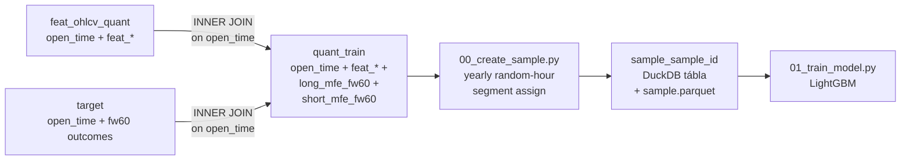
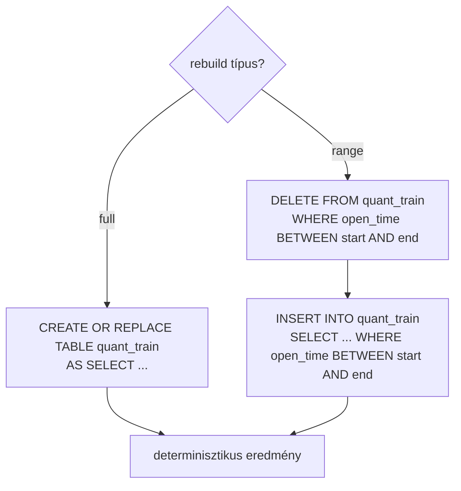

# 1260 — quant_train Table

Model-ready join tábla: `feat_ohlcv_quant` + `target` → tanítási adatforrás.

---

## Áttekintés

A `quant_train` tábla az ML pipeline egyetlen stabil belépési pontja. Feature engineering, sampling és LightGBM tanítás ebből dolgozik — nem a nyers `feat_ohlcv_quant` + `target` join-ból.



**NULL target policy:** Az INNER JOIN automatikusan kizárja azokat a sorokat, ahol `long_mfe_fw60 IS NULL OR short_mfe_fw60 IS NULL`. Ezek a sorok sosem kerülnek be a `quant_train`-be.

**Nem pipeline:** A `quant_train` nem része a live sync pipeline-nak (`02_sync_pipeline.py`). Kizárólag ad-hoc rebuild — tanítás előtt futtatandó.

---

## Sample tábla materialization

A `00_create_sample.py` (`create_yearly_sample`) az éves mintavétel után a `quant_train`-ből
válogatott sorokat materializálja a DuckDB-be:

**Tábla neve:** `sample_<sample_id>` (pl. `sample_solusdt_fw60_yearly_2024`)

**Oszlopok:**

| Oszlop | Típus | Leírás |
|--------|-------|--------|
| `open_time` | `TIMESTAMP` | Bar nyitási ideje (PK az adott szegmensen belül) |
| `fold_id` | `BIGINT \| NULL` | 0-alapú index a validációs héthez; NULL ha train/test |
| `segment` | `VARCHAR` | `train`, `valid`, `purge`, vagy `test` |
| `feat_*` | `DOUBLE` | Kiválasztott feature-ök (sorted névsorban) |
| `long_mfe_fw60` | `DOUBLE` | Long target — NULL megengedett purge/test soroknál |
| `short_mfe_fw60` | `DOUBLE` | Short target — NULL megengedett purge/test soroknál |

**Rebuild:** `CREATE OR REPLACE TABLE` — idempotens, biztonságos újrafuttatásra.

**Artefaktok szerepe:**
- `sample_<id>` DuckDB tábla: **elsődleges modellezési handoff** — ebből olvas `01_train_model.py`
- `sample.parquet`: másodlagos output — EDA, notebookok, archív célokra
- `metadata.json`: konfigurációs és auditálási metaadatok; tartalmaz `sample_table_name` mezőt
- `audit.json`: adatminőségi metrikák (hiányzó órák, sorszámok)

---

## Séma

| Oszlop | Típus | Forrás | Leírás |
|--------|-------|--------|--------|
| `open_time` | `TIMESTAMP` (PK) | `feat_ohlcv_quant` | Bar nyitási ideje, UTC. INNER JOIN garantálja az egyediséget. |
| `feat_*` | `DOUBLE` | `feat_ohlcv_quant` | Összes `feat_` prefixű feature oszlop. T-1 lag már alkalmazva. |
| `long_mfe_fw60` | `DOUBLE` | `target` | `log(max_price_fw60 / close[t])` — fw60 long outcome. |
| `short_mfe_fw60` | `DOUBLE` | `target` | `log(min_price_fw60 / close[t])` — fw60 short outcome. |

**Kizárt oszlopok:** `close`, `available_ts`, `lookback_end_ts` (feat táblából), `fw60_close`, `fw60_max`, `fw60_min` és egyéb fw60 oszlopok (target táblából), `long_pred`, `short_pred` (predictions tábla).

**Legacy naming:** A `trg_l_fw60_q90` / `trg_s_fw60_q10` boolean elnevezés NEM szerepel ebben a rétegben. A target oszlopok kizárólag `long_mfe_fw60` és `short_mfe_fw60`.

---

## Rebuild szemantika



| Mód | SQL | Mikor |
|-----|-----|-------|
| **Full rebuild** | `CREATE OR REPLACE TABLE quant_train AS SELECT ...` | Kezdeti feltöltés, teljes újraépítés |
| **Range rebuild** | `DELETE + INSERT` a megadott `open_time` ablakra | Inkrementális frissítés |

Mindkét mód **idempotens** — többszöri futtatás azonos eredményt ad.

---

## CLI

```powershell
# Full rebuild (alapértelmezett)
uv run python src/database/03_build_quant_train.py

# Range rebuild
uv run python src/database/03_build_quant_train.py --start 2024-01-01 --end 2024-12-31
```

---

## Implementáció

| Fájl | Szerepe |
|------|---------|
| [`src/database/store/duckdb_store.py`](src/database/store/duckdb_store.py) | `rebuild_quant_train(conn, start_time, end_time)` — core rebuild logika |
| [`src/database/sync_tables/sync_quant_train.py`](src/database/sync_tables/sync_quant_train.py) | `sync_quant_train(asset_id, start_time, end_time)` — asset-szintű wrapper |
| [`src/database/03_build_quant_train.py`](src/database/03_build_quant_train.py) | Standalone CLI |

---

## Kapcsolódó dokumentumok

- [`_doc_/1000_database.md`](_doc_/1000_database.md) — teljes DuckDB séma áttekintő
- [`_doc_/1110_duckdb_store.md`](_doc_/1110_duckdb_store.md) — store réteg
- [`_doc_/1240_sync_targets.md`](_doc_/1240_sync_targets.md) — target tábla és fw60 outcome-ok
- [`_doc_/3300_targets.md`](_doc_/3300_targets.md) — target layer módszertani háttér
- [`_doc_/3100_sampling.md`](_doc_/3100_sampling.md) — sampling modul (downstream fogyasztó)
