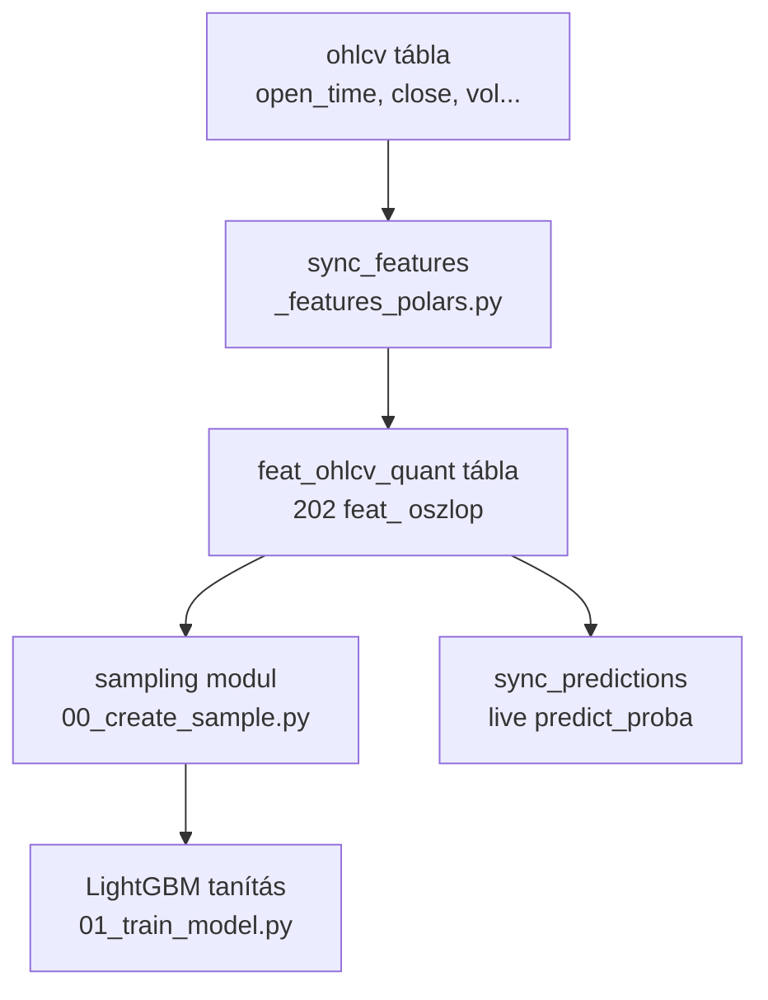
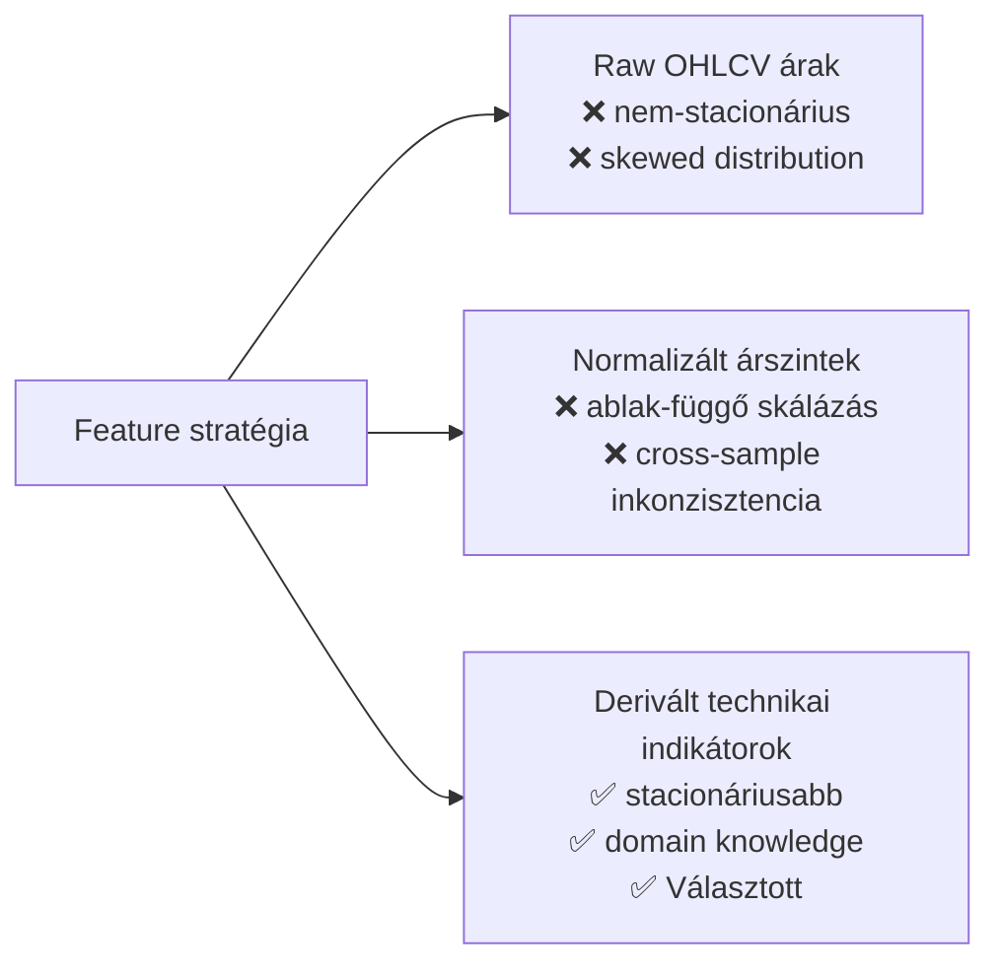
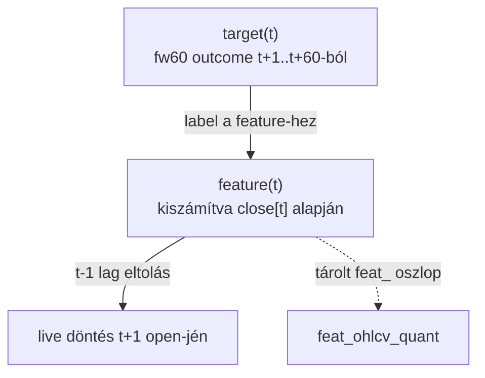
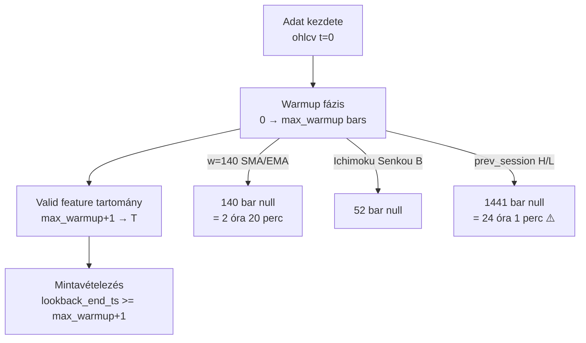

# 2000 — Feature Layer

A feature layer a ChronoQuant ML pipeline bemeneti adatrétege: minden modellezési döntés egy feature profilt feltételez, amelyet a `feat_ohlcv_quant` DuckDB tábla szolgáltat ki.

---

## Overview

A feature layer az `ohlcv` nyers adatból kiszámított technikai és statisztikai indikátorokból áll. Ezek a jellemzők leírják a piac állapotát a predikció időpontjában, és kizárólag olyan információt tartalmazhatnak, amely a `t` időpontnál nem újabb.

**Aktív feature profil:** `solusdt_fw60` — 208 feature, 25 csoport, 1 perces SOLUSDT OHLCV báron.

**Implementáció:** [`src/data_handling/sync_tables/_features_polars.py`](src/data_handling/sync_tables/_features_polars.py)
**Konfiguráció:** [`config/features.json`](config/features.json)
**Kód referencia:** [`_doc_/2200_features_polars.md`](_doc_/2200_features_polars.md)

---

## Feature Csoportok

| # | Csoport | Db | Domináns ablak(ok) |
|---|---------|----|--------------------|
| 1 | Momentum | 9 | w=14 (RSI, Stoch, ADX), w=20 (CCI), w=14/140 (ROC) |
| 2 | Trend | 8 | w=14, 140 (SMA, EMA ratio), w=10 (KAMA), fast=12/slow=26/sig=9 (MACD) |
| 3 | Volatility | 12 | w=14, 140 (BB), w=14 (NATR), w=20 (hist_vol), w=10, 30, 60 (GK, Parkinson) |
| 4 | Volume | 6 | w=14 (vol_sma, OBV_roc, MFI), w=20 (CMF), kumulatív (OBV) |
| 5 | Price Action | 6 | w=14 (returns std/skew/kurt), ablak nélkül (log return, hml_range, close_pos) |
| 6 | Market Structure | 6 | w=5 (swing high/low, trend counts) |
| 7 | Activity | 11 | w=10, 30 (taker flow), w=10, 30, 60 (quote vol ratio, trade count ratio) |
| 8 | Return Distance | 15 | w=10, 30, 60 (return, return_z, dist_high, dist_low, rolling_drawdown) |
| 9 | Regime Rank | 15 | w=10, 30 (vol/quote_vol/trade rank), w=20, 60 (natr/hist_vol/bb_width rank) |
| 10 | Candle Shape | 9 | ablak nélkül (body_ratio, wick_ratio), w=10, 30 (sma variants) |
| 11 | Trend Slope | 3 | w=10, 30 (EMA slope, directional agreement) |
| 12 | Interaction | 12 | w=5, 10, 30 (RSI/ROC delta, vol_adj_return) |
| 13 | Time / Session | 12 | nincs backward ablak — determinisztikus (óra, nap, szesszió, heti nyitó) |
| 14 | Autocorrelation | 5 | lag=1/5, w=30, 60 (return autocorr), cross=10/60 (variance ratio) |
| 15 | Drawdown & Timing | 12 | w=10, 30, 60 (recovery ratio, max drawdown, time since high/low) |
| 16 | Pattern Flags | 10 | ablak nélkül (doji, hammer, engulf), w=10, 30, 60 (bull_bars_ratio) |
| 17 | Gap | 3 | ablak nélkül (gap_open), w=10, 30 (abs sma) |
| 18 | Efficiency | 3 | w=10, 30, 60 (Kaufman efficiency ratio) |
| 19 | SR Levels | 8 | w=10, 30, 60 (ATR dist high/low), **prev session H/L (1440 bar shift)** |
| 20 | Tail Risk | 9 | w=10, 30, 60 (pos/neg return mean, return asymmetry) |
| 21 | Extended Accel | 2 | w=10, 30 (return momentum delta) |
| 22 | Ichimoku | 7 | built-in: 9, 26, 52 (tenkan, kijun, senkou_b, cloud) |
| 23 | Donchian | 9 | w=10, 30, 60 (width, position, breakout) |
| 24 | Linear Regression | 9 | w=10, 30, 60 (slope, R², residual) |
| 25 | Session Relative | 4 | ablak nélkül (day_range_position, day_open_return, bars_into_session_norm, weekly_open_return) |

---

## Üzleti és módszertani háttér

### Miért kritikus ez a lépés?

A feature layer az egyetlen csatorna, amelyen keresztül a modell a piacot látja. Ha egy feature jövőbeli adatot szivárogtat be (lookahead leak), a modell in-sample kiválóan teljesít, de live éles predikción azonnal összeomlik — nincs jövőbeli close ár, amelyre az indikátor támaszkodna. Ha a warmup kezelés hibás, a null sorok torzítják az imputation-t, és a sampling hamis tanulási pontokat vonhat be a train halmazba.

Ezért a feature layer helyes implementációja kötelező kapu minden modellezési munka előtt: ha a source-of-truth kód módosul, a sampling és a tanítás pipeline-nak is újra kell futnia.

### Miért ezt a megközelítést?

| Megközelítés | Előny | Hátrány | Státusz |
|---|---|---|---|
| Derivált technikai + statisztikai indikátorok (jelenlegi) | Stacionáriusabb, domain knowledge beépítve, széles szemantikai lefedés | Sok feature → szelekció szükséges, warmup overhead | ✅ Választott |
| Raw OHLCV ár + volume | Egyszerű, nincs warmup | Nem-stacionárius, LightGBM számára nehezen értelmezhető | ❌ Elvetett — szignálminőség hiány |
| Csak momentum + trend (szűk készlet) | Gyors warmup, olvasható | Elveszett context (volatilitás, aktivitás, struktúra) | ⚠️ Fontolóra vehető — egyszerű baseline-hoz |
| Deep learning embedding (raw OHLCV) | Automatikus feature extraction | Infrastruktúra-, adatigény, interpretálhatatlan | ❌ Elvetett — projekt scope-on kívül |

### t-1 lag: miért kell és hogyan működik?

A feature `t` időpontnál kerül kiszámításra a `t` bar close ára alapján. A modell predikciója azonban a következő bar — `t+1` — irányáról szól. Ha a modell a `t`-beli feature-t a `t`-beli targethez illeszti, nincs lookahead; de ha a modell live-on fut, a `t+1` bar open-jén vásárol, azaz a döntés és a végrehajtás között eltelt egy bar.

A `_apply_t1_lag_pl()` függvény minden feature oszlopot egységesen `shift(1)`-gyel tol el. Ez azt jelenti, hogy a tárolt `feat_` érték az előző bar indikátorát tartalmazza — ezáltal a modell tanulása és live inferenciája teljesen konzisztens.

**Kivétel:** Time/Session és Session Relative feature-ök (`T_MINUS_1_SKIP` tag) — ezek az `open_time` timestamp-ből vagy a nap/hét nyitójából deterministikusan számolódnak, és nem hordoznak jövőbeli piacadatot, ezért lag nélkül is lookahead-mentesek.

**Szabály:** Minden új feature-t `_apply_t1_lag_pl()` hatókörén belül kell definiálni, kivéve ha explicit `T_MINUS_1_SKIP` annotációval van ellátva.

### Warmup bars és az adatbiztonságos minta határai

| Feature(ek) | Warmup (bar) | Valós idő |
|---|---|---|
| Legtöbb rolling feature | 10–60 | 10–60 perc |
| Ichimoku Senkou B | 52 | 52 perc |
| SMA/EMA/BB w=140 | 140 | 2 óra 20 perc |
| **prev_session_high/low_dist** | **1441** | **24 óra 1 perc** |

A `prev_session_high/low_dist` feature 1440 bar-t shift-el (előző naptári nap max/min), majd jön a t-1 lag — összesen 1441 bar null az elején.

**Szabály:** A sampling modul `lookback_end_ts` értékének min. 1441 barral el kell tolódnia az adat kezdetétől, hogy a warmup nullák ne kerüljenek be a tanítási ablakba.

### Paraméter alapértékek és indoklásuk

| Paraméter | Érték | Indoklás |
|---|---|---|
| Domináns short ablak | `w=10` | 10 perces kontextus elegendő gyors momentum jelekhez; 5-nél zajosabb, 14-nél lassabb |
| Domináns mid ablak | `w=14` | Klasszikus technikai elemzés konvenció (RSI, ATR, ADX); széles elfogadottság |
| Domináns long ablak | `w=30` | 30 perces félóra-szintű kontextus; közelíti a kereskedési szesszió egységét |
| Széles trend ablak | `w=140` | ~2.3 óra; a nap-szintű trend kontextus közelítése 1 perces bárokon |
| Ichimoku Senkou B | `w=52` | Ichimoku szabványos beállítás (26 periódus × 2) |
| prev_session shift | `1440` | Pontosan egy napnyi (00:00–23:59 UTC) bar a shift; 1440 = 24×60 |
| Feature prefix | `feat_` | Névtérelkülönítés a target és raw OHLCV oszlopoktól |
| t-1 lag | `shift(1)` | Egy bar eltolás; a smallest production granularitás |

### Ismert kockázatok és korlátok

| Kockázat | Tünet | Mitigáció |
|---|---|---|
| `prev_session` gap kockázat | Ha a piac gappel nyit és az OHLCV nem pontosan 1440 bar/nap, a shift nem a nap határán landol | Elhagyható feature set; vagy explicit napos aggregáció indexelés alapján |
| Warmup null → imputáció torzítás | A null sorok véletlenszerű középértékkel tölthetők be, ami hamis szignált ad a modellnek | `lookback_end_ts` offset >= 1441 bar kötelező; soha ne impute-old a warmup tartományban |
| Feature multikollinearitás | Sok csoport (pl. Momentum + Interaction + Return Distance) átfedő információt hordoz | LightGBM természetes feature importance szelekciója; opcionálisan SHAP-alapú pruning |
| Feature count overhead | 202 feature → lassabb tanítás, overfitting veszély kis mintán | Szűk feature profil kísérletekhez (`config/features.json` profile-ok) |
| Live warmup hiány | Ha live deploy-ban nincs elegendő history a széles ablakokhoz, az indikátorok nullák | Deployment előtt ellenőrizni: min. 1441 bar history rendelkezésre áll-e |
| Time/Session feature timezone eltolás | `_tmp_day` UTC alapú; daylight saving nem releváns, de Binance maintenance window (UTC 00:00) érinthet teljes napokat | Ismert, kezelt; maintenance window általában < 60 perc, az indikátor csillapodik |

### Validációs checklist

- [ ] Minden `feat_` oszlopban az első 1441 sor null (vagy az adott feature saját warmup-ja, amelyik nagyobb)
- [ ] Nincs lookahead: `_apply_t1_lag_pl()` alkalmazva az összes nem-`T_MINUS_1_SKIP` feature-re
- [ ] `prev_session_high_dist` és `prev_session_low_dist` értékei az előző naptári nap max/min-jét tükrözik (nem az aktuális napét)
- [ ] A `feat_ohlcv_quant` tábla oszlopszáma megfelel a `config/features.json` `solusdt_fw60` profiljának
- [ ] A sampling `lookback_end_ts` offset >= 1441 bar — ellenőrzés: `audit_feature_table()` null count riport
- [ ] Live prediction pipeline ugyanazon feature-definícióval fut, mint a tanítási pipeline (közös `_features_polars.py` forrás)
- [ ] Új feature hozzáadásakor: `T_MINUS_1_SKIP` vagy `_apply_t1_lag_pl()` hatókörbe esik-e?
