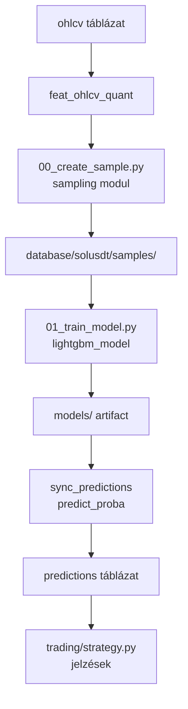

# 3000 — Modeling

A modeling domain a ChronoQuant ML pipeline szíve: nyers OHLCV adatokból valószínűségi
kereskedési jelzéseket állít elő LightGBM bináris osztályozókkal.

---

## Overview

A pipeline öt lépésből áll: feature számítás → sample definíció → modell tanítás →
predikció szinkronizálás → kereskedési jelzések. Minden lépés idempotens és
önállóan újrafuttatható.

---

## Aktív modellek (v4)

| Model ID | Irány | Target |
|----------|-------|--------|
| `lgbm_solusdt_l_fw60_q90_local_v4` | Long | `long_mfe_fw60` |
| `lgbm_solusdt_s_fw60_q10_local_v4` | Short | `short_mfe_fw60` |

- **Target szemantika:** `fw60` = 60-perces forward ablak (`t+1..t+60`); `long_mfe_fw60` = log(max future close / close[t]); `short_mfe_fw60` = log(min future close / close[t])
- **Feature prefix:** `feat_` | **Target oszlopok:** `long_mfe_fw60`, `short_mfe_fw60`
- **t-1 lag kötelező** minden feature-ön tanítás előtt

---

## Fejezetek

| Szám | Fájl | Tartalom | Állapot |
|------|------|----------|---------|
| 3100 | [3100_sampling.md](3100_sampling.md) | Sampling almodul áttekintő | kész |
| 3110 | [3110_sampling_config.md](3110_sampling_config.md) | SamplingConfig dataclass | kész |
| 3120 | [3120_sampling_splits.md](3120_sampling_splits.md) | Expanding window splits | kész |
| 3130 | [3130_sampling_audit.md](3130_sampling_audit.md) | Feature table audit | kész |
| 3140 | [3140_sampling_artifacts.md](3140_sampling_artifacts.md) | Artifact IO | kész |
| 3150 | [3150_create_sample.md](3150_create_sample.md) | CLI orchestrator | kész |
| 3200 | [3200_features.md](3200_features.md) | Feature layer metodológia | kész |
| 3300 | [3300_targets.md](3300_targets.md) | Target layer metodológia | kész |
| 3400 | — | LightGBM model | tervezett |
| 3450 | — | Hyperparameter search | tervezett |
| 3500 | — | Evaluation / backtest | tervezett |
| 3600 | — | Elliott waves (kutatás) | tervezett |
