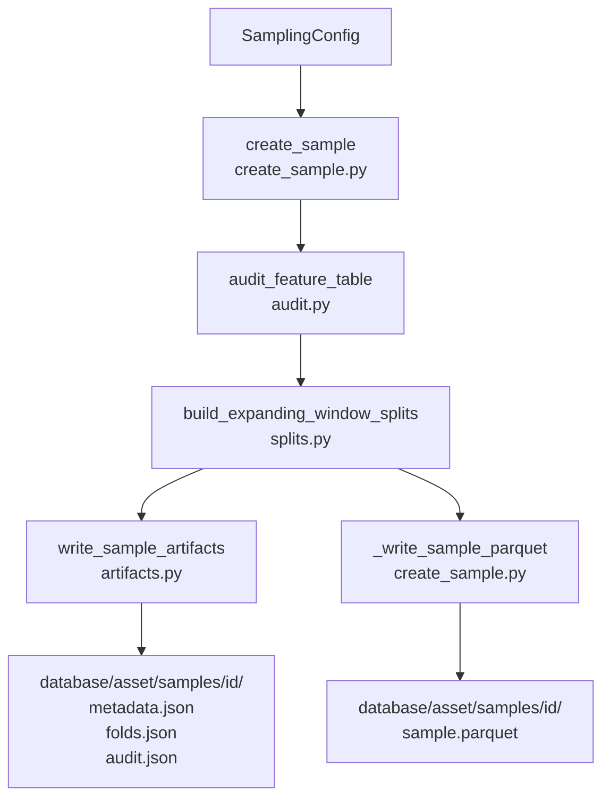

# 3100 — Sampling

A sampling almodul időalapú keresztvalidációs sample definíciókat generál. Kimenet:
három JSON fájl (metadata, folds, audit) és egy Parquet fájl (`sample.parquet`) a
`database/<asset>/samples/<sample_id>/` könyvtárban — ezeket olvassa be a modell
tanítási pipeline és az elemzési notebookok.

---

## Overview

Az expanding window CV lényege: minden fold-ban a training ablak visszanyúlik az
adatok elejéig (nem csúszóablak), a validációs ablak pedig előre gördül. Embargo
(embargó gap) biztosítja, hogy a feature-ök `target_horizon_minutes` percnyi
előrenézési ablaka ne szivárogjon át train→valid határon.



---

## Üzleti és módszertani háttér

### Miért kritikus lépés a sampling?

A sampling dönti el, hogy:

1. Milyen adat áll rendelkezésre az adott assetre és targetre?
2. Melyik rész használható modell- és hiperparaméter-szelekciójára?
3. Melyik rész marad érintetlen végső holdout-ként?
4. Melyik perzisztált sample definíciót kell az összehasonlítható modelleknek újra felhasználni?

A helytelen sampling a leggyakoribb forrása a félrevezető backtest-eredményeknek.
Egy szétcsúszott train/valid határ vagy kimaradt embargo torzított metrikákat ad
— a modell jónak látszik, de élesben nem teljesít.

---

### Miért kronologikus split? (Nem random CV)

Pénzügyi idősorokon a standard random k-fold keresztvalidáció **szivárgáshoz vezet**:
egy 2024-es bar kerülhet a train set-be, miközben a 2023-as szomszédja a validation-be
— így a modell implicit módon jövőbeli információhoz fér hozzá tanítás során.

A piac nem i.i.d. folyamat: trend, volatilitás-rezsim, korreláció időben változik.
A cronológikus split imitálja azt a helyzetet, amit live kereskedésben tapasztalunk:
a model csak a múltat látja, és a jövőre van kiértékelve.

**Szabály:** Mindig kronologikus splitet használj. Shuffled CV csak akkor megengedett,
ha az adott kísérlet dokumentáltan igazolja, hogy biztonságos.

---

### Miért expanding window? (Nem sliding/rolling)

Két lehetséges CV stratégia:

| Stratégia | Train ablak | Hátránya |
|-----------|-------------|----------|
| Sliding (rolling) window | Fix hosszú, előre csúszik | Korai adatok kiesnek; kevesebb stabil becslés |
| **Expanding window** | Mindig az adatok elejétől, csak vége nő | Maximális historikus kontextus, stabil tanítás |

Az expanding window azért preferált, mert:
- Több historikus adat → jobb szignál/zaj arány
- Az első fold már 2+ éves historikus háttérrel rendelkezik (`min_train_days = 730`)
- Intraday kereskedési szignálok esetén a korai évek (pl. 2020–2021 bull market) is releváns rezsim-kontextust adnak

---

### Embargo: miért kell és hogyan működik?

A `feat_ohlcv_quant` feature-ök egy részét rolling ablakokkal számítjuk. A
`trg_l_fw60_q90` target egy 60 perces előre néző ablakot vesz figyelembe — ez azt
jelenti, hogy az ablak határán lévő feature sorok **implicit módon tartalmazzák
jövőbeli információt** (pl. az átlag kiszámításához a target ablak áraihoz is nyúlik
a rolling window).

Ha a train vége és a valid eleje között nincs gap, ezek a sorok nem szivárogthatnak
— de pont az átmeneti zónában lévő sorok kerülnének oda. Az **embargo** a megoldás:

```
train_end = valid_start − embargo_minutes − 1 perc
```

Az embargo mérete alapértelmezetten a `target_horizon_minutes` értéke (azaz 60 perc
a fw60 targetnél), ami garantálja, hogy a target ablak által érintett percek mindig
kiesnek a training set végéről.

---

### Egész hónapok szabálya

A sampling mindig teljes naptári hónapokra korlátozódik — nem az audit által visszaadott
pontos timestampre. Az indok: a hónaphatáros adatszeletelés megkönnyíti az összehasonlítást
modellek és verziók között, mivel az időszak emberi kommunikációban is egyértelmű.

**Szabály:**

- `data_start` → felfelé kerekítés a következő hónap első napjára (ha a tényleges start nem hó eleje)
- `data_end` → lefelé kerekítés az előző hónap utolsó percére

**Példa:**

| Audit eredmény | Kerekítés után |
|----------------|---------------|
| `data_start_safe = 2020-09-14 07:00:00` | `2020-10-01 00:00:00` |
| `data_end_safe   = 2026-06-12 18:20:00` | `2026-05-31 23:59:00` |

**Sample névkonvenció:** `solusdt_fw60_YYMM_YYMM` ahol YYMM a kerekített start és end hónap.
Pl.: `solusdt_fw60_2010_2605` (2020-10 → 2026-05).

---

### Final holdout: az "érettségi vizsga"

A végső holdout (test set) a **legfrissebb 365 nap** (alapértelmezetten). Ez:

- **Nem kerül felhasználásra** feature-, modell-, hiperparaméter- vagy trigger-szelekciójához
- **Egyetlen alkalommal** van kiértékelve: amikor a kutatási döntések megvannak
- **Nem eldobott adat:** ha egy kandidáns átment a holdout-ellenőrzésen, az összes
  jóváhagyott adat (beleértve a holdup-ot) felhasználható a promóciós fitre

A holdout gondolata: a kutatási döntések meghozataláig az "examinál" adat ismeretlen.
Ha a holdoton is átmegy a modell, az erős jele annak, hogy nem overfit-elt a
kutatási fázisra.

---

### Promotion fit

Promotion (élesítés) előtt a modell újrataníthato az összes jóváhagyott adaton:

```
Kutatási fázis:  data_start → pre-holdout data  (fold CV + trigger selection)
Final holdout:   újabb 365 nap (csak egyszer kiértékelve)
Promotion fit:   data_start → latest safe timestamp (holdout jóváhagyás után)
```

A promotion fit nem véletlenszerű túlillesztés: a döntések a kutatási fázisban
születtek, a holdout csak validál. Az összes adaton való refitelés a live deployment
hatékonyságát növeli.

---

## Sample ID policy

### Mikor lehet ugyanazt a `sample_id`-t újra felhasználni?

Reuse ugyanazon `sample_id`-vel, ha az összehasonlíthatóság szükséges:

- Ugyanarra az assetre és horizonra épülő long és short modellek
- Ugyanarra a targetre szánt LightGBM kandidáns verziók
- Baseline vs. champion összehasonlítás

### Mikor kell új `sample_id`?

| Ok | Magyarázat |
|----|-----------|
| Asset vagy forrástábla változott | Az adatok összehasonlíthatatlanok |
| Target horizon változott | A fold határok más perceket jelölnek |
| Label definíció változott | A target értékek eltérnek |
| Feature tábla rebuild | Ha az elérhető dátumtartomány jelentősen változott |
| Split paraméterek változtak | A fold határok eltérnek |
| Adatminőségi javítás | Ha a minta érdemben megváltozott |

**Elv:** Az összehasonlítható modelleknek azonos `sample_id`-vel kell rendelkezniük —
különben az összehasonlítás érvénytelen (más train/valid határokon értékelve).

---

## Startup adatellenőrzés

Minden modell-fejlesztési ciklus előtt futtasd az audit-ot az alábbi szempontokra:

- Feature tábla első és utolsó elérhető timestampja
- Sorok száma a feature táblában
- Szükséges target oszlopok meglétét az adott horizonhoz
- Target és feature null arányok
- Duplikált `open_time` értékek
- Időbeli hézagok (gap) a feature táblában
- Target horizon és embargo igény

Az audit eredménye határozza meg a `data_start_safe` értékét, ami a splitek
generálásának alapja.

---

## Target NULL szemantika

A feature tábla target oszlopai (`trg_l_fw60_q90`, `trg_s_fw60_q10`) három értéket vehetnek fel:

| Érték | Jelentés |
|-------|---------|
| `1` | Feltétel teljesült — a forward ablak megerősítette az eseményt |
| `0` | Feltétel nem teljesült — a forward ablak lezárult esemény nélkül |
| `NULL` | Forward adat még nem elérhető — az utolsó `rolling_window` bar-ban vagyunk |

### Miért fontos a NULL?

A target egy fordított rolling ablakkal számított. Az utolsó `rolling_window` bar-nál
(pl. 60 bar a fw60-nál) az ablak nem tartalmaz teljes forward adatot — ezért ezek
a sorok ismeretlen állapotban vannak, nem megerősített negatívok.

**Alapelv:** Ne impputáld a NULL targeteket 0-val. A NULL valóban ismeretlen, nem
megerősített negatív. A modell-pipeline `dropna(subset=[target_col])` szűréssel
kezeli őket.

Az utolsó `rolling_window` bar-ban lévő, nem-nulla NULL arány normális és helyes.
Ha ezen kívül is NULL értékek vannak, az adatpipeline-ban van hiba.

---

## Paraméter alapértékek és indoklásuk

| Paraméter | Alapérték | Indoklás |
|-----------|-----------|---------|
| `min_train_days` | 730 (2 év) | Elegendő historikus kontextus az első validációs foldhoz; rövidebb historikus adat instabil modellhez vezet |
| `valid_days` | 180 (6 hó) | Érdemi időtáv a modell stabilitásának méréséhez, de nem annyira hosszú, hogy kevés fold keletkezzen |
| `step_days` | 180 (6 hó) | Megegyezik a `valid_days`-zel — non-overlapping validációs ablakok biztosítva |
| `test_days` | 365 (1 év) | Legalább egy teljes éves holdout; piaci szezonalitást lefedje |
| `embargo_minutes` | `None` → `target_horizon_minutes` | Automatikusan a target horizon értéke; ha nincs megadva, nem lehet tévesen nulla |

Rövidebb holdout indokolt, ha az asset historikusan kevés adattal rendelkezik.
Hosszabb holdout indokolt rezsim-érzékeny kutatásnál, de csökkenti a kutatási fázis
rendelkezésre álló adatát.

---

## Expanding window CV — kulcsfogalmak

| Fogalom | Leírás |
|---------|--------|
| Expanding train | Train ablak mindig `data_start_safe`-tól indul, csak a vége tolódik |
| Fixed valid | Minden fold-ban azonos hosszú validációs ablak |
| Embargo | `embargo_minutes` perces gap train vége és valid eleje között |
| Test set | Fix végső holdout — az összes fold után, embargóval elválasztva |

---

## Artifact output

Minden `create_sample` futtatás négy fájlt ír a `database/<asset_id>/samples/<sample_id>/` alá:

| Fájl | Tartalom |
|------|----------|
| `metadata.json` | sample_id, asset_id, target_col, paraméterek, adathatárok, generated_at |
| `folds.json` | `{"folds": [...], "test": {...}}` — időhatárok fold-onként |
| `audit.json` | Feature tábla minőségi metrikák (gap, null arány, sorok száma) |
| `sample.parquet` | Összes sor (feat_ohlcv_quant + target + `segment` label), ZSTD tömörítve |

### sample.parquet struktúra

| Oszlop | Forrás | Leírás |
|--------|--------|--------|
| `open_time` | `feat_ohlcv_quant` | Timestamp (YYYY-MM-DD HH:MM:SS) |
| `feat_*` (208 db) | `feat_ohlcv_quant` | Kvantitatív feature-ök |
| `trg_l_fw60_q90` | `target` | Long target label |
| `trg_s_fw60_q10` | `target` | Short target label |
| `segment` | generált | Szegmens azonosító (ld. lent) |

**`segment` oszlop értékkészlete:**

| Érték | Leírás |
|-------|--------|
| `fold_1_train` … `fold_N_train` | Az N. fold training adatai |
| `fold_1_valid` … `fold_N_valid` | Az N. fold validációs adatai |
| `test` | Végső holdout |

Az expanding window miatt az azonos sor több `fold_K_train` szegmensben is szerepelhet
(pl. 2021-es adat fold_1_train-ben és fold_2_train-ben is). Szegmentált olvasáshoz
használj Polars lazy frame-t:

```python
import polars as pl

df = (
    pl.scan_parquet("database/solusdt/samples/<sample_id>/sample.parquet")
    .filter(pl.col("segment") == "fold_1_train")
    .collect()
)
```

---

## Validációs checklist

- [ ] `metadata.json`, `folds.json`, `audit.json` és `sample.parquet` létezik a `sample_id`-hoz
- [ ] Fold határok kronologikusak és nem fednek át
- [ ] Embargo elválasztja a train és valid/test sorokat
- [ ] A végső holdout nem volt felhasználva modell-, feature-, hiperparaméter- vagy trigger-szelekciójára
- [ ] Összehasonlítható kandidánsok azonos `sample_id`-t használnak
- [ ] A minta dátumtartománya megfelel az aktuális modellezési kérdésnek
- [ ] Nincs NULL target a forward-edge-en kívül
- [ ] `sample.parquet` `segment` oszlopában minden elvárt szegmens jelen van (`fold_1_train`…`fold_N_valid`, `test`)

---

## Alfejezetek

| Szám | Fájl | Tartalom |
|------|------|----------|
| 3110 | [3110_sampling_config.md](3110_sampling_config.md) | SamplingConfig dataclass |
| 3120 | [3120_sampling_splits.md](3120_sampling_splits.md) | build_expanding_window_splits |
| 3130 | [3130_sampling_audit.md](3130_sampling_audit.md) | audit_feature_table |
| 3140 | [3140_sampling_artifacts.md](3140_sampling_artifacts.md) | write / load / validate artifacts |
| 3150 | [3150_create_sample.md](3150_create_sample.md) | create_sample orchestrator + CLI |
