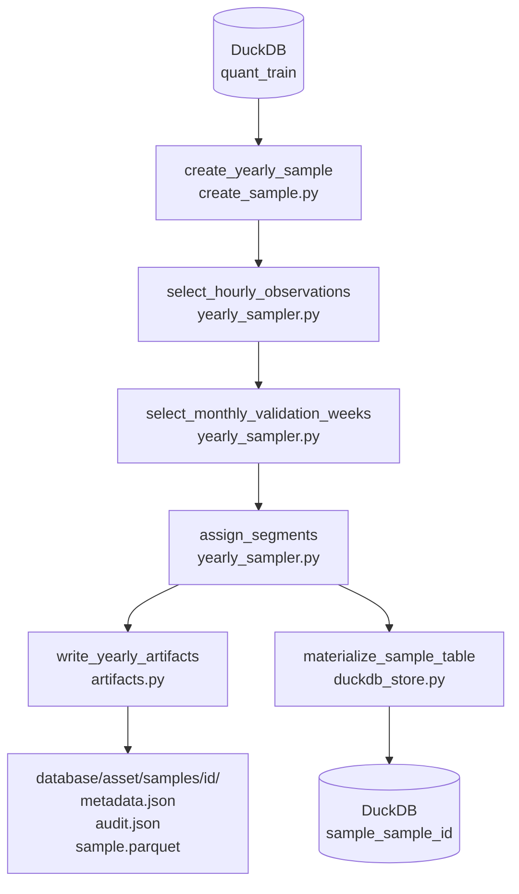
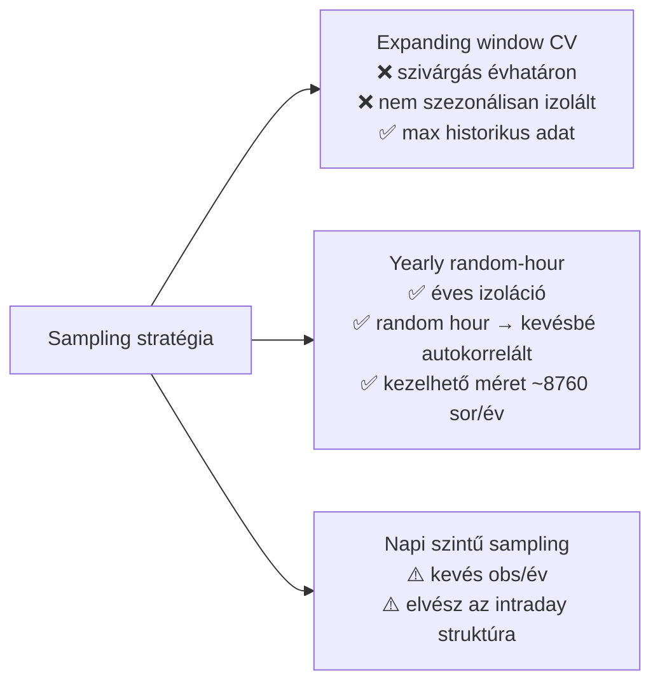
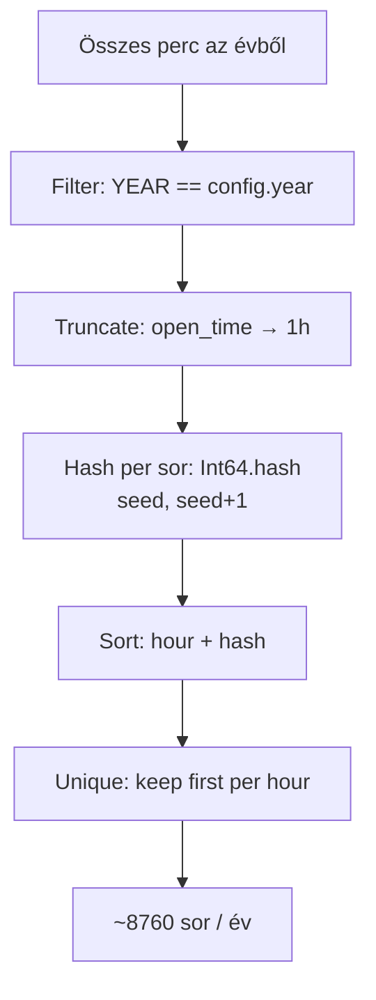
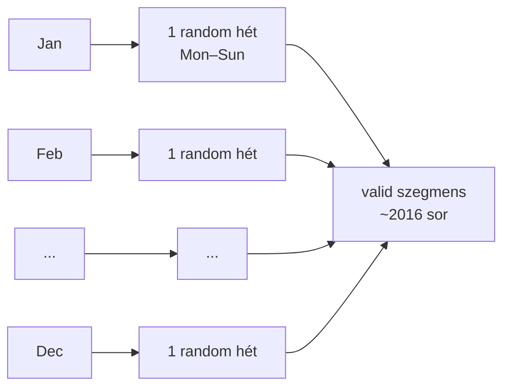

# 3101 — Yearly Random-Hour Sampling

Az éves, random-óra-alapú sampling stratégia lényege: egy naptári évre pontosan egy
random percet választ óránként (~8 760 sor/év), majd 12 hónaponkénti validációs hetet
jelöl ki, és purge-ablakkal választja el a train és valid szegmenseket.

---

## Overview



A pipeline input-ja a `quant_train` tábla (feat_* + target oszlopok, NULL target sorok
kizárva); kimenetei:
- `database/<asset>/samples/<sample_id>/metadata.json`, `audit.json`, `sample.parquet`
- DuckDB tábla: `sample_<sample_id>` — elsődleges modellezési handoff

---

## Üzleti és módszertani háttér

### Miért kritikus ez a lépés?

A yearly sampling dönt arról, hogy melyik percek kerülnek tanítóba, melyik
validálásba, és melyik kap purge-jelölést. Egy rossz split → információszivárgás
train→valid irányba → a model jónak látszik backtesten, de élesben alulteljesít.

Az éves granularitás egy további célt is szolgál: minden naptári év egy önálló
megfigyelési egységként értékelhető, így a modell éven belüli stabilitása és az
évek közötti rezsimváltás hatása külön mérhető.

---

### Miért ezt a megközelítést?



| Megközelítés | Előny | Hátrány | Státusz |
|---|---|---|---|
| **Yearly random-hour** | Éves izoláció; random hour → kevésbé autokorrelált minták; kezelhető méret | Nem maximalizálja a historikus adatot | ✅ Választott |
| Expanding window CV | Maximális historikus kontextus; hagyományos ML-CV analógia | Évhatáron átnyúló szivárgás lehetséges; nem mér éves stabilitást | ❌ Elvetett — éves izolációt nem biztosít |
| Napi mintavétel (1 bar/nap) | Minimális korreláció | Elvész az intraday mintázat; ~365 sor/év → túl kevés | ❌ Elvetett — intraday struktúra elvész |
| Minden perc (nincs mintavétel) | Maximális adatsűrűség | Erős autokorrelációval torzított metrikák | ❌ Elvetett — szivárgás kockázata magas |

---

### Random hour selection: miért kell és hogyan működik?

Az 1 perces OHLCV sorok erősen autokorreláltak — egymást követő percek közel azonos
feature-vektorokat adnak. Ha minden percet betennénk, a validációs metrikák optimistán
torzítottak lennének (a model "emlékszik" az előző percre).

Az **óránkénti random mintavétel** csökkenti ezt az autokorrelációt: az egy percnyi
ugrás + random kiválasztás biztosítja, hogy szomszédos sorok ne ugyanazon árjelből
következzenek.

**Szabály:** Egy naptári évből pontosan 1 sort választunk minden teljes óra-egységre.
Szökőévben 8 784, standard évben 8 760 sort kapunk (ha az adatbázis teljes).

**Reprodukálhatóság:** a kiválasztás `open_time.cast(Int64).hash(seed, seed+1)` alapú
— row-ordering független, azonos seed + év → azonos kiválasztás.



---

### Monthly validation week: miért kell és hogyan működik?

A validáció célja a generalizációs képesség mérése. Egy szezon-izolált validáció
(pl. csak Q4) elfogult lehet a piaci ciklus adott fázisára. Ezért **12 validációs
hetet** választunk — hónaponként egyet —, hogy minden naptári hónap és piaci
szezon képviselve legyen.

A hetek **teljes Monday–Sunday egységek**: ez megőrzi az intraday és intraweek
periodikus mintázatokat a validációs ablakban. Az esetleges hónaphatár-átlépés
(pl. dec. 29 → jan. 4) elfogadható — a hét integritása prioritás.

**Kiválasztás:** minden hónapban az összes hétfő listájából `random.Random(seed)`
választ egyet (determinisztikus, seed-függő).



---

### Purge (±240 perc): miért kell és hogyan működik?

A `feat_ohlcv_quant` feature-ök rolling ablakokkal számítottak. Ha egy validációs
hét elején lévő sor feature-vektora egy train-beli percből "visszanéz" az előző
ablakba, az implicit tudást hordoz a train adatból — ez szivárgás.

A **purge** ezt kezeli: a validációs hét előtti és utáni `purge_minutes` percben lévő
sorokat se trainbe, se validba nem tesszük.

```
... [train] ... [purge 240 perc] [valid hét Mon–Sun] [purge 240 perc] [train] ...
```

**Miért 240 perc?**
A `features.json`-ban a leghosszabb rolling ablak 140 bar (= 140 perc 1m chart-on).
A 240 perces purge ~71%-os biztonsági margót ad a 140 perces max lookback fölé.
Ez biztosítja, hogy még a leghosszabb feature-ablak is biztosan a train-en belül
marad, nem "néz bele" a válida ablak előtti percekbe.

**Szabály:** Purge sorok sem train, sem valid set-be nem kerülhetnek.

---

### Segment értékek és definíciók

| Érték | Leírás |
|-------|--------|
| `train` | Minden sor, amely nincs valid, purge és test ablakban |
| `valid` | Pontosan a 12 validációs hét (Mon 00:00 → Sun 23:59), test hónapok kizárva |
| `purge` | ±240 perces zóna minden validációs hét határán (nem fed át validdal) |
| `test` | Az év utolsó `test_months` hónapja (holdout) — nem kerül train/valid/purge-ba |

Prioritási sorrend az assign_segments logikájában: test > valid > purge > train.

---

### Paraméter alapértékek és indoklásuk

| Paraméter | Alapérték | Indoklás |
|-----------|-----------|---------|
| `purge_minutes` | `240` | Max feature lookback = 140 perc; 240 perc ~71%-os biztonsági margó; biztonságos default a jövőbeli feature-bővítésekre is |
| `seed` | `42 + year` | Évenként eltérő seed → különböző óra- és hétválasztás; reprodukálható, dokumentálható; 42 konvencionális ML alap |
| `target_cols` | `("long_mfe_fw60", "short_mfe_fw60")` | Aktív target páros a v4 modellekhez; tuple → immutable config |
| `sample_id` | `{asset_id}_fw60_yearly_{year}` | Emberi olvashatóság + programmatikus parse-olhatóság; egyértelműen azonosítja az évet és stratégiát |

---

### Ismert kockázatok és korlátok

| Kockázat | Tünet | Mitigáció |
|---|---|---|
| Év-határon átnyúló validation week (pl. dec. 29 → jan. 4) | 2025-ös évben valid=1920 (nem 2016) — jan. adatok hiányoznak | Elfogadott viselkedés; audit.json tartalmaz `missing_hours` mezőt; alert ha valid < 1800 |
| Szökőév (pl. 2024) módosítja a purge számot | 2024-ben purge=84 (nem 96) — év-határon átnyúló purge ablakok rövidülnek | Elfogadott; dokumentált; modell-összehasonlításhoz az éves row count-okat rögzíteni kell |
| Hiányzó DB adatok az évben | `missing_hours > 0` az audit-ban | Ellenőrizd az audit.json-t minden generált sample-nál; ne használd ha `missing_hours > 500` |
| Random hour selection nem fed le minden intraday mintát | Szisztematikus intraday anomáliák (pl. funding hour spike) alulreprezentáltak | Elfogadott — a hash-based random egyenletes eloszlást közelít; manuális audit ajánlott ha intraday pattern ismert |
| Expanding window pipeline nem kompatibilis az új sample formátummal | `lightgbm_model.py` `load_sample_definition` (`folds.json`) szintaxist vár | A new training pipeline (yearly format aware) külön epic feladata; addig ne futtass train-t yearly sample-en a régi pipeline-nal |

---

### Validációs checklist

- [ ] `sample.parquet` és `sample_<sample_id>` DuckDB tábla létezik
- [ ] `metadata.json` tartalmaz: `year`, `seed`, `selected_valid_weeks` (12 elem), `row_counts` szegmensenként, `sample_table_name`
- [ ] `audit.json` tartalmaz: `missing_hours`, `total_quant_train_rows_in_year`, `actual_hourly_rows`
- [ ] Standard évben (1 test hónap): `valid = 2016`, `purge = 96` (kb.), `test` = utolsó hónap sorai
- [ ] Szökőévben (2024): `valid = 2016`, `purge ≤ 96`
- [ ] Nincs `open_time` átfedés train és valid szegmens között
- [ ] Purge sorok sem trainben, sem validban nem szerepelnek
- [ ] `segment` oszlop értékkészlete: `{"train", "valid", "purge", "test"}` — semmi más
- [ ] Azonos seed + év → azonos `sample.parquet` (reprodukálhatósági teszt)
- [ ] `missing_hours < 500` (ha felette van: vizsgáld meg az adatbázis hiányait)
- [ ] `check_sample_table(db_path, sample_id)` lefut hiba nélkül

---

## Kapcsolódó fájlok

| Szám | Fájl | Tartalom |
|------|------|----------|
| 3100 | [3100_sampling.md](3100_sampling.md) | Expanding window CV metodológia (legacy — archív referencia) |
| 3110 | [3110_sampling_config.md](3110_sampling_config.md) | YearlySamplingConfig dataclass |
| 3140 | [3140_sampling_artifacts.md](3140_sampling_artifacts.md) | write_yearly_artifacts / load_yearly_sample |
| 3150 | [3150_create_sample.md](3150_create_sample.md) | create_yearly_sample orchestrator + CLI |
