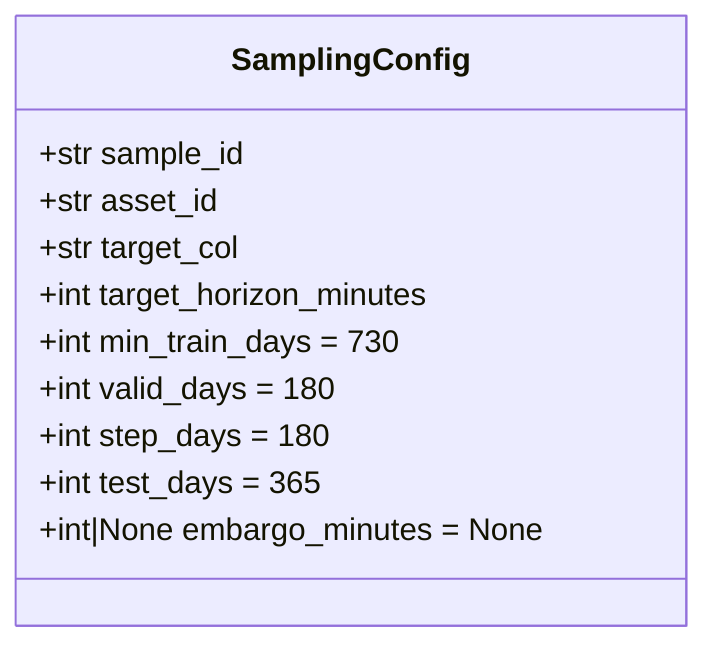

# 3110 — SamplingConfig

Immutable dataclass, amely az összes paramétert tartalmazza egy time-based CV sample
generálásához. Forrás: [sampling/config.py](../src/modeling/quantitative/sampling/config.py)

---

## Overview



---

## Mezők

| Mező | Típus | Default | Leírás |
|------|-------|---------|--------|
| `sample_id` | `str` | — | Egyedi azonosító; ez lesz a `samples/` alkönyvtár neve |
| `asset_id` | `str` | — | Asset kulcs a `config/assets.json`-ból (pl. `solusdt`) |
| `target_col` | `str` | — | Target oszlop neve (pl. `trg_l_fw60_q90`) |
| `target_horizon_minutes` | `int` | — | Forward-return ablak percben; embargó fallback értéke |
| `min_train_days` | `int` | `730` | Első training fold minimális hossza naptári napban |
| `valid_days` | `int` | `180` | Validációs ablak hossza naptári napban |
| `step_days` | `int` | `180` | Egymást követő fold-ok közti lépés naptári napban |
| `test_days` | `int` | `365` | Végső holdout ablak hossza naptári napban |
| `embargo_minutes` | `int \| None` | `None` | Embargó gap train→valid között; `None` → `target_horizon_minutes` értéke |

### `embargo_minutes` None-szemantikája

Ha `embargo_minutes` értéke `None`, a `create_sample` orchestrator automatikusan
a `target_horizon_minutes` értékét használja fallback-ként:

```python
embargo_minutes = config.embargo_minutes or config.target_horizon_minutes
```

Ez biztosítja, hogy az embargó legalább akkora legyen, mint a target kiszámításához
felhasznált előre néző ablak — megakadályozva az adatszivárgást.

---

## Példa inicializálás

```python
from modeling.quantitative.sampling import SamplingConfig

config = SamplingConfig(
    sample_id              = "solusdt_fw60_v1",
    asset_id               = "solusdt",
    target_col             = "trg_l_fw60_q90",
    target_horizon_minutes = 60,
    min_train_days         = 730,
    valid_days             = 180,
    step_days              = 180,
    test_days              = 365,
    # embargo_minutes=None → 60 perc lesz az embargo
)
```

A `frozen=True` miatt a dataclass példányosítás után nem módosítható — minden
paraméter-változtatáshoz új `SamplingConfig` példányt kell létrehozni.
