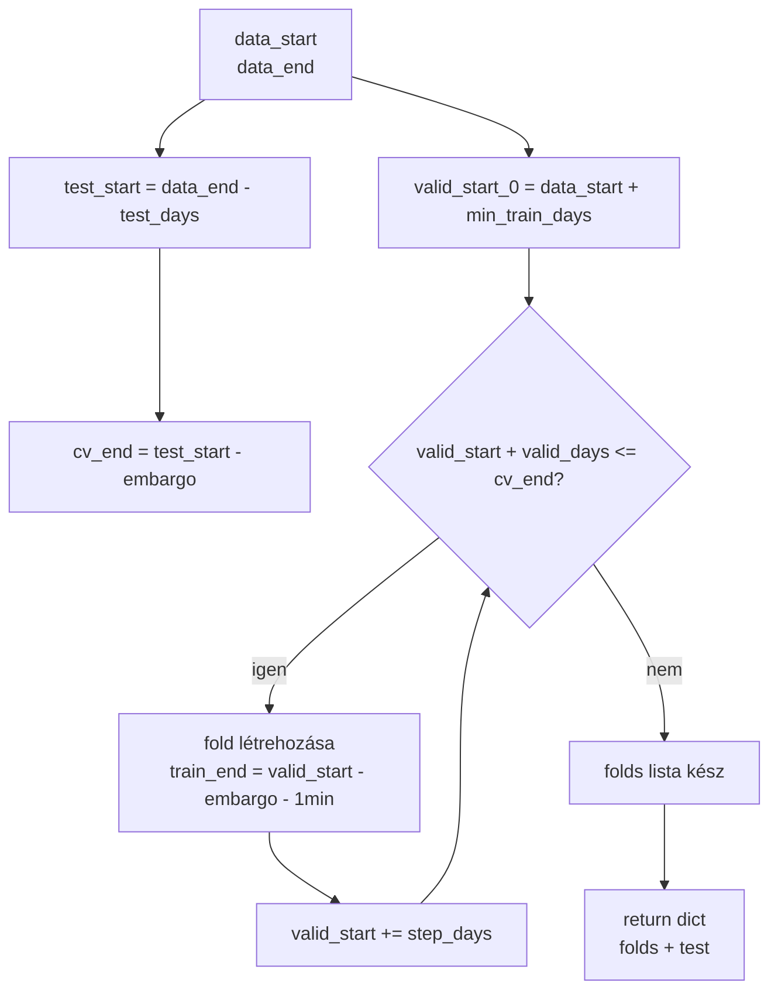
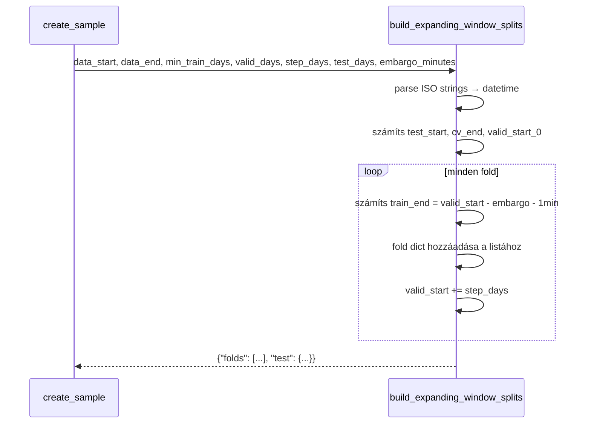

# 3120 — Expanding Window Splits

Pure date-math modul: nincs IO, nincs adatbázis-hozzáférés, nincs projekt-import.
Bemenete és kimenete `YYYY-MM-DD HH:MM:SS` formátumú stringek.
Forrás: [sampling/splits.py](../src/modeling/quantitative/sampling/splits.py)

---

## Overview



---

## `build_expanding_window_splits()`

Expanding training ablakokat generál fix hosszú validációs ablakokkal és egy végső
test set-tel.

| Paraméter | Típus | Leírás |
|-----------|-------|--------|
| `data_start` | `str` | Legkorábbi felhasználható timestamp (`YYYY-MM-DD HH:MM:SS`) |
| `data_end` | `str` | Utolsó címkézett timestamp |
| `min_train_days` | `int` | Minimális training ablak naptári napban |
| `valid_days` | `int` | Validációs ablak hossza naptári napban |
| `step_days` | `int` | Egymást követő fold-ok közti lépés napban |
| `test_days` | `int` | Végső holdout ablak hossza napban |
| `embargo_minutes` | `int \| None` | Embargó percben; `None` → 0 perc (nincs gap) |



### Return dict struktúra

```json
{
  "folds": [
    {
      "fold": 1,
      "train_start": "2021-01-01 00:00:00",
      "train_end":   "2022-12-31 22:59:00",
      "valid_start": "2022-12-31 23:00:00",
      "valid_end":   "2023-06-29 23:59:00"
    }
  ],
  "test": {
    "start": "2024-01-01 00:00:00",
    "end":   "2024-12-31 23:59:00"
  }
}
```

Minden fold mezői:

| Mező | Leírás |
|------|--------|
| `fold` | 1-indexelt fold sorszám |
| `train_start` | Mindig `data_start` — az expanding window nem változtatja |
| `train_end` | `valid_start - embargo - 1 perc` |
| `valid_start` | Aktuális fold validációs ablakának kezdete |
| `valid_end` | `valid_start + valid_days - 1 perc` |

### Embargo logika

Az embargo gap biztosítja, hogy a training set utolsó példányai és a validation set
első példányai között legalább `embargo_minutes` perc kihagyás legyen:

```
train_end = valid_start - embargo_td - 1 minute
```

Ez kizárja a forward-return ablak által érintett perceket a validációból, megakadályozva
az adatszivárgást ahol egy feature a target kiszámításához felhasznált jövőbeli
adatot is tartalmaz.

### ValueError feltételek

| Feltétel | Hibaüzenet |
|----------|------------|
| `data_end <= data_start` | `"data_end must be after data_start"` |
| Egy fold sem generálható | `"No folds generated. Reduce min_train_days, valid_days, or test_days."` |
