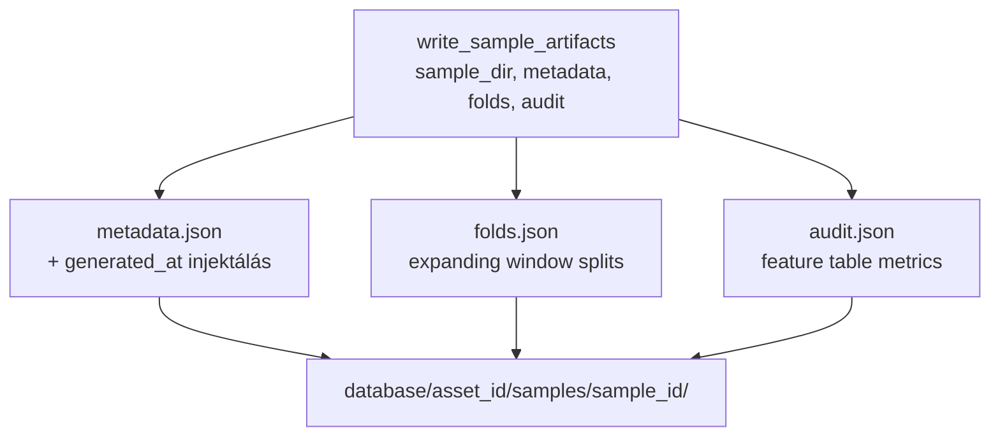
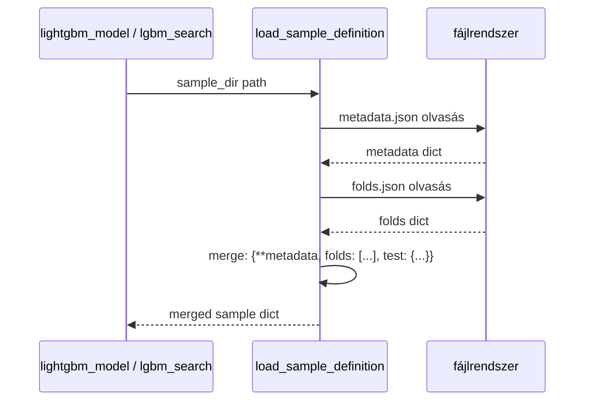

# 3140 — Sampling Artifacts

Artifact IO modul: három JSON fájlt ír, olvas be és validál. Nincs pandas import —
stdlib only (`json`, `pathlib`, `datetime`).
Forrás: [sampling/artifacts.py](../src/modeling/quantitative/sampling/artifacts.py)

---

## Overview



---

## `write_sample_artifacts()`

Kiírja a három JSON fájlt a sample könyvtárba. Automatikusan létrehozza a könyvtárat
ha nem létezik.

| Paraméter | Típus | Leírás |
|-----------|-------|--------|
| `sample_dir` | `Path` | Célkönyvtár (létrehozza ha nincs) |
| `metadata` | `dict` | Sample metadata (sample_id, asset_id, paraméterek, adathatárok, …) |
| `folds` | `dict` | `build_expanding_window_splits` kimenete — `{"folds": [...], "test": {...}}` |
| `audit` | `dict` | `audit_feature_table` kimenete |

**`generated_at` injektálás:** a `metadata` dict-be automatikusan bekerül az
aktuális UTC ISO timestamp mielőtt kiíródna — a hívónak nem kell ezt megadni.

```python
meta_out = {
    **metadata,
    "generated_at": datetime.now(UTC).isoformat(),
}
```

---

## `load_sample_definition()`

Beolvassa a sample definíciót az artifact könyvtárból. Egyesíti a `metadata.json`
és `folds.json` tartalmát egyetlen dict-be.



### Return dict struktúra

A merged dict kulcsai, amelyeket a `lightgbm_model` és `lgbm_search` vár:

| Kulcs | Forrás | Leírás |
|-------|--------|--------|
| `sample_id` | metadata | Egyedi azonosító |
| `asset_id` | metadata | Asset kulcs |
| `target_col` | metadata | Target oszlop neve |
| `data.start` | metadata | Biztonságos adatkezdés |
| `data.end` | metadata | Biztonságos adatvég |
| `n_folds` | metadata | Fold-ok száma |
| `parameters` | metadata | Összes sampling paraméter |
| `folds` | folds.json | Lista fold dict-ekből |
| `test` | folds.json | `{"start": ..., "end": ...}` |

**Raises:** `FileNotFoundError` ha a `metadata.json` vagy `folds.json` hiányzik.

---

## `validate_sample_definition()`

Ellenőrzi a folds és test range kronológiai sorrendjét és átfedés-mentességét.

| Ellenőrzés | Feltétel | Hiba |
|------------|----------|------|
| Test range | `test_end > test_start` | `"Test end must be after test start"` |
| Fold sorrend | `train_start < train_end < valid_start < valid_end < test_start` | `"Invalid or overlapping fold: {fold}"` |

---

## A három JSON fájl sémája

### `metadata.json`

```json
{
  "sample_id": "solusdt_fw60_v1",
  "asset_id": "solusdt",
  "target_col": "trg_l_fw60_q90",
  "target_horizon_minutes": 60,
  "split_type": "expanding_window",
  "embargo_minutes": 60,
  "data": { "start": "2021-06-01 00:00:00", "end": "2024-11-30 23:59:00" },
  "parameters": {
    "min_train_days": 730,
    "valid_days": 180,
    "step_days": 180,
    "test_days": 365
  },
  "n_folds": 5,
  "source": {
    "db_relative_path": "database/solusdt/solusdt.duckdb",
    "feature_table": "feat_ohlcv_quant",
    "target_table": "target"
  },
  "generated_at": "2024-12-01T10:00:00+00:00"
}
```

### `folds.json`

```json
{
  "folds": [
    {
      "fold": 1,
      "train_start": "2021-06-01 00:00:00",
      "train_end":   "2023-05-31 23:00:00",
      "valid_start": "2023-06-01 00:00:00",
      "valid_end":   "2023-11-29 23:59:00"
    }
  ],
  "test": {
    "start": "2023-12-01 00:00:00",
    "end":   "2024-11-30 23:59:00"
  }
}
```

### `audit.json`

```json
{
  "data_start_safe": "2021-06-01 00:00:00",
  "data_end_safe": "2024-11-30 23:59:00",
  "row_count": 1814400,
  "unique_timestamps": 1814400,
  "duplicate_count": 0,
  "target_null_count": 60,
  "feature_null_summary": { "feat_rsi_14": 0.0, "feat_vol_200": 0.0 },
  "gap_count": 3,
  "gap_minutes_total": 12
}
```
