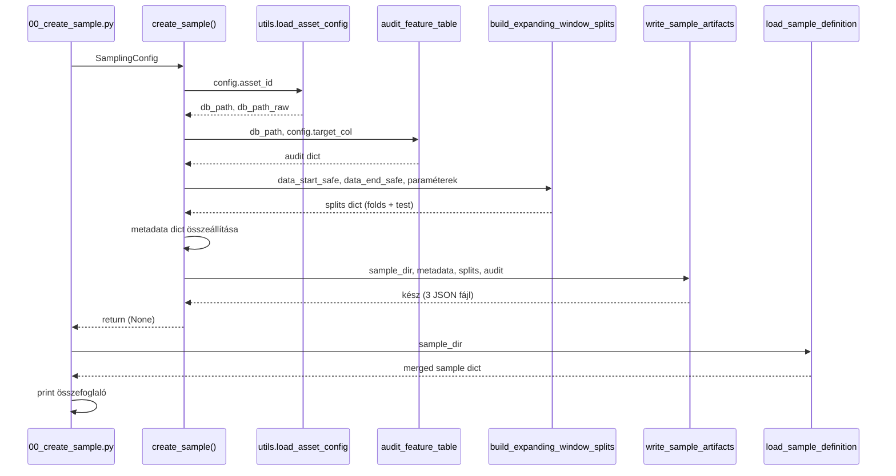

# 3150 — create_sample Orchestrator és CLI

A sampling orchestrator összefogja az audit → splits → write lépéseket egyetlen
`create_sample(config)` hívásba. Csak ez a modul importálja a `utils`-t — az
altmodulok (audit, splits, artifacts) projekt-agnosztikusak.

Forrás:
- [sampling/create_sample.py](../src/modeling/quantitative/sampling/create_sample.py)
- [00_create_sample.py](../src/modeling/quantitative/00_create_sample.py)

---

## Overview



---

## `create_sample(config)`

Generál és perzisztál egy time-based CV sample definíciót a megadott konfigurációhoz.

| Paraméter | Típus | Leírás |
|-----------|-------|--------|
| `config` | `SamplingConfig` | Frozen dataclass az összes paraméterrel |

### Lépések

1. **Útvonalak feloldása** — `utils.load_asset_config(asset_id)` hívja be a
   `db_path`-t a `config/assets.json`-ból; a `sample_dir` a
   `database/<asset_id>/samples/<sample_id>/` path lesz
2. **Embargó feloldása** — `embargo_minutes = config.embargo_minutes or config.target_horizon_minutes`
3. **Audit futtatása** — `audit_feature_table(db_path, target_col)` meghatározza
   a biztonságos határokat
4. **Splits generálása** — `build_expanding_window_splits(...)` a safe boundary-k alapján
5. **Metadata összeállítása** — `sample_id`, `asset_id`, `target_col`, `split_type`,
   `embargo_minutes`, `data.start/end`, `parameters`, `n_folds`, `source`
6. **Kiírás** — `write_sample_artifacts(sample_dir, metadata, splits, audit)`

**Miért csak itt van `utils` import?** Az audit, splits, és artifacts modulok
szándékosan projekt-agnosztikusak — tesztelhetők és újrafelhasználhatók projekt
kontextus nélkül. Csak az orchestrator ismeri a projekt-specifikus path-konvenciókat.

**Raises:**
- `ValueError` ha a safe data boundaries nem meghatározhatók (üres feature/target tábla)

---

## CLI — `00_create_sample.py`

### Argumentumok

| Argument | Kötelező | Default | Leírás |
|----------|----------|---------|--------|
| `--sample-id` | igen | — | Egyedi sample azonosító |
| `--asset-id` | igen | — | Asset kulcs (`config/assets.json`-ból) |
| `--target-col` | igen | — | Target oszlop neve |
| `--target-horizon-minutes` | igen | — | Forward-return ablak percben |
| `--min-train-days` | nem | `730` | Minimális training ablak napban |
| `--valid-days` | nem | `180` | Validációs ablak napban |
| `--step-days` | nem | `180` | Fold lépés napban |
| `--test-days` | nem | `365` | Holdout ablak napban |
| `--embargo-minutes` | nem | `None` | Embargó percben (default: target-horizon) |

### Példa CLI hívás

```bash
uv run src/modeling/quantitative/00_create_sample.py \
  --sample-id solusdt_fw60_v1 \
  --asset-id solusdt \
  --target-col trg_l_fw60_q90 \
  --target-horizon-minutes 60 \
  --min-train-days 730 \
  --valid-days 180 \
  --step-days 180 \
  --test-days 365
```

### Output summary

Sikeres futás után a CLI három sort nyomtat:

```
OK: Sample created at database/solusdt/samples/solusdt_fw60_v1
    n_folds        = 5
    data_start_safe= 2021-06-01 00:00:00
    data_end_safe  = 2024-11-30 23:59:00
```
