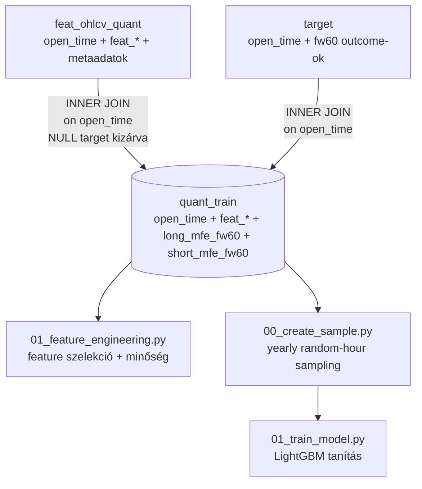
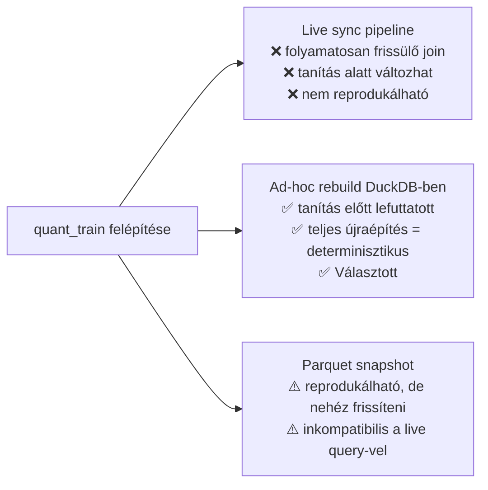
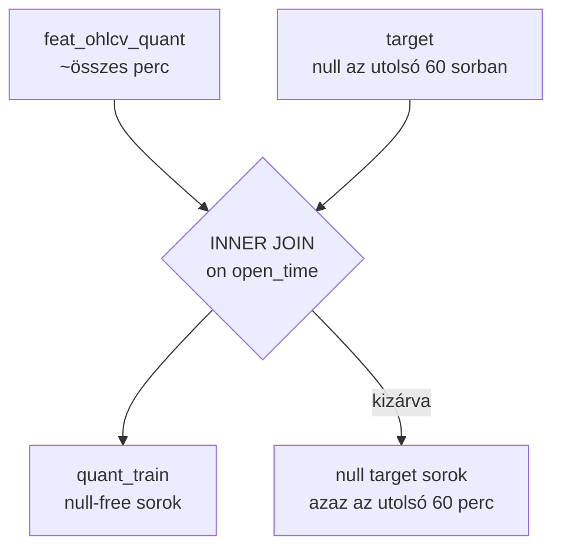
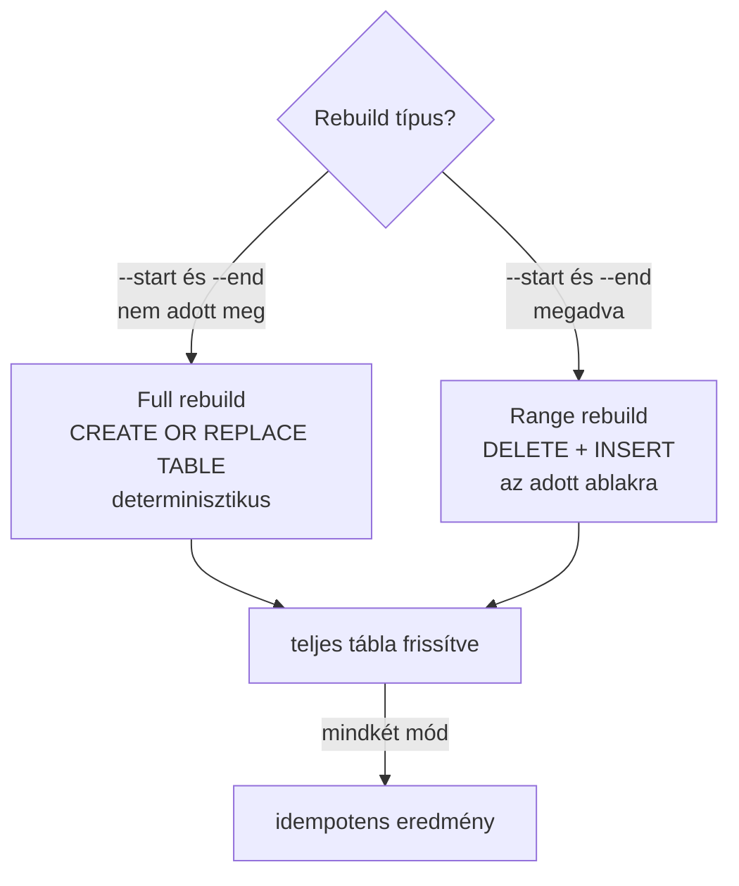

# 4000 — quant_train Table

A `quant_train` tábla a modeling pipeline egyetlen stabil belépési pontja: a `feat_ohlcv_quant` és a `target` tábla INNER JOIN-jából épül fel, és kizárólag ad-hoc rebuild-del frissül — soha nem a live sync pipeline részént.

---

## Overview

A `quant_train` kizárja az `available_ts`, `lookback_end_ts`, `close`, és minden auxiliary fw60 oszlopot — csak a `feat_*` prefix és a két elsődleges target kerül bele.

**Kód referencia:** [`_doc_/4100_quant_train.md`](_doc_/4100_quant_train.md)
**Implementáció:** [`src/data_handling/sync_tables/sync_quant_train.py`](src/data_handling/sync_tables/sync_quant_train.py)
**CLI:** `uv run python src/data_handling/03_build_quant_train.py [--start YYYY-MM-DD] [--end YYYY-MM-DD]`

---

## Üzleti és módszertani háttér

### Miért kritikus ez a lépés?

A `quant_train` az ML pipeline egyetlen handoff-pontja az adat-réteg és a modellező réteg között. Ha ez a tábla sérült (pl. NULL targeteket tartalmaz, vagy hiányzó feature oszlopai vannak), az összes downstream munka — feature engineering, sampling, LightGBM tanítás — helytelen vagy félrevezető eredményt ad, és a hiba az outputban (model.pkl, sample_oos.parquet) jelenik meg, nem a tanításban.

A NULL target sorok kizárása ezen a szinten kritikus: ha az utolsó 60 sor (ahol nincs elegendő forward data) bekerülne a tanítóba, a modell `0`-ként tanulná meg ezeket, holott ezek ismeretlen állapotú sorok.

### Miért ezt a megközelítést?

| Megközelítés | Előny | Hátrány | Státusz |
|---|---|---|---|
| Ad-hoc DuckDB rebuild (jelenlegi) | Determinisztikus, lekérdezhető, frissíthető range-rebuild-del | Manuálisan kell futtatni tanítás előtt | ✅ Választott |
| Live sync pipeline | Mindig aktuális | Tanítás alatt változhat → nem reprodukálható; overhead minden sync-nél | ❌ Elvetett — pipeline inkonzisztencia kockázata |
| Parquet snapshot | Reprodukálható snapshot | Nem frissíthető inkrementálisan; DuckDB query nem tud rá csatlakozni | ⚠️ Csak archív célra |

### INNER JOIN szemantika: miért nem LEFT JOIN?

Az INNER JOIN dupla védelmet nyújt:
1. Csak azok a sorok kerülnek be, ahol a target tábla row-ja létezik
2. A `WHERE long_mfe_fw60 IS NOT NULL AND short_mfe_fw60 IS NOT NULL` feltétel kizárja a NULL forward outcome-okat

LEFT JOIN esetén NULL targetű sorok bekerülnének, és a dataset loadernek minden betöltésnél kellene szűrni — ez hibalehetőség, és a NULL-ok véletlenül 0-vá imputálódhatnának.

### Full vs. Range rebuild: mikor melyik?

| Mód | Mikor | SQL |
|-----|-------|-----|
| **Full rebuild** | Első feltöltés, teljes újraépítés, schema változás után | `CREATE OR REPLACE TABLE quant_train AS SELECT ...` |
| **Range rebuild** | Inkrementális frissítés (pl. új OHLCV adat érkezett) | `DELETE ... WHERE open_time BETWEEN start AND end` + `INSERT INTO ...` |

Mindkét mód **idempotens** — biztonságos többszöri futtatásra.

### Kizárt oszlopok: miért nem kerül be az összes?

A `quant_train` szándékosan szűk scope-ú:

| Kizárt oszlop | Forrás | Miért kizárt |
|---|---|---|
| `close` | feat_ohlcv_quant | Nem feature — árszint, non-stacionárius; nem kell a modellnek |
| `available_ts`, `lookback_end_ts` | feat_ohlcv_quant | Metadata — sampling és pipeline kontroll, nem ML input |
| `fw60_close`, `fw60_max`, `fw60_min`, stb. | target | Auxiliary outcome-ok — csak `long_mfe_fw60` és `short_mfe_fw60` az aktív target |
| `long_pred`, `short_pred` | predictions | Predikciók nem kerülhetnek vissza tanítóba — feedback loop |

### Paraméter alapértékek és indoklásuk

| Paraméter | Érték | Indoklás |
|---|---|---|
| Target oszlopok | `long_mfe_fw60`, `short_mfe_fw60` | Aktív fw60 logreturn target páros a v4 modellekhez; bővítés esetén új rebuild szükséges |
| NULL szűrés | `IS NOT NULL` mindkét targetre | Védi a modellt a forward-edge soroktól; soha ne imputálj 0-val |
| Rebuild mód default | Full rebuild | Biztonságos és determinisztikus; range rebuild csak ha tanítás-előtti inkrementális frissítés szükséges |
| DuckDB táblanév | `quant_train` | Fix — a downstream pipeline (sampling, training) erre a névre hivatkozik |

### Ismert kockázatok és korlátok

| Kockázat | Tünet | Mitigáció |
|---|---|---|
| Stale tábla (nem rebuild-elt tanítás előtt) | Hiányzó legfrissebb adatok; model training régi datán tanul | Kötelező futtatni a `03_build_quant_train.py`-t tanítás előtt — checklist pontja |
| Schema drift (új feature oszlop `feat_ohlcv_quant`-ban) | Hiányzó feature oszlop a `quant_train`-ben | Full rebuild kötelező ha `sync_features` megváltozott |
| Range rebuild időablak túl szűk | Overlap az INNER JOIN-nal, NULL sorok maradnak | Rebuild a target sync teljes tartományán futtasd, ne csak az OHLCV tartományán |
| `feat_ohlcv_quant` és `target` eltérő adathatárok | Kevesebb sor a quant_train-ben mint várható | Ellenőrizd mindkét tábla `MAX(open_time)`-ját; futtasd mindkét sync-et az újraépítés előtt |
| `quant_train` vs `sample_<id>` DuckDB tábla konfúzió | A `sample_<id>` tábla a sampling materializálása, nem a `quant_train` | Soha ne olvasd a `sample_<id>` táblát közvetlenül training célra — az orchestrator tölti be |

### Validációs checklist

- [ ] `quant_train` tábla létezik: `SHOW TABLES` tartalmazza
- [ ] `SELECT COUNT(*) FROM quant_train WHERE long_mfe_fw60 IS NULL` → 0 (nincs NULL target)
- [ ] `SELECT COUNT(*) FROM quant_train WHERE short_mfe_fw60 IS NULL` → 0
- [ ] `SELECT MAX(open_time) FROM quant_train` ≥ `SELECT MAX(open_time) FROM target WHERE long_mfe_fw60 IS NOT NULL` − 1 perc
- [ ] Oszlopok: `open_time`, összes `feat_*`, `long_mfe_fw60`, `short_mfe_fw60` — semmi más (pl. `close`, `available_ts`, `trg_*`)
- [ ] Rebuild futott le a legutóbbi `sync_features` és `sync_targets` után
- [ ] `DESCRIBE quant_train` feat_ oszlopszáma megegyezik `feat_ohlcv_quant`-éval

---

## Alfejezetek

| Szám | Fájl | Tartalom |
|------|------|----------|
| 4100 | [4100_quant_train.md](4100_quant_train.md) | Részletes séma, rebuild szemantika, CLI referencia |
