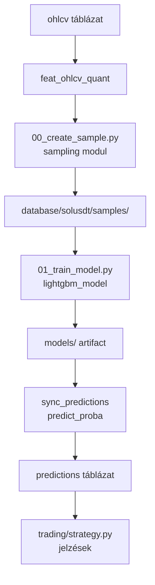

# 5000 — Modeling

A modeling domain a ChronoQuant ML pipeline szíve: nyers OHLCV adatokból valószínűségi
kereskedési jelzéseket állít elő LightGBM bináris osztályozókkal.

---

## Overview

A pipeline öt lépésből áll: feature számítás → sample definíció → modell tanítás →
predikció szinkronizálás → kereskedési jelzések. Minden lépés idempotens és
önállóan újrafuttatható.

---

## Aktív modellek (v4)

| Model ID | Irány | Target |
|----------|-------|--------|
| `lgbm_solusdt_l_fw60_q90_local_v4` | Long | `long_mfe_fw60` |
| `lgbm_solusdt_s_fw60_q10_local_v4` | Short | `short_mfe_fw60` |

- **Target szemantika:** `fw60` = 60-perces forward ablak (`t+1..t+60`); `long_mfe_fw60` = log(max future close / close[t]); `short_mfe_fw60` = log(min future close / close[t])
- **Feature prefix:** `feat_` | **Target oszlopok:** `long_mfe_fw60`, `short_mfe_fw60`
- **t-1 lag kötelező** minden feature-ön tanítás előtt

---

## Fejezetek

| Szám | Fájl | Tartalom | Szint | Állapot |
|------|------|----------|-------|---------|
| 5010 | [5010_sampling_yearly.md](5010_sampling_yearly.md) | Yearly random-hour sampling — teljes metodológia | X100 | kész |
| 5100 | [5100_sampling_config.md](5100_sampling_config.md) | YearlySamplingConfig dataclass | X110 | kész |
| 5200 | [5200_sampling_artifacts.md](5200_sampling_artifacts.md) | write_yearly_artifacts / load_yearly_sample | X110 | kész |
| 5300 | [5300_create_sample.md](5300_create_sample.md) | create_yearly_sample orchestrator + CLI | X110 | kész |
| 2000 | [2000_features.md](2000_features.md) | Feature layer metodológia (208 feat, 25 csoport) | X100 | kész |
| 2010 | [2010_feature_engineering.md](2010_feature_engineering.md) | Feature selection — quality, target relation, redundancy, stability | X100 | kész |
| 3000 | [3000_targets.md](3000_targets.md) | Target layer metodológia (fw60 logreturn outcome-ok) | X100 | kész |
| 4000 | [4000_quant_train.md](4000_quant_train.md) | quant_train table — INNER JOIN handoff, rebuild szemantika | X100 | kész |
| 5500 | [5500_hyper_param_search.md](5500_hyper_param_search.md) | LightGBM hyperparameter search — yearly sample, Optuna TPE, CV | X100 | kész |
| — | — | Evaluation / backtest | X100 | tervezett |
| — | — | Elliott waves (kutatás, izolált) | X100 | tervezett |
| 5400 | [5400_sampling.md](5400_sampling.md) | **ARCHÍV** — expanding window CV (nem aktív) | archív | archív |
| 5410 | [5410_sampling_splits.md](5410_sampling_splits.md) | **ARCHÍV** — expanding window splits | archív | archív |
| 5420 | [5420_sampling_audit.md](5420_sampling_audit.md) | **ARCHÍV** — feature table audit | archív | archív |
