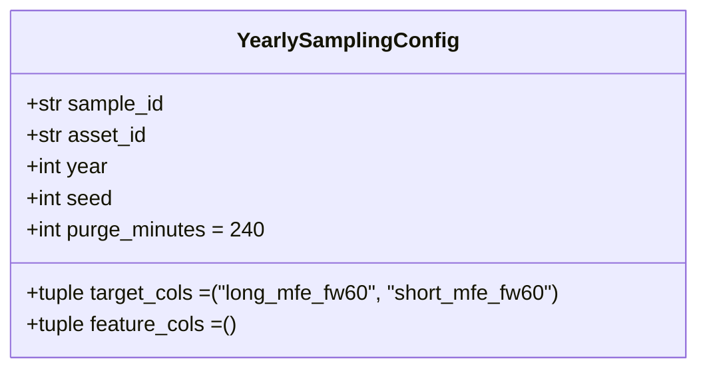

# 5100 — YearlySamplingConfig

Immutable dataclass, amely az összes paramétert tartalmazza egy éves random-óra sample
generálásához. Forrás: [sampling/config.py](../src/modeling/sampling/config.py)

---

## Overview



---

## Mezők

| Mező | Típus | Default | Leírás |
|------|-------|---------|--------|
| `sample_id` | `str` | — | Egyedi azonosító; ez lesz a `samples/` alkönyvtár neve |
| `asset_id` | `str` | — | Asset kulcs a `config/assets.json`-ból (pl. `solusdt`) |
| `year` | `int` | — | Naptári év, amelyből a sample készül (pl. `2021`) |
| `seed` | `int` | — | Véletlenszám-generátor seedje; minden óra- és hétválasztás ebből származik |
| `purge_minutes` | `int` | `240` | Purge zóna szélessége percben minden validációs hét határán |
| `target_cols` | `tuple[str, ...]` | `("long_mfe_fw60", "short_mfe_fw60")` | Target oszlopok, amelyek a sample_train_valid.parquet-be kerülnek |
| `feature_cols` | `tuple[str, ...]` | `()` | Feature oszlopok; üres tuple = minden `feat_*` auto-discovery futásidőben |

### `purge_minutes` default indoklása

A `feat_ohlcv_quant`-ban a leghosszabb rolling ablak 140 bar (= 140 perc 1m chart-on).
A 240 perces default ~71%-os biztonsági margót ad, hogy a jövőbeli feature-bővítések
is biztonságban legyenek purge csökkentés nélkül.

### `feature_cols` üres tuple szemantikája

Ha `feature_cols` üres, a `create_yearly_sample` orchestrator futásidőben felfedezi
az összes `feat_*` oszlopot a `quant_train` sémájából — ez az ajánlott működési mód.
Explicit lista csak akkor szükséges, ha feature-szelekcióval korlátozott sample kell.

---

## Példa inicializálás

```python
from modeling.sampling.config import YearlySamplingConfig

config = YearlySamplingConfig(
    sample_id = "solusdt_fw60_yearly_2021",
    asset_id  = "solusdt",
    year      = 2021,
    seed      = 42 + 2021,   # 2063
)
```

A `frozen=True` miatt a dataclass példányosítás után nem módosítható — minden
paraméter-változtatáshoz új `YearlySamplingConfig` példányt kell létrehozni.

---

## Kapcsolódó fájlok

| Fájl | Tartalom |
|------|----------|
| [5010_sampling_yearly.md](5010_sampling_yearly.md) | Yearly sampling teljes metodológiája |
| [5300_create_sample.md](5300_create_sample.md) | create_yearly_sample orchestrator és CLI |
