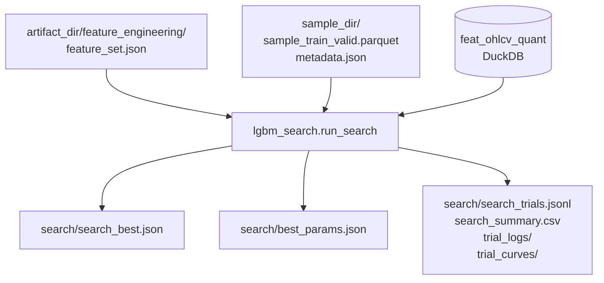

# 5500 — LightGBM Hyperparameter Search

A hyperparameter search az éves sample és a feature_engineering kimenete alapján
keresi az optimális LightGBM modell paraméterkészletet. Optuna TPE (vagy seeded
random fallback) alapú keresés, stability-penalized RMSE célértékkel.

---

## Overview



**Entry point:**
```bash
uv run python src/modeling/02_hyper_param_search.py --model lgbm_solusdt_l_fw60_2021 --stage smoke
uv run python src/modeling/pipeline.py --model lgbm_solusdt_l_fw60_2021 --step search --stage explore
```

---

## Input

| Forrás | Tartalom | Hogyan töltődik be |
|--------|----------|-------------------|
| `artifact_dir/feature_engineering/feature_set.json` | `selected` lista — a feature engineering által kiválasztott feature-ök | `_load_feature_cols(artifact_dir)` |
| `sample_dir/sample_train_valid.parquet` | `open_time`, `segment`, `target_col` — az éves hourly sample | `load_yearly_sample` + polars |
| `sample_dir/metadata.json` | `selected_valid_weeks` (12 hét), `year` | `load_yearly_sample` |
| DuckDB `feat_ohlcv_quant` | Feature értékek az adott évre | `query_range_pl` |

**Fontos:** a search **kizárólag** a `feature_set.json["selected"]` listán szereplő
feature-öket használja — nem fut újabb feature auditet, nem hasznal hardcoded listát.

---

## Target

A `long_mfe_fw60` és `short_mfe_fw60` target oszlopok folytonos értékek (log-return).
A search ezeket **közvetlenül** használja regressziós targetként — nincs binarizálás,
nincs percentilis küszöb.

| Model típus | Target oszlop | Modell típusa |
|------------|--------------|---------------|
| Long (`_l_`) | `long_mfe_fw60` | `LGBMRegressor` |
| Short (`_s_`) | `short_mfe_fw60` | `LGBMRegressor` |

A `long_mfe_fw60` értéke pozitív ha az ár felfelé ment (long kedvező); a
`short_mfe_fw60` értéke negatív ha az ár lefelé ment (short kedvező).

---

## CV struktúra

A CV a `metadata.json["selected_valid_weeks"]` alapján épül — 12 fold, hónaponként egy.

```
Fold 1: train=összes "train" szegmens sor  |  valid="2021-01-11"–"2021-01-17"
Fold 2: train=összes "train" szegmens sor  |  valid="2021-02-08"–"2021-02-14"
...
Fold 12: train=összes "train" szegmens sor |  valid="2021-12-13"–"2021-12-19"
```

**Kulcspont:** A training set minden foldban UGYANAZ — az összes `train` szegmens sor.
Ez szándékos: a random-hour yearly sampling már elvégezte a strukturális szeparációt
(purge zóna + segment assignment). A search feladata a generalizáció mérése 12
különböző validációs héten keresztül, nem a CV folds train-valid időbeli szeparációja.

**Purge sorok** (`segment == "purge"`) semmilyen foldba nem kerülnek be — sem train,
sem valid oldalra.

---

## Search Stages

| Stage | Trials | Folds | Célja |
|-------|--------|-------|-------|
| `smoke` | 5 | 2 | Pipeline sanity check — nem keresési eredmény |
| `explore` | 60 | mind (12) | Széles régió feltérképezés |
| `refine` | 30 | mind (12) | Legjobb régiók pontosítása |

A `row_stride` paraméter alapértéke **1** minden stage-nél (a sample már hourly
→ ~8 760 sor/év, nem szükséges tovább ritkulni). Manuálisan felülírható.

---

## Search Objective

A search az alábbi penalizált célfüggvényt minimalizálja (lower = better):

```
score = mean(valid_rmse)
      + 0.25 × std(valid_rmse)         # stabilitás penalizálás
      + 0.10 × max(0, gap - 0.03)      # overfitting penalizálás
```

ahol `gap = mean(valid_rmse) - mean(train_rmse)`.

**Miért stabilitást bünteti?** Egy magas variance-ű modell (jó néhány foldon, rossz
másokon) az éles kereskedésben megbízhatatlan. A std(valid_rmse) büntetés preferálja
a konzisztensen közepes modelleket az ingadozó jókkal szemben.

**Miért gap-et bünteti?** Egy 0.03-nál nagyobb train-valid rés overfittingre utal.
A gap penalizálás a regularizált, általánosítható megoldásokat kedvezi.

---

## Search Engine

| Elérhetőség | Engine | Megjegyzés |
|------------|--------|-----------|
| `optuna` csomag elérhető | **Optuna TPE** | Multivariate TPE, seed=42, 20 startup trial |
| `optuna` nem telepítve | Seeded random fallback | `np.random.default_rng(seed=42)`, crude TPE-guide a legjobb quartile alapján |

Az Optuna Sqlite-ba perzisztálja a study-t (`search/optuna_study.db`), így
megszakítás után folytatható (`--resume` nem szükséges — automatikus).

---

## Parameter Space

| Paraméter | Tér | Típus |
|-----------|-----|-------|
| `num_leaves` | [3, 63] (smoke: 31) | log-int |
| `max_depth` | {-1, 2, 3, 4, 5, 6, 8} | kategória |
| `min_child_samples` | [200, 8 000] | log-int |
| `min_child_weight` | [1e-4, 1e-1] | log-float |
| `min_split_gain` | 0 (20% valószínűség) vagy [1e-5, 0.1] | vegyes |
| `reg_alpha` | [1e-3, 10] | log-float |
| `reg_lambda` | [1, 100] | log-float |
| `subsample` | [0.45, 0.95] | uniform |
| `colsample_bytree` | [0.35, 0.95] | uniform |
| `learning_rate` | [0.005, 0.05] | log-float |
| `max_bin` | {63, 127} | kategória |
| `path_smooth` | [1e-3, 10] | log-float |
| `extra_trees` | {True, False} | kategória |

Rögzített (nem keresett): `objective=regression`, `metric=rmse`,
`n_estimators=3000`, `early_stopping=100`, `n_jobs=4`.

---

## Fold metrikák

| Metrika | Leírás |
|---------|--------|
| `rmse` | Root mean squared error — elsődleges optimalizálási metrika |
| `mae` | Mean absolute error — referencia metrika |

---

## Output Artifacts

| Fájl | Tartalom |
|------|----------|
| `search/search_best.json` | Teljes best trial rekord: params, metrics, fold summary |
| `search/best_params.json` | Csak a tunable paraméter dict — az ugyanazon `model_id` fit lépésének inputja |
| `search/search_trials.jsonl` | Compact rekord minden befejezett trialhoz |
| `search/search_summary.csv` | CSV: trial_no, objective_score, params_* — elemzéshez |
| `search/trial_logs/trial_NNNN.json` | Teljes trial rekord fold metricsekkel |
| `search/trial_curves/trial_NNNN_fold_MM.json` | LightGBM eval görbék (tömörítve) |
| `search/failed_trials.jsonl` | Hibás trialok logja |
| `search/optuna_study.db` | Optuna SQLite study (ha optuna telepítve) |

---

## Resume és Dedup

A search **automatikusan folytatható** — minden futtatás beolvassa az előző session
completed/failed hash-eit, és kihagyja a már látott paraméterkombinációkat.
`--retry-failed` flag újra lefuttatja a korábban hibás trialokat.

---

## Kapcsolódó fájlok

| Szám | Fájl | Tartalom |
|------|------|----------|
| 5000 | [5000_modelling.md](5000_modelling.md) | Modeling domain overview |
| 5010 | [5010_sampling_yearly.md](5010_sampling_yearly.md) | Yearly sample struktúra és selected_valid_weeks |
| 2010 | [2010_feature_engineering.md](2010_feature_engineering.md) | Feature selection — feature_set.json generálás |
