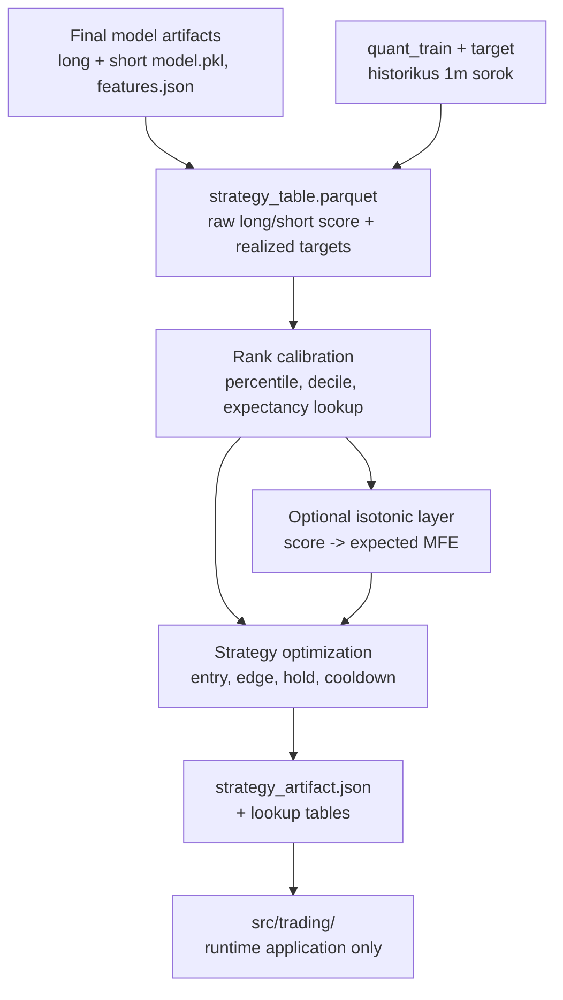
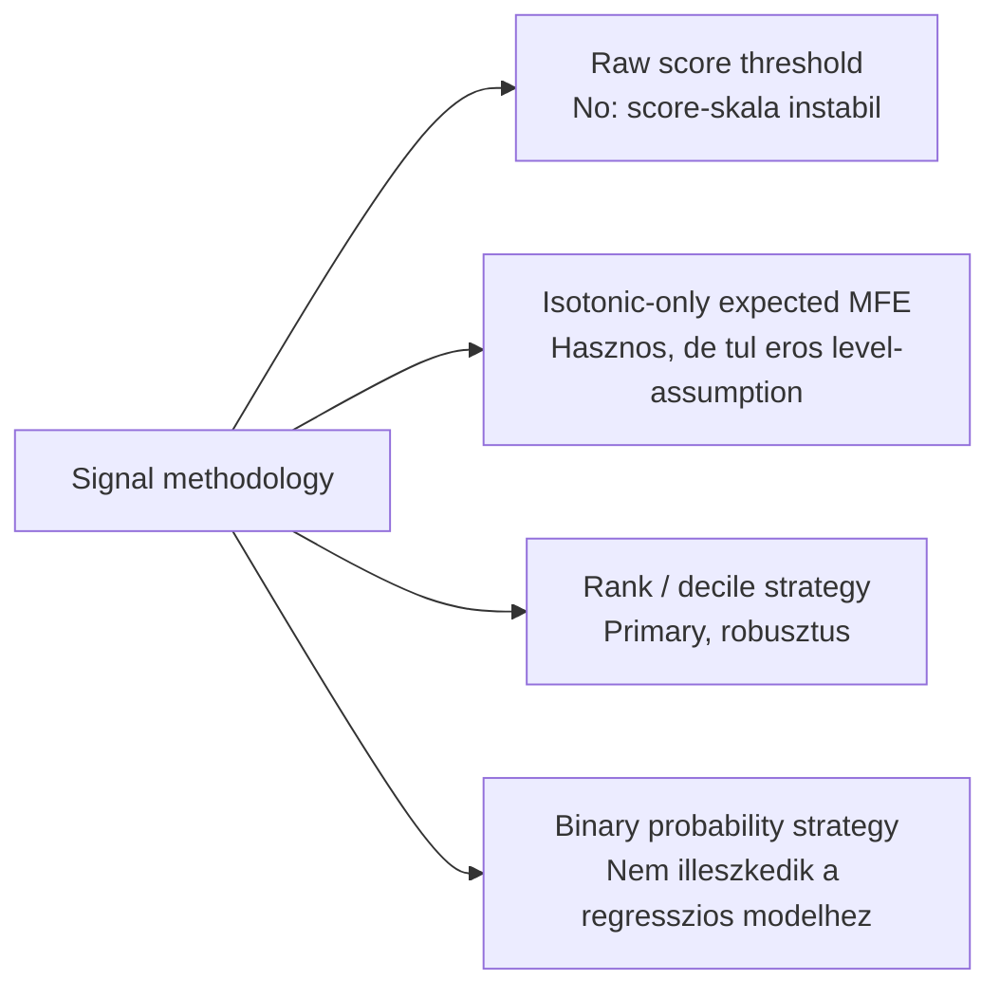
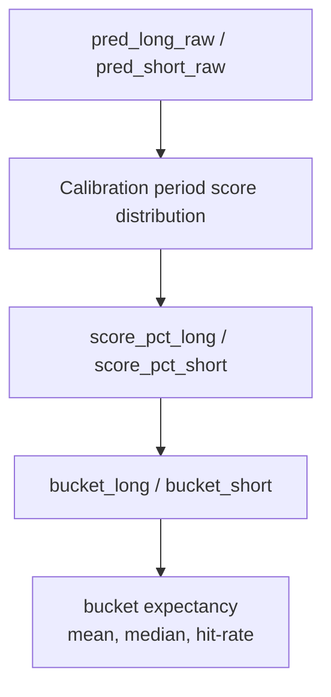
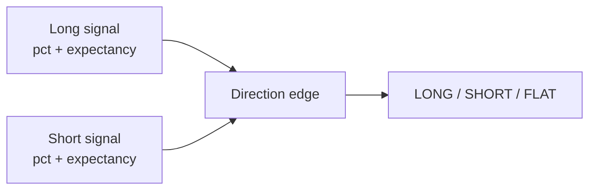
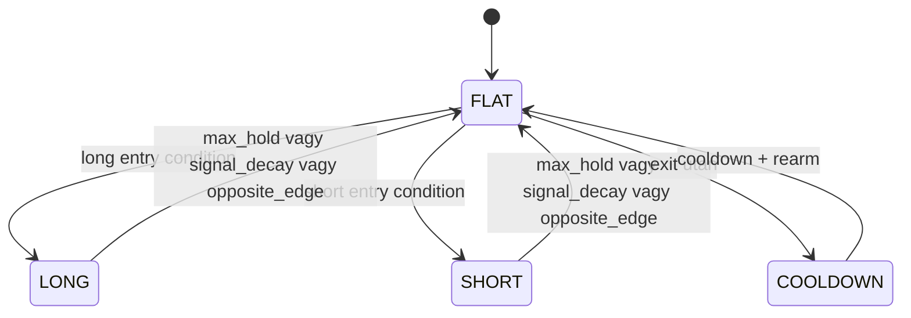

# 6000 - Strategy

A `src/strategy/` modul feladata, hogy a ket vegleges modell score-jaibol
kereskedheto, runtime-ban alkalmazhato strategiai szerzodest kepezzen.
Ez nem live execution reteg, hanem signal-to-strategy transzformacio:
raw model output -> rank / expectancy -> entry-exit szabalyok -> strategy artifact.

---

## Overview



Ez a fejezet csak a strategy metodologiat rogziti. A trading domain ennek
kesobbi alkalmazo retege: a strategy artifactot betolti, de nem tanul, nem
kalibral, es nem keres uj szabalyokat.

**Mukodesi mod:** a strategy session alapertelmezetten egyetlen, user altal megadott
idoszakon dolgozik. Ugyanarra az ablakra:

- lefuttatja a ket modellt;
- felepiti a `strategy_table`-t;
- elvegzi a calibrationt;
- lefuttatja a strategy parameter keresest;
- es ezen ugyanazon ablak metrikait menti az artifactba.

Ez praktikusan egy `same_window` kalibracio + optimalizacio futas. A riportalt
metrikak tehat nem fuggetlen holdout bizonyitekok, hanem az adott strategy session
ablakara vonatkozo fit/measure eredmenyek.

---

## Uzleti es modszertani hatter

### Miért kritikus ez a lépés?

A modellek jelenlegi minosege arra eleg eros, hogy a jobb es rosszabb
opportunity-ket sorba rendezze, de nem eleg eros arra, hogy a raw score-t
onmagaban abszolut kereskedesi jelenteskent kezeljuk. Ezen a ponton dol el,
hogy a modellekbol valodi strategia lesz-e, vagy csak score-thresholdolt
zajos signal.

Ha a strategy reteg rosszul van definialva, akkor:

- a long es short score-ok osszehasonlithatatlanok maradnak;
- az optimizer nem ugyanarra a viselkedesre keres, ami live-ban fut;
- a trading runtime olyan raw outputot kap, amelybol nem kovetkezik egyertelmu
  entry/exit dontes.

### Miért ezt a megközelítést?



| Megközelítés | Előny | Hátrány | Státusz |
|--------------|-------|---------|---------|
| Rank / decile first | Illeszkedik a modellek top-decile optimalizaciojahoz; stabilabb rezsimvaltasnal; konnyu long-short osszehasonlitas | Kulon calibration lookup kell | Valasztott |
| Isotonic-only expected MFE | Interpretalhato abszolut skala; hasznos secondary metric | Tulsagosan eros felteves, ha a modell inkabb rank-useful, mint level-accurate | Kiegeszito reteg |
| Raw score threshold | Egyszeru | Modellonkent mas skala; rossz transfer | Elvetett |
| Binary probability conversion | Ismeros trading nyelv | A regresszios targetet mestersegesen torzitja | Elvetett |

A javasolt strategy domain tehat **rank-first, artifact-driven**:

- a nyers score megmarad;
- ebbol strategy session soran percentile / decile besorolas keszul;
- a dontes primary inputja a relativ erosseg;
- az isotonic vagy mas expected-MFE calibration opcionálisan
  masodlagos interpretacios reteget adhat.

### Rank calibration: miért kell és hogyan működik?



A rank calibration feladata, hogy a raw model score-t egy olyan relativ skálára
tegye at, amely osszehasonlithato idoben es iranyok kozott.

Javasolt minimum outputok iranyonkent:

- `score_pct_long`, `score_pct_short`: a score helye a calibration period
  eloszlasaban;
- `bucket_long`, `bucket_short`: decilis vagy finomabb bucket;
- `bucket_mean_mfe_*`: az adott bucket historikus atlagos realized MFE-je;
- `bucket_hit_rate_*`: az adott bucketben milyen aranyban volt pozitiv excursion.

**Szabály:** entry dontest nem raw score alapjan hozunk, hanem a rankolt signal
es a hozza rendelt bucket-expectancy alapjan.

### Dual-direction edge: miért kell és hogyan működik?



Ket modell mellett nem eleg kulon long es kulon short thresholdot nezni.
A strategy domain feladata, hogy ugyanabban az idopontban megmondja:

- long az eros irany;
- short az eros irany;
- vagy egyik sem eleg eros, tehat flat.

Javasolt primary dontesi logika:

- long entry csak akkor, ha `score_pct_long >= long_entry_pct`;
- short entry csak akkor, ha `score_pct_short >= short_entry_pct`;
- ha mindketto aktiv, akkor a nagyobb **direction edge** nyer;
- ha az edge kulonbseg nem eri el a minimum gapet, akkor nincs trade.

Az edge lehet egyszeru vagy osszetett:

- egyszeru: `score_pct_long - score_pct_short`;
- jobb: `expected_mfe_long - expected_mfe_short`;
- legrobosztusabb: bucket expectancy + hit-rate kombinacio.

**Szabály:** hardcoded long priority helyett `highest_edge` konfliktuskezeles az
ajanlott alapertelmezett.

### Exit és tartási logika: miért kell és hogyan működik?



Ha a belepes rank-alapu, akkor a kilepes sem lehet csak nyers idolimit.
A javasolt exit-contract harom reszbol all:

1. **max_hold**: mindig van felso tartasi korlat;
2. **signal_decay**: zaras, ha a tartott irany percentile vagy expectancy ereje
   visszaesik;
3. **opposite_edge**: zaras, ha az ellenirany egyertelmuen dominanssa valik.

A cooldown es rearm nem optimalizacios zajcsokkento trukk, hanem a strategy
contract resze: ugyanazt a piacmozgast ne tradelje ujra a rendszer egymas utan.

**Szabály:** az offline optimizernek es a live runtime-nak ugyanazt a
state-machine szerzodest kell hasznalnia.

### Paraméter alapértékek és indoklásuk

| Paraméter | Alapérték | Indoklás |
|-----------|-----------|----------|
| `calibration_months` | `12` | Elegendo minta a stable score distributionhoz es bucket expectancyhez |
| `bucket_count` | `10` | A decilis nezet kozvetlenul illeszkedik a jelenlegi model review logikahoz |
| `long_entry_pct` | `0.90` | Csak a felso decilis legyen alapbol kereskedheto long oldalon |
| `short_entry_pct` | `0.90` | Szimmetrikus kiindulas short oldalon |
| `min_edge_gap` | `0.05` | Ne eleg legyen a kuszob atlepese; a nyertes irany legyen erdemben erosebb |
| `min_hold_minutes` | `5` | Azonnali visszafordulo zaj-trade-ek kiszurese |
| `max_hold_minutes` | `60-120` | Illeszkedik a `fw60` targethez; implementacioban sweepelendo tartomany |
| `cooldown_minutes` | `30-60` | Re-entry fekezese ugyanarra a mozgasra |
| `rearm_pct` | `0.60` | Ujra csak akkor legyen belepes, ha a signal visszahult a top zonabol |
| `use_isotonic_overlay` | `true` | Secondary interpretacio es sizing tamogatas, de nem primary entry input |

### Ismert kockázatok és korlátok

| Kockázat | Tünet | Mitigáció |
|----------|-------|-----------|
| Rezsimvaltas a calibration utan | A felso decilis varhato erteke a kovetkezo eloperiodusban szetesik | Rendszeres ujrafuttatas friss strategy ablakkal |
| Keves trade tul magas percentile kuszobnel | Szep expectancy, de tul alacsony mintaszam | Minimum trade penalty es tobb kuszobszint osszehasonlitasa |
| Decilis-hatar instabilitas | Kis score-valtozas bucket-valtast okoz | Percentile + simitott lookup, ne csak bucket ID alapjan dontsunk |
| Long/short aszimmetria | Azonos percentile mas minoseget jelent ket iranyban | Kulon iranyonkenti calibration es kulon lookup |
| Offline/live elteres | Backtest jo, live gyenge | Kozos decision contract es kozos strategy artifact mezok |
| Tul sok reteg az artifactban | Nehezen debuggolhato runtime | Egyszeru JSON contract + kulon lookup tabla + journal mezok |

### Validációs checklist

- [ ] A strategy session ugyanarra az idotartomanyra epiti a long es short raw score-okat
- [ ] A `strategy_table.parquet` tartalmazza a raw score-okat es a realized targeteket
- [ ] A calibration output tartalmaz rank/percentile mezoket iranyonkent
- [ ] A trading runtime ujrafitteles nelkul tudja alkalmazni a strategy artifactot
- [ ] A conflict rule explicit es tesztelt (`highest_edge` vagy mas vegleges szabaly)
- [ ] Az optimizer es a live state machine azonos entry/exit/cooldown logikat hasznal
- [ ] Az artifact explicit jeloli, hogy a riportolt metrikak `same_window` modban keszultek
- [ ] A riportolt metrikak neve megfelel a tenyleges szamitasnak

---

## Strategy Table Contract

A meglevo `strategy_table.parquet` irany jo alap. Ezt kell kiegesziteni a strategy
epicben olyan mezokkel, amelyek a runtime-ban is ujraalkalmazhatok.

Javasolt minimum schema:

```text
open_time
pred_long_raw
pred_short_raw
long_mfe_fw60
short_mfe_fw60
score_pct_long
score_pct_short
bucket_long
bucket_short
bucket_mean_mfe_long
bucket_mean_mfe_short
edge_long
edge_short
pred_long_cal
pred_short_cal
```

Az `edge_*` mezok lehetnek materializaltak a strategy table-ben, vagy runtime-ban
szamolhatok a lookup alapjan. A lenyeg, hogy a runtime ugyanazt a definiciot kapja.

---

## Perzisztencia és Runtime Alkalmazás

A strategy domain outputja maradjon artifact-alapu:

```text
artifacts/<session_id>/
  strategy_table.parquet
  strategy_artifact.json
  rank_lookup_long.parquet
  rank_lookup_short.parquet
  isotonic_long.pkl
  isotonic_short.pkl
  sweep_results.csv
```

Javasolt `strategy_artifact.json` minimum contract:

```json
{
  "session_id": "strategy_lgbm_solusdt_l_fw60_2101_2605__lgbm_solusdt_s_fw60_2101_2605__20260620",
  "long_model": "lgbm_solusdt_l_fw60_2101_2605",
  "short_model": "lgbm_solusdt_s_fw60_2101_2605",
  "signal_mode": "rank_first",
  "evaluation_mode": "same_window",
  "fit_period": {"start": "2025-05-01", "end": "2026-05-31"},
  "rank_lookup_long_path": "rank_lookup_long.parquet",
  "rank_lookup_short_path": "rank_lookup_short.parquet",
  "isotonic_long_path": "isotonic_long.pkl",
  "isotonic_short_path": "isotonic_short.pkl",
  "decision_params": {
    "long_entry_pct": 0.90,
    "short_entry_pct": 0.90,
    "min_edge_gap": 0.05,
    "min_hold_minutes": 5,
    "max_hold_minutes": 60,
    "cooldown_minutes": 45,
    "rearm_pct": 0.60,
    "conflict_rule": "highest_edge"
  }
}
```

Ez a forma jol illeszkedik a jelenlegi kodiranyhoz:

- a `src/strategy/` most is session artifactot epit;
- a `strategy_table.parquet` most is kozponti intermediate;
- a `strategy_artifact.json` mar most is a runtime contract csiraja.

Az ajanlott valtozas nem teljes iranyvaltas, hanem a strategy contract
megerositese: a trading ne raw score-thresholdokat kapjon, hanem
**strategiailag interpretalt lookupokat es dontesi parametereket**.
