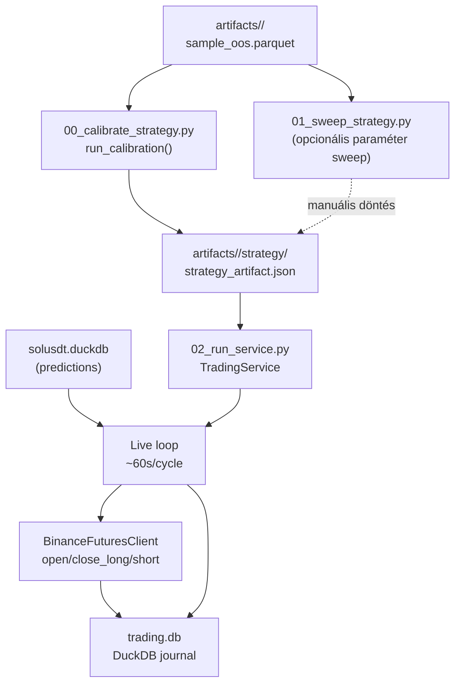

# src/trading/ — Trading Domain

A `src/trading/` modul feladata a kalibrált predikciós modellek alapján kereskedési stratégiák tesztelése, finomhangolása és élő futtatása. A calibration almodul az OOS predikciókból stratégia-artefaktumot állít elő; a live almodul ezt az artefaktumot felhasználva percenkénti ciklusban dönt, majd végrehajtja és naplózza a kereskedéseket.

---

## Adatfolyam



---

## Modul struktúra

```
src/trading/
├── calibration/
│   ├── backtest.py         load_oos_frame(), simulate_long/short, summarize_trades, write_backtest_report
│   ├── calibrate.py        run_calibration() orchestrátor
│   └── artifacts.py        write_strategy_artifact(), load_strategy_artifact()
├── live/
│   ├── service.py          TradingService — főciklus, life cycle
│   ├── exchange.py         BinanceFuturesClient — Binance Futures API wrapper
│   ├── journal.py          DuckDB journal (5 tábla)
│   ├── state.py            TradingState dataclass
│   └── strategy.py         evaluate() state machine
├── 00_calibrate_strategy.py   CLI: single-pass kalibrálás
├── 01_sweep_strategy.py       CLI: paraméter sweep
└── 02_run_service.py          CLI: live/dry_run service indítás
```

---

## Entry point scriptek

| Script | Paraméterek | Kimenet |
|--------|-------------|---------|
| `00_calibrate_strategy.py` | `--model <model_id>` (kötelező), `--start YYYY-MM-DD`, `--end YYYY-MM-DD` | `artifacts/<model_id>/strategy/strategy_artifact.json`, `trades.csv`, `equity_curve.csv`, `report.html` |
| `01_sweep_strategy.py` | `--model <model_id>` (kötelező), `--start YYYY-MM-DD`, `--end YYYY-MM-DD`, `--top-n N` (alap: 20) | `artifacts/<model_id>/strategy/sweep_results.csv`, stdout tábla |
| `02_run_service.py` | `--mode dry_run\|live` (alap: config-ból) | Futó TradingService, `trading.db` journal |

---

## Fejezetek

| Fájl | Tartalom |
|------|----------|
| [6100_calibration.md](6100_calibration.md) | Calibration almodul — backtest, artifacts, run_calibration |
| [6200_live_service.md](6200_live_service.md) | Live service — TradingService, state machine, journal, exchange |
