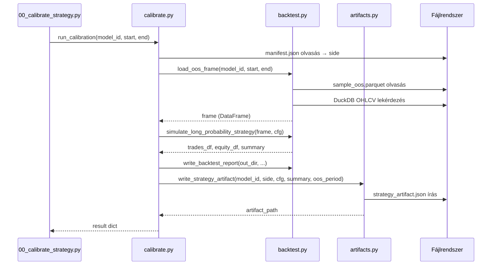

# calibration/ — Kalibrációs Almodul

A `src/trading/calibration/` könyvtár olvassa az OOS predikciós fájlokat, szimulál egy visszatesztelést, kiszámítja a teljesítménymutatókat, és lementi a stratégia-artefaktumot.

---

## Áttekintés

---

## backtest.py

### `load_oos_frame(model_id, start, end)`

OOS predikciók betöltése és join OHLCV adatokkal.

| Paraméter | Típus | Leírás |
|-----------|-------|--------|
| `model_id` | `str` | Artifact könyvtár neve, pl. `lgbm_solusdt_l_fw60_2021` |
| `start` | `str \| None` | OOS kezdő dátum (`YYYY-MM-DD`), None = legkorábbi sor |
| `end` | `str \| None` | OOS záró dátum (`YYYY-MM-DD`), None = legutolsó sor |

**Visszatérési érték:** `pd.DataFrame` — oszlopok: `open_time, open, high, low, close, target, prediction`

**Működés:**
1. Beolvassa `artifacts/<model_id>/manifest.json`-t — meghatározza a side-ot (`long`/`short`) és a predikciós oszlop nevét (`pred_long` / `pred_short`).
2. Betölti `artifacts/<model_id>/sample_oos.parquet`-ot, szűri a dátumtartományra.
3. Betölti a DuckDB OHLCV tábla megfelelő tartományát (`duckdb_query.query_range`).
4. Inner join-t végez `open_time`-on, deduplication + sort után adja vissza.

**Kivételek:** `FileNotFoundError` (hiányzó parquet vagy manifest), `ValueError` (ismeretlen `target_name`, üres tartomány, hiányzó pred oszlop).

---

### `simulate_long_probability_strategy(frame, strategy_cfg)`

Valószínűségi küszöb alapú LONG/FLAT stratégia szimulátora. Ha `strategy_cfg["side"] == "short"`, automatikusan a short szimulátorra (`_simulate_short_probability_strategy`) delegál.

| Paraméter | Típus | Leírás |
|-----------|-------|--------|
| `frame` | `pd.DataFrame` | `load_oos_frame` kimenete |
| `strategy_cfg` | `dict` | Stratégia paraméterek (lásd lent) |

**Visszatérési érték:** `tuple[pd.DataFrame, pd.DataFrame, dict]` — `(trades_df, equity_df, summary_dict)`

**`strategy_cfg` kulcsok:**

| Kulcs | Alap | Leírás |
|-------|------|--------|
| `side` | `"long"` | `"long"` vagy `"short"` |
| `entry_threshold` | — (kötelező) | Belépési valószínűségi küszöb |
| `rearm_threshold` | = `entry_threshold` | Újrafegyverkezési küszöb (rearm) |
| `exit_threshold` | `-1.0` | Kilépési valószínűségi küszöb |
| `min_hold_minutes` | `0` | Minimális tartási idő |
| `max_hold_minutes` | `240` | Maximális tartási idő |
| `take_profit_pct` | `0.0` | Take profit ár % (0 = letiltva) |
| `stop_loss_pct` | `0.0` | Stop loss ár % (0 = letiltva) |
| `trailing_activation_pct` | `0.0` | Trailing stop aktiválási % |
| `trailing_stop_pct` | `0.0` | Trailing stop követési % |
| `cooldown_minutes` | `0` | Kilépés utáni várakozás percekben |
| `fee_bps_per_side` | `0.0` | Kereskedési díj bázispontban (oldalanként) |
| `slippage_bps_per_side` | `0.0` | Csúszás bázispontban (oldalanként) |
| `initial_equity` | `10000.0` | Kezdeti tőke |

**Belépési logika (LONG):**
- Az előző bar `prediction >= entry_threshold` → belépés a jelenlegi bar `open`-ján + slippage
- Rendszer csak `armed == True` esetén lép be
- Cooldown lejárta + `prediction <= rearm_threshold` esetén a rendszer újra fegyverkezik

**Kilépési logika (LONG) prioritás sorrendben:**
1. `low <= hard_stop` → `stop_loss`
2. `high >= take_profit` → `take_profit`
3. Trailing stop aktiválva + `low <= trailing_stop_price` → `trailing_stop`
4. `hold_minutes >= max_hold_minutes` → `max_hold`
5. `hold_minutes >= min_hold_minutes` és `prediction <= exit_threshold` → `probability_exit`

**`trades_df` oszlopok:** `entry_time, entry_signal_time, exit_time, exit_reason, hold_minutes, entry_price, exit_price, entry_prediction, entry_target, gross_return, net_return, equity_after`

---

### `_simulate_short_probability_strategy(frame, strategy_cfg)` (belső)

A long szimulátor tükörképe — SHORT/FLAT stratégiát szimulál. A P&L pozitív, ha az ár a belépés után esik.

Megegyező paraméterek és visszatérési típus mint a long verziónál. Különbségek:
- Belépéskor a slippage az ár **alá** tolódik (short slippage iránya fordított)
- Stop loss: `high >= entry_price * (1 + stop_loss_pct)`
- Take profit: `low <= entry_price * (1 - take_profit_pct)`
- Trailing: `lowest_price` és `trailing_cover_price` nyomkövetés

---

### `summarize_trades(trades_df, equity_df, initial_equity, start_time, end_time)`

Trade-szintű és equity-szintű backtest metrikák kiszámítása.

| Paraméter | Típus | Leírás |
|-----------|-------|--------|
| `trades_df` | `pd.DataFrame` | Trade rekordok |
| `equity_df` | `pd.DataFrame` | Equity görbe (`open_time`, `equity`) |
| `initial_equity` | `float` | Kezdeti tőke |
| `start_time` | `pd.Timestamp` | Első bar időbélyege |
| `end_time` | `pd.Timestamp` | Utolsó bar időbélyege |

**Visszatérési érték:** `dict` — metrikák:

| Kulcs | Leírás |
|-------|--------|
| `trade_count` | Kötések száma |
| `winning_trades` / `losing_trades` | Nyerő/vesztes kötések |
| `win_rate` | Nyerési arány (0.0–1.0) |
| `avg_net_return` / `median_net_return` | Átlag/medián nettó hozam |
| `best_trade` / `worst_trade` | Legjobb/legrosszabb kötés |
| `profit_factor` | Bruttó nyereség / bruttó veszteség |
| `total_return` | Összesített hozam |
| `profit` | Abszolút nyereség USDT-ben |
| `max_drawdown` | Maximális drawdown (negatív) |
| `avg_hold_minutes` / `median_hold_minutes` | Tartási idők |
| `avg_minutes_between_entries` | Átlag idő kötések között |
| `exposure_pct` | Piaci expozíció aránya (tartási / összes idő) |
| `exit_reasons` | `dict` — kilépési okok és darabszámok |

---

### `write_backtest_report(output_dir, strategy_id, strategy_cfg, summary, trades_df)`

HTML backtest riport írása.

| Paraméter | Típus | Leírás |
|-----------|-------|--------|
| `output_dir` | `Path` | Célkönyvtár |
| `strategy_id` | `str` | Riport cím / modell azonosító |
| `strategy_cfg` | `dict` | Stratégia konfiguráció |
| `summary` | `dict` | `summarize_trades` kimenete |
| `trades_df` | `pd.DataFrame` | Trade rekordok |

**Kimenet:** `output_dir/report.html` — tartalmaz strategy config, summary tábla, exit reasons, utolsó 50 trade.

---

## calibrate.py

### `run_calibration(model_id, start, end)`

Egymenetes kalibrációs orchestrátor.

| Paraméter | Típus | Leírás |
|-----------|-------|--------|
| `model_id` | `str` | Artifact könyvtár neve |
| `start` | `str \| None` | OOS kezdő dátum override |
| `end` | `str \| None` | OOS záró dátum override |

**Visszatérési érték:** `dict` — kulcsok: `model_id, side, oos_period, strategy, metrics, artifact_path`

**Alapértelmezett stratégia paraméterek (`_DEFAULT_STRATEGY`):**

| Paraméter | Érték |
|-----------|-------|
| `entry_threshold` | `0.45` |
| `rearm_threshold` | `0.18` |
| `exit_threshold` | `0.10` |
| `min_hold_minutes` | `5` |
| `max_hold_minutes` | `120` |
| `take_profit_pct` | `0.0` |
| `stop_loss_pct` | `0.0` |
| `trailing_activation_pct` | `0.0` |
| `trailing_stop_pct` | `0.0` |
| `cooldown_minutes` | `60` |
| `fee_bps_per_side` | `10.0` |
| `slippage_bps_per_side` | `2.0` |
| `initial_equity` | `10000.0` |

**Folyamat:**
1. Manifest alapján meghatározza a side-ot
2. `load_oos_frame` → frame
3. `simulate_long_probability_strategy` → trades_df, equity_df, summary
4. Ha vannak kötések: `trades.csv`, `equity_curve.csv`, `report.html` mentés
5. `write_strategy_artifact` → `strategy_artifact.json`

---

## artifacts.py

### `write_strategy_artifact(model_id, side, strategy_cfg, summary, oos_period)`

Stratégia-artefaktum írása JSON formátumban.

| Paraméter | Típus | Leírás |
|-----------|-------|--------|
| `model_id` | `str` | Artifact könyvtár neve |
| `side` | `str` | `"long"` vagy `"short"` |
| `strategy_cfg` | `dict` | Stratégia paraméterek |
| `summary` | `dict` | `summarize_trades` kimenete |
| `oos_period` | `dict` | `{"start": "YYYY-MM-DD", "end": "YYYY-MM-DD"}` |

**Visszatérési érték:** `Path` — a megírt `strategy_artifact.json` elérési útja.

**Helyszín:** `artifacts/<model_id>/strategy/strategy_artifact.json` (felülírja ha létezik)

---

### `load_strategy_artifact(model_id)`

Betölti a `strategy_artifact.json` fájlt.

| Paraméter | Típus | Leírás |
|-----------|-------|--------|
| `model_id` | `str` | Artifact könyvtár neve |

**Visszatérési érték:** `dict` — a teljes artifact JSON tartalma.

**Kivételek:** `FileNotFoundError` ha a fájl hiányzik.

---

## Strategy artifact JSON schema

| Mező | Típus | Szemantika |
|------|-------|-----------|
| `model_id` | `str` | Modell azonosító |
| `side` | `str` | `"long"` vagy `"short"` |
| `calibrated_at` | `str` | ISO 8601 UTC timestamp (kalibrálás időpontja) |
| `oos_period.start` | `str` | OOS periódus kezdete (`YYYY-MM-DD`) |
| `oos_period.end` | `str` | OOS periódus vége (`YYYY-MM-DD`) |
| `strategy` | `dict` | Teljes `strategy_cfg` (entry_threshold, max_hold_minutes stb.) |
| `metrics.trade_count` | `int` | Kötések száma az OOS periódusban |
| `metrics.win_rate` | `float \| null` | Nyerési arány |
| `metrics.total_return` | `float` | Összesített hozam (arány) |
| `metrics.profit` | `float \| null` | Abszolút nyereség USDT-ben |
| `metrics.profit_factor` | `float \| null` | Profit factor |
| `metrics.max_drawdown` | `float` | Maximális drawdown (negatív) |
| `metrics.avg_hold_minutes` | `float \| null` | Átlag tartási idő |
| `metrics.exposure_pct` | `float` | Piaci expozíció aránya |
| `metrics.initial_equity` | `float` | Kezdeti tőke |
| `metrics.final_equity` | `float \| null` | Záró tőke |
| `metrics.exit_reasons` | `dict` | Kilépési okok darabszámmal |

**Példa elérési út:** `artifacts/lgbm_solusdt_l_fw60_2021/strategy/strategy_artifact.json`
