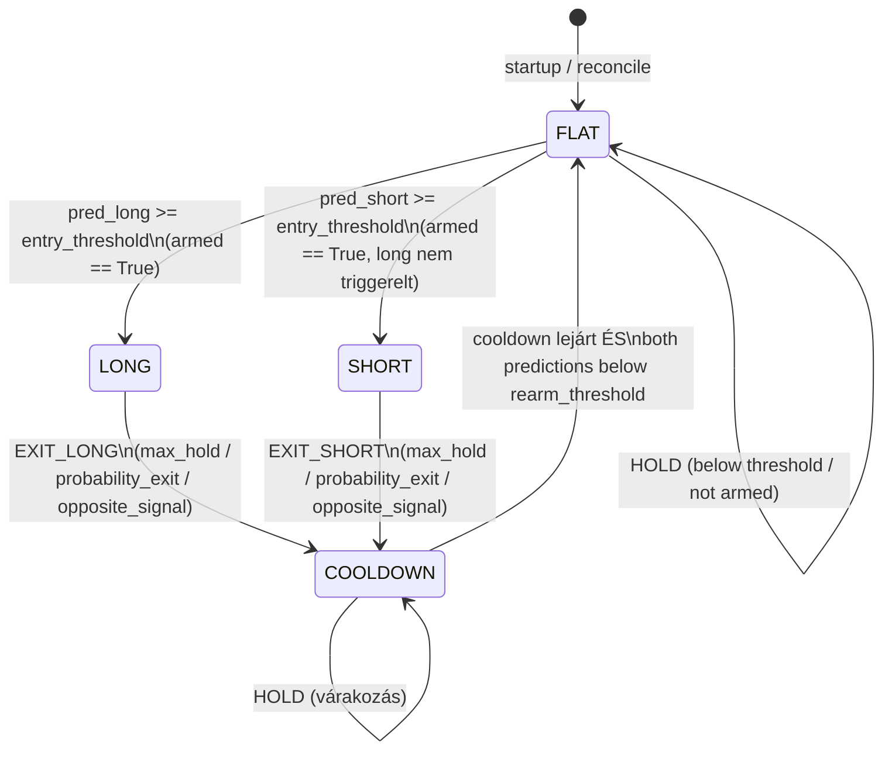

# live/ — Live Trading Service

A `src/trading/live/` könyvtár kezeli az élő (és dry_run) kereskedést: percenkénti adatszinkront végez, predikció alapján dönt a stratégia state machine segítségével, megbízásokat ad Binance Futures-ön, és minden eseményt naplóz egy DuckDB journalba.

---

## Áttekintés — állapotgép



---

## service.py — TradingService

### `__init__(config)`

Inicializálja a service-t a trading config dict alapján.

| Paraméter | Típus | Leírás |
|-----------|-------|--------|
| `config` | `dict` | Teljes trading konfiguráció (`config/trading.json`) |

**Inicializált attribútumok:**

| Attribútum | Leírás |
|-----------|--------|
| `mode` | `"dry_run"` vagy `"live"` |
| `asset_id` | Kereskedett asset azonosítója |
| `long_cfg` / `short_cfg` | Stratégia paraméter dict-ek (`config/strategies.json`-ból) |
| `long_pred_col` / `short_pred_col` | Predikció oszlop nevek: `"long_pred"`, `"short_pred"` |
| `exchange` | `BinanceFuturesClient` példány |
| `state` | `TradingState \| None` (startup után töltődik) |
| `run_id` | Futás azonosítója (startup után töltődik) |

---

### `start()`

Elindítja a trading loop-ot háttérszálban (`daemon=True`, szál neve: `chronoquant-trading`).

---

### `stop()`

Jelzést küld a graceful leállításhoz (`_stop_event.set()`). Az aktuális ciklus befejezése után a loop megáll.

---

### `is_running()`

**Visszatérési érték:** `bool` — `True` ha a service még nem lett leállítva.

---

### `_startup()` (belső)

1. `journal.ensure_tables` — táblák létrehozása ha hiányoznak
2. Unique `run_id` generálás (`run_YYYYMMDD_HHMMSS_<6hex>`)
3. `journal.insert_run` — futás naplózása
4. `journal.get_open_position` — nyitott pozíció reconcile DB-ből
5. `TradingState.from_db` — state rekonstrukció
6. `exchange.set_leverage` — tőkeáttétel beállítása

---

### `_cycle()` (belső)

Egy 1-perces bar feldolgozása. Sorrendben:

1. `_sync_data()` — OHLCV + features + predictions szinkron (`run_database_sync`)
2. `_read_latest_bar()` → `(bar_open_time, pred_long, pred_short, close)` vagy `None`
3. `_apply_cooldown_rearm()` — COOLDOWN → FLAT átmenet és `armed` flag kezelése
4. `strategy.evaluate()` → `(decision, reason)`
5. `_execute()` — pozíció nyitás/zárás az exchange-en
6. `journal.insert_signal()` — jel naplózása
7. `state.consecutive_errors = 0` — hiba számláló reset

---

### `_shutdown()` (belső)

1. `journal.mark_run_stopped` — futás lezárása
2. Ha `journal_cfg["export_on_stop"]`: `journal.export_run` → CSV export

---

## strategy.py — State Machine

### `evaluate(state, pred_long, pred_short, long_cfg, short_cfg, now)`

Egy lezárt bar stratégiai értékelése. **Nem módosítja a state-et** — a hívó alkalmazza a döntést.

| Paraméter | Típus | Leírás |
|-----------|-------|--------|
| `state` | `TradingState` | Jelenlegi állapot |
| `pred_long` | `float` | Long modell predikciós valószínűsége |
| `pred_short` | `float` | Short modell predikciós valószínűsége |
| `long_cfg` | `dict` | Long stratégia paraméterek |
| `short_cfg` | `dict` | Short stratégia paraméterek |
| `now` | `datetime \| None` | Referencia UTC idő (alapért.: `datetime.now(UTC)`) |

**Visszatérési érték:** `tuple[str, str]` — `(decision, reason)`

**Decision értékek:** `HOLD`, `ENTER_LONG`, `ENTER_SHORT`, `EXIT_LONG`, `EXIT_SHORT`

**Döntési logika állapotonként:**

| Állapot | Feltétel | Döntés |
|---------|----------|--------|
| `COOLDOWN` | `now < cooldown_until` | `HOLD` "cooldown Nmin remaining" |
| `COOLDOWN` | lejárt + `pred_long <= rearm` és `pred_short <= rearm` | `HOLD` "rearm_triggered" |
| `COOLDOWN` | lejárt, de nem rearm | `HOLD` "waiting_rearm" |
| `FLAT` | `not state.armed` | `HOLD` "not_armed" |
| `FLAT` | `pred_long >= entry_threshold` | `ENTER_LONG` |
| `FLAT` | `pred_short >= entry_threshold` (long nem triggerelt) | `ENTER_SHORT` |
| `LONG` | `hold_min >= max_hold_minutes` | `EXIT_LONG` "max_hold" |
| `LONG` | `pred_short >= short entry_threshold` | `EXIT_LONG` "opposite_signal" |
| `LONG` | `hold_min >= min_hold` és `pred_long <= exit_threshold` | `EXIT_LONG` "probability_exit" |
| `SHORT` | `hold_min >= max_hold_minutes` | `EXIT_SHORT` "max_hold" |
| `SHORT` | `pred_long >= long entry_threshold` | `EXIT_SHORT` "opposite_signal" |
| `SHORT` | `hold_min >= min_hold` és `pred_short <= exit_threshold` | `EXIT_SHORT` "probability_exit" |

---

## state.py — TradingState

### `TradingState` dataclass

Mutable runtime állapot egy trading service futáshoz.

| Mező | Típus | Leírás |
|------|-------|--------|
| `status` | `str` | Jelenlegi állapot: `FLAT`, `LONG`, `SHORT`, `COOLDOWN` |
| `armed` | `bool` | True = kész belépni új pozícióba |
| `cooldown_until` | `datetime \| None` | Legkorábbi újrafegyverkezési idő |
| `position_id` | `str \| None` | Aktív pozíció azonosítója (journalból) |
| `side` | `str \| None` | Jelenlegi pozíció oldala (`LONG` / `SHORT`) |
| `entry_time` | `datetime \| None` | Pozíció nyitásának UTC időpontja |
| `entry_price` | `float \| None` | Belépési végrehajtási ár |
| `quantity` | `float \| None` | Pozíció mérete (base asset egységben) |
| `run_id` | `str \| None` | Futás azonosítója |
| `daily_trade_count` | `int` | Mai nyitott kötések száma |
| `daily_loss_usdt` | `float` | Mai kumulált veszteség USDT-ben |
| `consecutive_errors` | `int` | Egymást követő hibák száma |
| `last_trade_date` | `str \| None` | Utolsó kötés dátuma (`YYYY-MM-DD`) |

**Állandók:** `FLAT = "FLAT"`, `LONG = "LONG"`, `SHORT = "SHORT"`, `COOLDOWN = "COOLDOWN"`

**Metódusok:**

| Metódus | Leírás |
|---------|--------|
| `hold_minutes(now)` | Jelenlegi pozíció tartási ideje percben |
| `clear_position()` | Összes pozíció mező nullázása |
| `record_trade_result(pnl_usdt)` | Napi risk számlálók frissítése, napi reset ha új nap |
| `from_db(run_id, open_position)` | Classmethod — state rekonstrukció DB sorból |

---

## journal.py — DuckDB Journal

Az összes live trading eseményt egy külön `trading.db` DuckDB fájlba írja. Minden írás tranzakcionális (`BEGIN` / `COMMIT` / `ROLLBACK`).

**DB elérési út:** `utils.load_trading_config()["db_path"]` → `trading_db_path()`

### Táblák

#### `trading_runs`

| Oszlop | Típus | Leírás |
|--------|-------|--------|
| `run_id` | `TEXT PK` | Egyedi futás azonosító |
| `started_at` | `TEXT` | Indulás UTC timestamp |
| `stopped_at` | `TEXT \| NULL` | Leállás UTC timestamp |
| `mode` | `TEXT` | `"dry_run"` vagy `"live"` |
| `asset_id` | `TEXT` | Kereskedett asset |
| `long_strategy_id` | `TEXT` | Long stratégia azonosítója |
| `short_strategy_id` | `TEXT` | Short stratégia azonosítója |
| `config_json` | `TEXT` | Teljes config JSON |

#### `trading_signals`

| Oszlop | Típus | Leírás |
|--------|-------|--------|
| `id` | `BIGINT PK` | Auto-increment (sequence) |
| `run_id` | `TEXT` | Futás azonosítója |
| `bar_open_time` | `TEXT` | Bar nyitási időpontja |
| `pred_long` | `REAL` | Long predikciós valószínűség |
| `pred_short` | `REAL` | Short predikciós valószínűség |
| `state_before` | `TEXT` | Állapot a döntés előtt |
| `decision` | `TEXT` | Döntés (HOLD, ENTER_LONG stb.) |
| `reason` | `TEXT` | Olvasható indoklás |
| `processed_at` | `TEXT` | Feldolgozás UTC timestamp |

#### `trading_positions`

| Oszlop | Típus | Leírás |
|--------|-------|--------|
| `position_id` | `TEXT PK` | Egyedi pozíció azonosító |
| `run_id` | `TEXT` | Futás azonosítója |
| `side` | `TEXT` | `"LONG"` vagy `"SHORT"` |
| `status` | `TEXT` | `"OPEN"` vagy `"CLOSED"` |
| `entry_time` | `TEXT` | Nyitás UTC timestamp |
| `exit_time` | `TEXT \| NULL` | Zárás UTC timestamp |
| `entry_price` | `REAL` | Belépési ár |
| `exit_price` | `REAL \| NULL` | Kilépési ár |
| `quantity` | `REAL` | Pozíció mérete |
| `pnl_usdt` | `REAL \| NULL` | Realizált P&L USDT-ben |
| `exit_reason` | `TEXT \| NULL` | Zárás oka |
| `entry_order_id` | `TEXT \| NULL` | Belépési megbízás azonosítója |
| `exit_order_id` | `TEXT \| NULL` | Kilépési megbízás azonosítója |

#### `trading_orders`

| Oszlop | Típus | Leírás |
|--------|-------|--------|
| `order_id` | `TEXT PK` | Helyi megbízás azonosító |
| `run_id` | `TEXT` | Futás azonosítója |
| `position_id` | `TEXT \| NULL` | Kapcsolódó pozíció |
| `side` | `TEXT` | `"BUY"` vagy `"SELL"` |
| `order_type` | `TEXT` | Pl. `"MARKET"` |
| `status` | `TEXT` | Pl. `"FILLED"` |
| `client_order_id` | `TEXT \| NULL` | Kliens oldali megbízás ID |
| `binance_order_id` | `TEXT \| NULL` | Binance megbízás ID |
| `requested_qty` | `REAL \| NULL` | Kért mennyiség |
| `filled_qty` | `REAL \| NULL` | Ténylegesen teljesített mennyiség |
| `avg_price` | `REAL \| NULL` | Átlag teljesítési ár |
| `request_json` | `TEXT \| NULL` | Nyers kérés (JSON) |
| `response_json` | `TEXT \| NULL` | Nyers exchange válasz (JSON) |
| `created_at` | `TEXT` | Létrehozás UTC timestamp |

#### `trading_errors`

| Oszlop | Típus | Leírás |
|--------|-------|--------|
| `id` | `BIGINT PK` | Auto-increment (sequence) |
| `run_id` | `TEXT \| NULL` | Futás azonosítója |
| `error_time` | `TEXT` | Hiba UTC timestamp |
| `component` | `TEXT` | Komponens neve (pl. `"cycle"`, `"execute"`) |
| `error_type` | `TEXT` | Exception osztály neve |
| `message` | `TEXT` | Exception üzenet |
| `traceback` | `TEXT \| NULL` | Teljes traceback |

### Journal függvények

| Függvény | Leírás |
|----------|--------|
| `ensure_tables(db_path)` | Táblák és sequence-ek létrehozása |
| `insert_run(...)` | Új futás naplózása |
| `mark_run_stopped(db_path, run_id)` | `stopped_at` beállítása |
| `insert_signal(...)` | Jel naplózása |
| `insert_position(...)` | Nyitott pozíció beírása |
| `close_position(...)` | Pozíció lezárása (UPDATE) |
| `get_open_position(db_path)` | Legutóbbi nyitott pozíció lekérése |
| `get_latest_run(db_path)` | Legutóbbi futás lekérése |
| `insert_order(...)` | Megbízás naplózása |
| `insert_error(...)` | Hiba naplózása (soha nem dob kivételt) |
| `get_recent_signals(db_path, limit)` | Legutóbbi jelek (dashboard) |
| `get_recent_positions(db_path, limit)` | Legutóbbi pozíciók (dashboard) |
| `get_current_run_status(db_path)` | Összesített status dict (dashboard) |
| `export_run(db_path, run_id, report_dir)` | CSV export leálláskor |

---

## exchange.py — BinanceFuturesClient

### `__init__(symbol, leverage, quote_order_qty, mode)`

| Paraméter | Típus | Leírás |
|-----------|-------|--------|
| `symbol` | `str` | Binance szimbólum, pl. `"SOLUSDT"` |
| `leverage` | `int` | Futures tőkeáttétel szorzó |
| `quote_order_qty` | `float` | Nominális megbízás méret USDT-ben |
| `mode` | `str` | `"dry_run"` vagy `"live"` |

**`dry_run` mód:** valódi megbízások nélkül, mark price-on szimulált teljesítés. Az exchange API-t csak price lekérdezésre hívja.

**`live` mód:** aláírt Binance Futures MARKET megbízások a `python-binance` kliens via API kulcsok (`config/env.json`-ban konfigurált elérési út).

### Megbízás metódusok

| Metódus | Leírás | Visszatérési érték |
|---------|--------|-------------------|
| `set_leverage()` | Tőkeáttétel beállítás (dry_run: no-op) | — |
| `get_mark_price()` | Mark price lekérdezés | `float` |
| `open_long(mark_price)` | BUY MARKET megbízás | order response `dict` |
| `close_long(quantity, mark_price)` | Reduce-only SELL MARKET | order response `dict` |
| `open_short(mark_price)` | SELL MARKET megbízás | order response `dict` |
| `close_short(quantity, mark_price)` | Reduce-only BUY MARKET | order response `dict` |

**Quantity számítás:** `qty = round_down((quote_order_qty * leverage) / mark_price, step=0.1)`

**Dry fill response formátum:**
```json
{
    "orderId": "DRY_<timestamp_ms>",
    "clientOrderId": "CQ_DRY_<8hex>",
    "symbol": "SOLUSDT",
    "side": "BUY|SELL",
    "type": "MARKET",
    "status": "FILLED",
    "executedQty": "<qty>",
    "avgPrice": "<mark_price>",
    "dry_run": true
}
```

---

## 02_run_service.py CLI

```bash
uv run python src/trading/02_run_service.py [--mode dry_run|live]
```

| Argument | Alap | Leírás |
|----------|------|--------|
| `--mode` | config-ból | `"dry_run"` vagy `"live"` — felülírja a `config/trading.json` mode mezőjét |

**Live mód megerősítés:** `live` módban interaktív `"yes"` megerősítés szükséges a folytatáshoz.

**Jelkezelés:** `SIGINT` / `SIGTERM` → `service.stop()` → graceful shutdown.
