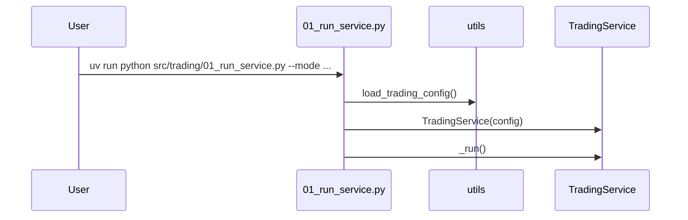
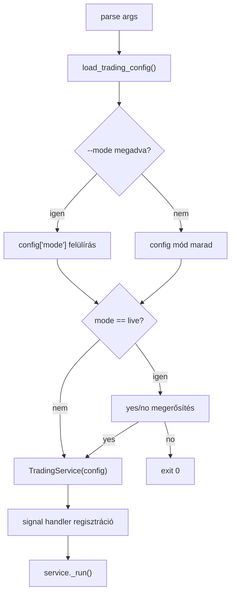

# 7110 - 01_run_service.py

`src/trading/01_run_service.py`

Headless CLI entrypoint a live trading service-hez. Betölti a trading configot,
opcionálisan felülírja a módot, live módban interaktív jóváhagyást kér, majd a
`TradingService` foreground loopját futtatja.

---

## Overview

---

## `main()`

Beolvassa a `--mode` CLI paramétert, majd a configból létrehozza a service-t.

| Paraméter | Típus | Leírás |
|-----------|------|--------|
| `--mode` | `dry_run | live` | opcionális config felülírás |

Returns: `None` - a folyamat a service leállásáig blokkol.

## Signal kezelés

- `SIGINT` és `SIGTERM` esetén a handler `service.stop()`-ot hív.
- A tényleges ciklus leállítása nem itt, hanem a service loopban történik.
