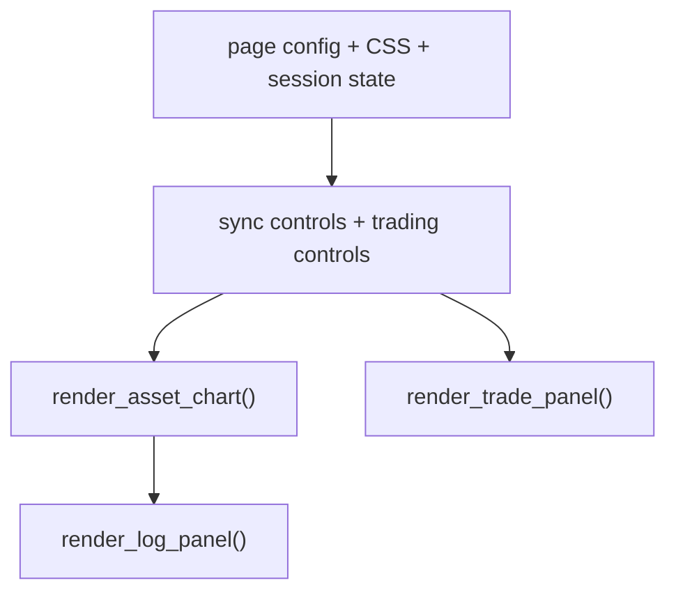
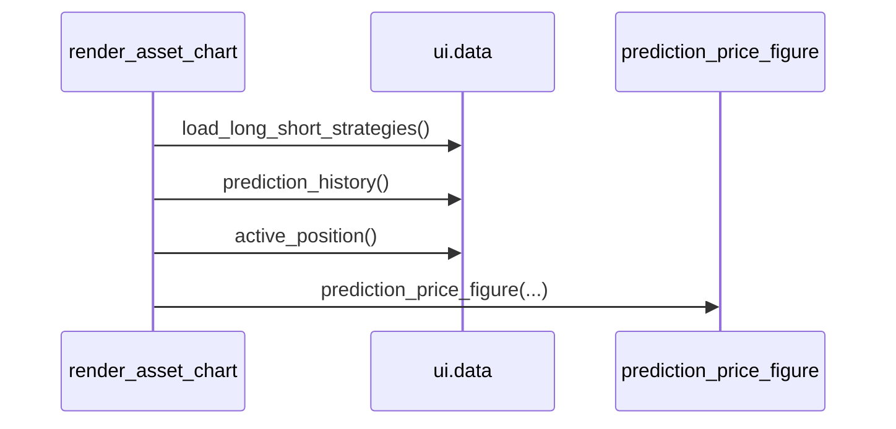

# 8110 - ui/main.py

`src/ui/main.py`

A dashboard belépési pontja. Beállítja a Streamlit page configot, inicializálja
az alap session state-et, kezeli az auto-sync és trading control gombokat, majd
kirendereli a chart és a jobb oldali trade panel elrendezést.

---

## Overview

---

## `_render_sync_controls(asset_id)`

Egy asset sync állapotát és a gombokat rajzolja ki.

| Paraméter | Típus | Leírás |
|-----------|------|--------|
| `asset_id` | `str | None` | UI oldali asset kulcs |

Returns: `None`

Kapcsolódó hívások:
- `ensure_sync_state()`
- `is_sync_running()`
- `auto_sync_due_seconds()`
- `start_sync()`
- `enable_auto_sync()`
- `disable_auto_sync()`

## `_sync_panel_sol()`

`@st.fragment(run_every="2s")` wrapper az SOL panelhez.

Returns: `None`

## `render_asset_chart(asset_id)`

Betölti a predikciós history-t és az aktív pozíciót, majd létrehozza a Plotly ábrát.

Returns: `None`

## `_render_trading_controls()`

Start/stop gombok a background trading service-hez.

Returns: `None`

Leágazások:
- ha a service fut: státusz + stop gomb;
- ha nem fut: mode selector + start gomb.

## Top-level layout

A fájl végén:
- sidebar épül;
- `active_asset_id = "solusdt_fw60"` és `asset_label = "SOL / 1m"` rögzül;
- `st.columns([3, 1])` layoutban balra a chart és log, jobbra a trade panel kerül.
