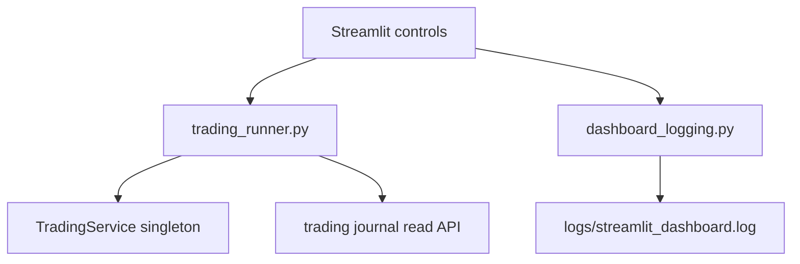

# 8140 - UI Runners And Logging

`src/ui/trading_runner.py`  
`src/ui/dashboard_logging.py`

Ez a dokumentum a dashboard két infrastrukturális segédmodulját írja le:
a trading service singleton wrapperét és a fájl alapú dashboard loggert.

---

## Overview

---

## `trading_runner.py`

### `start_trading(mode="dry_run")`

Betölti a trading configot, létrehozza a `TradingService` példányt, majd háttérszálon elindítja.

Returns: `bool`

### `stop_trading()`

Leállítási jel küldése a singleton service-nek.

Returns: `None`

### `is_trading_running()`

Returns: `bool`

### `get_trading_mode()`

Returns: `str | None`

### `get_last_error()`

Returns: `str | None`

### `get_trading_status()`

A journal read API fölött összesíti az aktuális státuszt, és hozzáadja a
`service_running` mezőt.

Returns: `dict | None`

### `get_recent_signals(limit=10)`, `get_recent_positions(limit=20)`

Dashboard-kompatibilis listás wrapper a journal olvasások fölött.

Returns:
- `list[dict]`
- `list[dict]`

## `dashboard_logging.py`

### `log_path()`

Returns: `Path` - `logs/streamlit_dashboard.log`.

### `get_dashboard_logger()`

Singleton `logging.Logger`, amely szükség esetén létrehozza a `FileHandler`-t.

Returns: `logging.Logger`

### `read_recent_logs(max_lines=200)`

Returns: `list[str]` - a fájl vége `deque`-vel beolvasva.

### `clear_logs()`

Returns: `None` - lenullázza a logfájlt.
