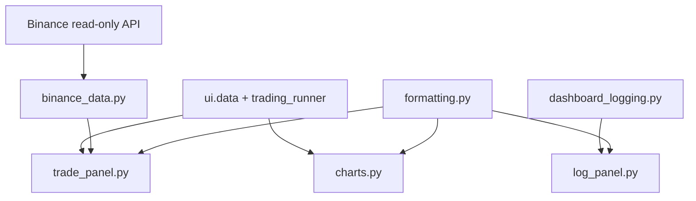

# 8150 - UI Components

`src/ui/components/charts.py`  
`src/ui/components/trade_panel.py`  
`src/ui/components/log_panel.py`  
`src/ui/components/formatting.py`  
`src/ui/binance_data.py`

A dashboard megjelenítési logikája ezekben a komponensmodulokban él. A page
szintű orchestration nem rajzol közvetlenül komplex HTML-t vagy chartot, hanem
ezekre a segédmodulokra támaszkodik.

---

## Overview

---

## `charts.py`

### `prediction_price_figure(...)`

Háromsoros Plotly figure:
- long prediction;
- price / candlestick;
- short prediction.

Returns: `plotly.graph_objects.Figure`

Fő helper függvények:
- `_ann`
- `_add_trade_overlay`
- `_has_ohlc`
- `_resample_ohlcv`
- `_add_price_candles`
- `_add_threshold_trace`
- `_threshold_legend`
- `_long_signal_markers`
- `_short_signal_markers`
- `_style_figure`

### `equity_figure(df)`

Matplotlib equity chart fallback.

Returns: `matplotlib.figure.Figure`

## `trade_panel.py`

Jobb oldali kereskedési kártyák és trade lista.

Fő render függvények:
- `_render_active_trade_card`
- `_render_recent_trades_panel`
- `_render_trading_status_card`
- `_render_trading_positions_card`
- `_render_signal_trigger_card`
- `render_trade_panel`

Segédek:
- `_fmt`
- `_fmt_time`
- `_group_trades_by_minute`
- `_binance_trade_row_html`

## `log_panel.py`

Scrollozható pseudo-terminal a dashboard logfájlból.

Fő függvények:
- `_log_entries`
- `_split_log_header`
- `_terminal_line_html`
- `_render_log_terminal`
- `render_log_panel`

## `formatting.py`

Közös színpaletta és numerikus formatterek:
- `pct`
- `money`
- `number`

## `binance_data.py`

Read-only Binance trade history wrapper.

Fő függvények:
- `_make_client`
- `recent_trades`
- `_normalize_futures`
- `_normalize_spot`
- `_empty_frame`
