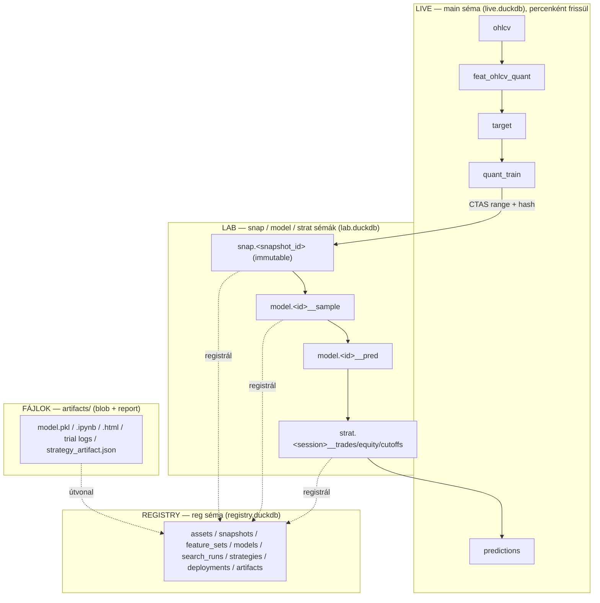
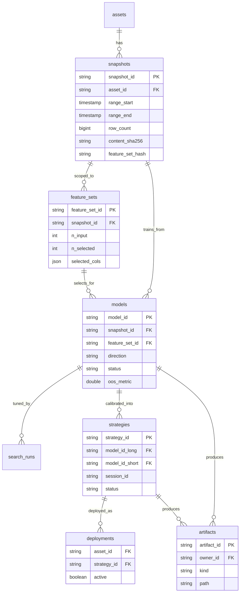
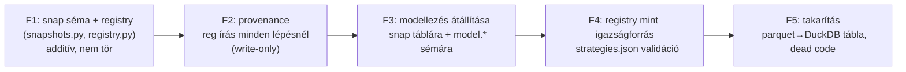

# ChronoQuant — Rendszerterv: adat- és folyamat-architektúra (DuckDB-natív)

> Státusz: terv (draft). Nem kanonikus `_doc_` metodológia — javaslat a cél-állapotra.
> Kód-, config- és `_jira_`-módosítást nem tartalmaz.

---

## 1. Vezetői összefoglaló

A jelenlegi rendszer működőképes és jó alapokon áll (asset-per-DuckDB, append-only upsert, config-gateway, parquet snapshotok). Két strukturális hiányosság van, amit a célállapot megold:

1. **Nincs rögzített adatállapot** a modellezés mögött → a modellek ma nem reprodukálhatók (a `quant_train` az élő, percenként változó táblákból épül, és semmi nem jegyzi fel, melyik állapotból).
2. **Nincs explicit katalógus** → az `asset → snapshot → model → strategy → deployment` láncot fájlnév-konvenciók és szétszórt JSON-ok kódolják, amelyek már most elcsúsztak egymástól (`strategies.json` ≠ `models.json` ≠ `assets.json`).

A megoldás **DuckDB-natív**: az adat a DuckDB-ben marad (sémák + táblák + view-k), így integrált és lekérdezhető; a reprodukálhatóságot **befagyasztott (immutable) DuckDB táblák + content-hash** adják, parquet-réteg nélkül. A láncot egy **registry** (DuckDB katalógus) köti össze.

**Az architektúra fő elve:**

> Strukturált adat → DuckDB (séma + tábla/view). Blob és ember-report → fájl. Mindent a registry köt össze. A feature-szűrés **logikai feature_set**, nem fizikai tábla-törlés.

---

## 2. Jelenlegi állapot

### 2.1 Adatfolyam ma

```
Binance ──▶ ohlcv ──▶ feat_ohlcv_quant ──▶ target
                              │                │
                              └──── INNER JOIN ┘
                                     │
                          quant_train (materializált TÁBLA, ad-hoc rebuild)   ← változékony
                                     │
                          sample_train_valid.parquet (per modell, MINDEN feat_* bemásolva)
                                     │
                          model.pkl ──▶ predictions (vissza a DB-be)
                                     │
                          strategy_artifact ──▶ live trading
```

### 2.2 Fájdalompontok (megfigyelt, konkrét)

| # | Probléma | Hely | Hatás |
|---|----------|------|-------|
| P1 | `quant_train` mutable tábla, ad-hoc `CREATE OR REPLACE`, nincs verzió | `src/data_handling/store/duckdb_store.py:250` | A modell adat-bázisa felülíródik → nincs reprodukció |
| P2 | A modell-manifest nem rögzít adat-provenance-t | `src/modeling/pipeline.py:75` | Nem tudható, melyik adatból készült a modell |
| P3 | Elavult/inkonzisztens regiszter | `config/strategies.json` (`asset_id: solusdt_fw60`, `q90_local_v4`) vs `models.json` (`..._2021`) | A strategy→model link kézzel romlik el |
| P4 | Kézi, verziózatlan séma-migrációk | `ensure_tables()` `duckdb_store.py:36-141` | Törékeny, sorrend-függő, nehezen auditálható |
| P5 | Dead/ellentmondó kódút | `materialize_sample_table()` DB-be ír, miközben „samples are parquet only" | Zavar, karbantartási teher |

---

## 3. Tervezési döntések (rögzítve)

| Döntés | Választott irány | Következmény a tervre |
|--------|------------------|----------------------|
| Reprodukálhatóság | **Verziózott immutable snapshot, DuckDB táblaként** | `snap` séma; `snap."<snapshot_id>"` befagyasztott tábla + content-hash; a modellezés ebből dolgozik |
| Adattárolás | **DuckDB-natív** (séma + tábla + view), nem parquet | Integrált, joinolható; parquet-réteg megszűnik |
| Tárolási topológia | **3 fájl, ATTACH-csal** (live / lab / registry) — végleges | Újrabecslés és live predikció írás-izoláltan, párhuzamosan futhat |
| Feature-szűrés | **Logikai feature_set**, nem fizikai tábla | A táblák a szuperszettet hordozzák; a szűrés a registryben él |
| Katalógus | **Központi registry (DuckDB)** | `reg` séma; az igazság forrása; fájlnév-konvenciók maradnak olvashatóságért |
| Kimenet | **Csak rendszerterv** | Ez a dokumentum |

> **A duplikációról.** A korábbi „minden marad" döntés a DuckDB-natív irányban finomodott: a feature-adat fizikailag a `feat_ohlcv_quant` (szuperszett) és a `snap` táblákban (range-másolat, teljes felbontás) él. A **sample kicsi** (óránkénti felbontás), a feature-szűrés pedig **logikai** — így nincs per-modell teljes feature-másolat. Ez kevesebb redundancia, mint a kiinduló állapot, és reprodukálható forrásból származik.

---

## 4. Cél-architektúra

### 4.1 Négy réteg, tiszta felelősséggel



### 4.2 DuckDB szervezés: 3 fájl + sémák, ATTACH-csal összekötve

A „minden egy fájlban" buktatója a **single-writer** korlát: ha az élő trading/sync folyamatosan írja a DB-t, a modellezés nem tud ugyanabba írni. Ezért **írás szerint** szétválasztjuk, de ATTACH-csal **olvasásra egyesítjük**:

```
database/
  solusdt/
    solusdt.duckdb         ← LIVE (sync ír ide):  main.ohlcv, feat_ohlcv_quant, target, predictions, quant_train
    solusdt_lab.duckdb     ← MODELLEZÉS (pipeline ír ide):  snap.* , model.* , strat.*
  _registry/
    registry.duckdb        ← GLOBÁLIS katalógus:  reg.*
```

Egy modellezési connection:

```sql
ATTACH 'database/solusdt/solusdt.duckdb'    AS live (READ_ONLY);
ATTACH 'database/_registry/registry.duckdb' AS reg;
-- a lab DB a default; innen minden joinolható: snap ⋈ live.quant_train ⋈ reg.models
```

Integrált marad (egy lekérdezésben elérsz mindent), de a live sync és a modellezés **nem ütközik**.

> **Döntés: a 3-fájlos szétválasztás végleges** (nem opcionális). Indok: a modell **újrabecslése** közben a live `main.predictions` táblát nem szabad piszkálni — az élő trading olvassa. A `lab.duckdb` külön write-target garantálja, hogy egy újratréning/újrascorolás (`model.*__pred`) **nem érinti** az élő predikciós táblát; a két folyamat egyszerre futhat.

| Séma | Hol | Objektumok | Mutability |
|------|-----|-----------|-----------|
| `main` | live.duckdb | ohlcv, feat_ohlcv_quant, target, predictions, quant_train | élő, frissül |
| `snap` | lab.duckdb | `snap."<snapshot_id>"` — befagyasztott range | **immutable** |
| `model` | lab.duckdb | `model."<model_id>__sample"`, `model."<model_id>__pred"` | per-modell |
| `strat` | lab.duckdb | `strat."<session_id>__trades / __equity / __cutoffs"` | per-session |
| `reg` | registry.duckdb | assets, snapshots, feature_sets, models, search_runs, strategies, deployments, artifacts | katalógus |

### 4.3 Registry (DuckDB katalógus)



A `status` mező teszi „élővé": `draft → candidate → champion → active → archived`. A `config/*.json` fájlok **megmaradnak** ember-szerkeszthető bemenetnek; a registry a normalizált igazságforrás, és egy validátor jelez, ha egy config elcsúszik tőle (P3 megoldva).

---

## 5. A model train pipeline — részletes objektum-térkép

Egy teljes modellfejlesztési futás (`lgbm_solusdt_l_fw60_2101_2605_v1` példán). Az oszlopok: melyik **DuckDB objektum**, melyik **fájl**, mi kerül a **registrybe**.

| # | Lépés | DuckDB objektum (séma.tábla) + lekérdezés | Fájl (artifacts/) | Registry írás |
|---|-------|-------------------------------------------|-------------------|---------------|
| 0 | **setup** | — | `artifacts/<model_id>/manifest.json` | `reg.models` INSERT (status=`draft`) |
| 1 | **snapshot** | `CREATE TABLE snap."<snapshot_id>" AS SELECT * FROM live.quant_train WHERE open_time BETWEEN range` → **immutable**. Hash: `SELECT sha256(...) ...` | — (a snapshot-manifest registrybe kerül, nem fájlba) | `reg.snapshots` INSERT (range, row_count, content_sha256, feature_set_hash) |
| 2 | **sample** | `CREATE TABLE model."<model_id>__sample" AS` ⟨hourly select `QUALIFY ROW_NUMBER() OVER (PARTITION BY date_trunc('hour',open_time) ORDER BY hash(open_time,seed))` + walk-forward `fold_id` `CASE`⟩ a snapshot fölött → **kicsi** (~tízezer sor) | `artifacts/<model_id>/sample_audit.json` (opcionális, sor/hiány-statisztika) | `reg.models` UPDATE (sample stats, status=`sampled`) |
| 3 | **feature_engineering** | nincs új tábla — a notebook a sample-t **olvassa** és projektál | `artifacts/<model_id>/feature_engineering/fe.ipynb` + `fe.html` | `reg.feature_sets` INSERT (selected_cols, n_input, n_selected); `reg.artifacts` INSERT (ipynb, html) |
| 4 | **search** | nincs új tábla — projekció a feature_set-re a sample-ből | `artifacts/<model_id>/search/trials.jsonl`, `search_best.json`, `search_summary.csv` (+ opc. elemző notebook) | `reg.search_runs` INSERT (best_params, objective, stage); `reg.artifacts` INSERT (logok) |
| 5 | **train** | nincs új tábla a tréninghez | `artifacts/<model_id>/model.pkl`, `features.json`, `params.json`, `metrics.json`, `cv_results.csv` | `reg.models` UPDATE (status=`trained`, oos_metric, feature_set_id, search_run_id); `reg.artifacts` INSERT (model.pkl, …) |
| 6 | **predict** (offline, teljes range) | `CREATE TABLE model."<model_id>__pred" AS` ⟨a snapshot teljes range-ének scorolása a model.pkl-lel⟩ → (open_time, pred). **NEM a snapshotba fúzva.** | — | `reg.models` UPDATE (status=`predicted`) |
| — | *live predict (külön, nem dev-pipeline)* | a live sync a `main.predictions` táblába ír | — | — |

**Kulcsdöntések a táblázathoz:**

- **Snapshot = tábla, nem view** — egy view a változó live táblát követné; az immutable tábla adja a reprodukálhatóságot.
- **Sample = kicsi materializált tábla** — óránkénti felbontás miatt ~tízezer sor; sokszor olvasható gyorsan (FE, search, train).
- **Feature engineering nem hoz létre szűkebb táblát** — a megmaradt változók egy **feature_set** (registry-bejegyzés); a tréning ezekre **projektál** a sample-ből (columnar → ingyen).
- **Predikció = ÚJ tábla** (`model.<id>__pred`), nem a snapshotba fúzva — így a snapshot hash-e és reprodukálhatósága sértetlen; szükség esetén `snap ⋈ pred` join.
- **Reportok és binárisok fájlban** — DuckDB-be nincs értelme tenni; a registry az **útvonalukat** jegyzi (`reg.artifacts`).

### 5.1 Mi keletkezik view-ként (nem materializált)

| View | Definíció | Mikor használt |
|------|-----------|----------------|
| `model."<model_id>__train_input"` | `SELECT open_time, fold_id, <target>, <feature_set cols> FROM model."<id>__sample"` | search + train bemenet (projekció a feature_set-re) |
| `strat."<session>__scored"` | `snap ⋈ model_long.__pred ⋈ model_short.__pred` | strategy kalibráció bemenete |

---

## 6. Naming convention (javaslat)

Egységes, gép-parsolható **és** ember-olvasható sémák. A `{...}` kötelező, a `[...]` opcionális.

| Entitás | Minta | Példa |
|---------|-------|-------|
| **asset_id** | `{symbol-lower}` | `solusdt` |
| **horizon** | `fw{bars}` | `fw60` |
| **range** | `{YYMM_start}_{YYMM_end}` v. `{year}` | `2101_2605`, `2023` |
| **snapshot_id** | `{asset}_fw{h}_{range}__{hash8}` | `solusdt_fw60_2101_2605__a1b2c3d4` |
| **feature_set_id** | `fs_{asset}_fw{h}_{dir}__{hash8}` | `fs_solusdt_fw60_l__9f8e7d6c` |
| **model_id** | `{family}_{asset}_{dir}_fw{h}_{range}[_v{n}]` | `lgbm_solusdt_l_fw60_2101_2605_v1` |
| **search_run_id** | `{model_id}__search_{stage}` | `lgbm_solusdt_l_fw60_2101_2605_v1__search_refine` |
| **session_id** (strategy) | `strat_{asset}_fw{h}_{scope}_{range}[_v{n}]` | `strat_solusdt_fw60_combo_2101_2605_v1` |
| **deployment** | `{asset}` (egy aktív/asset) | `solusdt` → `active=true` strategy_id-vel |

**DuckDB objektum-nevek (a fenti ID-kből):**

| Objektum | Minta | Példa |
|----------|-------|-------|
| Snapshot tábla | `snap."{snapshot_id}"` | `snap."solusdt_fw60_2101_2605__a1b2c3d4"` |
| Sample tábla | `model."{model_id}__sample"` | `model."lgbm_solusdt_l_fw60_2101_2605_v1__sample"` |
| Predikció tábla | `model."{model_id}__pred"` | `model."lgbm_solusdt_l_fw60_2101_2605_v1__pred"` |
| Strategy táblák | `strat."{session_id}__{trades\|equity\|cutoffs}"` | `strat."strat_solusdt_fw60_combo_2101_2605_v1__trades"` |

**Konvenciók:**

- **`dir`**: `l` (long) / `s` (short) / `combo` (kétirányú stratégia).
- **`__` (dupla aláhúzás)**: az ID és az **objektum-szerep** elválasztója (`__sample`, `__pred`, `__search_*`) és a hash-elválasztó (`__hash8`). Az egyszeres `_` az ID-n belüli mezőelválasztó. Így a név egyértelműen visszaparsolható.
- **`hash8`**: az adott objektum tartalmából számolt sha256 első 8 karaktere (snapshot → adat tartalom; feature_set → rendezett oszloplista). Ez ad **reuse-detektálást**: azonos tartalom → azonos hash → nem kell újraszámolni.
- **`_v{n}`**: ugyanazon (range, feature_set) újratréningje. Nélküle az első verzió.

**Artifact mappa-konvenció:**

```
artifacts/
  <model_id>/                      ← model_id névvel
    manifest.json
    sample_audit.json
    feature_engineering/  fe.ipynb  fe.html
    search/               trials.jsonl  search_best.json  search_summary.csv
    model.pkl  features.json  params.json  metrics.json  cv_results.csv
  <session_id>/                    ← session_id névvel
    strategy_artifact.json  isotonic_long.pkl  isotonic_short.pkl
    rank_lookup_long.parquet  rank_lookup_short.parquet
    strategy_report.ipynb  strategy_report.html
```

> A `trades / equity / cutoffs` a strategy esetében **DuckDB táblákba** kerül (`strat.*`), nem parquetbe — az UI közvetlenül lekérdezi. A `strategy_artifact.json` + isotonic/rank_lookup **fájl** marad, mert a live service ezeket tölti.

---

## 7. Tárolási mátrix (mi hol él és miért)

| Adat | Réteg | Tárolás | Mutability |
|------|-------|---------|-----------|
| ohlcv, feat_ohlcv_quant, target, predictions, quant_train | LIVE | `main.*` (live.duckdb) | append/upsert |
| Range snapshot | SNAP | `snap."<id>"` tábla + hash | **immutable** |
| Sample (hourly+fold) | MODEL | `model."<id>__sample"` tábla (kicsi) | per-modell |
| Megmaradt változók (FE) | REGISTRY | `reg.feature_sets` | logikai |
| Offline predikció | MODEL | `model."<id>__pred"` tábla (új) | per-modell |
| Trades / equity / cutoff | STRAT | `strat."<session>__*"` tábla | per-session |
| Model bináris, FE/search report, strategy artifact | FÁJL | `artifacts/...` | static |
| Minden link + best params + státusz | REGISTRY | `reg.*` | upsert + státusz |

---

## 8. Bővíthetőség — a három forgatókönyv

A bővítés **config + registry-bejegyzés**, nem kód-elágazás.

### 8.1 Új modell ugyanarra a coinra, más range / más features

- **Range:** új snapshot (CTAS) a kívánt range-re; ha a (range, feature_set_hash) egyezik egy meglévővel → a registry detektálja, nincs felesleges újraszámítás.
- **Features:** más feature-készlet → más `feature_set_id` ugyanazon snapshot fölött. Fizikai tábla nem változik, csak a `reg.feature_sets` bejegyzés.
- **Munka:** 1 config-sor a `models.json`-ba + pipeline futtatás.

### 8.2 Új coin (pl. bchusdt)

- **DB:** új `bchusdt.duckdb` + `bchusdt_lab.duckdb`, ugyanezzel a sémastruktúrával.
- **Config:** `assets.json` új bejegyzés; aktiválás a `reg.deployments`-ben explicit (az „aktív asset = solusdt" elv nem sérül).
- **Egyetlen valódi feltétel:** a feature-számítás (`_features_polars.py`) coin-agnosztikus legyen (nincs beégetett `solusdt`). Migrációban auditálandó.

### 8.3 Új stratégia

- **Artifact + táblák:** új `session_id` → `strat.*` táblák + `strategy_artifact.json`.
- **Registry:** új `reg.strategies` sor (model_id_long/short, snapshot_id), majd `reg.deployments` átállítás `active`-ra.
- A `strategies.json` mint bemenet marad, de a registry validálja a model-linkeket (P3 megoldva).

---

## 9. Modul-architektúra változások (delta a maihoz)

| Modul | Változás | Agent |
|-------|----------|-------|
| `src/data_handling/store/` | +`snapshots.py` (snap tábla CTAS + hash), +`registry.py` (reg CRUD + ATTACH) | database_agent |
| `src/data_handling/` | +`05_create_snapshot.py` CLI (range → immutable snap tábla + reg) | database_agent |
| `src/data_handling/store/duckdb_store.py` | `materialize_sample_table` kivezetése (P5); migrációk külön `migrations.py`-ba (P4) | database_agent |
| `src/modeling/sampling/create_sample.py` | forrás: `quant_train` tábla → `snap."<snapshot_id>"`; output: parquet → `model.<id>__sample` tábla | modeling_agent |
| `src/modeling/pipeline.py` | `step_setup` → reg.models; minden lépés végén registry-frissítés (P2) | modeling_agent |
| `src/modeling/feature_engineering/` | output: `feature_set.json` fájl → `reg.feature_sets` | modeling_agent |
| `src/strategy/` | output parquet → `strat.*` táblák; strategy-regisztráció a registrybe | modeling_agent |
| `src/utils.py` | +registry/ATTACH hozzáférési API (config-gateway elv megtartva) | database_agent |
| `src/ui/` | trades/equity olvasás parquet → `strat.*` táblák | ui_agent |

Egyik sem zöldmezős újraírás — mind inkrementális beékelés a meglévő határokra.

---

## 10. Dokumentációs struktúra javaslat

A flat-számozott séma (`X000` → `X100` → `X110+`) megtartandó. Bővítések:

- `0002_data_architecture.md` (globális) — ez a rendszerterv kanonizálva. *methodology_agent.*
- `1400_snapshots.md` (X100) + `1410_snapshots_code.md` (X110) — snapshot réteg.
- `1500_registry.md` (X100) + `1510_registry_code.md` (X110) — registry séma + életciklus.

**Elv a multi-asset/multi-model bővítéshez:** a `_doc_/` **asset- és modell-agnosztikus** marad (metodológia + kódreferencia). A konkrét példányok (asset, snapshot, model, strategy) adatai a **registrybe + artifact-manifestekbe** kerülnek, nem dokumentum-fájlokba. Így 50 modellnél sem nő a `_doc_/`.

---

## 11. Migrációs útvonal (fázisok, kockázat-sorrendben)

A meglévő rendszer végig működőképes marad — minden fázis additív.



| Fázis | Tartalom | Visszafordítható? | Rizikó |
|-------|----------|-------------------|--------|
| F1 | `snap` séma + hash + `reg` séma + CLI | Igen (csak új objektumok) | Alacsony |
| F2 | Registry-feltöltés a pipeline lépéseknél (régi út él) | Igen | Alacsony |
| F3 | `create_sample` snap-forrásra; sample/pred DuckDB táblába; 1 modell újrafuttatása verifikációként | Igen (flag) | Közepes |
| F4 | Registry az igazságforrás; `strategies.json` validátor | Részben | Közepes |
| F5 | strategy parquet → `strat.*`; `materialize_sample_table` törlés; UI átállítás | Nehéz | Magas → utoljára |

Javasolt először **F1+F2** (tiszta nyereség, nulla törés), és csak verifikáció után F3+.

---

## 12. Kockázatok és nyitott pontok

1. **Single-writer konkurencia — megoldva.** Live sync/trading vs modellezés: a 3-fájlos ATTACH (live read-only a modellezésből) végleges döntés. Egy modell-újrabecslés a `lab.duckdb`-be ír (`model.*__sample/__pred`), így az élő `main.predictions` táblát nem érinti — a két folyamat párhuzamosan futhat.
2. **Snapshot tárhely.** A `snap` táblák nagyok (~2.6M sor/range). Reuse-detektálás (hash) + nyugdíjazási policy (`archived` snapshot tábla DROP, a `reg.snapshots` sor megtartásával).
3. **Feature-számítás coin-agnoszticitása.** A bchusdt bővítés előfeltétele — auditálandó a `_features_polars.py`.
4. **DuckDB séma-verziózás.** A `reg` és `lab` sémákhoz is kell migrációs keret (P4) — ne ismétlődjön az inline ALTER minta.
5. **Registry tranzakciók.** Rövid, tranzakciós írások; nem hosszú olvasó kapcsolat alatt.

---

## 13. Dokumentációs terv

Kétféle leírás kell, külön artefaktként — a referencia **leír** (`_doc_`), a playbook **előír** (`.agent/skills/`).

### 13.1 Referencia réteg (`_doc_`, leíró, stabil)

| Doc | Tartalom | Felelős |
|-----|----------|---------|
| `0002_data_architecture.md` | Tárolási topológia: 3-fájl, sémák, snapshot, registry — mi hol és hogyan | methodology_agent |
| `0003_runtime_flow.md` | Éles folyamat end-to-end: sync → live predict → trade | methodology_agent |
| `0004_model_lifecycle.md` | Modellfejlesztés + élesítés end-to-end: snapshot → sample → FE → search → train → predict → deploy/cutover (a backfill+swap referenciája is itt) | methodology_agent |
| `1400_snapshots.md` (X100) + `1410_snapshots_code.md` (X110) | Snapshot réteg metodológia + kód-referencia | methodology_agent / code_doc_agent |
| `1500_registry.md` (X100) + `1510_registry_code.md` (X110) | Registry séma + életciklus + kód-referencia | methodology_agent / code_doc_agent |

A deploy/cutover a referenciában a `0004` **része** (a lifecycle utolsó fázisa), nem külön doc.

### 13.2 Playbook réteg (`.agent/skills/`, utasító, akció)

| Skill | Tartalom | Ki tölti be |
|-------|----------|-------------|
| `model_lifecycle_skill.md` | Checklist: teljes új modell és részleges retrain — mely lépés fut, mit írj a `models.json`-ba, milyen `reg.*` sorok keletkeznek, mit NEM kell újra (lásd 13.3) | modeling_agent |
| `deploy_skill.md` | Checklist: élesítés — validáció, `reg.deployments` pending, live író backfill+swap+flip, pointer-átírás, rollback | orchestrator + database/modeling/ui_agent |

A deploy **külön skill** (nem a lifecycle alszekciója), mert ez a legkockázatosabb, élő rendszert érintő művelet.

### 13.3 Részleges-retrain döntési tábla (a `model_lifecycle_skill` magja)

A registry hash-ei (snapshot, feature_set) automatikusan detektálják, mit lehet újrahasználni:

| Mi változott | Snapshot | Sample | FE | Search | Train | Predict | Deploy |
|--------------|:---:|:---:|:---:|:---:|:---:|:---:|:---:|
| Csak hyperparam | – | – | – | ✓ | ✓ | ✓ | ✓ |
| Új feature_set (ugyanaz a range) | – | – | ✓ | ✓ | ✓ | ✓ | ✓ |
| Új range | ✓ | ✓ | ✓ | ✓ | ✓ | ✓ | ✓ |
| Csak újra-élesítés (kész modell) | – | – | – | – | – | – | ✓ |

### 13.4 Kanonizálási útvonal

A jelen `_plans_/data_process_architecture.md` a **forrás**. Jóváhagyás után a methodology_agent ebből bontja ki a `0002–0004` referencia docokat, a code_doc_agent a kód-referenciákat, és a skilleket — lásd a kapcsolódó `_jira_` epicet.

---

## Kapcsolódó fájlok

| Fájl | Szerep |
|------|--------|
| `_doc_/0000_project_overview.md` | Jelenlegi modul- és adat-architektúra |
| `_doc_/0001_agentic_system.md` | Agentic fejlesztési rendszer |
| `src/data_handling/store/duckdb_store.py` | LIVE réteg + `quant_train` rebuild + (deprecálandó) sample materializáció |
| `src/modeling/sampling/create_sample.py` | Sample build (forrás + output átállítás cél) |
| `src/modeling/pipeline.py` | Modell pipeline (provenance + registráció cél) |
| `config/assets.json`, `config/models.json`, `config/strategies.json` | Jelenlegi konfig-regiszter (normalizálandó) |
