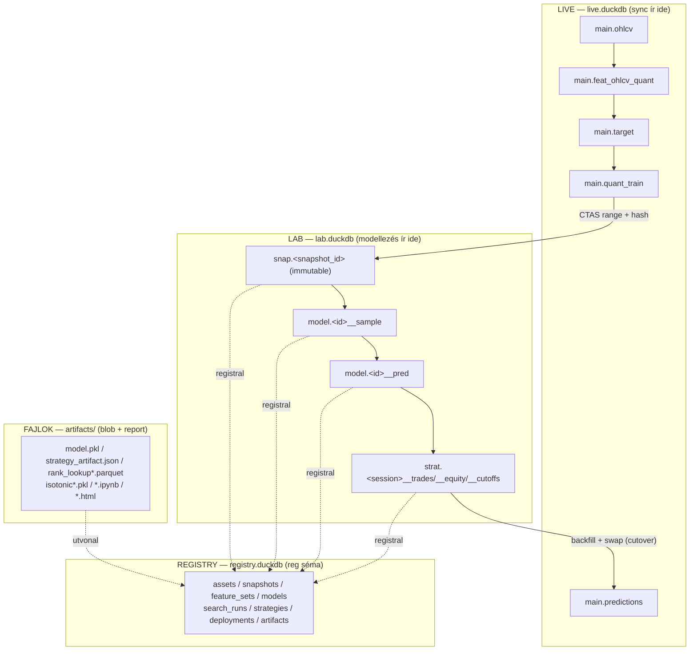
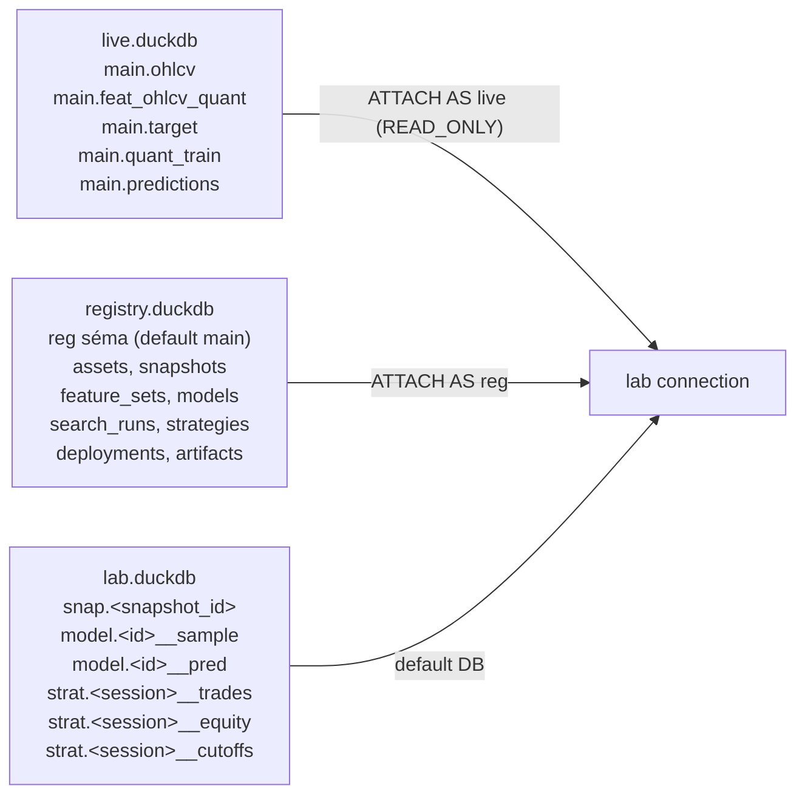
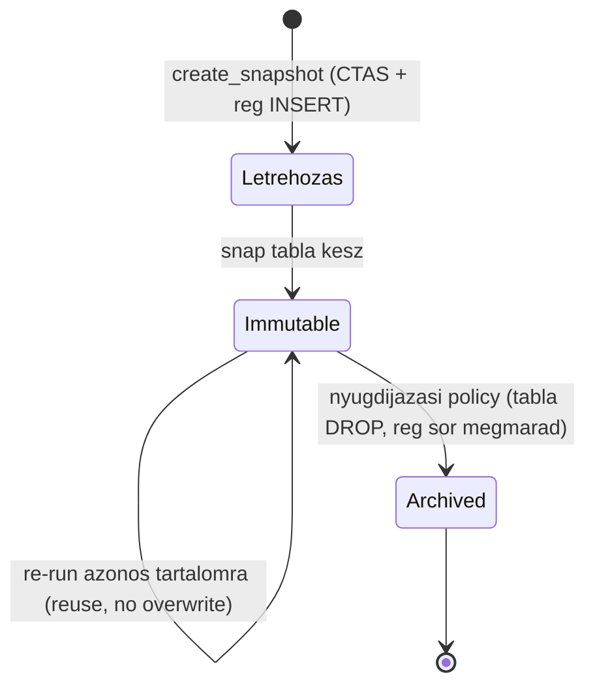
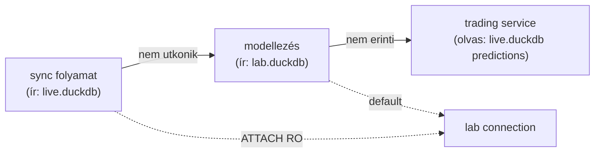

# 0002 — Adat-architektúra (Tárolási Topológia)

ChronoQuant DuckDB-natív, 3-fájlos tárolási topológiát használ. Az élő adat, a
modellezési labor és a katalógus külön DuckDB fájlban él — írás szerint szétválasztva,
ATTACH-csal olvasásra egyesítve.

---

## Overview



A három fájl írás szerint szét van választva, de egyetlen connectionből olvasásra
egyesíthető ATTACH-cal (lásd alább). Ez garantálja, hogy a modellezés és az élő
trading egyszerre futhat anélkül, hogy ütköznének.

---

## A 3-fájlos topológia

### Fájlok és séma-kiosztás



| Séma | DB fájl | Objektumok | Mutability |
|------|---------|-----------|-----------|
| `main` | `live.duckdb` | ohlcv, feat_ohlcv_quant, target, predictions, quant_train | élő, frissül |
| `snap` | `lab.duckdb` | `snap."<snapshot_id>"` — befagyasztott range | **immutable** |
| `model` | `lab.duckdb` | `model."<model_id>__sample"`, `model."<model_id>__pred"` | per-modell |
| `strat` | `lab.duckdb` | `strat."<session_id>__trades/__equity/__cutoffs"` | per-session |
| `reg` | `registry.duckdb` | assets, snapshots, feature_sets, models, search_runs, strategies, deployments, artifacts | katalógus |

### Fizikai elrendezés

```
database/
  solusdt/
    solusdt.duckdb         <- LIVE  (sync ír ide)
    solusdt_lab.duckdb     <- LAB   (modellezés, strategy, predict ír ide)
  _registry/
    registry.duckdb        <- REGISTRY  (globális katalógus, asset-agnosztikus)
```

### ATTACH elérési minta

Egy lab connection, amelyből minden joinolható:

```sql
-- A lab DB a default (open_lab_connection visszaadja)
ATTACH 'database/solusdt/solusdt.duckdb'    AS live (READ_ONLY);
ATTACH 'database/_registry/registry.duckdb' AS reg;
-- snap * live.quant_train * reg.models egy lekérdezésből elérhetok
```

A hívók nem nyúlnak közvetlenül a path-okhoz — az `utils` gateway API adja a
connectiont (`utils.open_lab_connection`, `utils.open_registry_connection`).

---

## Sémák részletezése

### `main` séma — live.duckdb

Az operatív réteg. A sync percenként frissíti. Append-only upsert minden táblán
(`open_time` PK). Egyetlen writer: a `data_handling` sync folyamat.

| Tábla | Tartalom |
|-------|---------|
| `ohlcv` | 1 perces OHLCV candle-k Binance-ről |
| `feat_ohlcv_quant` | Kvantitatív feature-ök (`feat_` prefix) |
| `target` | fw60 forward outcome-ok (long/short MFE) |
| `quant_train` | Ad-hoc join: feat_* + target oszlopok |
| `predictions` | Élő modell-pontszámok + `long_model_id` / `short_model_id` stamp |

### `snap` séma — lab.duckdb

Immutable befagyasztott range-másolatok. Minden snapshot `CREATE TABLE IF NOT
EXISTS` szemantikával jön létre; a tartalom soha nem íródik felül.

A `snapshot_id` formátuma: `{asset}_fw{h}_{range}__{hash8}`
(pl. `solusdt_fw60_2023__a37d2703`).

Részletek: → [1400_snapshots.md](methodology_doc/1400_snapshots.md)

### `model` séma — lab.duckdb

Egy-egy modellhez tartozó kicsi táblák:

| Tábla minta | Tartalom |
|-------------|---------|
| `model."<id>__sample"` | Hourly sample + fold_id (walk-forward CV), ~tízezer sor |
| `model."<id>__pred"` | Teljes snapshot range offline predikciói `(open_time, pred)` |

A predikció NEM fúzódik a snapshotba — a snapshot hash-e és reprodukálhatósága
sértetlen marad. A `snap ⋈ model.__pred` join `open_time`-on 1:1.

### `strat` séma — lab.duckdb

A strategy-kalibráció kimenete (parquet helyett DuckDB tábla):

| Tábla minta | Tartalom |
|-------------|---------|
| `strat."<session>__trades"` | Trade ledger (entry/exit time, direction, hold_minutes, …) |
| `strat."<session>__equity"` | Kumulatív MFE proxy equity curve per trade |
| `strat."<session>__cutoffs"` | Per-direction decile cutoffok a kalibrált scored-table-ből |

Az UI és a deploy folyamat ezekből olvassa az élesítés előtti teljesítményadatokat.

### `reg` séma — registry.duckdb

8 tábla, normalizált igazságforrás. A séma a `registry.duckdb` **default (main)**
sémájában él (ATTACH alias = `reg`). Részletek: → [1500_registry.md](methodology_doc/1500_registry.md)

---

## Snapshot és immutability

A snapshot az egyetlen pont, ahol a változékony élő adat rögzül. Minden modell
egy konkrét, soha többé nem változó adatállapotból tanul.



A `content_sha256` és `feature_set_hash` biztosítják a reuse-detektálást és a
reprodukálhatóságot. Részletek: → [1400_snapshots.md](methodology_doc/1400_snapshots.md)

---

## Miért 3 fájl és nem 1?

A single-writer korlát: ha az élő trading/sync folyamatosan írja a DB-t, a
modellezés nem tud ugyanabba írni. A 3-fájlos szétválasztás garantálja:



Egy modell-újrabecslés a `lab.duckdb`-be ír — az élő `main.predictions` táblát
nem érinti. A két folyamat párhuzamosan futhat.

---

## Kapcsolódó dokumentumok

| Téma | Hivatkozás |
|------|-----------|
| Snapshot réteg — miért és hogyan | [1400_snapshots.md](methodology_doc/1400_snapshots.md) |
| Registry séma + életciklus | [1500_registry.md](methodology_doc/1500_registry.md) |
| Éles folyamat (sync → predict → trade) | [0003_runtime_flow.md](0003_runtime_flow.md) |
| Modell életciklus (snapshot → deploy) | [0004_model_lifecycle.md](0004_model_lifecycle.md) |
| quant_train metodológia | [methodology_doc/4000_quant_train.md](methodology_doc/4000_quant_train.md) |
