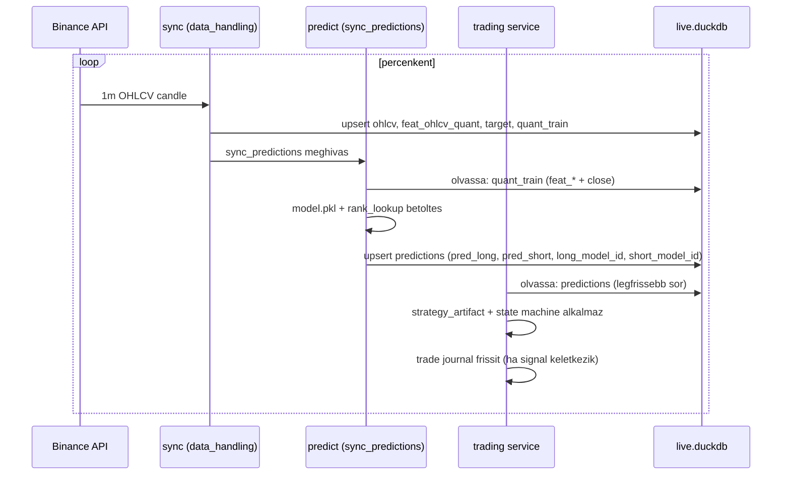
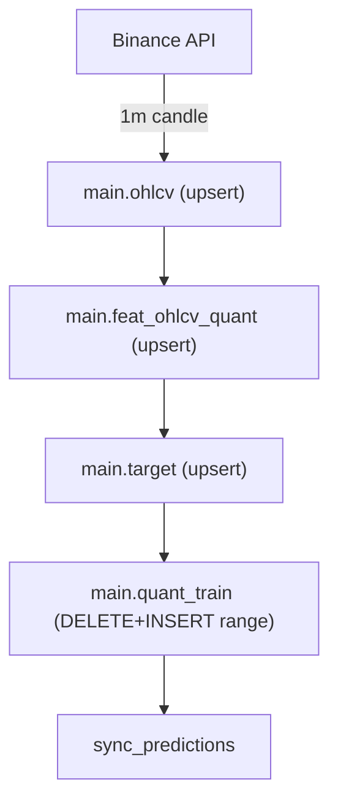
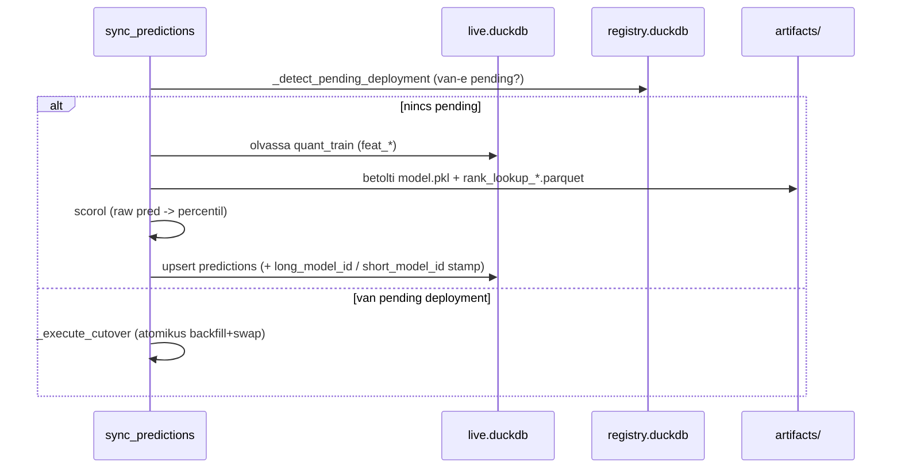
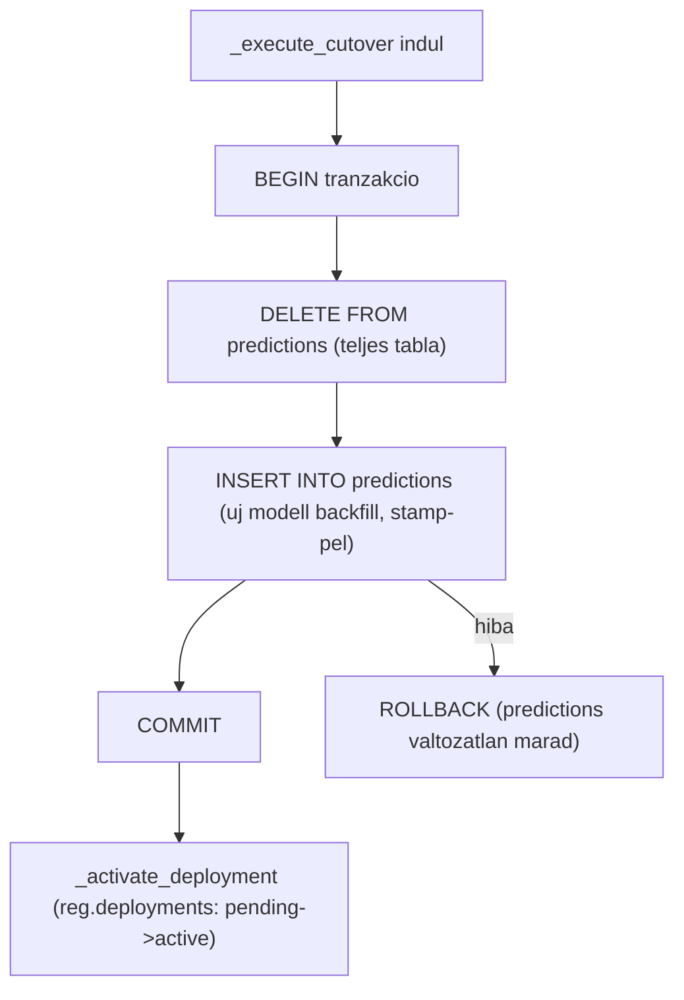
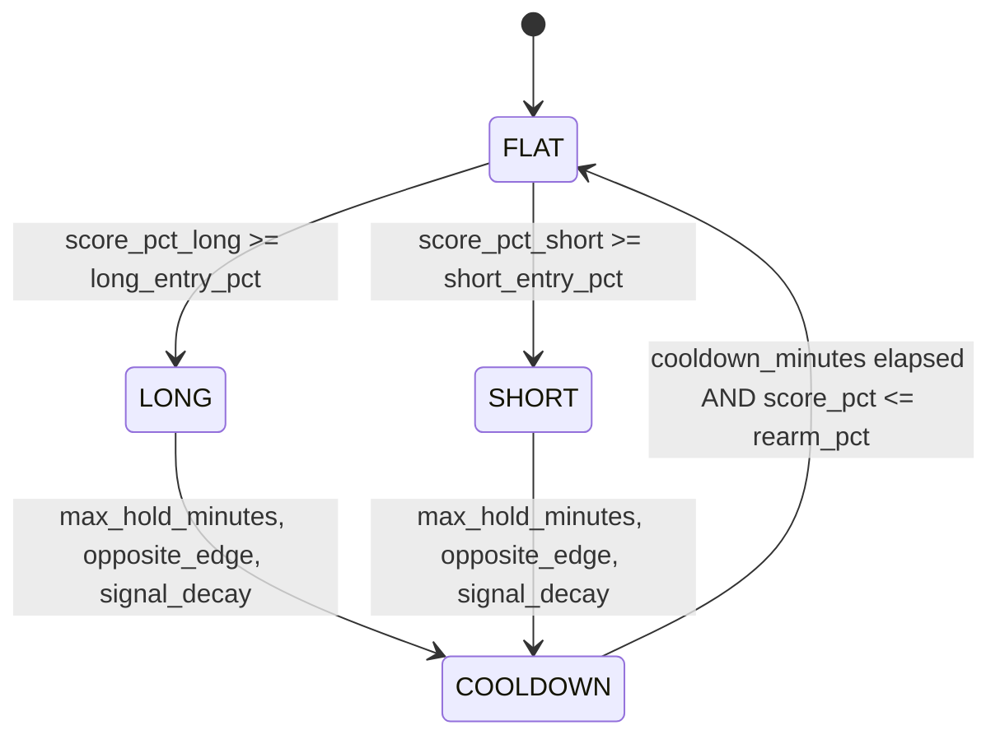

# 0003 — Éles Folyamat (Runtime Flow)

Az éles (production) folyamat három egymással laza csatolású ciklus: a **sync**
percenként frissíti az élő adatot, a **live predict** generálja a modell-pontszámokat,
a **trading service** alkalmazza a kalibrált stratégiát. Mindhárom a `live.duckdb`-n
kommunikál — közvetlen függőség nélkül.

---

## Overview



A trading service soha nem lát részleges `predictions` táblát: a deploy/cutover
egyetlen tranzakcióban cseréli az összes sort (lásd lent).

---

## Sync ciklus

A `data_handling` sync folyamat (`02_sync_pipeline.py`) az operatív réteg egyedüli
writere. Lépések:



Minden lépés **idempotens upsert** — újrafuttatás nem duplikál. Az `open_time`
az összes tábla primary key-e. A `quant_train` a legutóbbi elérhető range
DELETE+INSERT-tel frissül (nem full rebuild).

---

## Live predict (sync_predictions)

A `sync_predictions` a live predict lépés: a `quant_train` legfrissebb sorait
scorolja az aktív modellekkel, és beírja a `predictions` táblába.



### Stamp oszlopok

Minden predictions sor tartalmazza:
- `long_model_id` — melyik modell generálta a long predikciót
- `short_model_id` — melyik modell generálta a short predikciót

A stamp lehetővé teszi, hogy egy predictions sor egyértelműen visszakövethető
legyen az azt gyártó modellre.

---

## Deploy észlelése és cutover

A deploy **registry-szándék alapú**: a `reg.deployments` tábla egy `pending`
státuszú sort kap (a `06_trigger_deploy.py` CLI inserti), és a következő sync
ciklusban a `sync_predictions` észleli és végrehajtja az atomikus cserét.

```mermaid
sequenceDiagram
  participant CLI as 06_trigger_deploy.py
  participant REG as registry.duckdb
  participant SP as sync_predictions
  participant DB as live.duckdb

  CLI->>REG: INSERT reg.deployments (status='pending', strategy_id)
  Note over CLI,REG: a CLI csak registry-t ír, nem predictions-t

  loop kovetkezo sync ciklus
    SP->>REG: _detect_pending_deployment
    REG-->>SP: pending deployment talalt
    SP->>SP: _execute_cutover
    Note over SP: 1. feloldja strategy -> model_id_long / short
    Note over SP: 2. betolti model.__pred tablabol a teljes range predikcioit
    Note over SP: 3. BEGIN; DELETE FROM predictions; INSERT INTO predictions; COMMIT
    Note over SP: (DuckDB MVCC: trading soha nem lat fele tablat)
    SP->>REG: _activate_deployment (pending -> active, regi -> archived)
  end
```

### Atomicitás garanciája



A DuckDB MVCC biztosítja, hogy a trading service nem lát részleges táblát: vagy
a teljes régi állapotot olvassa, vagy a teljesen felváltott új állapotot.

---

## Trading service

A trading service a `predictions` táblát olvassa, és a kalibrált `strategy_artifact.json`
döntési paramétereit alkalmazza. Saját state machine-t futtat.



A service betölti:
- `strategy_artifact.json` — döntési paraméterek (`decision_params`)
- `rank_lookup_long/short.parquet` — percentil-kalibráció (raw score → percentil)
- `isotonic_long/short.pkl` — isotonic kalibráció (alternatív, fallback)

Ezek a fájl-artefaktok az `artifacts/<session_id>/` könyvtárban élnek. A service
nem olvassa közvetlenül sem a strategy-, sem a predictions-táblát — csak a predictions
DuckDB táblát és a fájl-artefaktokat.

---

## Rollback

Ha a deploy visszavonandó, az előző `strategy_id` a `reg.deployments.previous_strategy_id`
mezőből olvasható. Rollback:

```
06_trigger_deploy.py --strategy-session-id <previous_strategy_id>
```

Ez új `pending` sort insertál; a következő sync ciklus végrehajtja a visszacserét.
A lab adat (`model.__pred` táblák) megmarad a lab DB-ben — a visszacsere nem kíván
újratréninget.

---

## Kapcsolódó dokumentumok

| Téma | Hivatkozás |
|------|-----------|
| Tárolási topológia (3 fájl, sémák) | [0002_data_architecture.md](0002_data_architecture.md) |
| Modell életciklus (hogyan keletkezik a pred tábla) | [0004_model_lifecycle.md](0004_model_lifecycle.md) |
| Registry séma + deployments tábla | [methodology_doc/1500_registry.md](methodology_doc/1500_registry.md) |
| Snapshot + immutability | [methodology_doc/1400_snapshots.md](methodology_doc/1400_snapshots.md) |
| Trading state machine | [methodology_doc/7100_live_trading.md](methodology_doc/7100_live_trading.md) |
