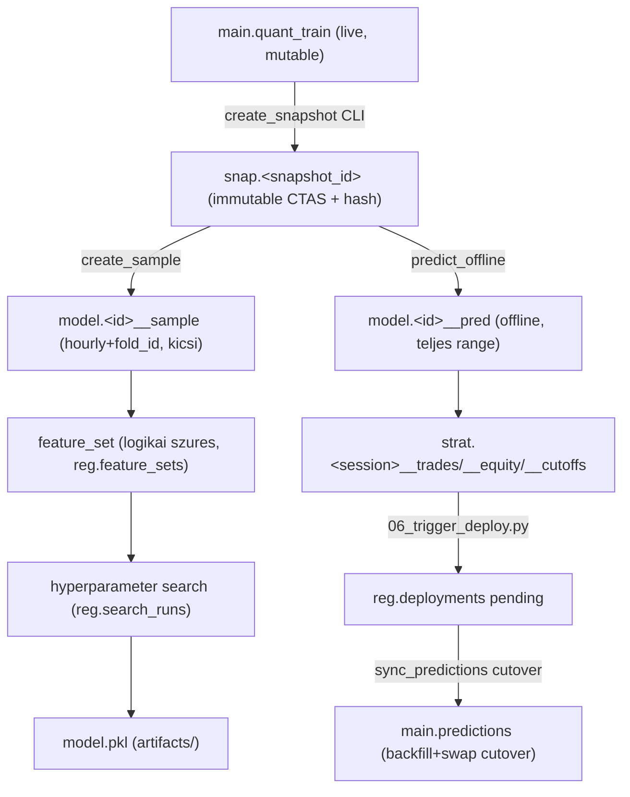
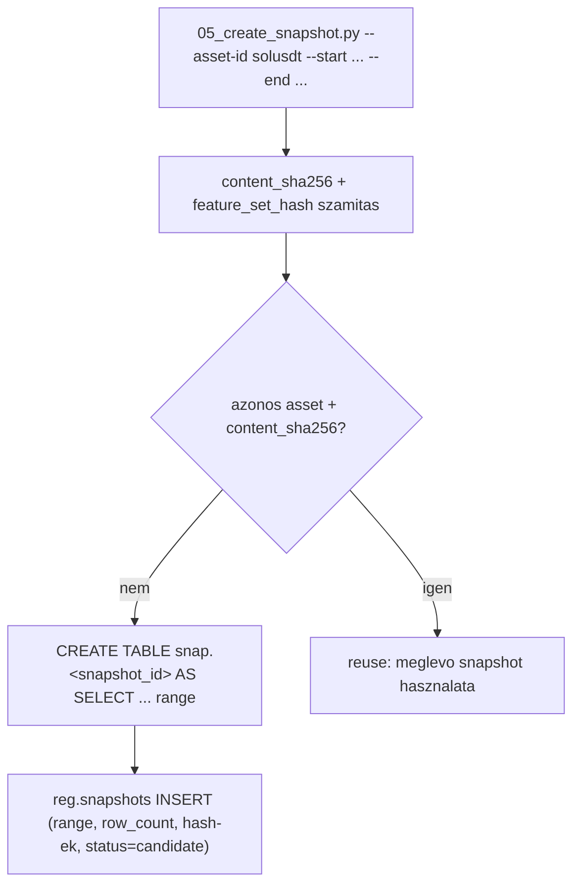
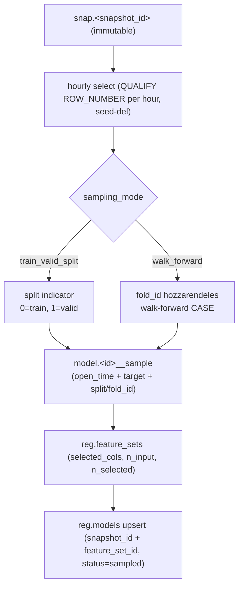
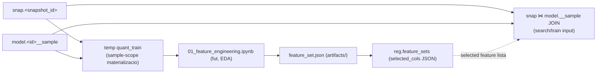
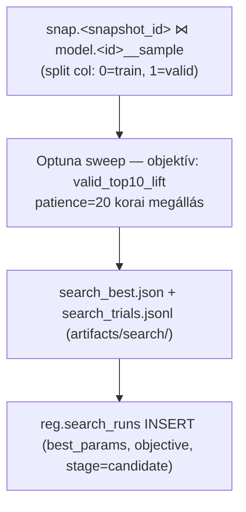
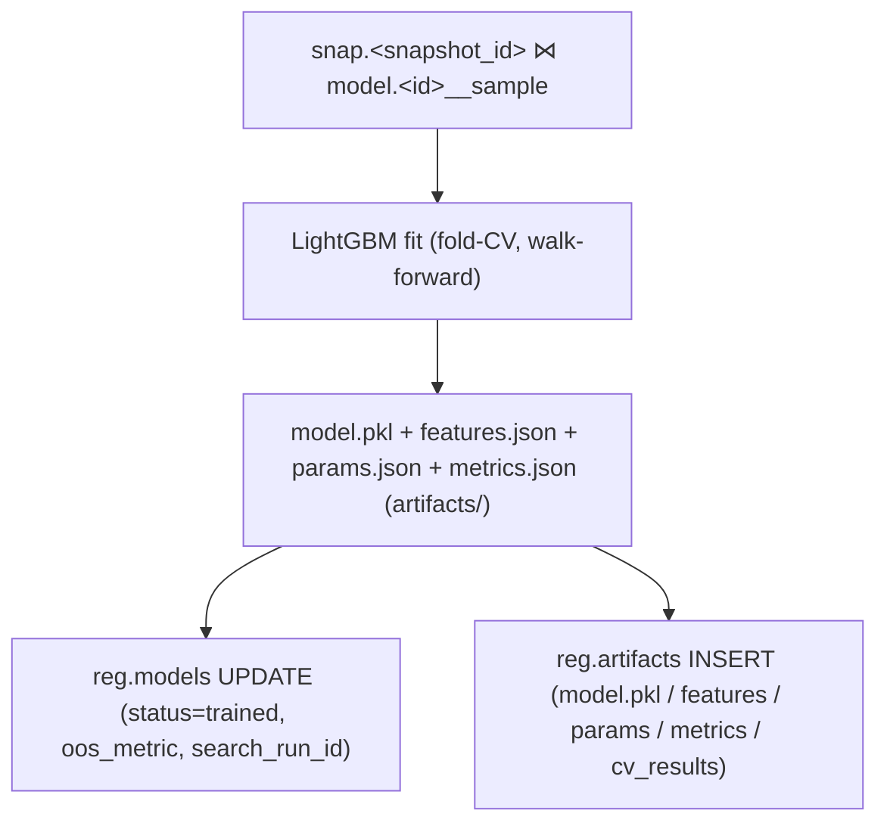
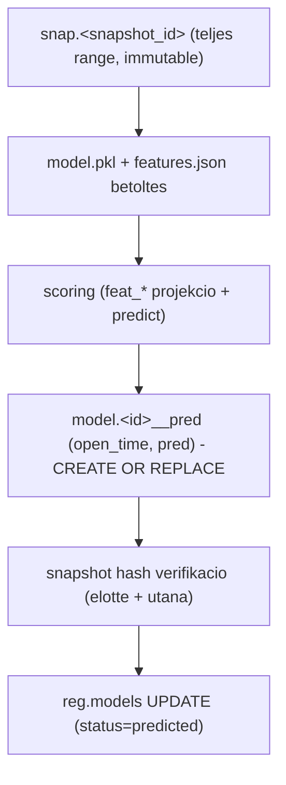
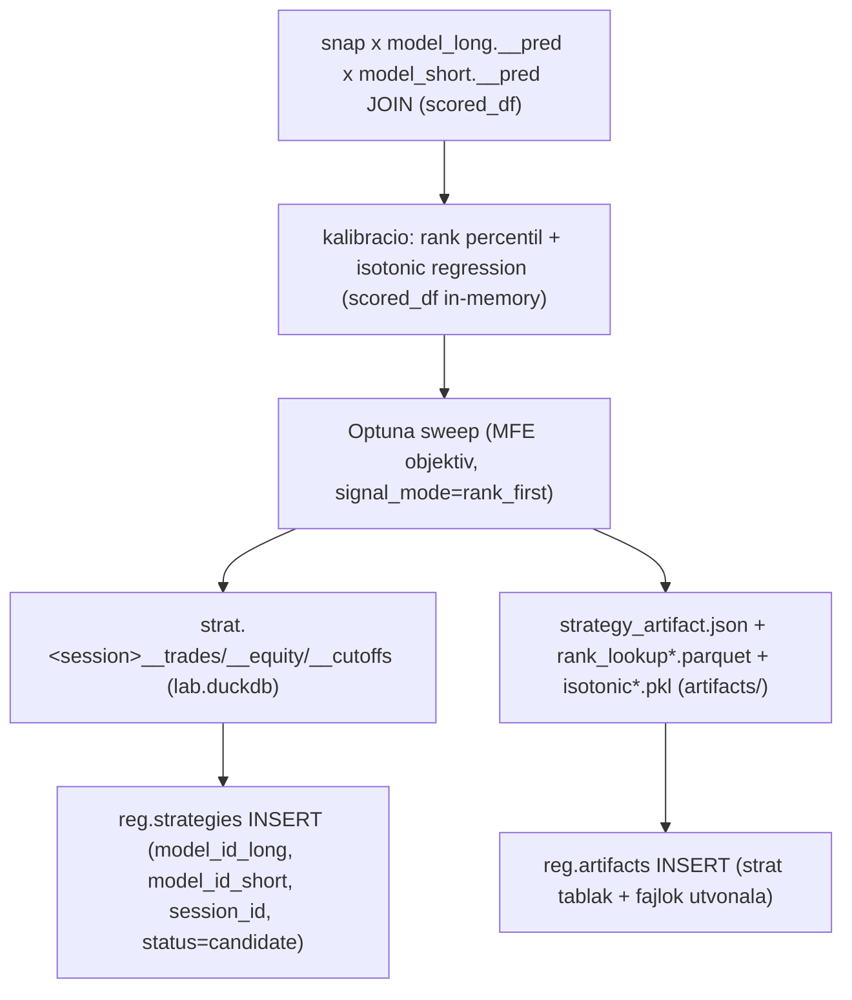
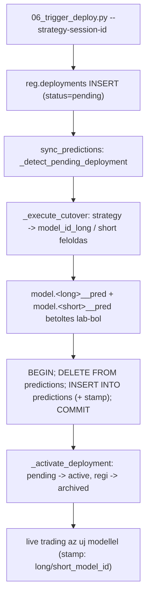
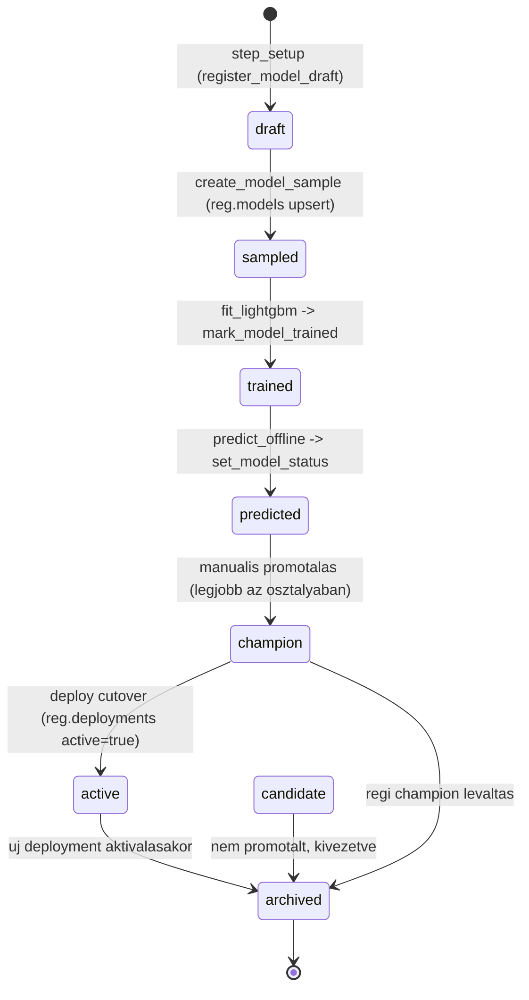

# 0004 — Modell Életciklus (Model Lifecycle)

A teljes modellfejlesztési és élesítési folyamat: snapshot befagyasztástól a live
predictions backfill+swap cutoverig. Minden lépés DuckDB-natív — a modellezési
adat a `lab.duckdb`-ben él, a registry (`registry.duckdb`) köti össze a lánc
elemeit, a live predikció az élesítés után a `live.duckdb` `predictions` táblájába kerül.

---

## Overview

A registry minden lépésnél kap provenance-bejegyzést. A státusz-lánc:
`draft → sampled → trained → predicted → (strategy candidate) → deployed → archived`

---

## 1. Snapshot (adatállapot rögzítése)

A fejlesztési folyamat forrása a `live.quant_train` egy befagyasztott
range-másolata. Ez az egyetlen pont, ahol a változékony élő adat rögzül.

A `snapshot_id` formátuma: `{asset}_fw{h}_{range}__{hash8}`
(pl. `solusdt_fw60_2023__a37d2703`).

Részletek: → [1400_snapshots.md](../methodology_doc/1400_snapshots.md)

---

## 2. Sample (mintavétel a snapshotból)

A sampling az immutable snapshot fölött dolgozik. Forrása a `snap."<snapshot_id>"`
tábla (nem a `quant_train`), kimenete `model."<model_id>__sample"` DuckDB tábla.

Az aktív champion modellek `train_valid_split` módot használnak: egyetlen kronológiai
felosztás, `split` TINYINT oszloppal (0=train, 1=valid). A legacy `walk_forward` mód
`fold_id` TINYINT oszlopot produkál (0=train-only, 1..n=valid fold).

A sample kicsi (~tízezer sor hourly felbontásban). A feat_* oszlopok a snapshotban
maradnak — a downstream lépések közvetlen `snap."<snapshot_id>" ⋈ model."<model_id>__sample"`
joinnal dolgoznak (nincs per-modell feature-másolat).

**Train/valid split paraméterek (aktív, champion modellek):**
`train_start`, `train_end`, `valid_start`, `valid_end` dátum határok;
`feature_lookback_embargo_minutes=240` (train eleje); `target_purge_minutes=60` (train vége).

**I6 garantálva:** Egy `model_id`-hez pontosan egy `target_name` tartozik (`config/models.json`).

Részletes invariáns összefoglaló (I1–I7): → [4100_quant_train.md](4100_quant_train.md#invariánsok--sample-scoped-pipeline)

---

## 3. Feature Engineering

A feature engineering az adott modell mintáját materializálja egy lokális
`quant_train` munkatáblába a `snap."<snapshot_id>" ⋈ model."<model_id>__sample"`
joinból. Kimenete továbbra is egy **logikai feature_set**: a kiválasztott
oszlopok listája, amelyet a registry tárol.

A search és a train lépés a snapshotból és a sample-ból közvetlenül építi a
betanítási mátrixot — columnar projekcióval, fizikai feature-másolat nélkül.

**I1 kikényszerítve (FE input):** `materialize_sample_scoped_quant_train` ellenőrzi,
hogy a TEMP `quant_train` sorszáma == `model.__sample` sorszáma.
**I7 garantálva:** A `feature_set.json["provenance"]` tartalmazza: `snapshot_id`,
`sample_table`, `sample_rows`, `joined_rows`, `source_contract: "snap ⋈ model.__sample"`.

---

## 4. Hyperparameter Search

Az objektív: `valid_top10_lift` (top 10% predikciók átlagos y_true értéke mínusz overall
átlag a valid seten). A legjobb trial kiválasztása: max `valid_top10_lift` elsőrendű
kritérium, `train_valid_gap` másodlagos tiebreaker (top-5 jelölt közül a legkisebb gap-et preferálja).

A search best-effort módon írja a registry-t: egy hiba a search futásában nem
veszíti el a kész eredményt.

---

## 5. Train

A tréning a `snap ⋈ model.__sample` joinból dolgozik, kimenete a model bináris és
az artifact fájlok.

A final modell **az összes train során** refittelt (a fold CV csak metrika-mérés).

---

## 6. Offline Predict

A predikció a snapshot teljes range-ét scorolja a frissen betanított modellel.
A predikció **nem** íródik vissza a snapshotba — külön `model.__pred` tábla keletkezik.

A `snap ⋈ model.__pred` join `open_time`-on 1:1. A snapshot immutability
sértetlen: a hash a predict lépés előtt és után egyezik.

---

## 7. Strategy Kalibráció

A strategy a `snap ⋈ model_long.__pred ⋈ model_short.__pred` joinból dolgozik —
nincs parquet-mozgatás.

A live service csak a fájl-artefaktokat tölti be futáskor (`strategy_artifact.json`,
`rank_lookup_*.parquet`, `isotonic_*.pkl`) — az `strat.*` DuckDB táblák az UI-nak
és validációnak szólnak.

---

## 8. Deploy és Cutover

A deploy a modell-életciklus utolsó fázisa: az élesítés atomikusan cseréli a
`predictions` táblát és átállítja a registry-t.

Rollback: az előző `strategy_id` a `reg.deployments.previous_strategy_id`-ben
tárolódik. Újra-élesítéssel (`06_trigger_deploy.py`) a következő sync ciklus
visszacsinálja a backfill+swap-ot.

Részletek: → [0003_runtime_flow.md](0003_runtime_flow.md)

---

## Reg.models státusz-lánc

A `champion` státusz manuális promóciót igényel — ez a gate, amely megelőzi, hogy
egy validálatlan modell automatikusan élesedjen.

---

## Részleges retrain döntési tábla

A registry hash-ek (`content_sha256`, `feature_set_hash`) automatikusan detektálják,
mit lehet újrahasználni:

| Mi változott | Snapshot | Sample | FE | Search | Train | Predict | Deploy |
|--------------|:---:|:---:|:---:|:---:|:---:|:---:|:---:|
| Csak hyperparam | – | – | – | Igen | Igen | Igen | Igen |
| Új feature_set (ua. range) | – | – | Igen | Igen | Igen | Igen | Igen |
| Új range | Igen | Igen | Igen | Igen | Igen | Igen | Igen |
| Csak újra-élesítés (kész modell) | – | – | – | – | – | – | Igen |

---

## Kapcsolódó dokumentumok

| Téma | Hivatkozás |
|------|-----------|
| Tárolási topológia (3 fájl, sémák) | [0002_data_architecture.md](0002_data_architecture.md) |
| Éles folyamat (sync → predict → trade → cutover) | [0003_runtime_flow.md](0003_runtime_flow.md) |
| Snapshot réteg — miért és hogyan | [1400_snapshots.md](../methodology_doc/1400_snapshots.md) |
| Registry séma + életciklus | [1500_registry.md](../methodology_doc/1500_registry.md) |
| Sampling metodológia | [5400_sampling.md](../methodology_doc/5400_sampling.md) |
| Hyperparameter search | [5500_hyper_param_search.md](../methodology_doc/5500_hyper_param_search.md) |
| Strategy metodológia | [6000_strategy.md](../methodology_doc/6000_strategy.md) |
| quant_train tábla + I1-I7 invariánsok | [4100_quant_train.md](4100_quant_train.md) |
| Sampling kód-ref (create_model_sample) | [5300_create_sample.md](5300_create_sample.md) |
| Pipeline / predict / provenance kód-ref | [5530_pipeline_predict_provenance.md](5530_pipeline_predict_provenance.md) |
