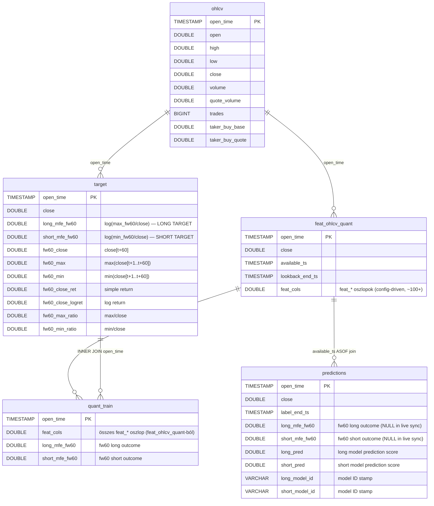

# Database — DuckDB Schema

A ChronoQuant egyetlen DuckDB fájlban tárolja az összes piaci adatot, feature-t és predikciót egy assetenként.

---

## Áttekintés



Minden tábla `open_time` TIMESTAMP primary key-en alapul. Az összes timestamp **UTC**, `YYYY-MM-DD HH:MM:SS` formátumban tárolva.

**DuckDB fájl helye:** `database/<asset_id>/<asset_id>.duckdb`

Aktív asset: `solusdt` → `database/solusdt/solusdt.duckdb`

Az elérési út mindig a `config/assets.json` → `utils.load_asset_config(asset_id)` → `db_path` mezőjéből jön.

---

## Táblák

### ohlcv

**Cél:** Nyers, változatlan Binance 1-perces kline adatok. A pipeline alapja — minden downstream tábla ebből épül fel.

**Beírási mód:** append-only. Csak a tárolt `MAX(open_time)`-nál újabb sorok kerülnek be (`_insert_append_only`). Nincs upsert, nincs törlés.

| Oszlop | Típus | Leírás |
|--------|-------|--------|
| `open_time` | `TIMESTAMP` (PK) | Gyertya nyitásának időpontja, UTC. Minden sor egyedi. |
| `open` | `DOUBLE` | Nyitóár USDT-ben |
| `high` | `DOUBLE` | Legmagasabb ár az 1 perces ablakban |
| `low` | `DOUBLE` | Legalacsonyabb ár az 1 perces ablakban |
| `close` | `DOUBLE` | Záróár USDT-ben |
| `volume` | `DOUBLE` | Forgalom base asset-ben (SOL) |
| `quote_volume` | `DOUBLE` | Forgalom quote asset-ben (USDT) |
| `trades` | `BIGINT` | Kötések száma az 1 perces ablakban |
| `taker_buy_base` | `DOUBLE` | Taker vevő forgalom base asset-ben (SOL) |
| `taker_buy_quote` | `DOUBLE` | Taker vevő forgalom quote asset-ben (USDT) |

**Nem tárolt Binance mezők:** `close_time` (redundáns), `ignore` (deprecated).

```sql
CREATE TABLE IF NOT EXISTS ohlcv (
    open_time       TIMESTAMP PRIMARY KEY,
    open            DOUBLE,
    high            DOUBLE,
    low             DOUBLE,
    close           DOUBLE,
    volume          DOUBLE,
    quote_volume    DOUBLE,
    trades          BIGINT,
    taker_buy_base  DOUBLE,
    taker_buy_quote DOUBLE
)
```

---

### target

**Cél:** Folytonos forward logreturn outcome-ok (fw60). Az `ohlcv.close` alapján, DuckDB SQL ablakfüggvényekkel számítva. Teljes rebuild minden `sync_targets` híváskor.

**Beírási mód:** DELETE + INSERT a teljes tartományra (`insert_target`). Az előre definiált időablakban (`ROWS BETWEEN 1 FOLLOWING AND 60 FOLLOWING`) az aktuális bar (`t`) NEM szerepel a forward window-ban.

**NULL sorok:** Az utolsó 60 sor minden fw60 outcome oszlopban `NULL` — nincs elegendő jövőbeli adat.

**Kód referencia:** [`_doc_/3100_sync_targets.md`](3100_sync_targets.md) | **Metodológia:** [`_doc_/3000_targets.md`](../methodology_doc/3000_targets.md)

| Oszlop | Típus | Leírás |
|--------|-------|--------|
| `open_time` | `TIMESTAMP` (PK) | Bar nyitási ideje, UTC |
| `close` | `DOUBLE` | Bar záróára (referencia close[t]) |
| `fw60_close` | `DOUBLE` | close[t+60] — nyers forward close |
| `fw60_max` | `DOUBLE` | max(close[t+1:t+60]) |
| `fw60_min` | `DOUBLE` | min(close[t+1:t+60]) |
| `fw60_close_ret` | `DOUBLE` | close[t+60] / close[t] − 1 |
| `fw60_close_logret` | `DOUBLE` | log(close[t+60] / close[t]) |
| `fw60_max_ratio` | `DOUBLE` | max(close[t+1:t+60]) / close[t] |
| `fw60_min_ratio` | `DOUBLE` | min(close[t+1:t+60]) / close[t] |
| **`long_mfe_fw60`** | **`DOUBLE`** | **log(max(close[t+1:t+60]) / close[t]) — LONG TARGET** |
| **`short_mfe_fw60`** | **`DOUBLE`** | **log(min(close[t+1:t+60]) / close[t]) — SHORT TARGET** |

```sql
CREATE TABLE IF NOT EXISTS target (
    open_time        TIMESTAMP PRIMARY KEY,
    close            DOUBLE,
    fw60_close       DOUBLE,
    fw60_max         DOUBLE,
    fw60_min         DOUBLE,
    fw60_close_ret   DOUBLE,
    fw60_close_logret DOUBLE,
    fw60_max_ratio   DOUBLE,
    fw60_min_ratio   DOUBLE,
    long_mfe_fw60    DOUBLE,
    short_mfe_fw60   DOUBLE
)
```

---

### feat_ohlcv_quant

**Cél:** Technikai indikátorok és feature-ök (Polars LazyFrame pipeline). Séma config-driven — az oszlopok száma és neve a `config/features.json` indikátor konfigurációjától függ (~100+ `feat_*` oszlop).

**Beírási mód:** append-only (`_insert_append_only`). A séma automatikusan bővül az első `insert_feat_ohlcv_quant` hívásnál (tábla létrehozása) és ha új feature oszlopok jelennek meg.

**t-1 lag:** Minden OHLCV-alapú feature 1 barral el van tolva (`shift(1)`) a `compute_features_polars` hívásban. A P2 (időindexes) feature-ök kivételek — ezek nem kerülnek eltolásra (`T_MINUS_1_SKIP`).

| Oszlop | Típus | Leírás |
|--------|-------|--------|
| `open_time` | `TIMESTAMP` (PK) | Bar nyitási ideje, UTC |
| `close` | `DOUBLE` | Bar záróára (referencia) |
| `available_ts` | `TIMESTAMP` | Mikor válik elérhetővé a feature (== `open_time`, t-1 lag garantált) |
| `lookback_end_ts` | `TIMESTAMP` | A lookback ablak vége (== `open_time`) |
| `feat_*` | `DOUBLE` / `BOOLEAN` | Config-driven feature oszlopok, `feat_` prefix |

Az ASOF join (`predictions` ↔ `feat_ohlcv_quant`) az `available_ts` oszlopon alapul: `p.open_time >= f.available_ts`.

---

### predictions

**Cél:** Champion modellek által generált predikciós pontszámok. Egy sor per `open_time`, unified long+short output.

**Beírási mód:** append-only (`_insert_append_only`). A séma rögzített — `ensure_tables` hozza létre.

| Oszlop | Típus | Leírás |
|--------|-------|--------|
| `open_time` | `TIMESTAMP` (PK) | Bar nyitási ideje, UTC |
| `close` | `DOUBLE` | Bar záróára (az `ohlcv.close`-val egyezik) |
| `label_end_ts` | `TIMESTAMP` | A forward window vége: `open_time + fw_minutes` |
| `long_mfe_fw60` | `DOUBLE` | Fw60 long outcome (target join-ból; live sync esetén `NULL`) |
| `short_mfe_fw60` | `DOUBLE` | Fw60 short outcome (target join-ból; live sync esetén `NULL`) |
| `long_pred` | `DOUBLE` | Long modell predikciós értéke (`predict_proba` vagy `predict`, config szerint) |
| `short_pred` | `DOUBLE` | Short modell predikciós értéke (`predict_proba` vagy `predict`, config szerint) |
| `long_model_id` | `VARCHAR` | A long predikciót generáló model ID stamp |
| `short_model_id` | `VARCHAR` | A short predikciót generáló model ID stamp |

```sql
CREATE TABLE IF NOT EXISTS predictions (
    open_time       TIMESTAMP PRIMARY KEY,
    close           DOUBLE,
    label_end_ts    TIMESTAMP,
    long_mfe_fw60   DOUBLE,
    short_mfe_fw60  DOUBLE,
    long_pred       DOUBLE,
    short_pred      DOUBLE,
    long_model_id   VARCHAR,
    short_model_id  VARCHAR
)
```

**Legacy oszlopok:** `dataset_split`, `fold_id`, valamint a régi `trg_*` bináris target oszlopok — verziózott migrációk (v3, v4) távolítják el `ALTER TABLE DROP COLUMN`-nal.

---

### quant_train

**Cél:** Model-ready join tábla — az összes `feat_*` feature és a két aktív fw60 target oszlop (`long_mfe_fw60`, `short_mfe_fw60`) egyetlen lekérdezhető táblaként. A feature engineering, sampling és LightGBM tanítás kiindulópontja.

**Forrás:** `feat_ohlcv_quant` INNER JOIN `target` ON `open_time`. NULL target sorok kizárva.

**Beírási mód:** Ad-hoc rebuild, NEM a live sync pipeline része. Tanítás előtt futtatandó:
- Full rebuild: `CREATE OR REPLACE TABLE` (determinisztikus)
- Range rebuild: `DELETE + INSERT` a megadott `open_time` ablakra

**CLI:** `uv run python src/data_handling/03_build_quant_train.py [--start YYYY-MM-DD] [--end YYYY-MM-DD]`

**Kód referencia:** [`_doc_/4100_quant_train.md`](4100_quant_train.md)

| Oszlop | Típus | Leírás |
|--------|-------|--------|
| `open_time` | `TIMESTAMP` (PK) | Bar nyitási ideje, UTC. Egyedi — INNER JOIN garantálja. |
| `feat_*` | `DOUBLE` | Az összes `feat_ohlcv_quant`-ban szereplő feature oszlop (t-1 lag már alkalmazva) |
| `long_mfe_fw60` | `DOUBLE` | Fw60 long outcome: `log(max_fw60 / close[t])`. NULL sorok kizárva. |
| `short_mfe_fw60` | `DOUBLE` | Fw60 short outcome: `log(min_fw60 / close[t])`. NULL sorok kizárva. |

> **Megjegyzés:** A `quant_train` nem tartalmaz `close`, `available_ts`, `label_end_ts` vagy predikció oszlopokat.
> A legacy `trg_*` boolean target elnevezés NEM kerül felhasználásra ebben a rétegben.

---

## Általános konvenciók

| Szabály | Részlet |
|---------|---------|
| **Timestamp formátum** | UTC, `YYYY-MM-DD HH:MM:SS` (naiv string, UTC-ként értelmezve) |
| **Epoch ms** | Csak Binance API-val való kommunikációban, nem tárolva |
| **Config gateway** | Mindig `utils.load_asset_config(asset_id)` → `db_path` |
| **Idempotens upsert** | Minden sync operáció biztonságosan újrafuttatható |
| **Zonemap** | Sorok `open_time` szerint rendezve kerülnek be (DuckDB range query optimalizálás) |
