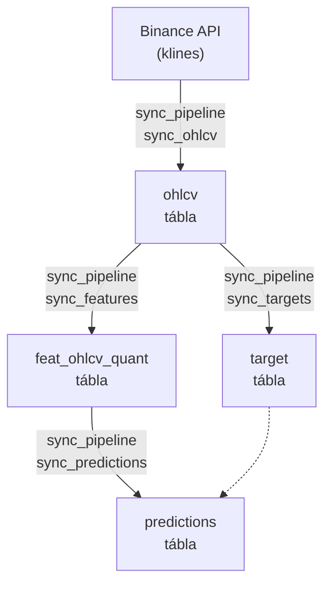

# src/data_handling/ — Database Module

A `src/data_handling/` modul kezeli az összes piaci adatot: Binance OHLCV szinkront, feature számítást, target labeleket, predikciók beírását és a DuckDB store réteget. Ez a fő adatvezeték, amelyből a modeling és a UI olvas.

---

## Modul struktúra

```
src/data_handling/
├── store/                  DuckDB store réteg (írás, olvasás, validáció, statisztikák)
├── sync_tables/            Sync pipeline (ohlcv → features → targets → predictions)
├── tests/                  Pytest tesztek (smoke, sanity, perf, integration)
├── 01_validate_stats.py    CLI: DB stat riport
├── 02_sync_pipeline.py     CLI: Unified sync belépési pont (OHLCV + derived táblák)
├── 03_build_quant_train.py CLI: quant_train tábla rebuild
├── 04_backfill_predictions.py CLI: Historikus predikció gap feltöltés
├── 05_create_snapshot.py   CLI: quant_train snapshot létrehozás
└── 06_trigger_deploy.py    CLI: Deployment pending sor regisztrálás
```

Részletes dokumentáció:
- Store réteg → [1100_store.md](1100_store.md)
- Sync tables → [1200_sync_tables.md](1200_sync_tables.md)
- Tesztek → [1300_tests.md](1300_tests.md)
- DuckDB schema → [1000_database.md](1000_database.md)

---

## Adatfolyam



Minden réteg az előző réteg `MAX(open_time)` értékétől indul — az operációk egymásra épülnek és idempotensek.

---

## Entry point scriptek

### `01_validate_stats.py`

**Célja:** Gyors DB egészség-ellenőrzés — megjeleníti az összes tábla sorát, időtartományát, null arányát és lekérdezési teljesítményét.

```bash
uv run python src/data_handling/01_validate_stats.py
uv run python src/data_handling/01_validate_stats.py --asset-id solusdt
```

| Argument | Alap | Leírás |
|----------|------|--------|
| `--asset-id` | config default | Asset azonosító |

Belső hívása: `collect_duckdb_stats_report(db_path)` → `format_duckdb_stats_report(report)` → stdout.

**Tábla lista:** `["ohlcv", "target", "feat_ohlcv_quant", "predictions", "quant_train"]` (alapértelmezett a stats modulban)

---

### `02_sync_pipeline.py`

**Célja:** Unified CLI belépési pont — OHLCV Binance szinkron és derived tábla rebuild (targets, features, predictions) egy scriptből.

```bash
# Teljes sync (OHLCV + összes derived tábla)
uv run python src/data_handling/02_sync_pipeline.py

# Csak derived táblák (Binance fetch kihagyva)
uv run python src/data_handling/02_sync_pipeline.py --skip-ohlcv

# OHLCV szinkron konkrét kezdőponttól
uv run python src/data_handling/02_sync_pipeline.py --start "2024-01-01 00:00:00" --asset-id solusdt

# Csak features és predictions egy dátumtartományra
uv run python src/data_handling/02_sync_pipeline.py \
    --tables features,predictions \
    --start "2025-01-01 00:00:00" \
    --end   "2025-06-01 00:00:00" \
    --chunk-months 1
```

| Argument | Alap | Leírás |
|----------|------|--------|
| `--asset-id` | config default | Asset azonosító (`solusdt`) |
| `--start` | legkorábbi OHLCV sor | Derived rebuild / OHLCV fetch kezdete (`YYYY-MM-DD HH:MM:SS`) |
| `--end` | legújabb OHLCV sor | Derived rebuild vége (`YYYY-MM-DD HH:MM:SS`) |
| `--chunk-months` | `3` | Hónapos chunk méret features/predictions-hoz |
| `--skip-ohlcv` | — | Binance fetch kihagyása, csak derived rebuild |
| `--tables` | `ohlcv,targets,features,predictions` | Vesszővel elválasztott tábla szűkítés |

**Függőségi sorrend** (mindig betartva): `ohlcv` → `targets` (full range) → `features` (chunked) → `predictions` (chunked).

**Log fájl:** A logolás rotating file handler-rel a `database/<asset_id>/logs/` mappába ír.

---

## Konfiguráció

A modul **csak** a `src/utils.py` API-n keresztül fér hozzá konfigurációhoz:

| Függvény | Mit ad vissza |
|----------|---------------|
| `utils.load_asset_config(asset_id)` | DB elérési út, feature profil neve |
| `utils.load_features_config(asset_id)` | Indikátor konfigurációk, target config |
| `utils.load_models_config()` | Champion modellek, path-ok |
| `utils.champion_models_for_asset(model_cfg, asset_id)` | Aktív long+short modell ID-k és metaadatok |

Közvetlen JSON olvasás tiltott a `src/data_handling/` teljes kódbázisában.
