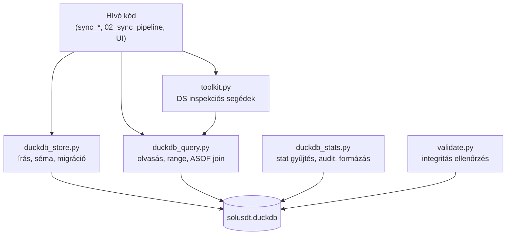

# store/ — DuckDB Store Réteg

A `src/data_handling/store/` könyvtár kezeli az összes alacsony szintű DuckDB interakciót: séma létrehozást, adatbeírást, lekérdezést, validációt és statisztikákat.

---

## Áttekintés

---

## Fájlok

### [duckdb_store.py](1110_duckdb_store.md)

DuckDB kapcsolat kezelés, séma inicializálás és adatbeírás.

**Kulcs funkciók:**
- `get_connection(db_path)` — DuckDB kapcsolat megnyitása, parent dir létrehozása
- `ensure_tables(conn)` — Verziózott migrációk futtatása (`LIVE_DB_MIGRATIONS` v1–v5, idempotens)
- `_ensure_feat_ohlcv_quant_table(conn, df)` — Dinamikus séma: tábla létrehozása vagy oszlopbővítés
- `_insert_append_only(conn, table, df)` — Core append logika `MAX(open_time)` alapon
- `insert_ohlcv(conn, df)` — OHLCV beírás (10 oszlop szűrés + append)
- `insert_feat_ohlcv_quant(conn, df)` — Feature beírás (dinamikus séma + append)
- `insert_target(conn, df)` — Target beírás (DELETE WHERE IN + INSERT)
- `insert_predictions(conn, df)` — Prediction beírás (séma DB-ből, append)
- `backfill_predictions(conn, df)` — Historikus gap-fill (INSERT OR IGNORE)
- `rebuild_quant_train(conn, start, end)` — quant_train teljes vagy range rebuild

---

### [duckdb_query.py](1120_duckdb_query.md)

Read-only lekérdezések pandas és Polars DataFrame kimenettel.

**Kulcs funkciók:**
- `_connect(db_path)` — Read-only kapcsolat, `None` ha a fájl hiányzik
- `query_range(db_path, dataset, start, end, columns)` → pandas DataFrame
- `query_range_pl(db_path, dataset, start, end, columns)` → Polars DataFrame (zero-copy)
- `dataset_columns(db_path, dataset)` → oszlopnév lista
- `dataset_exists(db_path, dataset)` → bool (tábla létezik ÉS van benne sor)
- `asof_join_predictions_features(db_path, feature_cols, start, end)` → ASOF LEFT JOIN
- `latest_open_time(db_path, dataset)` → `pd.Timestamp | None`
- OHLCV shortcut-ok: `ohlcv_dataset_exists`, `ohlcv_row_count`, `ohlcv_latest_open_time`, `ohlcv_time_stats`

---

### [duckdb_stats.py](1130_duckdb_stats.md)

DB egészség-statisztikák gyűjtése, formázása és dataset audit.

**Dataclass-ok:** `TableStats`, `TimedMetric`, `DuckDBStatsReport`

**Kulcs funkciók:**
- `collect_duckdb_stats_report(db_path, tables)` — Sorok, időtartomány, null arányok, timing smoke (1d/1w/1mo/full), GROUP BY year
- `format_duckdb_stats_report(report)` → szöveg riport stdout-ra
- `raw_manifest_audit(db_path, dataset)` — Nyers integritás audit: sorok, tartomány, null_ts, dup_ts logolása
- `log_dataset_check(db_path, dataset)` — Sor szám + időtartomány + `raw_manifest_audit` logolása

---

### [validate.py](1140_validate.md)

Integritás invariánsok ellenőrzése AssertionError-ral.

**Kulcs funkciók:**
- `assert_zero(con, sql, msg)` — SQL futtat, AssertionError ha `count > 0`
- `check_no_future_features(db_path)` — `available_ts <= open_time` mindenhol
- `check_target_no_current_bar(db_path)` — NULL tail sorok megléte

---

### [toolkit.py](1150_toolkit.md)

DS workflow segédek — dataset inspekció és összefoglalók.

**Kulcs funkciók:**
- `resolve_db_path(asset_id)` — db_path lekérés config-ból
- `list_datasets(asset_id)` — Adatot tartalmazó dataset-ek listája
- `get_dataset_columns`, `get_row_count`, `get_time_range`, `print_summary`

---

## Írási módok összefoglalója

| Tábla | Írási mód | Függvény |
|-------|-----------|----------|
| `ohlcv` | Append-only (`MAX(open_time)` alap) | `insert_ohlcv` |
| `feat_ohlcv_quant` | Append-only + dinamikus séma | `insert_feat_ohlcv_quant` |
| `target` | DELETE WHERE IN + INSERT (teljes rebuild) | `insert_target` |
| `predictions` | Append-only | `insert_predictions` |
| `predictions` | Gap-fill (INSERT OR IGNORE) | `backfill_predictions` |
| `quant_train` | Full rebuild (CREATE OR REPLACE) / Range (DELETE+INSERT) | `rebuild_quant_train` |
