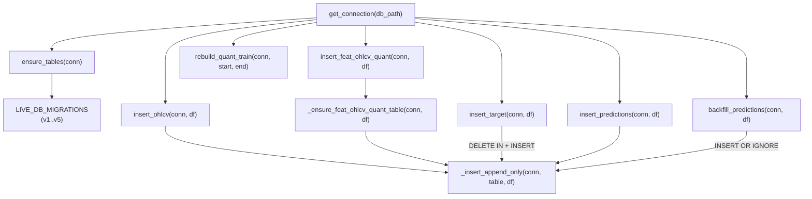

# duckdb_store.py — DuckDB Írás és Séma

`src/data_handling/store/duckdb_store.py`

Kapcsolat kezelés, táblák inicializálása, migráció és adatbeírás. Ez az egyetlen modul, amely írási hozzáféréssel rendelkezik a DuckDB-hez.

---

## Függvény áttekintés

---

## `get_connection(db_path)`

**Célja:** DuckDB kapcsolat megnyitása írás-olvasás módban.

**Paraméterek:**

| Paraméter | Típus | Leírás |
|-----------|-------|--------|
| `db_path` | `str` | DuckDB fájl elérési útja |

**Visszatérési érték:** `duckdb.DuckDBPyConnection`

**Mellékhatások:** Létrehozza a szülőkönyvtárat (`Path(db_path).parent.mkdir(parents=True, exist_ok=True)`).

---

## `ensure_tables(conn)`

**Célja:** A live DB verziózott migrációinak futtatása (`LIVE_DB_MIGRATIONS`). Idempotens — a már alkalmazott migrációk kimaradnak. Bookkeping a `_schema_migrations` táblában.

**Paraméterek:**

| Paraméter | Típus | Leírás |
|-----------|-------|--------|
| `conn` | `duckdb.DuckDBPyConnection` | Nyitott írható kapcsolat |

**Verziók (`LIVE_DB_MIGRATIONS`):**

| Verzió | Név | Mit csinál |
|--------|-----|------------|
| v1 | `create_core_tables` | `ohlcv`, `target`, `predictions` táblák létrehozása |
| v2 | `drop_target_boolean_schema` | Régi BOOLEAN target séma felváltása fw60 DOUBLE sémával |
| v3 | `drop_legacy_split_cols` | `dataset_split`, `fold_id` törlése `feat_ohlcv_quant`-ból és `predictions`-ből |
| v4 | `drop_predictions_boolean_targets` | Régi BOOLEAN target oszlopok törlése + `long_mfe_fw60`, `short_mfe_fw60` hozzáadása |
| v5 | `add_model_stamp_cols` | `long_model_id`, `short_model_id` VARCHAR oszlopok hozzáadása `predictions`-hoz |

**Megjegyzés:** A `feat_ohlcv_quant` tábla NEM itt jön létre — dinamikus séma, az első `insert_feat_ohlcv_quant()` hívásnál keletkezik.

---

## `_ensure_feat_ohlcv_quant_table(conn, df)`

**Célja:** Dinamikus séma kezelés a `feat_ohlcv_quant` táblához.

- **Ha a tábla nem létezik:** `CREATE TABLE` a DataFrame oszlopaiból (DuckDB típus inferencia)
- **Ha a tábla létezik:** hiányzó oszlopokat `ALTER TABLE ADD COLUMN`-nal adja hozzá

**Paraméterek:**

| Paraméter | Típus | Leírás |
|-----------|-------|--------|
| `conn` | `duckdb.DuckDBPyConnection` | Nyitott írható kapcsolat |
| `df` | `pl.DataFrame` | Az újonnan beírandó feature DataFrame |

**Fontos:** A config-driven feature szám változhat modellek között. Ez a függvény teszi lehetővé az online sémabővítést anélkül, hogy a teljes táblát újra kellene építeni.

---

## `_insert_append_only(conn, table, df)`

**Célja:** Core append logika — csak az eddig nem tárolt sorok beírása.

**Működés:**
1. `conn.register("_ins_batch", df)` — DataFrame DuckDB view-ként regisztrálva
2. `COALESCE(MAX(open_time), TIMESTAMP '1970-01-01')` lekérdezése az adott táblából (`max_open_time`)
3. `INSERT INTO table SELECT ... FROM _ins_batch WHERE open_time > max_open_time ORDER BY open_time`

**Paraméterek:**

| Paraméter | Típus | Leírás |
|-----------|-------|--------|
| `conn` | `duckdb.DuckDBPyConnection` | Nyitott írható kapcsolat |
| `table` | `str` | Céltábla neve |
| `df` | `pl.DataFrame` | Beírandó adatok |

**Visszatérési érték:** `int` — beírt sorok száma.

**Invariáns:** Ha a tábla üres, az összes sor bekerül. Ha minden sor már korábban be volt írva, 0 sor kerül beírásra (idempotens). Oszlopok neve szerint illesztve (nem pozíció szerint).

---

## `insert_ohlcv(conn, df)`

**Célja:** OHLCV adatok beírása append-only módban.

**Előfeldolgozás:** A DataFrame-ből csak a 10 OHLCV oszlopot tartja meg (szűri a Binance `close_time` és `ignore` mezőket, ha véletlenül jelen vannak).

**Paraméterek:**

| Paraméter | Típus | Leírás |
|-----------|-------|--------|
| `conn` | `duckdb.DuckDBPyConnection` | Nyitott írható kapcsolat |
| `df` | `pl.DataFrame` | OHLCV sorok (`open_time`, `open`, `high`, `low`, `close`, `volume`, `quote_volume`, `trades`, `taker_buy_base`, `taker_buy_quote`) |

**Visszatérési érték:** `int` — beírt sorok száma.

---

## `insert_feat_ohlcv_quant(conn, df)`

**Célja:** Feature adatok beírása dinamikus sémával.

**Lépések:** `_ensure_feat_ohlcv_quant_table(conn, df)` → `_insert_append_only(conn, "feat_ohlcv_quant", df)`

**Paraméterek:**

| Paraméter | Típus | Leírás |
|-----------|-------|--------|
| `conn` | `duckdb.DuckDBPyConnection` | Nyitott írható kapcsolat |
| `df` | `pl.DataFrame` | Feature sorok (`open_time`, `close`, `available_ts`, `lookback_end_ts`, `feat_*`) |

**Visszatérési érték:** `int` — beírt sorok száma.

---

## `insert_target(conn, df)`

**Célja:** Target labelek beírása. **Teljes rebuild szemantika** — nem append-only.

**Lépések:**
1. `DELETE FROM target WHERE open_time IN (SELECT open_time FROM _target_batch)`
2. `INSERT INTO target SELECT ... FROM _target_batch ORDER BY open_time`

**Paraméterek:**

| Paraméter | Típus | Leírás |
|-----------|-------|--------|
| `conn` | `duckdb.DuckDBPyConnection` | Nyitott írható kapcsolat |
| `df` | `pl.DataFrame` | Target sorok (`open_time`, `long_mfe_fw60`, `short_mfe_fw60` és auxiliary fw60 oszlopok) |

**Visszatérési érték:** `int` — beírt sorok száma.

**Fontos:** A DELETE pontosan a df-ben szereplő `open_time` értékeket törli (nem range-alapú), majd az összes df sor bekerül.

---

## `insert_predictions(conn, df)`

**Célja:** Predikciók beírása append-only módban. A séma a DB-ből olvasódik (nem a DataFrame-ből inferálva) — csak a táblában meglévő oszlopok kerülnek beírásra.

**Paraméterek:**

| Paraméter | Típus | Leírás |
|-----------|-------|--------|
| `conn` | `duckdb.DuckDBPyConnection` | Nyitott írható kapcsolat |
| `df` | `pl.DataFrame` | Predikció sorok (`open_time`, `close`, `label_end_ts`, `long_mfe_fw60`, `short_mfe_fw60`, `long_pred`, `short_pred`, `long_model_id`, `short_model_id`) |

**Visszatérési érték:** `int` — beírt sorok száma.

---

## `backfill_predictions(conn, df)`

**Célja:** Historikus gap feltöltés a `predictions` táblában — meglévő `open_time` sorok érintetlenek maradnak.

**Különbség `insert_predictions`-tól:** Nem MAX(open_time) alapú — a df bármely tartományából írhat, de létező sorokat nem írja felül (`INSERT OR IGNORE`).

**Paraméterek:**

| Paraméter | Típus | Leírás |
|-----------|-------|--------|
| `conn` | `duckdb.DuckDBPyConnection` | Nyitott írható kapcsolat |
| `df` | `pl.DataFrame` | Predikció sorok (azonos séma mint `insert_predictions`) |

**Visszatérési érték:** `int` — ténylegesen beírt új sorok száma.

---

## `rebuild_quant_train(conn, start_time, end_time)`

**Célja:** A `quant_train` tábla újraépítése `feat_ohlcv_quant` INNER JOIN `target` alapján. NULL target sorok kizárva.

**Módok:**
- **Full rebuild** (`start_time=None, end_time=None`): `CREATE OR REPLACE TABLE quant_train AS SELECT ...`
- **Range rebuild**: `DELETE WHERE open_time BETWEEN ...` + `INSERT`

**Paraméterek:**

| Paraméter | Típus | Alap | Leírás |
|-----------|-------|------|--------|
| `conn` | `duckdb.DuckDBPyConnection` | — | Nyitott írható kapcsolat |
| `start_time` | `str \| None` | `None` | Opcionális alsó határ, inkluzív (`YYYY-MM-DD HH:MM:SS`) |
| `end_time` | `str \| None` | `None` | Opcionális felső határ, inkluzív |

**Visszatérési érték:** `int` — sorok száma a `quant_train` táblában rebuild után.

**Megjegyzés:** A `feat_*` oszlopok dinamikusan kerülnek kiválasztásra az `information_schema`-ból — nem hardcoded lista.
