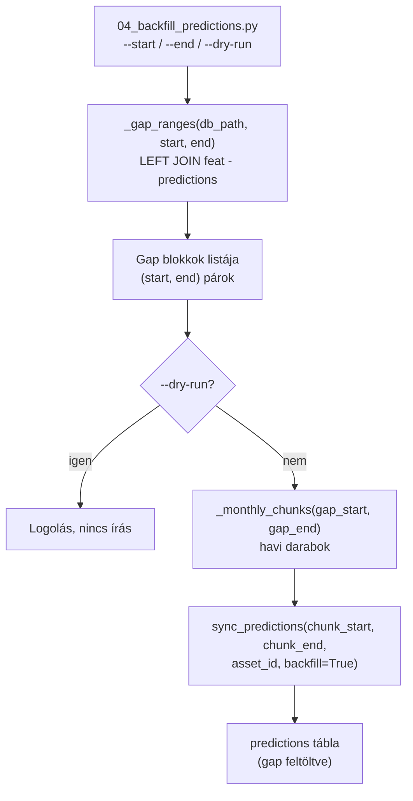
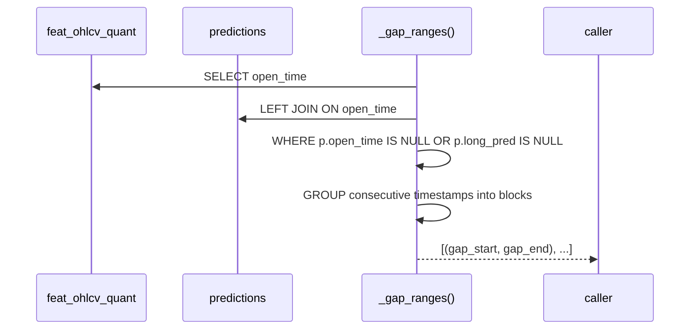

# 04_backfill_predictions.py — Predikció Gap Feltöltés CLI

`src/data_handling/04_backfill_predictions.py`

Detektálja a `feat_ohlcv_quant` és `predictions` tábla közötti gap-eket (feature sorok,
amelyekhez nincs predikció), majd havi chunkokon keresztül feltölti a hiányokat
a current champion modellekkel.

> Kapcsolódó kód-referencia: [`1230_sync_predictions.md`](1230_sync_predictions.md) — `sync_predictions()` részletes leírása.
> Módszertani háttér (predictions pipeline, champion model, deploy/cutover):
> → [`../methodology_doc/1500_registry.md`](../methodology_doc/1500_registry.md)
> → [`0003_runtime_flow.md`](0003_runtime_flow.md) — runtime flow és deploy narratíva.

---

## Overview



---

## `_gap_ranges(db_path, start, end)`

**Célja:** Összefüggő hiányos időtartományok (gap blokkok) meghatározása.

| Paraméter | Típus | Leírás |
|-----------|-------|--------|
| `db_path` | `str` | Asset DuckDB fájl elérési útja |
| `start` | `str \| None` | Opcionális UTC alsó határ (inclusive) |
| `end` | `str \| None` | Opcionális UTC felső határ (inclusive) |

**Visszatérési érték:** `list[tuple[str, str]]` — `(gap_start, gap_end)` UTC string párok (mindkét határ inclusive).

**Logika:** `feat_ohlcv_quant LEFT JOIN predictions ON open_time`, ahol `predictions.open_time IS NULL OR long_pred IS NULL`. Az egyedi sorokat összefüggő blokkokba csoportosítja (1 perces szomszédok egy blokkba kerülnek).



---

## `_monthly_chunks(start, end)`

**Célja:** Egy gap tartomány felbontása havi darabokra (`CHUNK_MONTHS = 1`).

| Paraméter | Típus | Leírás |
|-----------|-------|--------|
| `start` | `str` | Gap kezdete (`YYYY-MM-DD HH:MM:SS`) |
| `end` | `str` | Gap vége (`YYYY-MM-DD HH:MM:SS`) |

**Visszatérési érték:** `list[tuple[str, str]]` — havi chunk párok.

**Oka:** A `sync_predictions` `backfill=True` módban nagy tartományokat memória-hatékonyan, darabonként dolgoz fel.

---

## `main()`

Koordinálja a gap detekciót és a fill loopot.

1. `_gap_ranges()` — detektálás
2. `--dry-run` esetén: logolás, kilépés
3. Minden gap-re: `_monthly_chunks()` → `sync_predictions(..., backfill=True)` chunk-onként
4. Hiba esetén: logolás + `raise` (nem nyeli el)

---

## CLI használat

```powershell
# Auto-detect és feltölt minden gap-et
uv run python src/data_handling/04_backfill_predictions.py

# Csak egy dátumtartomány
uv run python src/data_handling/04_backfill_predictions.py \
    --start "2026-06-14 00:00:00" --end "2026-06-21 00:00:00"

# Dry-run: csak megmutatja a gap-eket, nem ír
uv run python src/data_handling/04_backfill_predictions.py --dry-run

# Explicit asset
uv run python src/data_handling/04_backfill_predictions.py --asset-id solusdt
```

**Fontos:** A trading service-t le kell állítani futtatás előtt (DuckDB kizárólagos írási hozzáférés).

| Flag | Leírás |
|------|--------|
| `--asset-id` | Asset kulcs (`config/assets.json`); default: `default_asset_id` |
| `--start` | UTC alsó határ a gap keresésnél |
| `--end` | UTC felső határ a gap keresésnél |
| `--dry-run` | Csak logolás, nincs írás |

---

## Kapcsolódó dokumentumok

- [`1230_sync_predictions.md`](1230_sync_predictions.md) — `sync_predictions(backfill=True)` részletes kód-ref
- [`1530_trigger_deploy.md`](1530_trigger_deploy.md) — deploy trigger CLI
- [`0003_runtime_flow.md`](0003_runtime_flow.md) — runtime flow, ahol a backfill szerepel
- [`../methodology_doc/1500_registry.md`](../methodology_doc/1500_registry.md) — registry és champion model metodológia
