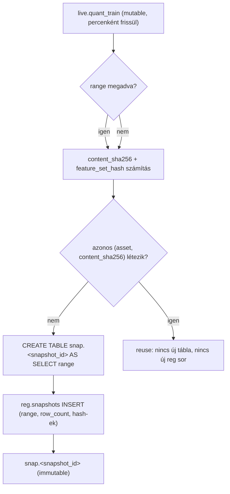
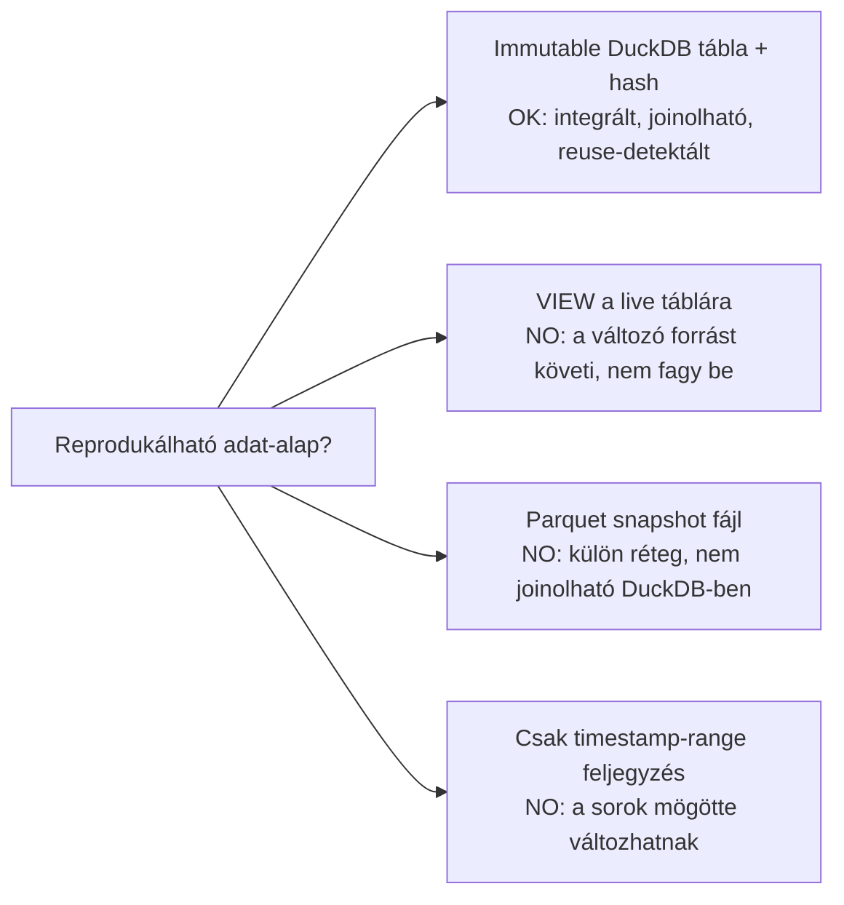
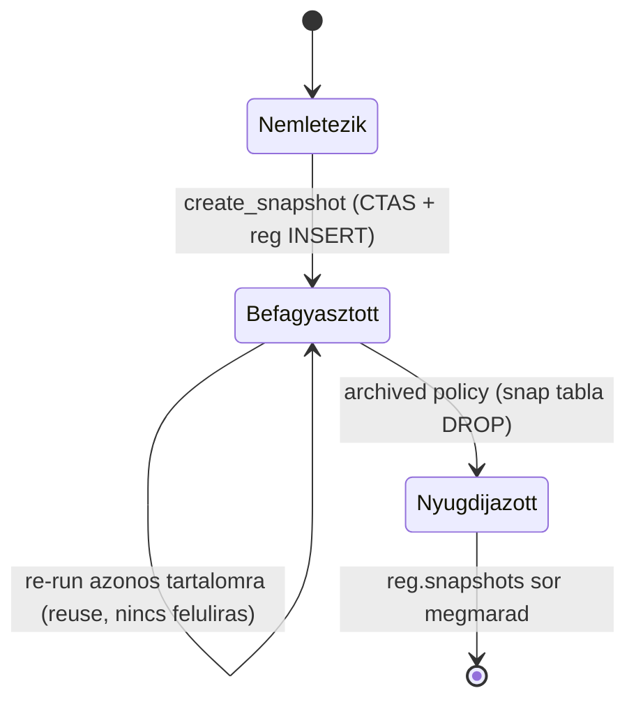
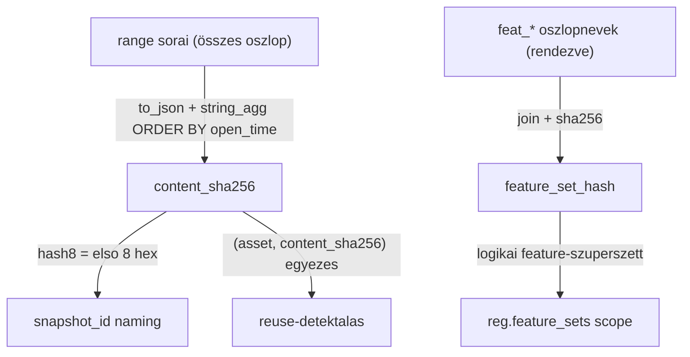
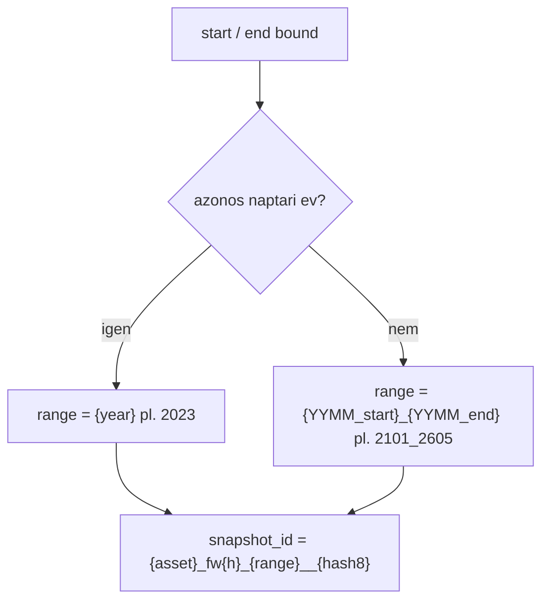
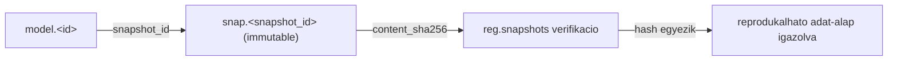

# 1400 — Snapshots (Immutable Adatállapot)

A snapshot réteg a `live.quant_train` egy idő-range-ének **befagyasztott, immutable
másolatát** állítja elő a lab DB `snap` sémájában, content-hash-sel azonosítva. Ez
adja a modellezés reprodukálható adat-alapját: minden modell egy konkrét, soha többé
nem változó adatállapotból tanul.

> Tárolási topológia és a rétegek (live / lab / registry) átfogó leírása:
> → `_doc_/0002_data_architecture.md`. Ez a doc kizárólag a snapshot réteg
> **miértjeit** és módszertani szabályait írja le, nem ismétli a topológiát.

---

## Overview

A snapshot az egyetlen pont, ahol a változékony élő adat **rögzül**. Felfelé a
`live.quant_train` táblából táplálkozik (read-only ATTACH), lefelé a sampling,
feature engineering, search, train és predict lépések kizárólag a befagyasztott
`snap."<snapshot_id>"` táblából dolgoznak.

---

## Üzleti és módszertani háttér

### Miért kritikus ez a lépés?

A snapshot a modellezés és az élő, percenként változó adat közötti **reprodukciós
határvonal**. A `live.quant_train` tábla folyamatosan újraépül a sync során, ezért
egy abból közvetlenül tanított modell sosem reprodukálható: nem tudható, melyik
adatállapotból készült. Ha ezen a ponton nincs befagyasztás, a teljes pipeline
elveszti az auditálhatóságát — egy később újrafuttatott tréning más adatot lát,
más eredményt ad, és nem lehet megmondani, melyik a "helyes". A snapshot rögzíti az
adatállapotot, és a content-hash bizonyítja, hogy a befagyasztott tartalom valóban
az, aminek mondja magát.

### Miért ezt a megközelítést?

| Megközelítés | Előny | Hátrány | Státusz |
|--------------|-------|---------|---------|
| Jelenlegi — immutable `snap` tábla + content-hash (CTAS) | Integrált, joinolható a live/reg rétegekkel; a hash bizonyítja a tartalmat; reuse-detektálás | Tárhely (range- enként teljes range-másolat) | ✅ Választott |
| VIEW a `live.quant_train` fölött | Nincs tárhely-költség | A változó live táblát követi → **nem fagy be**, nincs reprodukció | ❌ Elvetett — a view nem immutable |
| Parquet snapshot fájl | Hordozható, tömöríthető | Külön réteg, nem joinolható natívan a DuckDB rétegekkel; visszahozza a parquet-réteget, amit a terv megszüntet | ❌ Elvetett — DuckDB-natív irány |
| Csak range timestamp feljegyzés a registryben | Olcsó | A sorok a live táblában utólag módosulhatnak → ugyanaz a range más tartalmat adhat | ❌ Elvetett — nem rögzíti a tartalmat |

### Immutability: miért kell és hogyan működik?

Az immutability azt garantálja, hogy egy létrehozott `snap."<snapshot_id>"` tábla
soha nem íródik felül. A snapshot `CREATE TABLE IF NOT EXISTS` szemantikával jön
létre, így egy ismételt futtatás meglévő tartalmat nem ír át.

**Szabály:** A snapshot tábla tartalma a létrehozás után nem módosítható. Új
adatállapot = új `snapshot_id` (új tábla), nem felülírás. A nyugdíjazás (archived)
a `snap` táblát DROP-olhatja a tárhely felszabadításához, de a `reg.snapshots` sort
(provenance) megtartja.

### Content-hash: miért két hash és hogyan azonosít?

A snapshot **két** hash-t számít, eltérő céllal:

- `content_sha256` — a range **tényleges tartalmát** azonosítja:
  `sha256(string_agg(to_json(row), '\n' ORDER BY open_time))` a range minden
  oszlopára. Azonos sorok azonos sorrendben → azonos hash. Ez ad
  **reuse-detektálást**: ha egy `(asset_id, content_sha256)` pár már létezik és a
  tábla is megvan, nincs új befagyasztás.
- `feature_set_hash` — a befagyasztott tábla **logikai feature-listáját** azonosítja:
  `sha256(','.join(sorted feat_* oszlopnevek))` (az `open_time` és target oszlopok
  kizárva). Ez nem a tartalmat, hanem a feature-szuperszett szerkezetét rögzíti.

**Szabály:** Üres range esetén a `content_sha256` az üres string sha256-ja. A
`content_sha256` első 8 hex karaktere (`hash8`) kerül a `snapshot_id` névbe a
reuse-olvashatóságért.

### Range-szabályok és snapshot_id naming: miért kell és hogyan működik?

A `snapshot_id` formátuma gép-parsolható és ember-olvasható egyszerre:
`{asset}_fw{h}_{range}__{hash8}` (pl. `solusdt_fw60_2023__a37d2703`).

A `range` token kiszámítása:

| Feltétel | Range token | Példa |
|----------|-------------|-------|
| Mindkét bound azonos naptári évben | `{year}` | `2023` |
| Az évek eltérnek | `{YYMM_start}_{YYMM_end}` | `2101_2605` |
| Range nincs megadva | a teljes elérhető history | a tényleges min/max alapján |

**Szabály:** A `__` (dupla aláhúzás) elválasztja az ID-t a hash-től; az egyszeres
`_` az ID-n belüli mezőelválasztó. Így a név egyértelműen visszaparsolható, és a
`hash8` mindig a `content_sha256` prefixe.

### Reprodukálhatóság: miért a snapshot a horgony?

A reprodukálhatóság azt jelenti, hogy egy modell adat-alapja **bármikor
újraelőállítható és ellenőrizhető**. A snapshot ezt két módon biztosítja:

1. A tábla immutable → a tanításkor látott sorok soha nem változnak.
2. A `content_sha256` a registryben rögzül → bármikor ellenőrizhető, hogy a
   befagyasztott tábla tartalma egyezik-e a feljegyzett hash-sel.

**Szabály:** Egyetlen modell sem tanulhat olyan adatból, amelynek nincs
`snapshot_id`-je a registryben. A predikció **nem** íródik vissza a snapshotba (új
`model.<id>__pred` táblába kerül), így a snapshot hash-e és reprodukálhatósága
sértetlen marad.

### Paraméter alapértékek és indoklásuk

| Paraméter | Alapérték | Indoklás |
|-----------|-----------|---------|
| `horizon` | `60` (fw60) | Az aktív target horizon; a `snapshot_id` `fw{h}` tokenjét adja, így a snapshot egyértelműen a fw60 modellcsaládhoz köthető |
| `start_time` | `None` → range eleje | Ha nincs megadva, a teljes history eleje; explicit megadás kell range-szűkítéshez (kisebb, gyorsabb snapshot) |
| `end_time` | `None` → range vége | Ha nincs megadva, a teljes elérhető history vége; explicit end a holdout-határ rögzítéséhez |
| `hash8` hossz | `8` hex karakter | A `content_sha256` első 8 karaktere — elég nagy az ütközés-mentességhez ember-olvasható névben, elég rövid hogy a név kezelhető maradjon |
| reuse kulcs | `(asset_id, content_sha256)` | Két dimenzió kell: az asset elkülönítése + a tartalom egyezése; csak az egyik nem elég a biztonságos reuse-detektáláshoz |

### Ismert kockázatok és korlátok

| Kockázat | Tünet | Mitigáció |
|----------|-------|-----------|
| Snapshot tárhely-növekedés | A `snap` táblák nagyok (range-enként teljes felbontás, ~2.6M sor/range) | Reuse-detektálás (hash) + nyugdíjazási policy: `archived` snapshot tábla DROP, a `reg.snapshots` sor megtartásával |
| Range-határ elcsúszás | A snapshot range nem fedi a kívánt holdout/train időszakot | A range-szabályok explicit dokumentálása; a `snapshot_id` range tokenje emberi ellenőrzést tesz lehetővé |
| Hash-számítás drift | A `content_sha256` megváltozik azonosnak hitt tartalomra (pl. oszlopsorrend, NULL→JSON repr) | Determinista `ORDER BY open_time` + minden oszlop bevonása; a hash-recept rögzített és nem változtatható verzió nélkül |
| Üres range befagyasztása | Egy téves range üres `snap` táblát és üres-string hash-t ad | Az üres-string sha256 explicit kezelt; a `row_count=0` a reg sorban jelez |
| Feature-szuperszett változás | A `feat_*` oszloplista változik, de a régi snapshot a régit hordozza | `feature_set_hash` rögzíti a logikai listát; eltérő szuperszett → eltérő hash → új feature_set scope |

### Validációs checklist

- [ ] A `snap."<snapshot_id>"` tábla létrejött és immutable (re-run nem írja felül)
- [ ] A `snapshot_id` formátuma `{asset}_fw{h}_{range}__{hash8}`, a `hash8` a `content_sha256` prefixe
- [ ] A `range` token helyes: azonos év → `{year}`, eltérő év → `{YYMM_start}_{YYMM_end}`
- [ ] A `content_sha256` determinista (`ORDER BY open_time`, minden oszlop bevonva)
- [ ] A `feature_set_hash` csak a `feat_*` oszlopokat fedi (open_time/target kizárva)
- [ ] Reuse helyesen detektált azonos `(asset_id, content_sha256)` párra (nincs duplikált befagyasztás)
- [ ] A `reg.snapshots` sor létrejött a range, row_count és mindkét hash mezővel
- [ ] A predikció NEM íródott vissza a snapshotba (külön `model.<id>__pred` tábla)

---

## Kapcsolódó metodológia

| Téma | Hivatkozás |
|------|-----------|
| Tárolási topológia (live / lab / registry, ATTACH) | `_doc_/0002_data_architecture.md` |
| Registry séma + entitás-életciklus | [1500_registry.md](1500_registry.md) |
| Sampling a snapshot fölött | [5400_sampling.md](5400_sampling.md), [5010_sampling_yearly.md](5010_sampling_yearly.md) |
| quant_train (a snapshot forrása) | [4000_quant_train.md](4000_quant_train.md) |
