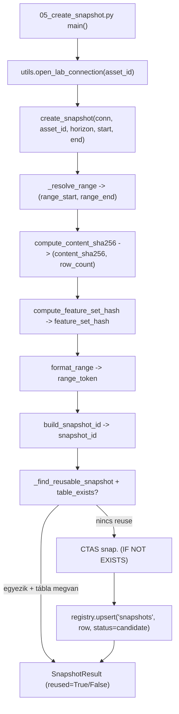
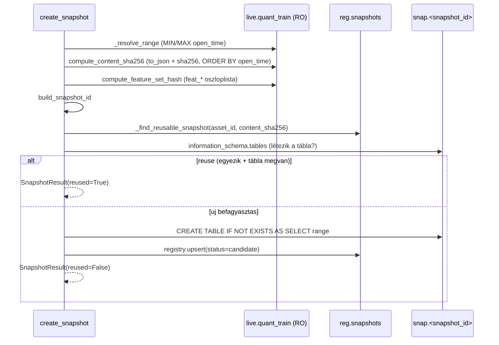
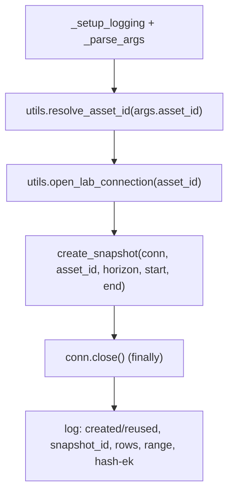

# snapshots.py + 05_create_snapshot.py — Snapshot Kód-referencia

`src/data_handling/store/snapshots.py`
`src/data_handling/05_create_snapshot.py`

A `live.quant_train` egy idő-range-ének befagyasztása immutable `snap."<snapshot_id>"`
táblába + `reg.snapshots` sor. Content-hash alapú reuse-detektálás, determinista
`snapshot_id` naming. Ez a kód-referencia a tényleges függvény-API-t írja le; a réteg
**miértjei** (immutability, két hash, range-szabályok, reprodukálhatóság) a módszertani
dokumentumban élnek.

> Módszertani háttér (miért, döntések, kockázatok, paraméter-indoklás):
> → [`../methodology_doc/1400_snapshots.md`](../methodology_doc/1400_snapshots.md).
> Tárolási topológia (live / lab / registry, ATTACH): `_doc_/database_and_code_doc/0002_data_architecture.md`.
> Terv: `_doc_/_plans_/data_process_architecture.md` 13.1 (snapshot réteg, plan 4.1/5/6).

---

## Overview



A CLI (`05_create_snapshot.py`) megnyit egy lab connectiont (lab default + `live` RO +
`reg`), majd a `create_snapshot` köré szervezi a hash → naming → reuse → CTAS + reg-upsert
láncot. A modellező pipeline a befagyasztott `snap` táblát olvassa, nem a változó live
táblát.

---

## Modul-konstansok (`snapshots.py`)

| Konstans | Érték | Leírás |
|----------|-------|--------|
| `SNAP_SCHEMA` | `"snap"` | A snapshot táblák sémája a lab DB-ben |
| `LIVE_SOURCE` | `"live.quant_train"` | A befagyasztás forrása (ATTACH-olt, READ_ONLY live DB) |
| `HASH8_LEN` | `8` | A `content_sha256` `snapshot_id`-be ágyazott hex-prefix hossza |

---

## `SnapshotResult` (dataclass, frozen)

Egy `create_snapshot` hívás kimenete (immutable).

| Mező | Típus | Leírás |
|------|-------|--------|
| `snapshot_id` | `str` | A `{asset}_fw{h}_{range}__{hash8}` azonosító |
| `asset_id` | `str` | Az asset, amelyhez a snapshot tartozik |
| `range_start` | `str` | Tényleges inkluzív alsó határ (`YYYY-MM-DD HH:MM:SS`) |
| `range_end` | `str` | Tényleges inkluzív felső határ (`YYYY-MM-DD HH:MM:SS`) |
| `row_count` | `int` | A befagyasztott sorok száma |
| `content_sha256` | `str` | Teljes sha256 a rendezett sor-tartalom fölött |
| `feature_set_hash` | `str` | sha256 a rendezett `feat_*` oszloplista fölött |
| `reused` | `bool` | `True`, ha azonos tartalmú snapshot már létezett (nincs írás) |

---

## Schema bootstrap

### `ensure_snap_schema(conn)`

**Célja:** A `snap` séma létrehozása a (default) lab DB-ben, ha hiányzik.
`CREATE SCHEMA IF NOT EXISTS snap`.

| Paraméter | Típus | Leírás |
|-----------|-------|--------|
| `conn` | `duckdb.DuckDBPyConnection` | Nyitott lab connection (a lab DB a default) |

**Visszatérési érték:** `None`.

---

## Naming

### `format_range(range_start, range_end)`

**Célja:** A `snapshot_id` range tokenjének felépítése. Azonos naptári év esetén `{year}`,
eltérő év esetén `{YYMM_start}_{YYMM_end}`. (Range-szabályok rationale → 1400_snapshots.)

| Paraméter | Típus | Leírás |
|-----------|-------|--------|
| `range_start` | `str` | Inkluzív alsó határ, `YYYY-MM-DD HH:MM:SS` |
| `range_end` | `str` | Inkluzív felső határ, `YYYY-MM-DD HH:MM:SS` |

**Visszatérési érték:** `str` — a range token, pl. `2023` vagy `2101_2605`.

### `build_snapshot_id(asset_id, horizon, range_token, content_sha256)`

**Célja:** A `snapshot_id` összeállítása: `{asset}_fw{horizon}_{range_token}__{hash8}`,
ahol `hash8` a `content_sha256` első `HASH8_LEN` (8) hex karaktere.

| Paraméter | Típus | Leírás |
|-----------|-------|--------|
| `asset_id` | `str` | Asset kulcs (kisbetűs szimbólum), pl. `solusdt` |
| `horizon` | `int` | Forward-window bar szám, pl. `60` -> `fw60` |
| `range_token` | `str` | A `format_range` kimenete |
| `content_sha256` | `str` | Teljes content hash; első 8 karaktere kerül a névbe |

**Visszatérési érték:** `str` — a `snapshot_id`.

---

## Hashing

### `compute_content_sha256(conn, range_start, range_end)`

**Célja:** A range content-hash-ének és sorszámának kiszámítása. A hash sha256 a teljes
rendezett sor-tartalom fölött (minden oszlop, `ORDER BY open_time`), `to_json(t)` +
`string_agg(..., '\n')`. Üres range esetén `sha256('')`. Ez hajtja a reuse-detektálást.

| Paraméter | Típus | Leírás |
|-----------|-------|--------|
| `conn` | `duckdb.DuckDBPyConnection` | Nyitott lab connection (`live` ATTACH-olva) |
| `range_start` | `str` | Inkluzív alsó határ, `YYYY-MM-DD HH:MM:SS` |
| `range_end` | `str` | Inkluzív felső határ, `YYYY-MM-DD HH:MM:SS` |

**Visszatérési érték:** `tuple[str, int]` — `(content_sha256, row_count)`.

### `compute_feature_set_hash(conn)`

**Célja:** sha256 a forrástábla rendezett `feat_*` oszloplistája fölött (a logikai
feature-szuperszettet rögzíti, nem a tartalmat).

| Paraméter | Típus | Leírás |
|-----------|-------|--------|
| `conn` | `duckdb.DuckDBPyConnection` | Nyitott lab connection |

**Visszatérési érték:** `str` — a `feature_set_hash`.

### Belső segédfüggvények

| Függvény | Visszatérés | Leírás |
|----------|-------------|--------|
| `_ordered_feature_columns(conn)` | `list[str]` | A forrástábla `feat_*` oszlopai rendezve (`open_time`/target kizárva) — determinista feature-hash alapja |
| `_resolve_range(conn, start_time, end_time)` | `tuple[str, str]` | A tényleges inkluzív range; a nem megadott oldalak a forrás min/max `open_time`-jából. `ValueError`, ha üres a range |

---

## Snapshot creation

### `create_snapshot(conn, asset_id, horizon=60, start_time=None, end_time=None)`

**Célja:** A `live.quant_train` egy range-ének befagyasztása immutable `snap` táblába +
`reg.snapshots` sor. Lépések: (1) range feloldás, (2) content + feature-set hash, (3) reuse-
detektálás, (4) CTAS + reg-upsert. Reuse esetén nincs írás (a snapshot immutable).

| Paraméter | Típus | Alap | Leírás |
|-----------|-------|------|--------|
| `conn` | `duckdb.DuckDBPyConnection` | — | Nyitott lab connection (lab default + `live` RO + `reg`), `utils.open_lab_connection(asset_id)` |
| `asset_id` | `str` | — | Asset kulcs (kisbetűs szimbólum), pl. `solusdt` |
| `horizon` | `int` | `60` | Forward-window bar szám az id tokenhez (`fw60`) |
| `start_time` | `str \| None` | `None` | Opcionális inkluzív alsó határ; `None` = history eleje |
| `end_time` | `str \| None` | `None` | Opcionális inkluzív felső határ; `None` = history vége |

**Visszatérési érték:** `SnapshotResult` — az új vagy reuse-olt snapshot leírása.

**Raises:** `ValueError`, ha a kért range nem tartalmaz sort.

**Mellékhatások:** `ensure_snap_schema`; reuse hiányában `CREATE TABLE IF NOT EXISTS
snap."<snapshot_id>"` (CTAS, `ORDER BY open_time`) + `registry.upsert("snapshots", ...,
status="candidate")`.



### Belső segédfüggvények

| Függvény | Visszatérés | Leírás |
|----------|-------------|--------|
| `_snapshot_table_fqn(snapshot_id)` | `str` | A teljes nevű, idézőjeles snap táblanév, pl. `snap."<id>"` |
| `_find_reusable_snapshot(conn, asset_id, content_sha256)` | `str \| None` | Létező `snapshot_id` egyező content-hash-re; reuse kulcs `(asset_id, content_sha256)` |

---

## CLI — `05_create_snapshot.py`

A `live.quant_train` range-ének befagyasztása parancssorból. Megnyit egy lab connectiont,
meghívja a `create_snapshot`-ot, logolja az eredményt (rows, range, mindkét hash, elapsed).

### Argumentumok (`_parse_args`)

| Flag | Típus | Alap | Leírás |
|------|-------|------|--------|
| `--asset-id` | `str` | `None` | Asset kulcs `config/assets.json`-ból; `None` -> `utils.resolve_asset_id` (default asset) |
| `--horizon` | `int` | `60` | Forward-window bar szám (`fw{horizon}`) |
| `--start` | `str` | `None` | Range alsó határ, inkluzív; üres = teljes history |
| `--end` | `str` | `None` | Range felső határ, inkluzív; üres = teljes history |

### Használat

```bash
# Teljes history snapshot a default assetre
uv run python src/data_handling/05_create_snapshot.py

# Range snapshot (inkluzív határok)
uv run python src/data_handling/05_create_snapshot.py \
    --start "2021-01-01 00:00:00" --end "2026-05-31 23:59:00"

# Explicit asset / horizon
uv run python src/data_handling/05_create_snapshot.py \
    --asset-id solusdt --horizon 60
```

### `main()` flow



---

## Kapcsolódó dokumentáció

| Téma | Hivatkozás |
|------|-----------|
| Snapshot módszertan (miért, immutability, hash-ek, range, reprodukció) | [`../methodology_doc/1400_snapshots.md`](../methodology_doc/1400_snapshots.md) |
| Registry kód-referencia (a `registry.upsert` célja) | [`1510_registry_code.md`](1510_registry_code.md) |
| Registry módszertan | [`../methodology_doc/1500_registry.md`](../methodology_doc/1500_registry.md) |
| Tárolási topológia (ATTACH, lab/live/reg) | `_doc_/database_and_code_doc/0002_data_architecture.md` |
