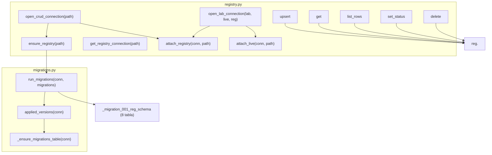
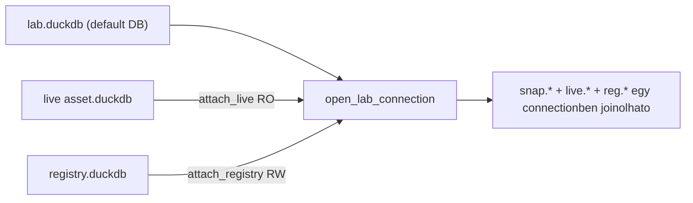
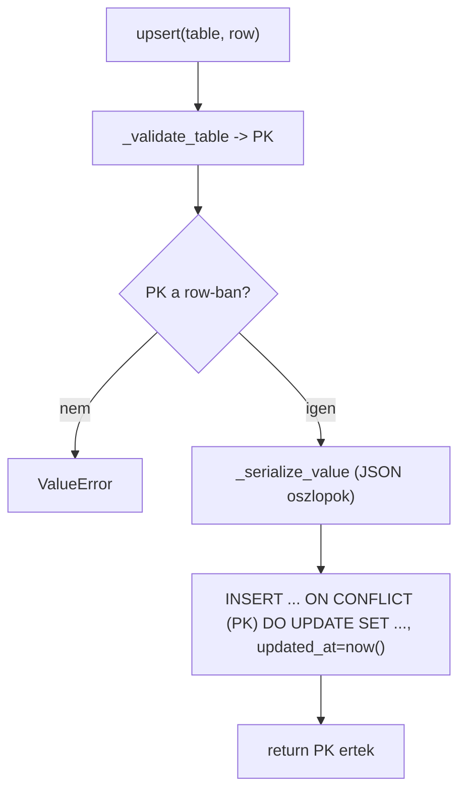

# registry.py + migrations.py — Registry Kód-referencia

`src/data_handling/store/registry.py`
`src/data_handling/store/migrations.py`

A `reg` séma (8 katalógus-tábla) verziózott bootstrapja a migrations-kerettel, az ATTACH
helperek (`live` RO + `reg` egy connectionben), és a generikus CRUD a státusz-lifecycle-lel.
Ez a kód-referencia a tényleges függvény-API-t írja le; a registry réteg **miértjei**
(8 entitás, idempotens upsert, status-folyam, config-gateway) a módszertani dokumentumban
élnek.

> Módszertani háttér (miért, döntések, ER-rationale, paraméter-indoklás):
> → [`../methodology_doc/1500_registry.md`](../methodology_doc/1500_registry.md).
> Tárolási topológia (live / lab / registry, ATTACH): `_doc_/database_and_code_doc/0002_data_architecture.md`.
> Terv: `_doc_/_plans_/data_process_architecture.md` 13.1 (registry, plan 4.2/4.3).

---

## Overview



A `registry.py` a katalógus tulajdonosa: a séma a `migrations.py` keretén át jön létre
(verziózott, idempotens), az ATTACH helperek egy connectionben teszik joinolhatóvá a
`reg` + `live` rétegeket, a CRUD réteg pedig generikusan kezeli mind a 8 táblát PK-alapon.

---

## migrations.py — verziózott séma-keret

Minden DB egy privát `_schema_migrations` könyvelő-táblát hordoz; a már alkalmazott verziók
átugorhatók, így a futtatás mindig biztonságosan ismételhető. Kiváltja a régi inline
ALTER/DROP mintát (P4).

### `Migration` (dataclass, frozen)

| Mező | Típus | Leírás |
|------|-------|--------|
| `version` | `int` | Monoton egész verzió (egyedi a migration-seten belül) |
| `name` | `str` | Rövid, ember-olvasható azonosító logoláshoz |
| `apply` | `MigrationFn` (`Callable[[conn], None]`) | A DDL-t végrehajtó callable |

### `applied_versions(conn)`

**Célja:** A DB-re már alkalmazott migration-verziók halmaza. Először biztosítja a
`_schema_migrations` táblát.

| Paraméter | Típus | Leírás |
|-----------|-------|--------|
| `conn` | `duckdb.DuckDBPyConnection` | Nyitott DuckDB connection |

**Visszatérési érték:** `set[int]` — a rögzített verziók (üres, ha nincs).

### `run_migrations(conn, migrations)`

**Célja:** Minden függő migráció alkalmazása növekvő verzió-sorrendben, idempotensen. Minden
migráció saját tranzakcióban fut; siker után a verzió a `_schema_migrations`-ba kerül. A már
jelenlévő verziók kimaradnak. Duplikált verzió-lista hibát dob, mielőtt bármi DDL futna.

| Paraméter | Típus | Leírás |
|-----------|-------|--------|
| `conn` | `duckdb.DuckDBPyConnection` | Nyitott írható connection |
| `migrations` | `list[Migration]` | Alkalmazandó migrációk (belül verzió szerint rendezve) |

**Visszatérési érték:** `list[int]` — az ebben a hívásban újonnan alkalmazott verziók.

**Raises:** `ValueError`, ha két migráció azonos verziójú.

### Belső segéd

| Függvény | Leírás |
|----------|--------|
| `_ensure_migrations_table(conn)` | Létrehozza a `_schema_migrations` (version PK, name, applied_at) táblát, ha hiányzik |

```mermaid
sequenceDiagram
  participant E as ensure_registry
  participant R as run_migrations
  participant DB as _schema_migrations
  participant M as _migration_001_reg_schema

  E->>R: run_migrations(conn, REG_MIGRATIONS)
  R->>DB: _ensure_migrations_table
  R->>DB: applied_versions -> {alkalmazott}
  alt v1 nincs alkalmazva
    R->>M: BEGIN; apply (8 CREATE TABLE)
    R->>DB: INSERT version=1; COMMIT
  else mar up-to-date
    R-->>E: [] (skip)
  end
```

---

## registry.py — séma-konstansok

| Konstans | Tartalom | Leírás |
|----------|----------|--------|
| `REG_SCHEMA` | `"reg"` | A registry séma/ATTACH alias |
| `REG_TABLES` | 8 tábla nevének tuple-je | `assets, snapshots, feature_sets, models, search_runs, strategies, deployments, artifacts` |
| `STATUS_LIFECYCLE` | `draft, candidate, champion, active, archived` | A status-mező fázisai (sorrend informatív) |
| `_PK` | `dict[str, str]` | Táblánkénti elsődleges kulcs oszlop (upsert/get/set_status) |
| `_JSON_COLS` | `dict[str, frozenset[str]]` | JSON-típusú oszlopok: `feature_sets.selected_cols`, `search_runs.best_params` |

### `_migration_001_reg_schema(conn)`

**Célja:** A 8 katalógus-tábla létrehozása (ER per plan 4.3) a registry.duckdb **default
(main)** sémájában. A `reg` névtér a plan SQL-jében az ATTACH alias, ezért a táblák nem nested
`reg` schemában élnek (az `reg.reg.<table>`-t kerülve). A `REG_MIGRATIONS` listán keresztül
fut, `version=1, name="reg_schema_initial"`.

A 8 tábla séma-kivonata (minden táblának van `status DEFAULT 'draft'`, `created_at`,
`updated_at`):

| Tábla | PK | Kulcsmezők (FK / payload) |
|-------|----|--------------------------|
| `assets` | `asset_id` | symbol, interval, market |
| `snapshots` | `snapshot_id` | asset_id, range_start/end, row_count, content_sha256, feature_set_hash |
| `feature_sets` | `feature_set_id` | snapshot_id, n_input, n_selected, selected_cols (JSON) |
| `models` | `model_id` | snapshot_id, feature_set_id, search_run_id, direction, oos_metric |
| `search_runs` | `search_run_id` | model_id, stage, objective, best_params (JSON) |
| `strategies` | `strategy_id` | model_id_long, model_id_short, session_id |
| `deployments` | `deployment_id` | asset_id, strategy_id, active (BOOLEAN) |
| `artifacts` | `artifact_id` | owner_id (polimorf), kind, path |

> A teljes ER és az entitás-relációk rationale-ja: [`../methodology_doc/1500_registry.md`](../methodology_doc/1500_registry.md).

---

## Connection / schema setup

### `get_registry_connection(registry_path)`

**Célja:** Írás-olvasás connection a registry DB-hez, a szülőkönyvtár biztosításával
(`mkdir parents`).

| Paraméter | Típus | Leírás |
|-----------|-------|--------|
| `registry_path` | `str` | Abszolút út a `registry.duckdb`-hez |

**Visszatérési érték:** `duckdb.DuckDBPyConnection` — a hívó zárja.

### `ensure_registry(registry_path)`

**Célja:** A reg séma létrehozása/frissítése a függő migrációk futtatásával. Ismételten
biztonságosan hívható; első híváskor létrehozza a fájlt és a 8 táblát.

| Paraméter | Típus | Leírás |
|-----------|-------|--------|
| `registry_path` | `str` | Abszolút út a `registry.duckdb`-hez |

**Visszatérési érték:** `list[int]` — az ebben a hívásban újonnan alkalmazott migration-verziók.

### `open_crud_connection(registry_path)`

**Célja:** CRUD connection, ahol a táblák `reg.<table>`-ként oldódnak fel. In-memory
sessionből ATTACH-olja a registryt `reg` aliasként, így a default alias ugyanúgy működik
standalone és lab/live mellett is. Először biztosítja a sémát (`ensure_registry`).

| Paraméter | Típus | Leírás |
|-----------|-------|--------|
| `registry_path` | `str` | Abszolút út a `registry.duckdb`-hez |

**Visszatérési érték:** `duckdb.DuckDBPyConnection` — registry `reg`-ként ATTACH-olva; a hívó zárja.

### `attach_registry(conn, registry_path, read_only=False, alias="reg")`

**Célja:** A registry DB ATTACH-olása egy meglévő connectionre `alias` alatt.

| Paraméter | Típus | Alap | Leírás |
|-----------|-------|------|--------|
| `conn` | `duckdb.DuckDBPyConnection` | — | Nyitott connection (pl. a lab DB) |
| `registry_path` | `str` | — | Abszolút út a `registry.duckdb`-hez |
| `read_only` | `bool` | `False` | Ha `True`, READ_ONLY ATTACH |
| `alias` | `str` | `"reg"` | A séma alias |

**Visszatérési érték:** `None`.

### `attach_live(conn, live_path, read_only=True, alias="live")`

**Célja:** A live asset DB ATTACH-olása, alapból READ_ONLY (modellező oldal). A lab connection
joinolhatja a live táblákat (`quant_train`, `predictions`) anélkül, hogy a live sync-targetbe
írna (plan 4.2).

| Paraméter | Típus | Alap | Leírás |
|-----------|-------|------|--------|
| `conn` | `duckdb.DuckDBPyConnection` | — | Nyitott connection (pl. a lab DB) |
| `live_path` | `str` | — | Abszolút út a live asset `.duckdb`-hez |
| `read_only` | `bool` | `True` | Ha `True` (default), READ_ONLY ATTACH |
| `alias` | `str` | `"live"` | A séma alias |

**Visszatérési érték:** `None`.

### `open_lab_connection(lab_path, live_path, registry_path)`

**Célja:** Modellező connection: lab default + `live` (READ_ONLY) + `reg` ATTACH-olva. Egy
connectionből joinolható a `snap`/`model`/`strat` (lab), `live.*` és `reg.*`, miközben a live
sync-target írás-izolált marad (plan 4.2).

| Paraméter | Típus | Leírás |
|-----------|-------|--------|
| `lab_path` | `str` | Abszolút út a lab `.duckdb`-hez (default DB) |
| `live_path` | `str` | Abszolút út a live asset `.duckdb`-hez (RO ATTACH) |
| `registry_path` | `str` | Abszolút út a `registry.duckdb`-hez (read-write ATTACH) |

**Visszatérési érték:** `duckdb.DuckDBPyConnection` — `live` + `reg` ATTACH-olva; a hívó zárja.



---

## CRUD

### `upsert(conn, table, row, alias="reg")`

**Célja:** Egy sor beszúrása/frissítése PK alapján, `INSERT ... ON CONFLICT DO UPDATE`
szemantikával (idempotens). Az `updated_at` minden írásnál frissül; a JSON-oszlopok
dict/list értékei automatikusan szerializálódnak.

| Paraméter | Típus | Alap | Leírás |
|-----------|-------|------|--------|
| `conn` | `duckdb.DuckDBPyConnection` | — | Connection a registryvel `alias` alatt |
| `table` | `str` | — | Egy a `REG_TABLES`-ből |
| `row` | `dict[str, Any]` | — | Oszlop -> érték; tartalmaznia kell a tábla PK oszlopát |
| `alias` | `str` | `"reg"` | A séma alias |

**Visszatérési érték:** `str` — az upsertelt sor PK-értéke.

**Raises:** `ValueError`, ha a tábla ismeretlen vagy hiányzik a PK oszlop a `row`-ból.



### `get(conn, table, pk_value, alias="reg")`

**Célja:** Egy registry-sor lekérése PK alapján, `column -> value` dictként.

| Paraméter | Típus | Alap | Leírás |
|-----------|-------|------|--------|
| `conn` | `duckdb.DuckDBPyConnection` | — | Connection a registryvel `alias` alatt |
| `table` | `str` | — | Egy a `REG_TABLES`-ből |
| `pk_value` | `str` | — | A keresett PK-érték |
| `alias` | `str` | `"reg"` | A séma alias |

**Visszatérési érték:** `dict[str, Any] | None` — a sor dictként, vagy `None`, ha nincs találat.

### `list_rows(conn, table, status=None, alias="reg")`

**Célja:** Registry-sorok listázása, opcionálisan `status` szerint szűrve.

| Paraméter | Típus | Alap | Leírás |
|-----------|-------|------|--------|
| `conn` | `duckdb.DuckDBPyConnection` | — | Connection a registryvel `alias` alatt |
| `table` | `str` | — | Egy a `REG_TABLES`-ből |
| `status` | `str \| None` | `None` | Ha megadva, csak az adott státuszú sorok |
| `alias` | `str` | `"reg"` | A séma alias |

**Visszatérési érték:** `list[dict[str, Any]]` — sor-dictek listája (lehet üres).

### `set_status(conn, table, pk_value, status, alias="reg")`

**Célja:** Egy registry-sor státuszának frissítése, `updated_at` megújításával. A
státusz-átmenetek ezen át történnek, nem közvetlen UPDATE-tel.

| Paraméter | Típus | Alap | Leírás |
|-----------|-------|------|--------|
| `conn` | `duckdb.DuckDBPyConnection` | — | Connection a registryvel `alias` alatt |
| `table` | `str` | — | Egy a `REG_TABLES`-ből |
| `pk_value` | `str` | — | A frissítendő sor PK-értéke |
| `status` | `str` | — | Új státusz (jellemzően a `STATUS_LIFECYCLE`-ből) |
| `alias` | `str` | `"reg"` | A séma alias |

**Visszatérési érték:** `None`.

### `delete(conn, table, pk_value, alias="reg")`

**Célja:** Egy registry-sor törlése PK alapján. Lifecycle-nyugdíjazásra a
`set_status(..., 'archived')` preferált; a `delete` csak valódi eltávolításra (pl. teszt-takarítás).

| Paraméter | Típus | Alap | Leírás |
|-----------|-------|------|--------|
| `conn` | `duckdb.DuckDBPyConnection` | — | Connection a registryvel `alias` alatt |
| `table` | `str` | — | Egy a `REG_TABLES`-ből |
| `pk_value` | `str` | — | A törlendő sor PK-értéke |
| `alias` | `str` | `"reg"` | A séma alias |

**Visszatérési érték:** `None`.

### Belső segédfüggvények

| Függvény | Visszatérés | Leírás |
|----------|-------------|--------|
| `_serialize_value(table, column, value)` | `Any` | dict/list értékek `json.dumps`-olása a JSON-oszlopokra; minden más változatlan |
| `_validate_table(table)` | `str` | A tábla PK oszlopa; `ValueError` ismeretlen táblára |

---

## Kapcsolódó dokumentáció

| Téma | Hivatkozás |
|------|-----------|
| Registry módszertan (miért, 8 entitás ER, upsert, status, config-gateway) | [`../methodology_doc/1500_registry.md`](../methodology_doc/1500_registry.md) |
| Snapshot kód-referencia (a `registry.upsert` egyik hívója) | [`1410_snapshots_code.md`](1410_snapshots_code.md) |
| Snapshot módszertan | [`../methodology_doc/1400_snapshots.md`](../methodology_doc/1400_snapshots.md) |
| Tárolási topológia (ATTACH, lab/live/reg) | `_doc_/database_and_code_doc/0002_data_architecture.md` |
