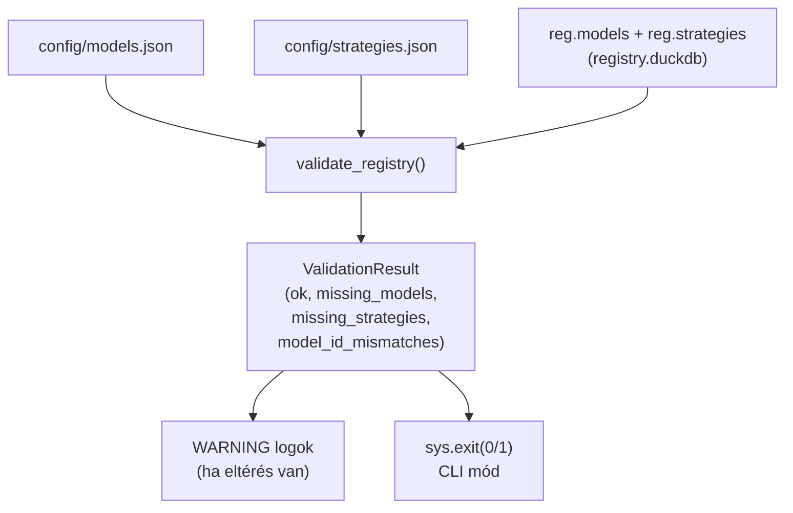
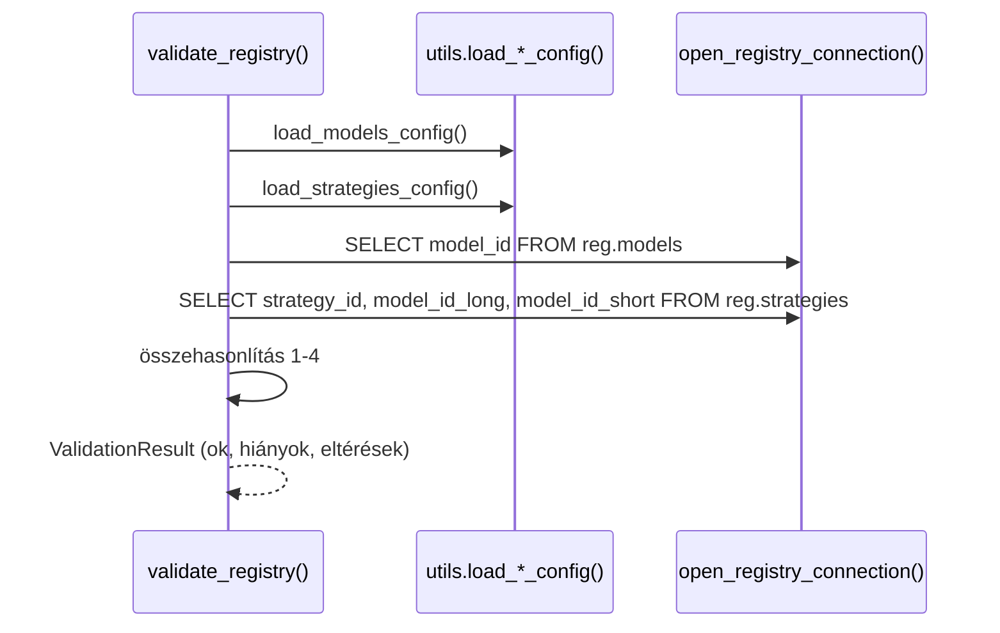

# registry_validator.py — Config↔Registry Konzisztencia Ellenőrzés

`src/data_handling/store/registry_validator.py`

Összehasonlítja a `config/models.json` és `config/strategies.json` bejegyzéseket a
live registry (`reg.models`, `reg.strategies`) tartalmával. A hiányosságokat és
eltéréseket WARNING szinten loggolja, de nem dob kivételt — a validator riportáló
eszköz, nem blocker.

> Módszertani háttér (registry konzisztencia, config-gateway pattern):
> → [`../methodology_doc/1500_registry.md`](../methodology_doc/1500_registry.md)

---

## Overview



---

## `ValidationResult` (dataclass)

Strukturált eredmény a `validate_registry()` hívásból.

| Mező | Típus | Leírás |
|------|-------|--------|
| `ok` | `bool` | `True`, ha nincs eltérés |
| `missing_models` | `list[str]` | `models.json`-ban van, `reg.models`-ban nincs |
| `missing_strategies` | `list[str]` | `strategies.json`-ban van, `reg.strategies`-ban nincs |
| `model_id_mismatches` | `list[dict]` | `reg.strategies` vs `strategies.json` `model_id` eltérés |
| `asset_id_mismatches` | `list[dict]` | `models.json` vs `reg.models` `asset_id` eltérés |

---

## `validate_registry(registry_path=None)`

**Célja:** A négy konzisztencia-ellenőrzés lefuttatása, `ValidationResult` visszaadása.

| Paraméter | Típus | Alap | Leírás |
|-----------|-------|------|--------|
| `registry_path` | `str \| None` | `None` | Abszolút út a `registry.duckdb`-hez; `None` = `utils.registry_path()` alapértéke |

**Visszatérési érték:** `ValidationResult`

**Ellenőrzések:**

| # | Mit néz? | Forrás | Cél |
|---|----------|--------|-----|
| 1 | `model_id` jelenlét | `models.json` | `reg.models` |
| 2 | `asset_id` egyezés | `models.json` | `reg.models.asset_id` |
| 3 | `strategy_key` jelenlét | `strategies.json` | `reg.strategies` |
| 4 | `model_id` egyezés (side szerint) | `strategies.json` | `reg.strategies.model_id_long / model_id_short` |



**Side-alapú model_id ellenőrzés:**
- `strategies.json` `side = "long"` → `reg.strategies.model_id_long`
- `strategies.json` `side = "short"` → `reg.strategies.model_id_short`
- ismeretlen `side` → mindkét oszlopot ellenőrzi

**Megjegyzés:** A registry legitimálisan nem tartalmaz régi/inaktív modellek bejegyzését —
a validator riportálja, nem akadályozza a működést.

---

## CLI használat

```powershell
# Ellenőrzés futtatása
uv run python -m data_handling.store.registry_validator

# Kimenet: OK
# OK — config and registry are consistent

# Kimenet: eltérés esetén
# WARN — discrepancies detected:
#   missing from reg.models (1):
#     - solusdt_fw60_v4_long_2505
```

**Exit kódok:**
- `0` — minden konzisztens
- `1` — eltérés(ek) találhatók

---

## Programmatikus használat

```python
from data_handling.store.registry_validator import validate_registry

result = validate_registry()
if not result.ok:
    print(f"Hiányzó modellek: {result.missing_models}")
    print(f"Hiányzó stratégiák: {result.missing_strategies}")
```

---

## Kapcsolódó dokumentumok

- [`1510_registry_code.md`](1510_registry_code.md) — registry.py + migrations.py kód-referencia
- [`../methodology_doc/1500_registry.md`](../methodology_doc/1500_registry.md) — registry módszertan (config-gateway, status lifecycle)
- [`0003_runtime_flow.md`](0003_runtime_flow.md) — deploy/cutover folyamat
