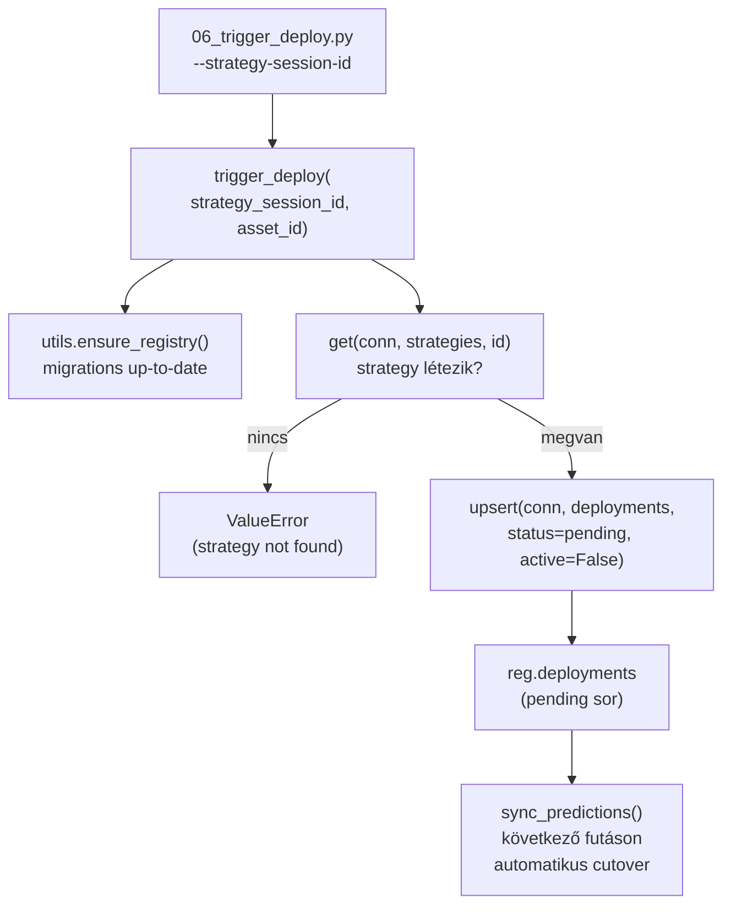
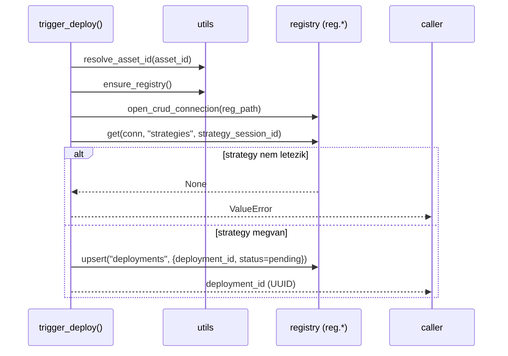

# 06_trigger_deploy.py — Deploy Trigger CLI

`src/data_handling/06_trigger_deploy.py`

Egy `status='pending'` sort szúr be a `reg.deployments` táblába a megadott
strategy session ID-hoz. A live sync folyamat (`sync_predictions`) a következő
futásán észleli a pending sort, és atomikusan végrehajtja a backfill+swap
cserét (cutover).

> Módszertani háttér (deploy/cutover design, registry-intent model, rollback):
> → [`../methodology_doc/1500_registry.md`](../methodology_doc/1500_registry.md)
> → [`0003_runtime_flow.md`](0003_runtime_flow.md) — teljes deploy/cutover narratíva
> → [`0004_model_lifecycle.md`](0004_model_lifecycle.md) — model lifecycle és deployment fázisok

---

## Overview



---

## `trigger_deploy(strategy_session_id, asset_id=None)`

**Célja:** Egy pending deployment sor létrehozása a registry-ben; az intent perzisztálása
a live writer általi cutover előtt.

| Paraméter | Típus | Alap | Leírás |
|-----------|-------|------|--------|
| `strategy_session_id` | `str` | — | A deployelni kívánt strategy ID (kell, hogy létezzen `reg.strategies`-ben) |
| `asset_id` | `str \| None` | `None` | Asset kulcs; `None` = default asset |

**Visszatérési érték:** `str` — az újonnan létrehozott `deployment_id` (UUID string).

**Raises:** `ValueError` — ha `strategy_session_id` nem található `reg.strategies`-ben.

**Lépések:**
1. `utils.ensure_registry()` — futtatja a függő migrációkat (pl. v2 `deployments` lifecycle oszlopok)
2. `get(conn, "strategies", strategy_session_id)` — validáció
3. `uuid.uuid4()` — új deployment ID generálása
4. `upsert(conn, "deployments", {..., status="pending", active=False})`



---

## Registry-intent design

A trigger CLI szeparált a cutover executortól:
- **CLI**: csak a *szándékot* írja (pending sor)
- **`sync_predictions`**: a *végrehajtást* végzi el (atomikus backfill+swap)

Ez elkerüli, hogy két writer versengjen a live sync connectionnel.

---

## Rollback

Rollback: az előző `strategy_session_id` újbóli deployolása.

```powershell
# A leváltott strategy_id a reg.deployments.previous_strategy_id oszlopban
uv run python src/data_handling/06_trigger_deploy.py \
    --strategy-session-id <elozo_strategy_session_id>
```

A következő `sync_predictions` futás visszaváltja a régi modell predikciós tábláját.

---

## CLI használat

```powershell
# Deploy trigger futtatása
uv run python src/data_handling/06_trigger_deploy.py \
    --strategy-session-id strat_solusdt_fw60_combo_2101_2605_v1

# Explicit asset (default: config szerinti)
uv run python src/data_handling/06_trigger_deploy.py \
    --strategy-session-id strat_solusdt_fw60_combo_2101_2605_v1 \
    --asset-id solusdt
```

| Flag | Kötelező | Leírás |
|------|----------|--------|
| `--strategy-session-id` | igen | Strategy ID a `reg.strategies`-ből |
| `--asset-id` | nem | Asset kulcs; default: `default_asset_id` |

**Kimenet (sikeres):**
```
INFO ... Pending deployment inserted: deployment_id=<uuid> strategy_id=... asset_id=solusdt
INFO ... A következő sync_predictions futás végrehajtja az atomikus cserét.
INFO ... Deploy trigger OK: deployment_id=<uuid>
```

**Kimenet (hiba):**
```
ERROR ... Deploy trigger FAILED: strategy_id '...' not found in reg.strategies.
```

---

## Kapcsolódó dokumentumok

- [`1510_registry_code.md`](1510_registry_code.md) — `upsert`, `get`, `open_crud_connection` CRUD API
- [`1520_registry_validator.md`](1520_registry_validator.md) — config↔registry konzisztencia ellenőrzés
- [`1230_sync_predictions.md`](1230_sync_predictions.md) — `sync_predictions` cutover végrehajtás
- [`0003_runtime_flow.md`](0003_runtime_flow.md) — teljes deploy/cutover narratíva
- [`../methodology_doc/1500_registry.md`](../methodology_doc/1500_registry.md) — registry módszertan
