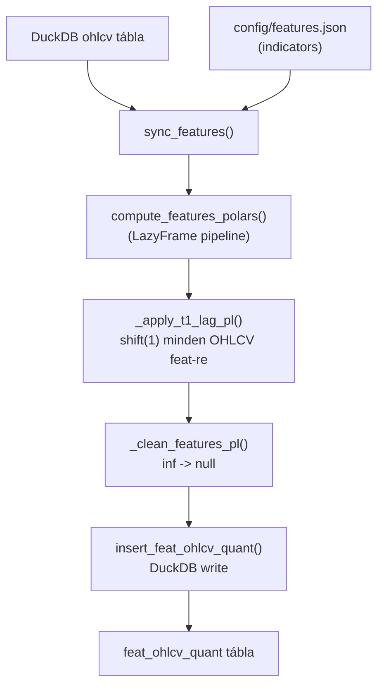
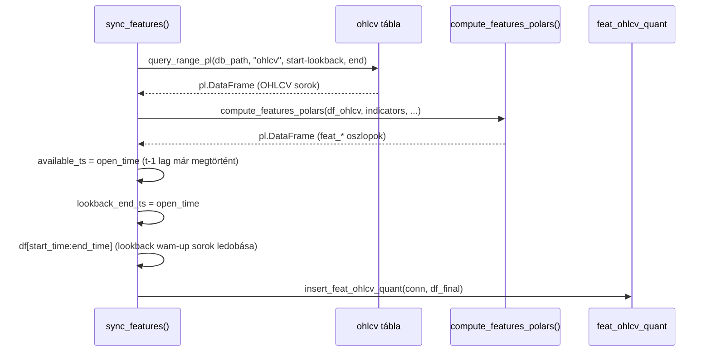

# sync_features.py — Feature Számítás és Beírás

`src/data_handling/sync_tables/sync_features.py`

OHLCV adatok beolvasása, feature pipeline futtatása Polars LazyFrame-mel, majd beírás a `feat_ohlcv_quant` táblába. t-1 lag kötelező az összes OHLCV-alapú feature-re.

> Módszertani háttér (feature engineering rationale, lookahead bias, t-1 lag döntés):
> → [`../methodology_doc/2000_features.md`](../methodology_doc/2000_features.md)

---

## Overview

---

## `sync_features(start_time, lookback_bars, end_time, asset_id)`

**Célja:** Feature-ök kiszámítása a megadott időtartományra és beírás.

**Paraméterek:**

| Paraméter | Típus | Alap | Leírás |
|-----------|-------|------|--------|
| `start_time` | `str` | — | Számítás kezdete (`YYYY-MM-DD HH:MM:SS`) |
| `lookback_bars` | `int` | config | Lookback ablak mérete barokban (warm-up periódus) |
| `end_time` | `str \| None` | `None` | Számítás vége (`None` = legújabb OHLCV bar) |
| `asset_id` | `str \| None` | `None` | Asset azonosító |

---

## Belső folyamat

---

## t-1 Lag mechanizmus

A `compute_features_polars` belül az `_apply_t1_lag_pl` függvény minden `feat_*` oszlopot 1 barral eltol (`shift(1)`), kivéve a `T_MINUS_1_SKIP` frozenset tagjait (P2 időindex feature-ök).

Az eltolás után:
- `available_ts` = `open_time` — ez azt jelenti: "a feature e bar **nyitásakor** lett elérhető"
- Az ASOF join a predictions-hoz: `predictions.open_time >= feat.available_ts`
- Eredmény: a t. bar predikciója csak t-1 bar (és korábbi) feature-öket lát

---

## `build_lag_snapshot(db_path, feature_cols, start, end)`

**Célja:** Modeling-ready snapshot készítése ASOF join alapján.

**Paraméterek:**

| Paraméter | Típus | Leírás |
|-----------|-------|--------|
| `db_path` | `str` | DuckDB fájl elérési útja |
| `feature_cols` | `list[str]` | Feature oszlopok listája |
| `start` | `str` | Időtartomány kezdete |
| `end` | `str` | Időtartomány vége |

**Visszatérési érték:** `pd.DataFrame` — `predictions` ⋈ `feat_ohlcv_quant` ASOF join eredménye.

**Belső hívás:** `asof_join_predictions_features(db_path, feature_cols, start, end)`

**Felhasználás:** A modeling réteg (`sync_predictions.py` és training pipeline) ezt hívja a feature snapshot elkészítéséhez.

---

## Kapcsolódó dokumentumok

- [`2200_features_polars.md`](2200_features_polars.md) — `_features_polars.py` részletes kód-referencia
- [`1110_duckdb_store.md`](1110_duckdb_store.md) — `insert_feat_ohlcv_quant` store réteg
- [`../methodology_doc/2000_features.md`](../methodology_doc/2000_features.md) — feature engineering módszertani háttér
