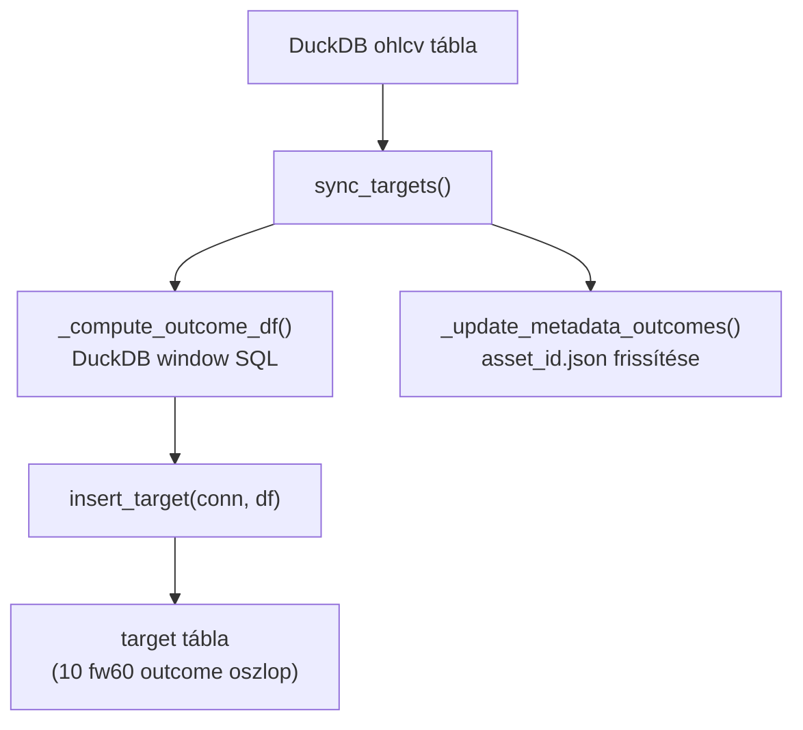
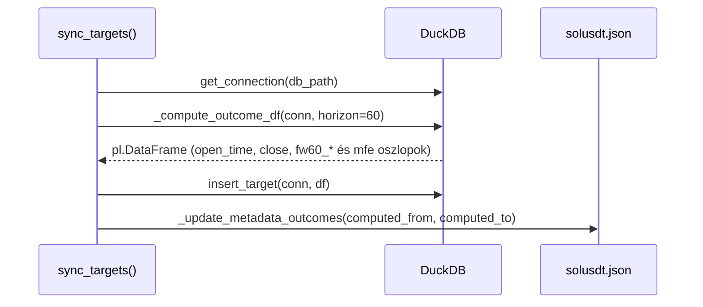

# sync_targets.py — fw60 Forward Outcome Számítás

`src/data_handling/sync_tables/sync_targets.py`

Minden `sync_targets` hívás teljes rebuild — DELETE+INSERT az összes tárolt OHLCV bar alapján.
A régi bináris `trg_*` target rendszer eltávolítva (epic-011).

> Módszertani háttér (fw60 forward outcome definíció, target rationale, lookahead bias protection):
> → [`../methodology_doc/3000_targets.md`](../methodology_doc/3000_targets.md)

---

## Overview



---

## `sync_targets(asset_id)`

**Célja:** A `target` tábla teljes újraépítése az összes `ohlcv` bar alapján, 10 fw60 forward outcome oszloppal.

**Paraméterek:**

| Paraméter | Típus | Leírás |
|-----------|-------|--------|
| `asset_id` | `str \| None` | Asset azonosító (config default ha `None`) |

---

## Belső folyamat



---

## fw60 Forward Outcome Oszlopok

| Oszlop | Típus | Definíció |
|--------|-------|-----------|
| `close` | DOUBLE | close[t] — jelenlegi bar close ára |
| `fw60_close` | DOUBLE | close[t+60] — nyers forward close |
| `fw60_max` | DOUBLE | max(close[t+1:t+60]) — nyers max ár |
| `fw60_min` | DOUBLE | min(close[t+1:t+60]) — nyers min ár |
| `fw60_close_ret` | DOUBLE | close[t+60] / close[t] - 1 |
| `fw60_close_logret` | DOUBLE | log(close[t+60] / close[t]) |
| `fw60_max_ratio` | DOUBLE | max(close[t+1:t+60]) / close[t] |
| `fw60_min_ratio` | DOUBLE | min(close[t+1:t+60]) / close[t] |
| `long_mfe_fw60` | DOUBLE | log(max(close[t+1:t+60]) / close[t]) — **LONG TARGET** |
| `short_mfe_fw60` | DOUBLE | log(min(close[t+1:t+60]) / close[t]) — **SHORT TARGET** |

**Szemantika:**
- `long_mfe_fw60` pozitív → az ár felment → long kedvező
- `short_mfe_fw60` negatív → az ár lement → short kedvező

---

## `_compute_outcome_df(conn, horizon=60)`

**Célja:** Az összes fw60 outcome oszlop kiszámítása DuckDB window SQL-lel.

**Visszatérési érték:** `pl.DataFrame` — `open_time`, `close`, és mind a 10 fw60 oszlop.

---

## `_TARGET_SQL` — A core SQL sablon

```sql
WITH ohlcv_ordered AS (
    SELECT open_time, close FROM ohlcv ORDER BY open_time
),
forward_window AS (
    SELECT
        open_time,
        close,
        LEAD(close, {horizon}) OVER (ORDER BY open_time) AS fw_close,
        MAX(close) OVER (
            ORDER BY open_time
            ROWS BETWEEN 1 FOLLOWING AND {horizon} FOLLOWING
        ) AS fw_max,
        MIN(close) OVER (
            ORDER BY open_time
            ROWS BETWEEN 1 FOLLOWING AND {horizon} FOLLOWING
        ) AS fw_min,
        COUNT(*) OVER (
            ORDER BY open_time
            ROWS BETWEEN 1 FOLLOWING AND {horizon} FOLLOWING
        ) AS fw_bar_count
    FROM ohlcv_ordered
)
SELECT
    open_time,
    close,
    CASE WHEN fw_bar_count >= {horizon} THEN fw_close           ELSE NULL END AS fw60_close,
    ...
    CASE WHEN fw_bar_count >= {horizon} AND close > 0
         THEN LN(fw_max / close)                               ELSE NULL END AS long_mfe_fw60,
    CASE WHEN fw_bar_count >= {horizon} AND close > 0
         THEN LN(fw_min / close)                               ELSE NULL END AS short_mfe_fw60
FROM forward_window
ORDER BY open_time
```

**Kritikus invariáns:** `ROWS BETWEEN 1 FOLLOWING AND {horizon} FOLLOWING`
- Az aktuális bar (`t`) **nem szerepel** a forward window-ban
- Az utolsó `horizon=60` sor `NULL`-t kap (nincs elegendő jövőbeli adat)

---

## NULL sorok

Az utolsó `60` sor minden fw60 oszlopban `NULL` — nincs elegendő jövőbeli adat.

```
                    ┌───────────────────────────────┐
OUTCOME OSZLOPOK:  │ értékek (DOUBLE) │ NULL (60 sor) │
                   └───────────────────────────────┘
                         ↑ fw_bar_count >= 60         ↑ fw_bar_count < 60
```

---

## `_update_metadata_outcomes(...)`

**Célja:** fw60 outcome definíciók és számítási időtartomány perzisztálása audit céljából.

**Kimeneti fájl:** `database/<asset_id>/<asset_id>.json`

**Tartalom:**
```json
{
  "target_outcomes": {
    "fw60": {
      "horizon": 60,
      "window": "t+1..t+60",
      "columns": {
        "close":             "close[t] — reference bar close",
        "fw60_close":        "close[t+60] — raw forward close",
        "fw60_max":          "max(close[t+1:t+60]) — raw max price",
        "fw60_min":          "min(close[t+1:t+60]) — raw min price",
        "fw60_close_ret":    "close[t+60] / close[t] - 1",
        "fw60_close_logret": "log(close[t+60] / close[t])",
        "fw60_max_ratio":    "max(close[t+1:t+60]) / close[t]",
        "fw60_min_ratio":    "min(close[t+1:t+60]) / close[t]",
        "long_mfe_fw60":     "log(max(close[t+1:t+60]) / close[t]) — LONG TARGET",
        "short_mfe_fw60":    "log(min(close[t+1:t+60]) / close[t]) — SHORT TARGET"
      },
      "null_tail_rows": 60,
      "computed_from": "2020-09-14 07:00:00",
      "computed_to":   "2026-06-17 12:00:00",
      "computed_at":   "2026-06-17 14:30:00"
    }
  }
}
```

---

## Régi bináris target rendszer (eltávolítva)

Az epic-011 előtt a target tábla két bináris oszlopot tartalmazott:
- `trg_* BOOLEAN` — legacy quantile-bináris target oszlopok (eltávolítva)

Ezek eltávolítva. Az `ensure_tables` migráció automatikusan felváltja a régi sémát az újra.
