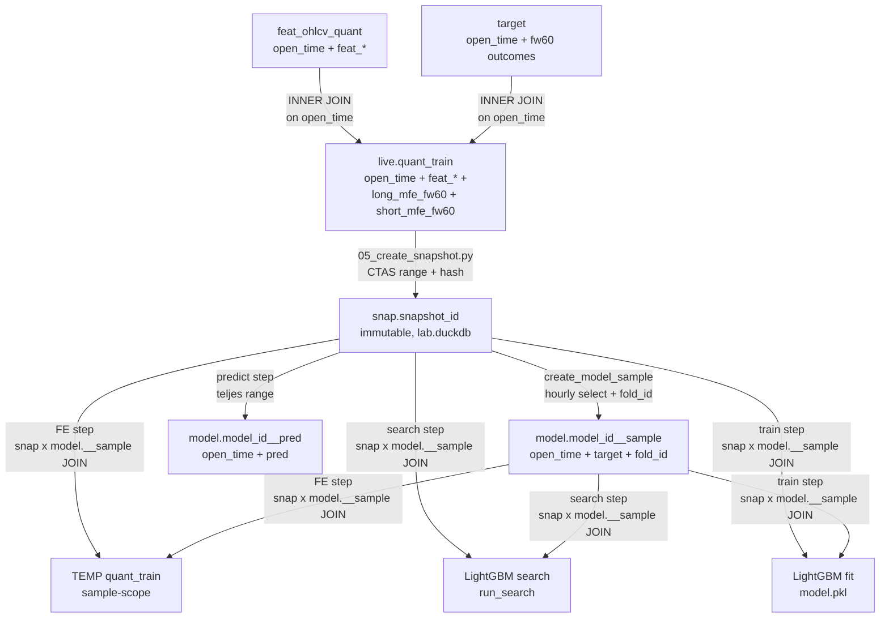
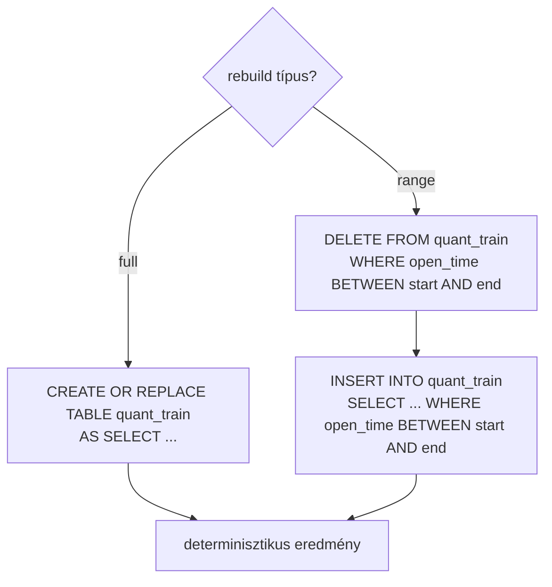

# 4100 — quant_train Table

Model-ready join tábla: `feat_ohlcv_quant` + `target` → tanítási adatforrás.

---

## Áttekintés

A `quant_train` (live) tábla a snapshot réteg **forrása** — `05_create_snapshot.py`
befagyasztja egy immutable `snap."<snapshot_id>"` táblává. Az aktív modell-fejlesztési
pipeline ezután kizárólag a befagyasztott snapshotból dolgozik: a FE, search és train
lépések a `snap ⋈ model.__sample` INNER JOIN path-on futnak, nem a live `quant_train`-en.



**NULL target policy:** Az INNER JOIN automatikusan kizárja azokat a sorokat, ahol `long_mfe_fw60 IS NULL OR short_mfe_fw60 IS NULL`. Ezek a sorok sosem kerülnek be a `quant_train`-be.

**Nem pipeline:** A `live.quant_train` nem része a live sync pipeline-nak (`02_sync_pipeline.py`). Kizárólag ad-hoc rebuild — snapshot létrehozása előtt futtatandó.

**Fontos asszimmetria (predict lépés):** A predict step szándékosan a snapshot teljes
range-ét score-olja, nem csak a sample sorait. Ez helyes: az offline prediction célja
az összes historikus bar előrejelzése (utólagos kiértékeléshez, strategy backtesthez).
A sample scope csak a **modell-fejlesztési** lépéseket köti (FE, search, train) — lásd
I1–I7 invariánsok alább.

---

## Snap-native sample handoff (aktív pipeline)

Az aktív `pipeline.py` `step_sample` lépése a `create_model_sample` függvényt hívja
(`src/modeling/sampling/create_sample.py`), amely DuckDB-natívan hozza létre a
`model."<model_id>__sample"` táblát a `snap."<snapshot_id>"` forrásból.

**`model."<model_id>__sample"` séma:**

| Oszlop | Típus | Leírás |
|--------|-------|--------|
| `open_time` | `TIMESTAMP` | Hourly-selected bar nyitási ideje (deterministic, seed-del) |
| `<target_col>` | `DOUBLE` | Modell target oszlopa (pl. `long_mfe_fw60`) |
| `fold_id` | `INT8` | Walk-forward fold (`0` = train-only, `1..n` = valid) |

Feature oszlopok **nem** kerülnek a sample táblába — azok a snapshotban maradnak.
A downstream lépések (FE, search, train) a `snap."<snapshot_id>" ⋈ model."<model_id>__sample"`
direct SQL JOIN-nal olvassák a feature-öket (nincs per-modell feature-másolat).

Részletek a sampling kód-referenciában: → [5300_create_sample.md](5300_create_sample.md)

---

## Yearly parquet artifact (legacy / audit)

Az `00_create_sample.py` (`create_yearly_sample`) az éves Polars-alapú mintavétel után
statikus parquet/json artifactokat ír a `database/<asset>/samples/<sample_id>/`
könyvtárba. Ez **nem az aktív pipeline.py path** — a `pipeline.py step_sample` a
DuckDB-natív `create_model_sample`-t hívja. A yearly parquet flow megtartott
visszafele-kompatibilitásra és legacy auditálásra.

**`sample_train_valid.parquet` oszlopok (yearly legacy):**

| Oszlop | Típus | Leírás |
|--------|-------|--------|
| `open_time` | `TIMESTAMP` | Bar nyitási ideje |
| `segment` | `VARCHAR` | `train`, `valid`, vagy `purge` |
| `fold_id` | `BIGINT \| NULL` | 0-alapú index a validációs héthez; NULL ha nem valid sor |
| `long_mfe_fw60` | `DOUBLE` | Long target |
| `short_mfe_fw60` | `DOUBLE` | Short target |

---

## Séma

| Oszlop | Típus | Forrás | Leírás |
|--------|-------|--------|--------|
| `open_time` | `TIMESTAMP` (PK) | `feat_ohlcv_quant` | Bar nyitási ideje, UTC. INNER JOIN garantálja az egyediséget. |
| `feat_*` | `DOUBLE` | `feat_ohlcv_quant` | Összes `feat_` prefixű feature oszlop. T-1 lag már alkalmazva. |
| `long_mfe_fw60` | `DOUBLE` | `target` | `log(max_price_fw60 / close[t])` — fw60 long outcome. |
| `short_mfe_fw60` | `DOUBLE` | `target` | `log(min_price_fw60 / close[t])` — fw60 short outcome. |

**Kizárt oszlopok:** `close`, `available_ts`, `lookback_end_ts` (feat táblából), `fw60_close`, `fw60_max`, `fw60_min` és egyéb fw60 oszlopok (target táblából), `long_pred`, `short_pred` (predictions tábla).

**Legacy naming:** A régi `trg_*` boolean elnevezés NEM szerepel ebben a rétegben. A target oszlopok kizárólag `long_mfe_fw60` és `short_mfe_fw60`.

---

## Rebuild szemantika



| Mód | SQL | Mikor |
|-----|-----|-------|
| **Full rebuild** | `CREATE OR REPLACE TABLE quant_train AS SELECT ...` | Kezdeti feltöltés, teljes újraépítés |
| **Range rebuild** | `DELETE + INSERT` a megadott `open_time` ablakra | Inkrementális frissítés |

Mindkét mód **idempotens** — többszöri futtatás azonos eredményt ad.

---

## CLI

```powershell
# Full rebuild (alapértelmezett)
uv run python src/data_handling/03_build_quant_train.py

# Range rebuild
uv run python src/data_handling/03_build_quant_train.py --start "2024-01-01 00:00:00" --end "2024-12-31 23:59:00"

# Explicit asset
uv run python src/data_handling/03_build_quant_train.py --asset-id solusdt
```

---

## Implementáció

| Fájl | Szerepe |
|------|---------|
| [`src/data_handling/store/duckdb_store.py`](../../src/data_handling/store/duckdb_store.py) | `rebuild_quant_train(conn, start_time, end_time)` — core rebuild logika |
| [`src/data_handling/sync_tables/sync_quant_train.py`](../../src/data_handling/sync_tables/sync_quant_train.py) | `sync_quant_train(asset_id, start_time, end_time)` — asset-szintű wrapper |
| [`src/data_handling/03_build_quant_train.py`](../../src/data_handling/03_build_quant_train.py) | Standalone CLI |

---

## Invariánsok — sample-scoped pipeline

Az alábbi invariánsok az aktív (`snap ⋈ model.__sample`) pipeline-ra vonatkoznak.
A részletes leírás az arch spec-ben és a módszertani dokumentumban él; itt csak
a kód-referencia szintű összefoglalás.

| ID | Invariáns | Érvényesítő |
|----|-----------|-------------|
| **I1** | `COUNT(TEMP quant_train) == COUNT(model.__sample)` az FE materializáció után | `sample_scope.py` RuntimeError (L72-76) |
| **I2** | `snap ⋈ model.__sample` JOIN a search/train lépésekben pontosan annyi sort ad, mint a sample | logging szinten; explicit assert t43 scope-ja |
| **I3** | `snap."<snapshot_id>"` soha nem módosul — content_sha256 a predict lépés előtt/után egyezik | `predict_offline(verify_snapshot=True)` |
| **I4** | `feature_set.json["selected"]` == `features.json["features"]` == `reg.feature_sets.selected_cols` | provenance lánc; reg upsert a step_fe végén |
| **I5** | `model.__sample` tartalmaz `fold_id` INT8 oszlopot (0 = train-only, 1..n = valid) | `create_model_sample` CTAS SQL |
| **I6** | Egy `model_id`-hez pontosan egy `target_name` tartozik; a FE/search/train/predict mind ezt használja | `config/models.json` |
| **I7** | `feature_set.json["provenance"]` tartalmaz: `snapshot_id`, `sample_table`, `sample_rows`, `joined_rows`, `min_open_time`, `max_open_time`, `source_contract: "snap ⋈ model.__sample"` | FE notebook + `sample_scope.py` |

Metodológiai háttér (miért, alternatívák, döntések):
→ [5000_modelling.md](../methodology_doc/5000_modelling.md) — I1-I7 teljes invariáns-rationale, A vs B döntés, provenance szerződés, predict aszimmetria
→ [5400_sampling.md](../methodology_doc/5400_sampling.md) — I1, I2, I5 sampling nézőpontból; sorpontos scope vs. időablakos szűkítés
→ [5600_model_training.md](../methodology_doc/5600_model_training.md) — I2 invariáns training kontextusa

---

## Kapcsolódó dokumentumok

- [`_doc_/1000_database.md`](1000_database.md) — teljes DuckDB séma áttekintő
- [`_doc_/1110_duckdb_store.md`](1110_duckdb_store.md) — store réteg
- [`_doc_/3100_sync_targets.md`](3100_sync_targets.md) — target tábla és fw60 outcome-ok
- [`_doc_/3000_targets.md`](../methodology_doc/3000_targets.md) — target layer módszertani háttér
- [`_doc_/5010_sampling_yearly.md`](../methodology_doc/5010_sampling_yearly.md) — aktív yearly sampling metodológia
- [`_doc_/5300_create_sample.md`](5300_create_sample.md) — `create_model_sample` snap-natív sampling kód-ref
- [`_doc_/0004_model_lifecycle.md`](0004_model_lifecycle.md) — teljes modell életciklus
